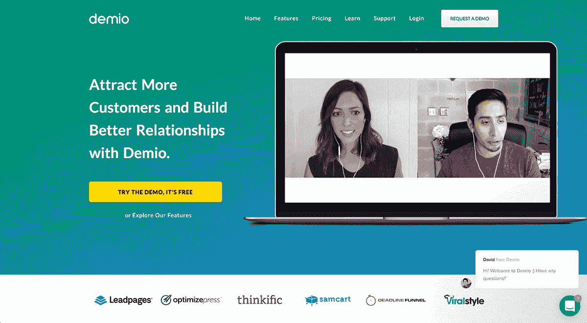
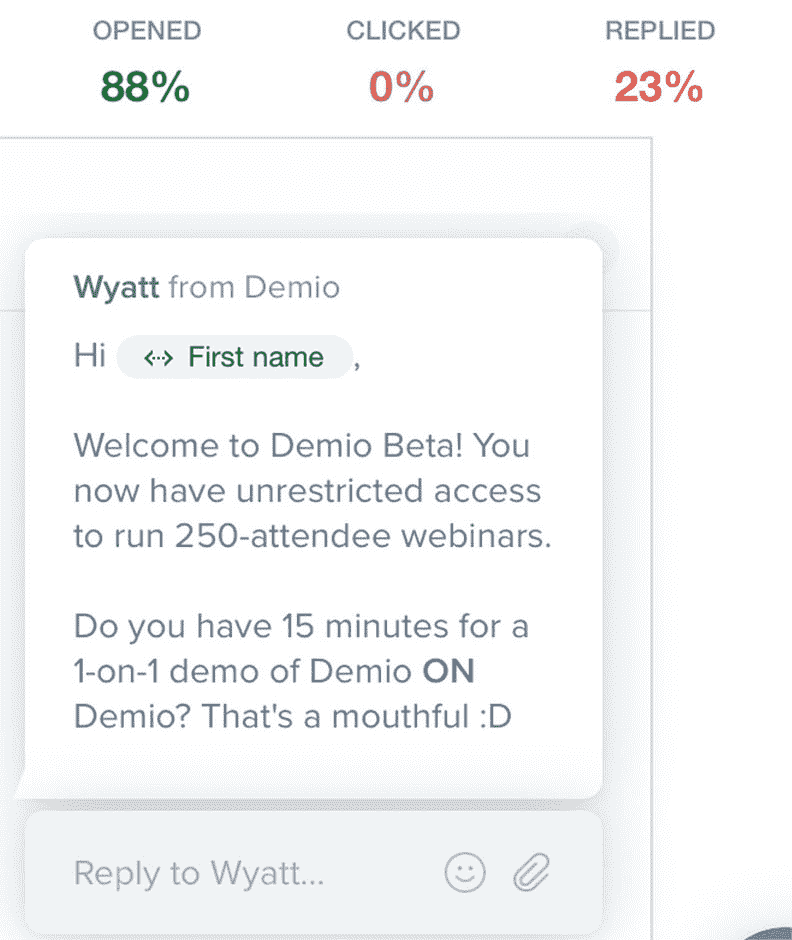
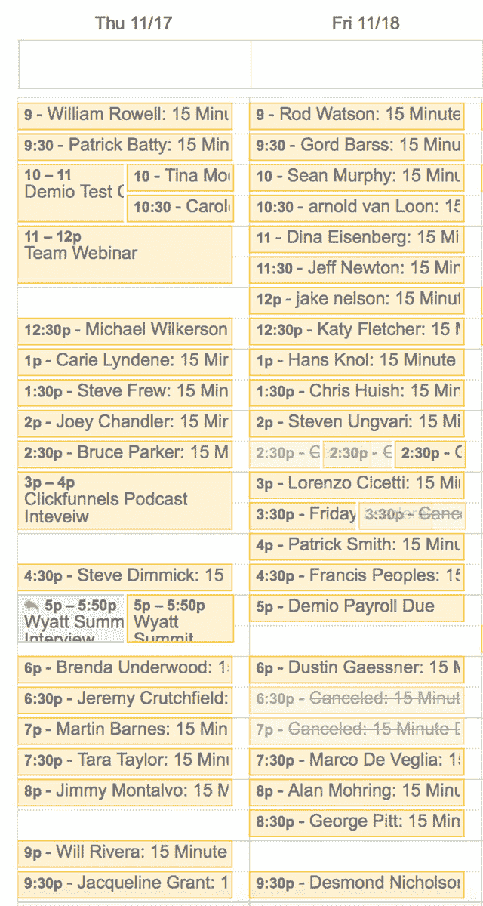
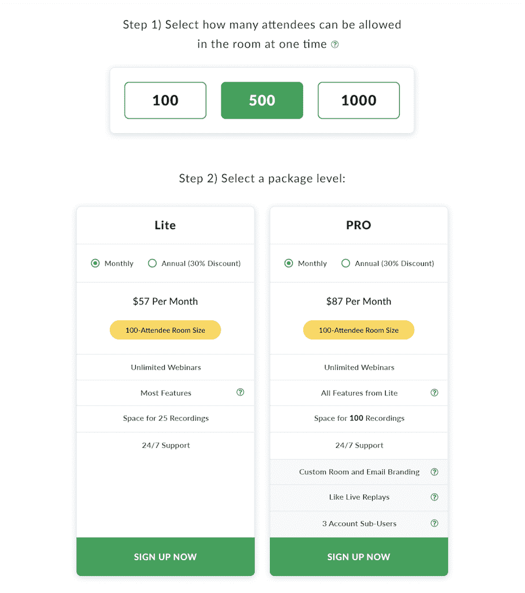

# 克服功能蠕变，收入增长到每月 43，000 美元

> 原文：<https://www.indiehackers.com/interview/overcoming-feature-creep-and-growing-revenue-to-43-000-mo-5943e304b9>

## 你好！你的背景是什么，你在做什么？

嘿！我叫 Wyatt Jozwowski，我是 Demio 的联合创始人之一。我今年 21 岁，十年来一直在创造和建造东西。在这段时间里，我发现了创建简单、有用和令人愉快的软件应用程序的热情。

目前，我的全部精力都放在了构建 Demio 上，这是一个为营销和销售而构建的智能网络研讨会平台。通过使用 Demio，企业主和营销团队可以产生销售线索，与他们的观众实时联系，并提高他们产品的销量。

我们的客户群主要由销售软件、信息、服务或任何其他数字产品的中小型企业组成。他们使用 Demio 的简单性、整合能力和营销功能帮助他们提高网络研讨会的转化率。

Demio 目前在 43，000 美元 MRR 附近徘徊，并以每月 10%左右的速度持续增长。虽然我们在近三年前就开始了建立 Demio 的旅程，但我们在 2016 年 11 月才开始创造收入，也就是十个月前。

 

## 是什么促使你开始和德米欧合作？

我记得每天都在社交媒体上看到关于人们在当前网络研讨会平台上的糟糕体验的帖子。我读过各种各样的恐怖故事，从网络研讨会崩溃到录音丢失，广告支出被浪费，等等。营销人员一直在寻找更好的解决方案。

大约在同一时间，我在为我的另一家公司主持每月一次的网络研讨会，我对缺乏营销灵活性感到非常沮丧。我花了几个小时来筹备一个网上研讨会活动，而且总是需要将多种工具组合在一起才能让它正常工作。更不用说，用户界面和用户体验是可怕的。每次举办活动，我都感觉自己回到了互联网的早期。

我和我的联合创始人大卫合作，开始建立一个简单而强大的网上研讨会平台。我们都很忙。他当时经营着一家数字营销机构，我经营着一个名为[滴滴应用](http://dripapps.com)的搜索引擎优化和营销课程的在线会员区。我们都没有技术背景，所以我们在海外租了一家代理公司，并决定兼职做 Demio，直到它准备好推出。

## 构建最初的产品需要什么？

[德米欧](https://demio.com)的故事是一个经典的“玩创业”的故事。我们有一个巨大的办公室:乒乓球桌，豆袋椅，一箱 t 恤，完全没有产品。我们正以惊人的速度消耗着个人积蓄。在与一家代理公司合作了 3 到 4 个月后，10 万美元已经花光了，我们完全没有任何东西可以展示。该机构一直在欺骗我们，直到他们最终无法再隐瞒下去——我们被骗了，我们被榨干了。你可以在[我们的博客](https://demio.com/learn/journey-100k-mrr/)上了解更多关于这一早期经历的信息。

直到现在，有了我们的优秀团队，我们才最终意识到雇佣合适的人是多么重要。

TweetShare

我们最终放弃了代理，决定认真对待事情。我们只剩下一点钱，但我仍然有来自滴滴应用的收入。我每月能够投资大约 2 万到 3 万美元，因为这些钱来自于滴滴应用。这一次，我们建立了自己的内部开发团队，我们尽可能快地烧钱。然而，我们终于取得了进展。

大卫和我都不知道从头开始构建一个可靠的实时流媒体平台实际上会有多大的挑战，尤其是在 2014 年。我们有一整面白板墙，上面写满了产品模型、功能想法和 UI 图，我们完全打算把它们都做好。

我们完全忽略了构建核心引擎，相反，我们构建了附加功能。又过了将近六个月，我们有了一个功能丰富的臃肿产品，但我们无法让核心的流媒体引擎工作。我们兜了几个月的圈子，在咖啡店里就可能不得不关闭公司的问题进行了多次交谈。

当我们终于第一次进入测试版时，在我们决定是时候关闭它之前，我们每月的经常性收入高达 2200 美元。产品就是不够好。这是我们曾经不得不做出的[最艰难的决定之一](https://demio.com/learn/shut-beta-2-2k-mrr-started/)，尤其是因为我们一直处于资金耗尽的边缘。

核心的流媒体引擎是建立在过时的 flash 技术上的，该产品有大量的 bug。由于基础不牢，我们知道不能慢慢改善。我们要么暂时忍受它，要么在流方面完全重新开始，再试一次。

随着时间的推移，向 Demio 投资变得越来越有挑战性。大卫也投入了他所能投入的一切，我们做了一些随机的副业，只是为了让德米奥不至于破产。我们知道我们只能再坚持几个月，所以这将是我们最后一次尝试。我们决定去掉 50%以上的现有功能，将全部精力放在 Demio 的核心流媒体方面。

三个月后，我们终于回到了测试版——这一次是一个伟大的 MVP。

## 你们是如何吸引用户，让 Demio 成长起来的？

我们决定让第二个测试版完全免费。我们的目标是吸引大量用户，真正测试我们的扩展极限，并迫使我们专注于核心功能。我们认为，面对数百名用户，为了生存，我们必须保持简单。

我们向每个注册的人提供个人演示，在此期间，我们吸引了 800 多名用户。

我们的日历总是排得满满的:

这些演示让我们在测试的几个月里学到了很多东西。我们了解了营销人员在网上研讨会平台上寻找什么。我们了解了哪些异议阻止了人们使用我们的平台，以及人们喜欢它的哪些方面。

在测试版结束时，我们向所有测试版用户提供升级到付费帐户的选项，价格非常优惠，仅按年计算。我们有 37 个人接受了这个提议，这是我们今天继续建立的基础。

在进入测试之前，我们已经计划好了我们的策略。我们知道我们将处于破产的边缘，所以我们需要在 beta 测试后有大量的客户涌入才能让它运行。知道这一点后，我们有一个大联盟推出计划后，测试期。我们不仅花了三个月的测试时间将产品提升到正确的水平，而且大卫和我几乎花了所有的时间为发布做准备。我们能够让数百家分支机构参与进来，宣传此次发布。

我们制作了一个会员邀请页面，您可以在这里看到。我们用这个页面解释了 [Demio](https://demio.com) 的推出，以及为什么分支机构应该加入进来推广它。在这个盛大的开业发布期间，我们为 Demio 提供了极其优惠的价格，并且我们给任何推广的附属机构 50%的佣金。这些打折的价格允许代销商对他们的观众使用[极度稀缺](https://en.wikipedia.org/wiki/Scarcity_(social_psychology))，因为在 7 天的发布窗口后，价格上涨了 300%以上。

这是一个巨大的成功。说到底，我们有 500 多名新客户购买了 Demio 的年度套餐，银行里的现金足够我们维持至少六个月。我们终于可以呼吸了。

从那以后，我们一直通过推荐、分支机构、内容营销和一些广告持续增长。

| 月 | 客户 |
| --- | --- |
| 11/9/2016 | 37 |
| 11/17/2016 | 521 |
| 12/18/2016 | 617 |
| 1/18/2017 | 658 |
| 2/18/2017 | 718 |

我们很幸运——从一开始，推荐就成了我们增长的一大部分。从本质上来说， [Demio](https://demio.com) 有点像病毒。当客户举办网上研讨会时，我们的平台可能会面对数百名与会者。当这些与会者有很好的体验时，他们中的许多人会访问我们的网站并安排演示。

自发布以来，大卫和我个人已经做了 1000 多次演示，这是我们获得大多数客户的地方。对我们来说，越多的客户使用我们的产品，我们的网站就会吸引越多的访问者。这就是我们关注的地方。

我们让我们的产品简单易用，因此我们的客户很容易学习、受益和参考他人。由于我们继续向分支机构提供 30%的经常性佣金，我们的许多客户向他们的电子邮件列表、脸书小组和正在寻找更好的网络研讨会平台的朋友推荐 Demio。

## 你的商业模式是什么，你是如何增加收入的？

我们出售 [Demio](https://demio.com) 作为订阅，按月或按年出售。到目前为止，我们有三个不同的层级，套餐之间的主要区别是网上研讨会会议室的大小，或者说您的网上研讨会一次可以有多少与会者。我们每个用户的平均收入徘徊在 56 美元左右，在过去的几个月里，我们已经能够持续增长这个数字。(3 月份是 50.47 美元。)

我们通过两种方式增加了这一数字:

1.  通过吸引更多合适的客户——拥有更多受众的客户
2.  通过开始限制我们的“启动”包的功能

我们有一个名为“Like Live Replays”的功能，让客户在 Demio 上拍摄过去的事件，并将其转换为现场事件的常青模拟，只要它是活动的，就会继续运行并产生结果。为了获得此功能，客户必须加入我们每月 117 美元的中级计划或每月 237 美元的高级计划。

我们从来都不喜欢限制底层包的特性，因为我们想为潜在客户保持简单。网上研讨会会议室的大小是唯一的区别，这让我们实现了让事情变得简单的目标。

但是我们遇到了一个非常重要的认识:对我们来说，好的客户不一定是由房间里有多少与会者来定义的。我们有一些大客户，有可识别的标识，他们每月只需支付 47 美元，因为他们不需要更大的房间。然而，他们坚持举办网络研讨会，并取得了很好的效果。

另一方面，我们也有“坏”客户，他们会举办一场有 500 人参加的网上研讨会，然后流失，因为他们只在一次活动中需要它。这种认识促使我们在更高层的包中只测试像实时回放这样的服务，而且效果非常好。我们计划根据套餐大小进一步细分功能，以提高 ARPU(每用户平均收入)并减少收入流失。

在过去的六个月里，我们每个月都能以 5–20%的速度增长。有些月份比其他月份慢，原因不明，但图表继续向右上方移动。

| 月 | 收入 |
| --- | --- |
| 2017 年 3 月 | 30365 |
| 2017 年 4 月 | 33630 |
| 2017 年 5 月 | 36741 |
| 2017 年 6 月 | 38729 |
| 2017 年 7 月 | 41370 |
| 2017 年 8 月 | 43014 |

## 你未来的目标是什么？

我们在未来六个月有五个主要目标:

1.  减少流失。我们现在面临着致命的 12%的用户流失率，我们的目标是将这个数字降低到 8%。
2.  增加 ARPU。我们的目标是将价格从 56.12 美元提高到 70 美元以上。
3.  改进产品。我们正在扩展浏览器兼容性，推出 Like Live Replays 的第二个版本，并为客户的直播流添加新的分发渠道。
4.  用 SEO 增加流量。目前我们的博客每月只有大约 200 个独立访问者，我们的目标是将这个数字提高到 5000。
5.  将 MRR 从 43k 美元增加到 70k 美元以上。

下面是我们实现这五个目标的方法:

**1。减少流失**

最终，如果我们想继续增长，即使 8%的用户流失率也太高了，但这比我们现在 12%的流失率要好。

我们失去客户有几个不同的原因。很多时候，客户会流失是因为他们不再需要产品了；他们举办了一些网络研讨会，现在他们暂时不打算举办。尽管总会有一些人注册时只打算举办一场活动，但我们肯定可以通过更好的入职培训来改善这一领域，帮助他们理解举办网络研讨会的重要性。

此外，我们将继续为产品添加功能，使其“更具粘性”。例如，我们的 Like Live Replays 功能是始终运行并始终生成结果的，不像一次性事件。我们还将增加其他功能，如每日/每周报告，将不断重新吸引用户。

客户抱怨的另一个重要原因是我们目前缺乏浏览器兼容性。许多客户已经离开，因为我们只支持桌面、iOS 设备和 Android 设备上的谷歌浏览器。值得庆幸的是，我们将在下个月发布一个期待已久的更新，不久之后将我们的浏览器支持扩展到 Firefox、Internet Explorer、Edge 和 Safari。我们预计，仅这一次更新就应该能减少几个百分点的流失率。

此后，我们将继续通过研究入职培训、通过视频和每周网络研讨会改进教育，以及通过吸引更多合适的客户来减少流失。

**2。增加 ARPU**

由于我们意识到在多个计划上分层功能的价值，我们在这条道路上走得更远。下个月，我们将推出一个全新的定价结构，我们相信这将使我们的 ARPU 在未来六个月内超过 70 美元。

我们将把与会者房间大小与套餐级别分开，将有两个套餐:Lite 和 Pro。进一步解释，Lite 将拥有大部分功能，而 Pro 将拥有所有功能，包括定制品牌、直播回放、子用户账户等。通过这种重组，客户现在可以享受“专业”计划，即使他们仍然只为 100 名与会者付费。此外，我们将通过新的兼容性更新提高所有价格。

因此，虽然客户目前每月为我们的 100 名与会者套餐支付 47 美元，但从下个月开始，新客户将为 100 名与会者的精简版每月支付 57 美元，或为 100 名与会者的专业版每月支付 87 美元。虽然这将有助于为我们带来更多收入，但对我们的客户也更有帮助，因为他们现在可以获得更高级的功能，例如每月只需 87 美元的实时回放，而不是现在每月 117 美元。

 

我们遇到了很多人的抵制，他们不想升级到下一个级别，因为他们不需要超过 100 人的房间，即使他们真的想要像现场回放一样的功能。有了这个新的结构，我们相信我们会看到更多的整体升级。

另一方面，我们也相信这一变化将减少收入流失。使用实时回放、子用户和定制品牌的客户不太可能会离开。我们现在最大的变动是在我们的首发包中，目前还没有直播回放。因此，虽然没有这些功能，Lite 客户可能仍然会以同样的速度流失，但 Pro 客户会流失得更少，并且他们会因为更高的价格而获得更多的收入。

**3。改进产品**

如果你以正确的方式构建你的 SaaS 产品，随着时间的推移，你自然会减少客户流失。每个月，我们都在通过添加新功能、新集成、提高稳定性等方式，慢慢消除异议或某些人可能变动的原因。下个月我们的兼容性更新就是一个很好的例子。

除了流失之外，我们还希望通过增加一些功能来提高使用率，让用户不断回来，而不是在他们需要举办网上研讨会时才回来。像实时回放一样，新的聊天信息不断出现，需要回复，所以这是让用户持续参与的好方法。现在的问题是，用户并不总是知道什么时候有新的聊天消息，所以这是我们将引入每日电子邮件报告的原因之一。

我们围绕产品的一些主要目标是让我们的客户通过他们的网络研讨会更加成功。我们不断问自己如何改进注册流程，为我们的客户争取更多注册，如何通过更好的提醒提高我们客户的出席率，以及如何通过营销/销售相关功能提高网上研讨会上和会后的转化率。

例如，我们将增加在脸书直播和 Youtube 直播上播放 Demio 网络研讨会的功能。这个特性会很棒，原因有几个。首先，它将提高我们客户活动的出席率，因为与会者可以从更多地区加入。第二，它会吸引更多人关注 Demio，这最终意味着我们网站会有更多的有机流量。

**4。用 SEO 增加流量**

我们最近在 Demio 聘请了一位营销总监，他的主要工作是通过我们的博客增加我们网站的定向流量。仅在过去的一个月里，我们就获得了大量的网站链接，流量也翻了一番。这是一项新举措，但我们对这一战略的未来非常乐观。

大卫和我一直在我们的博客上写更多基于旅程的帖子，以与我们的客户和追随者建立更深的关系。高层次的策略是通过围绕各种商业话题的广泛文章来增加流量，然后通过我们更透明的旅程帖子让他们关注我们的内容。

此外，我们已经开始更多地关注获得优质客座博文机会、播客和其他内容机会。我们非常关注 Demio 的长期发展，所以我们希望我们今天的努力能够让我们在未来几年受益，这就是为什么我们不太关注付费广告，至少目前是这样。这些客座博文不仅有利于定向流量和搜索引擎优化，还能让我们与其他 SaaS 公司建立战略关系。

**5。增加 MRR**

我不认为在接下来的六个月里将 Demio 带到超过 70k 美元的 MRR 会很容易，但我相信我们能做到。如果我们能保持同样的增长率，同时减少流失率，这应该是可能的。

对长期目标要有耐心，但对实现目标的方式要灵活。

TweetShare

此外，由于没有更多的浏览器支持，我们失去了很多潜在的销售机会。一旦我们下个月发布新的更新，这将不再是我们面临的异议。

我们计划在更新后做一个推广期，我们会让每个人都知道，任何新客户的价格都会上涨。这将增加现在在祖父定价选项注册的紧迫性。我们将联系我们的分支机构，让他们在这个 10-14 天的促销窗口进行促销。最重要的是，我们将手动联系任何因为缺乏支持而产生争议的客户，并且我们将联系任何因为这一异议而没有转化的演示。

这应该是一个很好的方式来获得新的更新，也获得了大量的客户。这肯定会帮助我们在接下来的六个月里更接近实现 7 万美元 MRR 的目标。

## 你面临的最大挑战和克服的障碍是什么？

我从哪里开始？在过去的三年里，我们犯了无数的错误，其中一些非常接近致命的错误。

我们面临的许多障碍都源于糟糕的招聘决策。它始于该机构，随后是一些其他的招聘，要么是短期的，要么是不符合良好的文化。我相信我们雇用这些人的原因是因为我们总是觉得我们在赶时间。在被代理商骗了之后，我们总是觉得自己落后了，所以我们试图尽快开发出一款产品。

更不用说，我们的燃烧率从一开始就不必要的高，这增加了一吨的压力。

我很感激我们走过的路和学到的教训。然而，如果我们可以再做一次，我们将首先明确 MVP 中需要什么，而不是描绘出我们想要的一百万个特性。其次，我们会对招聘有耐心。我们会从雇佣一个伟大的程序员开始，我们会专注于我们产品的核心方面。

当你有一个创办公司的想法时，你通常会想马上开始。但是，事实上，这是我们面临许多障碍的原因。事实上，因为我们都不是技术创始人，所以在组建团队的时候，我们应该非常有耐心。直到现在，有了我们的优秀团队，我们才最终意识到雇佣合适的人是多么重要。

就个人而言，我认为大卫和我变得更有耐心，更有禅意，也更注重长远。运行一个在真实环境中运行的产品，会有无穷无尽的压力。在任何时候，都有可能出错，而且有很多因素是我们无法控制的，例如互联网连接、防火墙、网络摄像头/麦克风设备等。正因为如此，我们不得不接受经营这家公司总会有一定程度的压力。

## 有没有发现什么特别有帮助或者有优势的？

我发现实践可持续性、休息、度假、理清思路、从外部视角看问题非常重要。人们很容易陷入日复一日的问题、支持、变动中，并认为世界正在终结，而事实上，几乎所有事情都在朝着积极的方向发展。讽刺的是，从外面看容易，从里面看难。

我们将长期从事这项工作，因此我们一直在寻找减轻工作压力的方法，不仅是为了我们自己，也是为了我们的员工。这意味着，除了简化产品，我们还将始终专注于简化内部流程、沟通、团队结构、员工入职等。为了让我们的生活变得更好，我们愿意放弃增长，这样我们就可以在未来很长一段时间内致力于此。

就我个人而言，在大本营跟随杰森·弗里德和 DHH，我学到了很多。我认为他们给了我们社区的每个人一个不同的视角来建立一个持久的公司。他们的书《返工》(Rework)是任何创建公司的人的必读之作。我们在 Demio 有一个远程团队，所以我们非常重视他们的建议。

## 对于刚刚起步的独立黑客，你有什么建议？

这很有趣，因为我认为我的建议实际上自相矛盾。我将把它分成两部分:

1.  要耐心
2.  开始吧

它总是比你想象的要花更长的时间。打造一个伟大的产品需要时间，获得牵引力需要时间，做出正确的招聘也需要时间，但这总是值得的。当你建立一家 SaaS 公司时，你的耐心肯定会受到考验；我相信这是你能拥有的最重要的品质之一。

另一方面，耐心并不意味着坐以待毙，无所事事。我讨厌听到这样的问题，“我该怎么办？”来自有抱负的企业家。我没有一步一步的指南可以给你去创业。最好的开始方式就是开始，做任何事情。你会一路学到的。

这个建议也适用于你以后会遇到的问题。你永远不会知道如何马上解决它们…你只需要做出你最好的猜测，然后继续下去。你会通过实验弄明白的。

当你结合这两条建议时，你最终会对长期目标保持耐心，但对如何实现它们保持灵活，我认为这对于取得成功至关重要。

我读了很多书，所以我肯定有很多书可以推荐——我只是不确定其中有多少是直接适用的。我想到的一些很棒的例子有*返工*、*从优秀到卓越*、*困难的事情*、*困难的事情是方式*、*创业 J 曲线*。

我还大量投资于哲学书籍，特别是斯多葛主义。这些书对于建立正确的长期心态以及帮助我们应对日常压力都很有帮助。我推荐阅读*美好生活指南:斯多葛派欢乐的古代艺术*、*斯多葛派的日常生活*、*塞内加的书信*、*马可·奥勒留的书信*以及其他斯多葛派哲学家的书信。

我发现实践可持续发展真的很重要:休息、休假、理清思绪。

TweetShare

## 我们可以去哪里了解更多？

正如我前面提到的，我们已经开始在我们的博客上大量投资。大卫和我已经发布了关于我们和德米奥的旅程的帖子，我们分享了一路上的几乎每一个细节。你可以在这里阅读那些帖子[。](https://demio.com/learn/blog/)

如果你想亲自关注我，可以在 Twitter 上关注我: [@WyattJawz](https://twitter.com/wyattjawz) —这也是联系我的最好方式！

我会密切关注评论，所以如果你想了解我们迄今为止的旅程，请务必在下面提出任何问题:)

——[<picture id="ember8000840" class="user-avatar ember-view user-link__avatar"></picture>wyattjozwowski](/wyattjozwowski?id=aomzVjPF2WQcbDI3i2hj4gOtnOS2)【德米奥的创造者

## 想像德米欧一样建立自己的事业？

你应该加入独立黑客社区！🤗

我们是几千名创始人，互相帮助建立有利可图的业务和副业。来分享你正在做的事情，并从你的同事那里获得反馈。

还没准备好开始使用你的产品吗？没问题。这个社区是一个认识人、学习和实践的好地方。随意[随便浏览](/)！

——[<picture id="ember8000845" class="user-avatar ember-view user-link__avatar"></picture>柯特兰艾伦](/csallen?id=ibTLPyjwVebnZjMGKvz6ztarnuV2)，独立黑客创始人

12votes