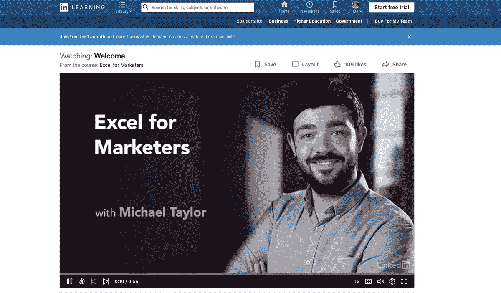
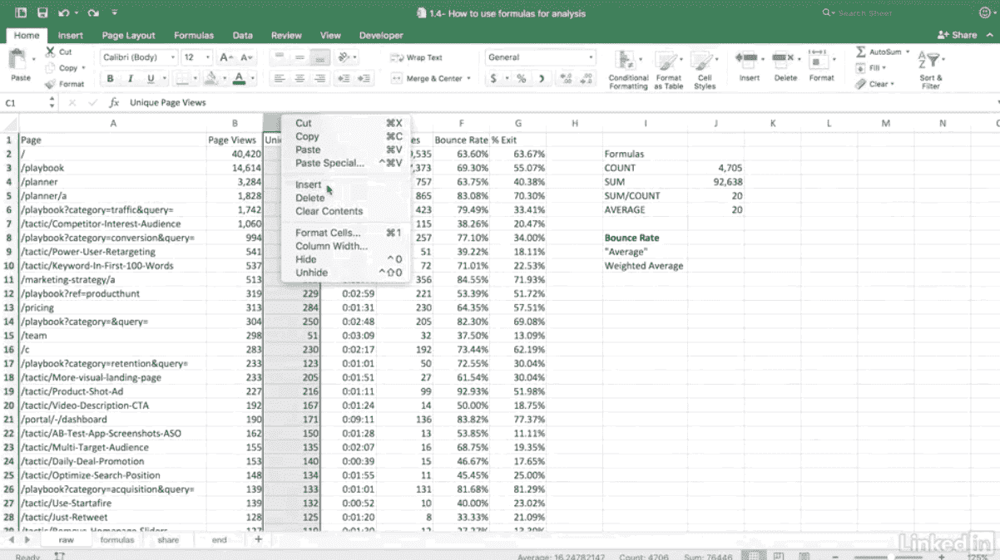

# 克服我的不安全感，每月获得 600 美元的真正被动收入

> 原文：<https://www.indiehackers.com/interview/overcoming-my-insecurities-to-make-600-mo-in-truly-passive-income-47dc2bd221>

## 你好！你的背景是什么，你在做什么？

我是迈克尔·泰勒，是一名技术营销人员，管理着超过 3000 万美元的跨渠道营销预算。我的日常工作是在一家成长型营销机构和我共同创立的名为 [Ladder](https://ladder.io) 的技术公司。事实上，我们之前已经被《T2》采访过了。

我创办了[营销人员 Excel](https://www.linkedin.com/learning/excel-for-marketers)，作为一种向初级营销人员传授我多年来学到的所有 Excel 生产力技巧和诀窍的方式。LinkedIn 发现了我的一篇[博客文章](https://blog.ladder.io/excel-tutorial/)并联系了我(当然是在 LinkedIn 上)，因为他们认为这将成为 LinkedIn 学习的一个很好的在线课程(你可能知道它是 Lynda.com，他们收购并更名了它)。经过严格的筛选，他们预付了我 4000 美元，让我飞到洛杉矶和一个制作人一起录制。大概花了八个月才付清预付款，现在它每个月能带来 600 美元的版税——真正的被动收入。

 

## 是什么促使你开始使用 Excel for Marketers？

和其他人一样，当蒂姆·费里斯的《每周 4 小时工作制》刚出版时，我读了这本书，从那以后我就一直梦想着被动收入。四年前，我开始了自己的生意，一周工作 80 小时，这与被动收入正好相反。尽管工作量很大，我仍然喜欢尝试不同的商业创意，希望其中一个能成为额外的收入来源。继续开发新的想法，特别是那些可以提供被动收入的想法，让我在作为一名初创企业创始人的情感过山车处于低谷时，感觉不那么被困住了。它为我的创造力加油，让我摆脱了 100%依赖和投资于我的主要创业公司的短视心理。

以前在创业学院和总会断断续续教营销。虽然钱还不错，但规模不是特别大，因为我仍然必须在固定的时间到那里，这在维持创始人时间的同时很难做到。在 AppSumo 工作期间，我了解了诺亚·卡根(Monthly1k)和纳特·埃利亚松(Nat Eliason)的作品，这让我真正看到了在线课程的力量。纽约 Teachable 的私人朋友和创始人康拉德·瓦多夫斯基(Conrad Wadowski)和安格库尔·纳格帕尔(Angkur Nagpal)用他们关于人们在其平台上开设的百万美元课程的轶事敲定了这笔交易。

虽然我被在线课程所吸引，但直到很久以后，我才真正有了动力去组织一个完整的课程。正如我提到的，LinkedIn Learning 的一个人注意到了我的一篇博文，于是联系了我。也许由于我的英国传统，不惜一切代价避免让人们失望的需要是我的主要动力之一，这种外部责任正是我开始并实际完成项目所需要的。那是很多个深夜和一些非常紧张的时刻，但是我设法在各自的截止日期前完成了每个阶段。

## 构建最初的产品需要什么？

LinkedIn 学习的形式是如此流畅和完美，在每个阶段我都清楚地知道他们需要我做什么。首先，我必须制作一份课程大纲(即目录)，向他们推销我将涉及的主题。在整个过程中，他们给出了很多指导，我得到的印象是，他们确切地知道什么会在他们的观众中表现良好:简单，易懂，三分钟的视频，作为更大课程的一部分，或者可以提取并放入任何其他课程，仍然有意义。

几经修改后，大纲通过了，然后我不得不录制其中一课的视频样本(即截屏)。不幸的是，由于时间问题，当样品到期时，我实际上正在度假。切换到我穿着睡衣坐在拉斯维加斯一个黑暗的酒店房间里，录下我自己如何在一家价值数十亿美元的科技公司的项目中使用 vlookup 公式，而我的妻子在楼下晒太阳，在游泳池喝鸡尾酒。这是我将永远铭记的超现实创始人经历之一。:)

在我解除警报并得知我的项目被委托后，他们帮我联系了一个制片人。我以前从未和制作人一起工作过，并发现这是一次令人难以置信的强大而富有成效的经历。每周的电话迫使我跟上课程进度(记住，我不喜欢让人失望)。这些课程非常高效——15 分钟的制作感觉像是一次交叉体能训练——并且完全专注于练习我已经完成的课程。我的日常工作要求很高，所以跟上节奏真的很难，但我确保我总是有东西可以展示，即使我在电话前五分钟就完成了。

与负责任的伙伴一起工作会改变生活。通常我们更在乎别人的看法，而不是我们自己的看法，如果你学会如何利用它，这可能是一个强大的动力。

TweetShare

最后，不知不觉中，我到了加利福尼亚，洛杉矶北部一个叫卡平特里亚的沉睡的海滨小镇。这是一个美丽的地方，非常和平，令人惊叹的天气，与我在纽约和伦敦的日常经历非常不同。这才是真正的开始。我的第一天真的很糟糕。在录音棚录音与通过 Skype 练习截然不同。我以前从未真正听到过自己的声音，这让我很困惑。我们有 34 段视频，每段 3 到 5 分钟，要在四天的时间里录制。第一天结束时，我只完成了...两个。

制片人在管理我的心理空间方面很棒——我们在阳光下散步，吃了一顿丰盛的午餐，他向我保证一切都很好，很正常，以免我崩溃。我担心他们会放弃，送我回家，但他说服我，这是不可能的，在他的任期内不会发生。

第二天我们完全扭转了局面。习惯了格式，真的开始飞了。我完成了超过 14 课，甚至有时间从头开始重新录制，我现在知道我可以做得更好。到了最后一天，我一口气就完成了课程，甚至没有流一点汗。我从未在如此压缩的时间内经历过如此巨大的生产力转变，这是一次真正令人惊叹的经历。谢谢鲍比。

 

## 你是如何吸引用户并为营销人员发展 Excel 的？

在别人的平台上做这样的课程的一个主要好处是，他们为你做市场营销。绝大多数流量来自 LinkedIn 自己的营销，迄今为止，该课程已有超过 11 万人观看！当然，我确实在社交媒体上发了帖子，链接到了启发我学习这门课程的原始博客帖子，并向 Ladder 的博客时事通讯订阅者(7000 人)发送了一封电子邮件。但是辛苦的工作都是 LinkedIn 做的。

根据市场需求，我知道这个课程甚至在制作之前就会成功。Excel 课程已经是 LinkedIn 最大的课程部分，在谷歌上有数百万次 Excel 相关主题的搜索。我也已经有了一个成功的博客帖子来证明我可以吸引这样的流量。重要的是，产品名称是不会错的。你是营销人员吗？需要了解 Excel 吗？如果是的话，那么[营销人员的 Excel】当然与你有关。](https://www.linkedin.com/learning/excel-for-marketers)

这种清晰性增加了点击率和转换率，以及推荐，因为它非常容易判断出一个朋友或同事是否是需要学习 Excel 的营销人员。

## 你的商业模式是什么，你是如何增加收入的？

LinkedIn Learning 的商业模式继承自 Lynda.com，非常独特。当他们决定制作你的课程时，他们会支付一笔预付款(据我所知，通常是 2000 美元，但这最终取决于课程、教师和其他各种因素)。然后，一旦课程出版，你就可以赚取版税，最初用来支付预付款。

有趣的是版税是如何计算的。由于 LinkedIn Learning 是一种订阅模式，所有订阅者都可以访问所有视频，他们不能直接从你的销售额中提成。他们的计算方法是从所有订阅收入中抽取 10%，然后除以所有课程的访客总数。然后，他们会根据你的课程当月吸引的总访问量来支付版税。

这不尽相同，但对我来说，这意味着每月 500 到 700 美元。支付预付款花了大约八个月的时间，所以现在版税钱每个月都直接进入我的银行账户。

| 月 | 版税收入 |
| --- | --- |
| 17 年 10 月 | 868.81 |
| 17 年 11 月 | 614.72 |
| 2017 年 12 月 | 547.13 |
| 2018 年 1 月 | 674.75 |
| 2018 年 2 月 | 600.89 |
| 18 年 3 月 | 548.68 |
| 2018 年 4 月 | 616.62 |
| 2018 年 5 月 | 613.19 |

## 你未来的目标是什么？

实际上，我试图向 LinkedIn 推荐一些其他的课程想法，但还没有收到任何反馈。该团队在制作内容时非常挑剔，因为他们已经有了一大堆了不起的作者在推销内容(以及网站上已经有的大量内容)。不过，我不会让这阻止我。实际上，我正在研究一门名为“面向营销人员的 Python”的新课程，我计划在 Teachable 平台上自行发布。具有讽刺意味的是，自从学会了如何用 Python 编程，我在日常工作中基本上已经不再使用 Excel 了，我想帮助下一代营销人员从 Python 自动化带来的巨大生产力提升中受益。

## 你面临的最大挑战和克服的障碍是什么？

最大的挑战是学会不被自己的不安全感吓倒。我认为我没有资格向全球观众教授 Excel。我知道很多营销人员比我更擅长 Excel。

最大的挑战是学会不被自己的不安全感吓倒。

TweetShare

飞到洛杉矶和制作人一起在 LinkedIn 录音室录音真是疯狂。但我一直在努力，你知道吗？我的恐惧没有一个成真。没有人说我是冒名顶替者，我的课程的评论真的很棒！

## 如果你必须重新开始，你会做什么不同的事？

我希望我可以收回的一个错误是让课程过于复杂，因为我认为这让我看起来很聪明。正如我所说的，我被前景和过程吓倒了，认为我的课程不够复杂，不够“好”。一旦我开始与制作人合作，我一直听到的都是课程对于普通的 Excel 用户来说太复杂了。

我们最终提炼出了它的核心原则，使它变得更有用、更容易理解，但这需要时间——如果我一开始就让它保持简单的话，这需要更多的时间。

## 有没有发现什么特别有帮助或者有优势的？

我一直在说这个，但是和一个制片人，或者一些其他类型的负责任的伙伴一起工作，是生活的改变。我认为没有这种责任感是单身创业者苦苦挣扎的原因之一。通常我们更在乎别人的看法，而不是我们自己的看法，如果你学会如何利用它，这可能是一个强大的动力。

我发现的另一个有用的技巧是让练习尽可能地接近真实。如果在到达洛杉矶之前，我在录音棚里呆上哪怕是五分钟，事情都会有所不同。这是如此不和谐的录音与 Skype 实践会议，我措手不及，它完全抛出我的第一天，有效地使它无效。下次我会努力避免浪费这种时间，改变我练习和准备的方式。

我希望我一开始就把事情简单化了。

TweetShare

对于那些即使长时间工作也想开始副业的忙碌的人来说——去度假，然后在假期中工作。我知道，这可能不是特别健康，但是在洛杉矶的那四天做一些完全不同的事情让人精神振奋。那段时间我工作非常努力，但我回来时比离开时精力更充沛。我知道这对欧洲的创业者来说更可行，他们每年有 20-25 天的假期，而不是美国的 5-10 天，但我建议你试试。

## 对于刚刚起步的独立黑客，你有什么建议？

开始吧。我真不敢相信我花了近十年的时间梦想做这件事，然后把它运出去。如果我没有与 LinkedIn Learning 联系的好运，我仍然会整天阅读 IndieHacker 的采访，而不是实际上成为一名 IndieHacker。这比你想象的要容易得多，也没那么可怕，而且你不需要辞职，甚至减少工作时间。只要让自己负责任，你就会对自己的能力感到惊讶。

## 我们可以去哪里了解更多？

查看[Excel for markets](https://www.linkedin.com/learning/excel-for-marketers)——我希望它能帮助你成为一名更有效率的营销人员。请记住:在 Excel 中几乎总是有更快的方法来做事情！

我是推特上的[@ 2 Michael Taylor](https://twitter.com/2michaeltaylor)。你可以在 [ladder.io](https://ladder.io) 查看我的日常工作，或者在 [LinkedIn](https://www.linkedin.com/in/mjt145) 联系我。

如果你有任何问题，请在下面留下评论——我最终会回答所有的问题！

——[<picture id="ember8162257" class="user-avatar ember-view user-link__avatar"></picture>迈克尔·泰勒](/hammer?id=i7oWbI3KsvaRL4OfCFOLPvUosqs1)，Excel 的创始人，对营销有一手

## 想要像 Excel 一样为营销人员建立自己的企业吗？

你应该加入独立黑客社区！🤗

我们是几千名创始人，互相帮助建立有利可图的业务和副业。来分享你正在做的事情，并从你的同事那里获得反馈。

还没准备好开始使用你的产品吗？没问题。这个社区是一个认识人、学习和实践的好地方。随意[随便浏览](/)！

——[<picture id="ember8162262" class="user-avatar ember-view user-link__avatar"></picture>柯特兰艾伦](/csallen?id=ibTLPyjwVebnZjMGKvz6ztarnuV2)，独立黑客创始人

52votes