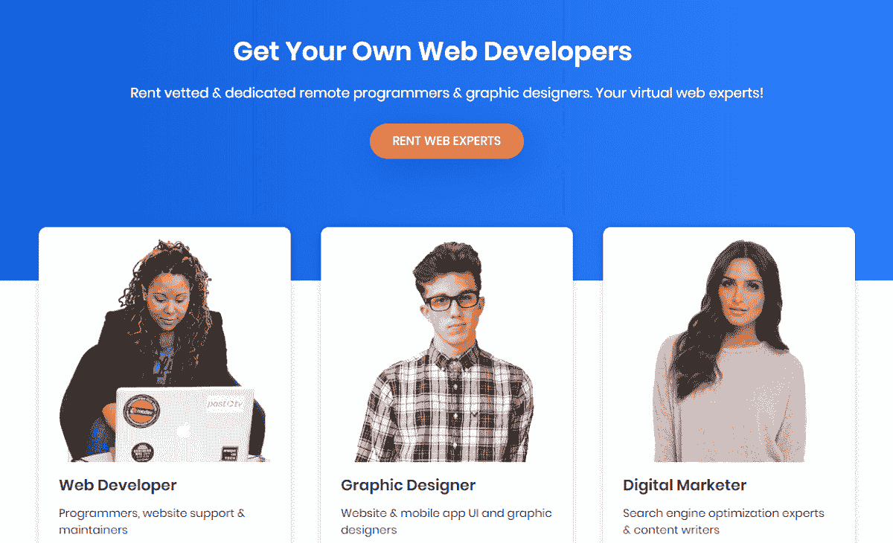
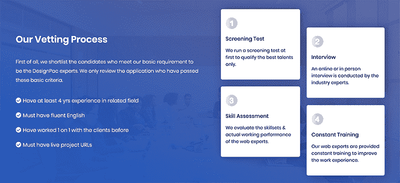
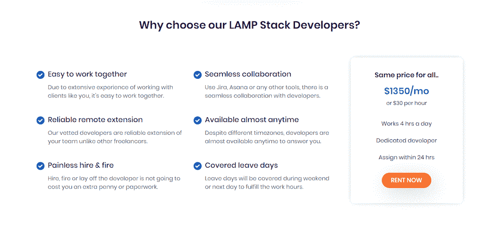
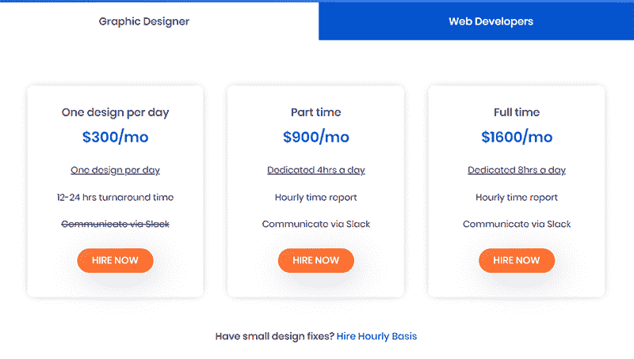
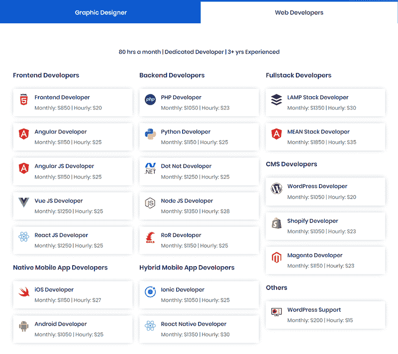

# 克服贫困，规划并建立一个 2 万美元的 MRR 企业

> 原文：<https://www.indiehackers.com/interview/overcoming-poverty-to-plan-and-build-a-20k-mrr-business-58890d612b>

## 你好！你的背景是什么，你在做什么？

我叫 SumanJung，今年 25 岁。我来自尼泊尔。尼泊尔是世界上最贫穷的国家之一，但对于那些有上进心的人来说，它仍然拥有巨大的商机。

我与人合伙创办了一家名为 [DesignPac](https://www.designpac.net/) 的公司，以每月低廉的固定费用提供专门的、经过审查的网络专家(平面设计师、网络开发人员、数字营销人员)。

这是一个简单的概念——当正在进行的项目和一次性项目需要远程网络专业人员时，我们帮助企业找到他们。目前，我们提供按小时、兼职和全职收费的编码员/程序员和图形设计师。通过提供工作就绪、经过审查的网络专家，我们消除了麻烦、额外费用和令人头痛的人力资源(发布职位空缺、搜索简历、面试几个候选人等)。).

保持专注，保持动力，不要让困难时期让你沮丧。继续努力。

TweetShare

我们所有的专家都经过精心训练，能够与客户一对一地合作。由于汇率的原因，我们能够支付给我们的团队远高于行业标准的薪酬，这不仅使我们在市场上具有竞争优势，而且使我们能够只雇佣最优秀的员工。我们的大部分客户是科技创业公司、小企业和代理商。

 

## 是什么促使你开始使用 DesignPac？

我从未想过我会成为今天的我。我不是生来就有很多资源和选择的。在我父亲失业和我们的经济状况恶化后，我在一个偏远的村庄由我的祖父母抚养。我的青春是在贫困中度过的。从年轻时起，我就下定决心要让自己摆脱贫困。

我在一个非英语国家长大；然而今天，我的大多数客户都是英国人。我必须进行大量的练习才能达到这一步。在妈妈的帮助下，我去了加德满都(尼泊尔的首都)接受高等教育。但是时代很艰难，大学也是如此。为了养家糊口，我辍学加入了陆军训练学校，以实现另一个梦想:成为英国廓尔喀军队的一员，这是尼泊尔社会中一个享有盛誉的职业。我还清楚地记得我被拒绝了，哭着回到家的那一刻。

我的哥哥 Pujan 正在利用他的平面设计技能寻找在线赚钱的方法。我决定试一试，加入了他。我们只有一台从叔叔那里借来的笔记本电脑。我哥白天用，我晚上用。我度过了许多不眠之夜，发现了像 [Designcrowd](https://www.designcrowd.com/) 和 [99designs](https://99designs.com/) 这样的众包网站。我开始在这些网站上参加设计竞赛，边走边学。九个月后，我终于成功了，赢得了 90 美元的名片设计。

赢得比赛增强了我的信心。之后，我做了一名自由平面设计师。工作开始滚滚而来，我开始为一家名为 [Stidner](https://www.stidner.com/) 的瑞典公司远程工作，担任他们的首席设计师。我能够从我的家里赚很多钱。

但这还不够。

我和我哥哥意识到我们在零星地赚钱，我们希望它更加稳定。我们成立了公司 Cinqsnipe Technology，为本地和国际客户提供品牌、网络和移动应用开发服务。我们挨家挨户地向土地客户推销，并有机会与尼泊尔一些知名和声誉良好的公司合作。然而，没有足够的经营企业的经验，它很快就失败了。虽然最初的概念看起来很有希望，但后勤还没有到位。我们需要一个更好的策略。

有一天，我的一个朋友提出了一个想法，每月支付固定费用，就可以获得无限的图形设计支持。这是在 2016 年末。我仍然没有经营或建立企业的经验，但这个概念太好了，不能不考虑。我购买了 WordPress 主题，购买了 designpac.net 域名，并于 2017 年 1 月推出了该网站。

该网站非常简单:描述我们做了什么，它是如何工作的，以及定价包的声明。当时只有四五个竞争者。我们没有自己的门户供客户登录和管理任务，所以我们用 Trello 代替。作为一家尼泊尔公司，我们没有像 Stripe 这样被广泛接受的全球支付处理器，所以我们手工发送发票，并通过 PayPal 接受付款。

处理支付开始成为一个问题。业务进展顺利，但国内的问题限制了我们的发展。尼泊尔不支持 PayPal。我在国外的一个朋友很友好地接受了贝宝的付款，然后电汇到我们这里。这既昂贵又耗时。我急切地寻找任何能使我们摆脱这些问题的解决办法。

突然，一个机会出现了。一家名为 Sqwash 的美国初创公司对互利并购表现出了兴趣。经过多次商议和谈判，合同于 2018 年 12 月一起签署。最好的部分是注册成为一家美国企业，并设立一个 FDIC 认可的银行账户。我们现在拥有了在全球市场竞争所需的一切。

到这个时候，市场上有许多竞争者也以固定的费用提供无限的图形设计服务。为了保持我们的竞争优势，我们决定扩大和增加开发和数字营销服务。我们提出了一种“租赁”模式，企业可以租用远程网络专家。

 

## 构建最初的产品需要什么？

这是一个漫长的过程。但最终一切都走到了一起:我们制定了详细的运营协议，建立了所有必要和安全的支付处理系统，并建立了一个由设计师、开发人员和营销人员组成的团队。我们多次改变我们的定价和服务菜单，直到我们最终在盈利的最佳点着陆，同时仍然为客户提供价值。

大多数人失败不是因为他们的梦想无法实现或没有必要，而是因为他们没有计划如何实现。为不可预见的灾难做好准备，并有行动计划。

在最终确定价格和计划时，我们的技术团队正忙于开发客户创建和管理其任务的仪表板。我希望它类似于 Trello，因为它是一个美丽而简单的工具。我们采用了 Trello 成功使用的看板板的相同模型。完成任务的过程有四个阶段:请求、结果、修改和移交。客户创建一个任务，一旦完成，专家会将它移动到结果部分。如果有修订，任务卡将被移至修订栏或移交栏。专家以要求的格式提供所有文件。

我们使用 PHP Laravel 作为仪表盘和集成 Stripe 的后端。在使用基于订阅的产品和普通产品时，很难在同一个平台上集成 Stripe。从开始到结束，我们花了将近六个月的时间将仪表板投入使用。

许多人只看到了经营企业的积极一面，而没有预料到它的消极面；花时间制定计划，坦然接受失败的想法。

TweetShare 

## 你是如何吸引用户和发展 DesignPac 的？

在 2019 年 2 月推出新服务之前，我完全专注于学习以结果为导向的营销策略，同时建立了网站和仪表板。自从我们开始做生意以来，我学到了很多东西。

在我们推出之前，我制定了一个全面的营销计划。在宣传 B2B 商业模式时，我相信有机理念，所以我们没有为付费广告做预算。相反，我们会定期在我们的[博客版块](https://www.designpac.net/blog/)发布文章，并更新社交媒体。

自我们推出以来，已经过去了将近两个月，我正在尝试不同的方法来有机地接触顾客:

*   **Reddit/indie hackers/Quora**
    我是这些平台的活跃用户。我每天都写一篇针对企业家和小企业主的知识帖。我与刚开始创业的人互动和交谈，分享知识/故事/成就，这反过来又增加了我的业务曝光率。我也回答他们的问题。有时分享你的商业故事(收入增长、客户体验、雇佣新员工等。)帮助你的企业获得牵引力。

*   **联盟营销**
    这是 B2B 业务最有效的方法。自从我们启动以来，我们已经接纳了总共 29 个客户；17 个是活跃客户，其中一半来自联盟营销商。我们为每个注册提供 10%的佣金，并在注册后提供一个附属链接的仪表板。

*   我收集有设计师、开发人员或营销人员职位空缺的公司的电子邮件地址，并向他们发送推销邮件。最终，我们为这些创建了一个模板，到目前为止，它似乎在工作。

 

## 你未来的目标是什么？

如今，我们正在实现每月销售目标并不断扩张，同时在达到特定里程碑时尝试不同的策略。我们也在继续发展我们的社交媒体和网络业务。

我们通过脸书、Instagram 和 LinkedIn 开展广告活动，每天都给我们带来一些线索。现在，我们在 MRR 通过缓慢但明智的行动赚了 1.9 万美元。找到理想的网络专家需要相当长的时间，而且并不是所有人都能成为 DesignPac 专家。但到目前为止，供应满足了需求。

 

## 有没有发现什么特别有帮助或者有优势的？

自从创业以来，我学到了很多东西。我学会了梦想和远大的目标。在规划我们公司的发展方向时，我总是试图从全球角度考虑。最重要的是一步一步来。

继续自我教育并在你的行业中保持领先也很重要。每天我都会花一些时间阅读文章和观看 Youtube 来了解企业家精神和商业。创业不仅仅是通过解决问题来赚钱；这是学习和创新，就像提供产品或服务一样。我终于觉得自己创造了一些值得骄傲的东西——我不仅仅是制作图形和应用程序，我还帮助人们建立自己的企业。

保持专注，保持动力，不要让困难时期让你沮丧。继续努力。

## 对于刚刚起步的独立黑客，你有什么建议？

开始之前，你应该有一个明确而具体的战略。你想做什么，你会做什么来实现它？商业想法越简单，过程就越简单。你的过程是你成功的蓝图。

过程的清晰可视化是关键。出发前制定一个全面的计划；不要只是创建业务和收入预测的路线图，要计划如何处理*负*收入的情况。许多人只看到了经营企业的积极一面，而没有预料到它的消极面；花时间制定计划，坦然接受失败的想法。

## 我们可以去哪里了解更多？

*   网址:[www.designpac.net](https://www.designpac.net)
*   脸书页面: [DesignPac](https://www.facebook.com/thedesignpac/)
*   推特: [@thedesignpac](https://twitter.com/thedesignpac)
*   LinkedIn: [DesignPac](https://www.linkedin.com/company/designpac)

如果你有任何问题或意见，请在下面留言！

——[<picture id="ember5247822" class="user-avatar ember-view user-link__avatar"></picture>苏曼君](/sumanjung?id=JaCGK4JpFUe8d3lSJThcnUdguVV2)，DesignPac 联合创始人

## 想像 DesignPac 一样建立自己的企业？

你应该加入[独立黑客社区](/)！🤗

我们是几千名创始人，互相帮助建立有利可图的业务和副业。来分享你正在做的事情，并从你的同事那里获得反馈。

还没准备好开始使用你的产品吗？没问题。这个社区是一个认识人、学习和实践的好地方。随意[随便浏览](/)！

——[<picture id="ember5247827" class="user-avatar ember-view user-link__avatar"></picture>考特兰艾伦](/csallen?id=ibTLPyjwVebnZjMGKvz6ztarnuV2)，独立黑客创始人

50votes