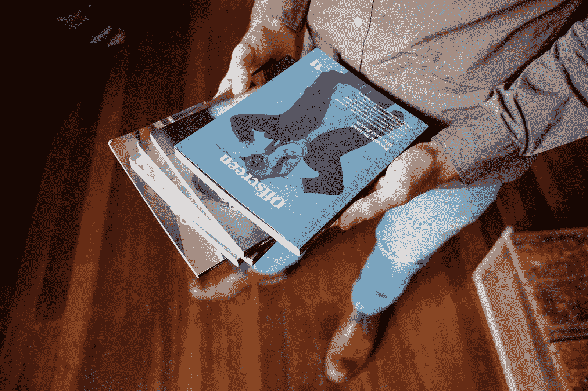
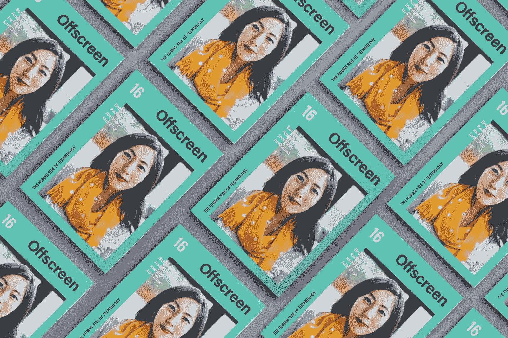

# 克服出版障碍，打造一份每月 1 万美元的技术杂志

> 原文：<https://www.indiehackers.com/interview/overcoming-publishing-hurdles-to-build-a-10k-mo-tech-magazine-afb2a36ec0>

## 你好！你的背景是什么，你在做什么？

我叫凯·布拉克。我是《屏幕外杂志》的出版人/编辑/创始人，这是一份独立的印刷杂志和《T2》周刊，对技术和网络进行了深思熟虑的、以人为本的报道。

该杂志每年在澳大利亚墨尔本出版三次，但在德国柏林印刷和装运。这 5000 本中的大部分在网上[出售](https://www.offscreenmag.com/buy)，但是在世界各地的首都也有大约 [200 家店铺](https://www.offscreenmag.com/about/stockists)出售这本书。

“银幕外”是一个人的工作，自从我创办这个公司以来，它一直是我的全职工作——现在已经是五年多前的事了。我的大部分收入来自 20 美元的封面价格。

[

凯拿着一些印刷杂志。](https://www.offscreenmag.com) 

## 是什么促使你创办杂志？

在推出[屏下](https://www.offscreenmag.com/)之前，我在[设计网站](http://brizk.com)十几年，大部分时间是作为自由职业者。2011 年初，我对自己正在做的工作感到非常不满足。这可能是因为客户的类型，但也是因为数字化的一切都是短暂的。几个月的创造性工作将简单地消失在互联网上，很快就会被新的版本号、收购或最新的设计趋势所取代。

我决定休息一段时间，并旅行了一段时间，主要是与其他网络人聊天。见到人们，听到我使用多年的产品背后的人类故事，让我大开眼界。

在我旅行的时候，我也爱上了印刷杂志，我在我去过的城市里寻找最好的杂志和书店。当我回来的时候，我决定要把这两者结合起来:用一种印刷的、更有形的形式讲述科技背后的人类故事。

## 是什么让第一期发行了呢？

在三个月的时间里，我基本上从网页设计转向了印刷设计，通过与许多出版商交谈、观看教程视频以及反复试验，自学了大部分技能。

2011 年末，我启动了 Kickstarter，为我的杂志创意筹集了 16000 美元。不幸的是，这还不够，但因为我做了这么多的跑腿工作，我决定用自己的积蓄继续下去。我很幸运地找到了八个赞助商，他们当时每人只支付了 400 美元的小额赞助费，这至少有助于支付部分印刷费用。

我决定[在德国印刷杂志](http://www.heftwerk.com)，尽管我的工作地点在澳大利亚，因为德国人对印刷略知一二，而且成本相对较低(尤其是与澳大利亚相比)。我出生在德国，并在那里生活了半辈子，所以交流不是问题。

将生产转移到德国的另一大好处是，他们的邮政服务为媒体邮件提供了一个简单、更实惠的定价结构。将像屏幕外的杂志寄到世界上任何地方只需要 3.5 欧元的邮费，而如果我从澳大利亚寄出，则需要 4 倍的邮费。

我创建了一个非常简单的网站来销售杂志，并在 2012 年 2 月推出了 3000 份的《银幕外》第一期。它没有在一夜之间售罄，但在最初几周卖得相对不错——好到足以在不久后承诺发行另一期。

然后一个又一个。

第一年只够生活，我很幸运有一些个人存款。但随着我增加赞助费用和发行量，订户数量也在增加，它变成了一个小而稳定的业务，有足够的利润使其可持续发展，值得发展。

[

画面外的打印机，*柏林的 medialis* 。](https://www.offscreenmag.com) 

## 你是如何发展屏幕外的用户群的？

我一直相信凯文·凯利的[1000 名忠实粉丝](https://vimeo.com/63654060)理论——你只需要 1000 名左右的忠实支持者，就能让你做的事情持续下去。1000 名普通读者/顾客似乎是可行的，这是我在推出[荧屏外](https://www.offscreenmag.com/)大约四期或十五个月后实现的目标。

但是说实话，你不会从独立出版中发财。这与构建数字产品非常不同，因为增长非常缓慢，需要几个月/几个问题。出版任何印刷品都需要激情、毅力和一点财务资本。对于独立杂志来说，使其可持续发展是一个巨大的成功。能够从中过上好日子，就是我们版本的独角兽。

对于独立杂志来说，使其可持续发展是一个巨大的成功。能够从中过上好日子，就是我们版本的独角兽。

TweetShare

独立印刷杂志的伟大之处在于他们拥有非常忠诚和热情的追随者。有些人在朋友的办公室或书店里发现了他们喜欢的出版物，并对它产生了浓厚的兴趣。印刷品的实体性和多感官体验吸引着人们。在当今短暂、超快的比特和像素世界中，我们许多人重新发现了拿着一本真正的书/杂志的快乐。

由于银幕外是一个人的表演，我没有太多的时间做市场营销。大部分销售来自固定的读者/订户，通过商店，或者通过我的社交媒体关注和我的邮件列表。

我对“做正确的事情”和以深思熟虑和道德的方式开展业务有着非常强烈的看法，这意味着我排除了某些在“增长黑客”哲学中非常常见的推动销售或线索的方式，例如时事通讯注册弹出窗口、点击诱饵列表等等。

我经常做的一件事(我猜你可以把它归入内容营销类别)是分享关于制作屏幕外的幕后博客帖子。例如，我最近发表了…

*   [我如何选择屏幕外的新字体](https://www.offscreenmag.com/blog/settling-on-acumin)，
*   [为什么我决定更换杂志的装帧](https://www.offscreenmag.com/blog/stitch-binding)，以及
*   [我定制的杂志订阅管理系统是什么样子的](https://www.offscreenmag.com/blog/magazine-subscription-management-system)。

去年，我写了一篇名为 [Indie Magonomics](https://www.offscreenmag.com/blog/indie-magonomics) 的巨型帖子，分享了我所知道的关于如何把数字加起来的一切。

写这些帖子，我不仅仅是想帮助其他初出茅庐的出版商:我认为我的许多读者真的很喜欢听如何制作一本伟大的小型独立杂志，这有助于他们理解为什么这本杂志要 20 美元，而不是 5 美元。

## 你能谈谈你们的定价模式、收入和费用吗？

这本杂志的读者费用是 20 美元，包括运送到世界各地的费用。我把其中的 7.5 美元花在了履行(包装、处理和邮寄)上。制作成本约为每本 3 美元(印数为 5000 本)，大部分由赞助商支付。编辑费用(作家、摄影师、插图画家、校对等。)因期而异，但每期约为 5000 美元至 7500 美元。

基于上述数字，你可能会认为我每期的纯利润约为 55，000 美元，但不幸的是事实并非如此。在我印刷的 5000 份中，只有大约一半以全价出售。其余的卖给零售商，零售商保留 40-60%。我还在世界各地的技术/设计会议上分发了很多免费的拷贝:我的营销预算。

由于银幕外是一个人的表演，我没有太多的时间做市场营销。

TweetShare

因此，虽然收入有时可能是每年 20 万美元甚至更多，但实际利润更有可能是税前 6 万至 8 万美元。

给一个简单可靠的数字变得更加困难，因为我的出版时间表很少(目标是每年三期)。我有几年赚了 10 万美元以上，然后有一年赚了一半。这真的取决于出版日期。还要记住，我住在世界上最昂贵的城市之一。就这一点而言，柏林是创办杂志的好地方，因为那里的生活费用仍然低得令人难以置信！

## 固定订户对你的商业模式有多重要？

订阅是任何杂志的支柱，因此至关重要。不幸的是，在网上销售实体出版物的订阅(尤其是当它们不经常发行时，比如屏幕外的[】仍然很棘手。](https://www.offscreenmag.com/)

对于大多数独立出版商来说，订阅通常只是提前销售的下 X 期(通常覆盖一整年)的包装。它们不会自动更新。

这意味着读者必须在一年后回来，手动续订。直到最近，屏幕外订阅也是这样运作的。问题是每次更新的时候，一定数量的用户会因为忘记而退出。

 

我试图通过建立一个更像数字订阅的[新订阅系统](https://www.offscreenmag.com/blog/magazine-subscription-management-system)来解决这个问题:我现在为订阅者提供几个层次——从标准读者(每期 20 美元)到老顾客(每期 50 美元)。我不再预付一整年的费用，而是在每发行一期新书时向他们收费。订阅会自动续订，直到他们通过自己的帐户取消或信用卡用完(顺便说一下，使用 Stripe)。

我几个月前才推出这个系统，现在判断它是否能更好地留住读者还为时过早。我希望如此，因为开发新的后端花费了我大约 15，000 美元，我能够在最近的[筹款活动](http://rebranding.offscreenmag.com/)中筹集到这笔钱。

## 银幕外的未来是什么样的？

过去的五年令人非常满意，但也同样令人疲惫不堪。我绝对已经达到了一个人对一个杂志品牌所能做的极限。

老实说，我很乐意保持小个子。我不想成长为一个大型媒体品牌，并扩展到每一种可能的形式:播客、活动等。

不要假装是一个大的，不知名的品牌，而是拥抱你的灵活和独立。

TweetShare

然而，如果能发展到足以长期雇佣一名助理编辑或编辑助理就好了。

最近重新推出和引入上述订阅模式旨在实现这一目标。我想把我的订户数量增加到我能雇得起兼职编辑的数量。确切的数字仍有待确定，但我目前的目标是 2，000-2，500 名订户。

## 你面临的最大挑战是什么？你克服的障碍？

天哪，从哪里开始呢？！因为我是个彻头彻尾的菜鸟，所以我犯了很多代价高昂的错误，从封面上的错别字(后来不得不重印)，到与从不付账的零售商打交道，到运送一箱箱从未送达的杂志。

我犯了很多初学者的错误，这就是为什么我如此渴望分享我的经验——以便不是每个人都必须经历相同的坎坷道路才能推出第一期。

实际上，最大的挑战仍然是组织内容计划和寻找容易接近、可靠和合适的贡献者。我正在为杂志采访许多非常忙碌的人，所以找时间进行长时间的 Skype 聊天和拍照总是一个挑战。

当然，生产真实、有形的产品并将它们运送到世界各地也是一个挑战。任何处理相关物流的人都会告诉你，事情经常出错。你最终会花很多时间向你的顾客道歉，因为邮政服务没有做好他们的工作。

 

更个人而言，对我来说最大的挑战是不要失去动力。因为只有我一个人，保持出版新材料所需的热情、精力和创造力水平并不总是容易的。在出版界，“一期之后”总是等同于“下一期之前”。换句话说，很少有时间去欣赏你刚刚完成的工作。

我也在努力将休闲和工作时间分开，这意味着我经常处于工作状态。这不一定会导致精疲力竭，但它可能会导致我不喜欢我所做的事情，在我看来，这几乎更糟。我想起了杰森·弗里德(Jason Fried)在我们的采访中告诉我的一些事情:尽管所有人都在谈论创业，但创业实际上很容易——要坚持下去要困难得多。

## 对于刚刚起步的独立出版商，你有什么建议？

就独立杂志出版而言，我认为我的[独立杂志经济学](https://www.offscreenmag.com/blog/indie-magonomics)帖子是一个好的开始。这里是[我用其他有用的资源整理的列表](https://www.offscreenmag.com/blog/resources-for-mag-makers)。

在之前，我也[写过一个更普遍的建议，那就是“个性化”。无论你在创造什么，都要建立自己的理想、价值观和观点。不要假装是一个大的，不知名的品牌，而是拥抱你的灵活和独立。](https://www.offscreenmag.com/blog/you-are-running-a-barber-shop)

[忘记专业](https://www.offscreenmag.com/blog/take-your-conscience-to-work)。创造一些独特的立场和观点。它可能不会吸引所有人，但会有一群人(希望有 1000 名真正的粉丝)认同你要说的话，并全力支持你，不管发生什么。

## 我们可以去哪里了解更多？

我们最新的一期是 [#16](https://www.offscreenmag.com/issues/16) 。你可以在 offscreenmag.com/buy 购买一份并订阅。每一份订单都很重要，有助于未来的销售！

你可以阅读更多[关于我](https://www.offscreenmag.com/about/)和[我们的生产流程](https://www.offscreenmag.com/about/production)、[找一个配货员](https://www.offscreenmag.com/about/stockists)，或者[浏览博客](https://www.offscreenmag.com/blog/)。你也可以在我最活跃的 Twitter 上关注我( [@kaibrach](https://twitter.com/kaibrach) )或者 [@OffscreenMag](https://twitter.com/offscreenmag) )。或者就在下面留言评论吧。

——[<picture id="ember8062656" class="user-avatar ember-view user-link__avatar"></picture>凯·布拉奇](/KaiBrach?id=offscreen-magazine-owner)，《画外音》杂志创作者

## 想像《银幕外杂志》一样建立自己的事业吗？

你应该加入[独立黑客社区](/)！🤗

我们是几千名创始人，互相帮助建立有利可图的业务和副业。来分享你正在做的事情，并从你的同事那里获得反馈。

还没准备好开始使用你的产品吗？没问题。这个社区是一个认识人、学习和实践的好地方。随意[随便浏览](/)！

—[<picture id="ember8062661" class="user-avatar ember-view user-link__avatar"></picture>考特兰艾伦](/csallen?id=ibTLPyjwVebnZjMGKvz6ztarnuV2)，独立黑客创始人

11votes