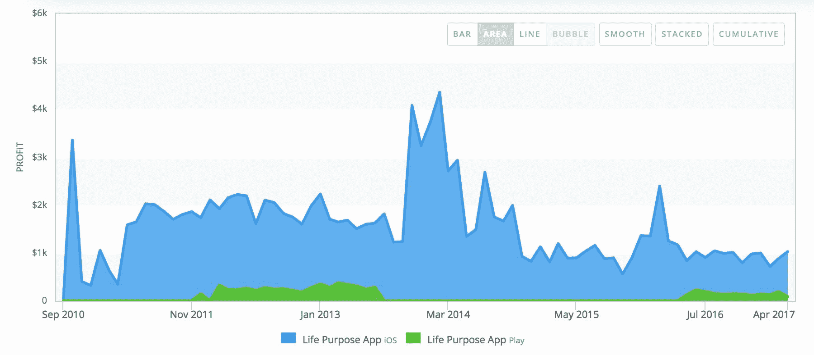

# 克服技术挑战，向 2 万人销售 10 美元的应用程序

> 原文：<https://www.indiehackers.com/interview/overcoming-technical-challenges-to-sell-a-10-app-to-20-000-people-dfd7860949>

## 你好！你的背景是什么，你在做什么？

你好，科特兰，独立黑客的每一个人！我的名字是马丁·亚当斯，我是[意识应用](https://www.consciousapps.com)幕后的人。我从 12 岁起就喜欢编程，但从未认真对待过，直到去年我成为一名全栈软件开发人员。

那时我决定全职开发意识应用。Conscious Apps 是一家开发“有目的的应用”的应用开发机构，尽管到目前为止只有一款应用:生活目的应用。

Life Purpose App 每月的收入在 1000 美元到 2000 美元之间。我最近推出了一个新版本，到目前为止，它已经有近 1200 名活跃用户。Life Purpose 应用的成功激励我开发更多类似的应用。

## 是什么促使你开始使用意识应用？

当我第一次遇到 IndieHackers.com[的时候，我几乎不敢相信我找到了我的部落:一个寻找创新方法创造被动收入的社区。对我来说，创造被动收入的冲动是由对个人自由的渴望驱动的。我很不情愿地得出结论，我不适合就业——我太独立了——我也不想作为一名独立承包商不断地用我的时间来换取金钱。](https://www.indiehackers.com)

早在 2009 年，我联系了畅销书作家[丹·米尔曼](http://www.peacefulwarrior.com/)，他是《和平战士之路*的作者，我的想法是基于他的一本书[你生来应该过的生活](https://www.amazon.com/Life-You-Were-Born-Live/dp/091581160X/ref=sr_1_1?ie=UTF8&qid=1493426746&sr=8-1&keywords=the+life+you+were+born+to+live+dan+millman)开发一个应用程序。这本书对我产生了近二十年的积极影响，因此基于这本书开发一个应用程序似乎非常值得。*

起初，丹回答说他不感兴趣。但后来，大约半年后，他带着一个“想法”联系到了我:我会有兴趣把这本书开发成一个 app 吗？(显然，他已经忘记了我之前曾提出过这个想法。)不用说，我愉快地答应了。

我通常不会根据逻辑做决定，而是根据感觉和直觉。生活目标应用程序的情况就是如此:它揭示一个人隐藏的生活目标的不可思议的能力让我觉得这是一次值得的尝试。当时，我对它的财务潜力一无所知。

在某种程度上——甜蜜的同步没有逃过我——通过开发生活目的应用程序，我最终发现了作为应用程序开发人员的生活目的。

## 构建最初的产品需要什么？

虽然我有图形设计技能，但我几乎没有 Objective-C(苹果当时用于 iOS 的编程语言)的经验，所以我不得不雇用应用程序开发人员。

这是在 iOS 应用商店的早年，有真本事的应用开发者少之又少。更糟糕的是，那些拥有重要技能的人价格高得惊人。此外，在印度与程序员共事还有语言障碍，这是我唯一负担得起的选择。就质量而言，物有所值:1.0 版本的质量非常差，开发时间大约为 10 个月。

我还花了很多钱在那些“很好拥有”但对应用程序不重要的功能上。我花了 3 万多美元(用我的积蓄)开发了 1.0 版的[人生目标应用](https://www.lifepurposeapp.com/)。(幸运的是，在苹果的 iBooks 应用程序出现之前，我使用了部分技术来销售电子书，这支付了一部分费用。)

第二版变得更好，因为我遇到了一个当地的应用程序开发者，他同意也获得一部分收入，而不仅仅是预付。这意味着我能够更频繁地升级应用程序。

然而，技术在不断发展，我不得不再次面对这样一个事实，如果要跟上时代的步伐，我需要进一步投资这个应用程序。到 2016 年，我们已经到了第 4 版，但该应用仍然主要包含遗留代码，并基于 32 位基础设施。(人们普遍认为，iOS 将在 2017 年晚些时候通过 iOS 11 放弃对 32 位应用的支持。)Life Purpose 应用程序偶尔也会出现一些我不知道如何修复的错误。所以我决定冒险成为一名应用程序开发员。

由于热爱 iOS 平台，我尝试了两次学习 Objective-C(后来 Swift 和 Objective-C 一起)*。这两次，我都花了很多钱参加为期一周的训练营，每次我都因为一点都不懂而退出。这令人非常沮丧:一个有编程诀窍的相当聪明的人怎么可能不理解 Objective-C？这种语言看起来笨拙而复杂，就好像它被故意设计成让我的生活尽可能的繁琐。*

如果就业很容易赚钱，而做一名独立黑客却不容易(至少一开始是这样)，那么你必须热爱自己的工作。

TweetShare

我终于意识到，计算机编程语言就像人类语言一样:有些语言我们喜欢，而有些我们不喜欢。有些我们有学习的诀窍，而另一些则不是我们喜欢的。这种见解帮助我接受了我永远也不会学习 Objective-C 的事实，也帮助我认识到我确实喜欢的语言——并且因为我也是一名独立的 web 开发人员，所以我一直喜欢的语言——是 JavaScript。

因此，去年我参加了新西兰的 Enspiral Dev Academy(由于有利的汇率，比美国的 Dev 学校有折扣)，从而扩展了我的 JavaScript 知识。我于 2016 年 10 月底毕业，2017 年 1 月 3 日，我开始了从零开始重建人生目的 App 的艰难工作，使用脸书的 [React](https://facebook.github.io/react/) 和 [GraphQL](http://graphql.org/) 技术(通过 [Graph.cool](https://www.graph.cool) 接口，这是我极力推荐的服务)。

iOS 和 Android 版本使用应用内购买(从 2017 年 5 月 1 日开始)，而 web 应用包含 [Stripe Checkout](https://www.stripe.com/checkout) 应用内购买模块。我在这里写了[如何创建一个](https://medium.com/consciousapps/integrating-stripe-with-react-graphql-and-apollo-client-e09fdc9e5b95)。

我也研究了 [React Native](https://facebook.github.io/react-native/) ，但是用另一种 JavaScript“方言”为移动设备改造应用程序所花费的努力似乎与应用程序的需求不相称。因此，我使用 JavaScript-iOS/Android 界面 [Cordova](https://cordova.apache.org/) 将应用程序保存在单一代码库中，并于 2017 年 4 月在 iOS、Android 和 LifePurposeApp.com[网站上发布了 5.0 版本。](https://www.LifePurposeApp.com)

## 你是如何吸引用户和开发有意识的应用程序的？

作为 17 本书的作者，包括著名的畅销书 *[【和平战士之路](http://amzn.to/2oYtL8a)* 】，丹·米尔曼有一群忠实的追随者。除了他的书 *[《你生来注定要过的生活](http://amzn.to/2pdYs9I)* 所提供的巨大价值(以及[人生目标应用](https://www.lifepurposeapp.com/)所基于的价值)之外，这一系列吸引了绝大多数用户。

到目前为止，总共有 22，000 名用户下载了这个 9.99 美元的应用程序。

除了丹的努力，我还尝试过脸书的广告，结果喜忧参半。广告的最终成本通常在每次实际销售的 6.50 美元至 9.00 美元之间，这往往高于我们每个应用程序 6.99 美元的利润(扣除苹果和谷歌的费用)。早期我也给人生目的 App 的[脸书](https://www.facebook.com/LifePurposeApp)和[推特](https://www.twitter.com/LifePurposeApp)账号做过广告，结果未知。

我在 5.0 版本的开发过程中想到，销售这款应用的关键是创建一个用户社区。因此，我将用户账户整合到 5.0 版本中，让用户不仅可以在手机上，也可以在网络上个性化生活目的应用。(例如，如果他们在手机上添加朋友的生活轨迹，当他们在网络上使用 Life Purpose 应用程序时，他们的朋友也会出现在他们的帐户中)。

这反过来允许电子邮件自动化。假设有人注册了，但没有在 24 小时后接受 9.99 美元的暴跌。MailChimp 会给他们发一封电子邮件，提醒他们人生目的应用的价值。如果他们还没有注册完整版，一周后会有另一封邮件，以此类推。

这也为我将来可能开发的其他应用的交叉推广打开了方便之门。然而，为了保护我提供的服务的完整性，并确保用户放心交出他们的个人数据，我制定了一个严格的[隐私政策](https://www.consciousapps.com/privacy)。实际上，用户拥有他们自己的数据，这是他们应该拥有的。

## 你的商业模式是什么，你是如何增加收入的？

[生活目的应用](https://www.lifepurposeapp.com/)售价 9.99 美元。我觉得这很有趣，因为大多数移动应用程序都远没有这么贵，但鉴于应用程序提供的价值，这个范围内的价格是合理的。如果我必须给其他开发者一条关于定价的建议，那就是:坚持给你的应用程序定价合理。人们为他们看重的东西付钱。如果你的应用为人们提供了很好的价值，他们会为它买单。

目前，Life Purpose 应用程序有三种赚钱方式:通过 iOS 应用商店、谷歌 Play 商店(在很小程度上，还有亚马逊商店)，现在还可以直接通过网络赚钱。

起初，从版本 2 到版本 4，我们有两个应用程序:一个 9.99 美元的完整版和一个推广完整版的“精简版”免费版。然后，苹果推出了应用内支付(IAP)，但因为我没有必要的编程经验，我从未将 IAP 集成到应用中——直到现在，第 5 版。

我的直觉是，包含 IAP 的免费应用优于付费应用，因为更多的用户最终会下载它们，从而带来更大的曝光率和收入。这也是我决定在 5 版的 app 中集成 IAP 的原因。

人们为他们看重的东西付钱。如果你的应用程序给人们提供了很好的价值，他们就会为此付费。

TweetShare

然而，使用 IAP 从付费版本过渡到免费版本提出了一个有趣的挑战。一方面，你不希望通过 IAP 再次向之前购买该应用的用户收费，从而疏远他们。(尤其是这款应用售价 9.99 美元，虽然价格合理，但并不便宜)。

另一方面，无论是 iOS 还是 Android 都不会告诉你的应用程序，用户是否是这个应用程序的新用户，或者他们以前是否购买过这个应用程序。所以，怎么搞清楚该收谁的，不该收谁的？

这就是为什么有必要将用户账户整合到应用程序中。在第 5 版中，我创建了一个宽限期，在此期间，该应用程序继续以 9.99 美元出售，在此期间，从第 4 版更新或购买第 5 版的用户可以免费注册他们的帐户。然后，2017 年 5 月 1 日，app 变成了免费 app。

现在，任何从应用程序中注册的人都不会被标记为付费，而是处于试用状态。然后，用户可以使用 IAP 升级到完整版。

对于 iOS 和 Android，苹果和谷歌都拥有 IAP 支付方式(同时收取令人难以置信的 30%的分成)。然而，对于 web 应用程序，我可以自由地集成任何我想要的支付方式，所以我选择了 [Stripe Checkout](https://stripe.com/checkout) ，这是一个我认为既简单又优雅的华丽产品。(作为一名 web 开发人员，我也在一些客户网站中使用过它)。但由于这款网络应用在撰写本文时才刚刚推出几周，所以到目前为止，网络应用销售缓慢。

总的来说，我的猜测是，一旦生活目的 app 在 2017 年 5 月 1 日成为拥有 IAP 的成熟免费 App，下载量和销量将会回升。我估计这将增加其每月平均收入，从目前的 1000 美元增加到大约 2000 美元，也许是 2000 美元 3K。

## 你未来的目标是什么，你打算如何实现它们？

既然[人生目的 App](https://www.lifepurposeapp.com/) v5 已经完成，我正把目光投向下一个项目。

我还不完全确定我是否会复制丹·米尔曼和我与其他内容创作者成功创建的合作模式，或者我是否会着手开发一个具有独特价值主张的应用程序。

我所知道的是，我是 100%的独立黑客，并将继续开发被动创收应用程序，希望能为人们的生活增加价值。

## 如果你必须重新开始，你会做什么不同的事？

在成为一名应用程序开发人员的过程中，我发现至关重要的一件事是应用我的优势，而不是与我的劣势作斗争。

例如，我可以不去上第二门 Objective-C/Swift 课程(并为此付费),而是早早地接受我对 Objective-C 一无所知，而是专注于 JavaScript。这样我就可以早点开始开发，而不是付钱给其他开发人员。这无疑会更快地推动销售。

对我来说，另一个重要的教训是了解自己，并据此采取行动。

我终于向自己承认——在努力否认这个现实多年后——我不是一个团队成员。我不是不与人相处。相反，我通常与人相处得很好。只是我太喜欢编码和设计了，而且我对一个应用程序应该如何工作和看起来(作为一个完美主义者)有一个精确的想法，所以我想自己做这项工作。

我很难承认这一点，因为“团队精神”不仅在当今经济中受到重视，甚至经常被认为是一种道德上优越的地位。当你的天赋告诉你不是这样的时候，那真的很糟糕。

尽管如此，正如奥斯卡·王尔德提醒我们的那样，“既然其他人都已经名花有主了”，我最好还是做我自己。如果我早点接受这一点，我会更早地专注于成为一名独立黑客，而不是尝试就业或在网络开发工作中混日子。

## 你最大的优势是什么？有什么特别有用的吗？

自我怀疑大概是我最大的敌人；在我的生活中无处不在。

去年夏天，我的生活到了紧要关头。我觉得自己一直在从一件事情漂流到另一件事情，不太清楚自己的人生应该做什么(是继续做一名网络开发人员，还是成为一名应用程序开发人员，或者成为一名经济学博士，因为我曾经写过一本关于新范式[经济体系](https://www.unitism.com)的书)。

就在那时，我和母亲通了电话，她正确地指出，我总是事后批评自己。她告诉我，一旦我选择了某样东西，我需要对我的选择有信心，无论我面临什么样的障碍，我都需要坚持不懈，我需要用激光视力专注于我选择做的任何事情。

从这个简单却相对惊天动地的建议中(我的母亲是一个聪明的女人)，我收集了三个成功的必要因素，这三个因素一直伴随着我，并且我一直在尽我最大的能力应用它们。

*   *专注*——一次只做一件事
*   *毅力*——完成我开始的事情
*   信念——相信我做出了正确的选择，如果这个选择似乎让我误入歧途，相信这个选择的深层目的

当我在开发第五版[人生目标应用](https://www.lifepurposeapp.com/)时，我得到了应用这三个原则的机会。

在某一点上，我遇到了一个激烈的阻碍:反应本土或科尔多瓦？这个应用程序能够使用 Cordova 做所有需要做的事情吗？我连续几天探索某些路径，结果却把那项工作毁了。我变得不知所措，自我怀疑，我甚至不知道我是否能完成这个应用程序(毕竟，我从来没有做过这样的事情)。

然而，我知道我必须集中精力，坚持不懈，并有信心。果然，经过三个半月漫长的白天和几个不眠之夜，第五版完成了。

## 对于刚刚起步的独立黑客，你有什么建议？

尽管这么做很俗气，但我想不出比重申史蒂夫·乔布斯的名言更好的建议了。尽管它们已经在互联网上被重复了无数次，但其中包含的真理值得重复(不管人们认为史蒂夫·乔布斯是天才还是混蛋，或者两者兼而有之):

> 你的时间是有限的，所以不要浪费时间过别人的生活。不要被教条所困，教条就是生活在别人思考的结果中。不要让别人的意见淹没了你内心的声音。最重要的是，要有勇气跟随你的心和直觉。他们已经知道你真正想成为什么样的人。其他的都是次要的。

我认为“跟随你的心”是对独立黑客最好的建议。因为如果就业容易赚钱，而做独立黑客不容易(至少在一开始)，你必须热爱你所做的事情，这样你的激情才能支撑你走向更美好的未来。即使你做不到，至少你会在这个过程中得到乐趣，你也可能成为一个更好的人。

## 我们可以去哪里了解更多？

*   网站:[LifePurposeApp.com](https://www.LifePurposeApp.com)和[ConsciousApps.com](https://www.ConsciousApps.com)
*   中:[@ heymartindadams](https://medium.com/@heyMartinAdams)
*   推特: [@LifePurposeApp](https://www.twitter.com/LifePurposeApp) ， [@ConsciousApps](https://twitter.com/consciousapps) ，以及 [@heyMartinAdams](https://www.twitter.com/heyMartinAdams)

请随时问我任何事情！很高兴找到了我的部落，独立黑客伙伴们！

——[<picture id="ember8185412" class="user-avatar ember-view user-link__avatar"></picture>马丁·亚当斯](/heymartinadams?id=Q8z58kqK0NVRoX5R1JqvJOhxNTE3)，有意识应用的创造者

## 想要像有意识的应用程序一样建立自己的业务吗？

你应该加入[独立黑客社区](/)！🤗

我们是几千名创始人，互相帮助建立有利可图的业务和副业。来分享你正在做的事情，并从你的同事那里获得反馈。

还没准备好开始使用你的产品吗？没问题。这个社区是一个认识人、学习和实践的好地方。随意[随便浏览](/)！

——[<picture id="ember8185417" class="user-avatar ember-view user-link__avatar"></picture>考特兰艾伦](/csallen?id=ibTLPyjwVebnZjMGKvz6ztarnuV2)，独立黑客创始人

3votes