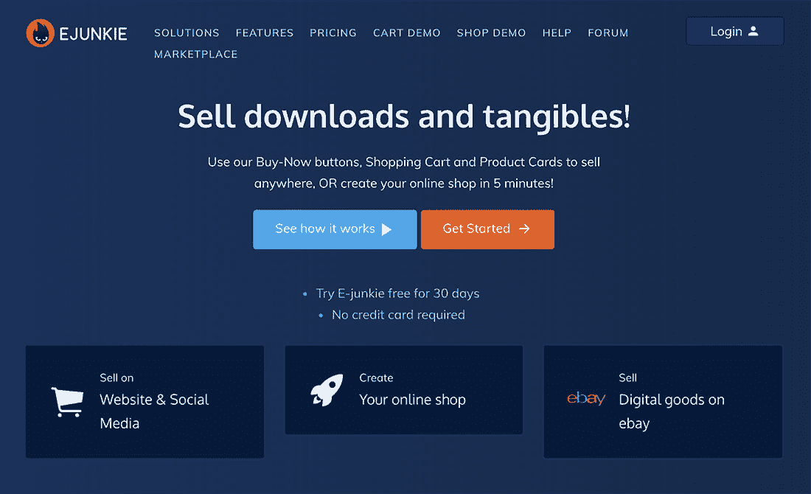
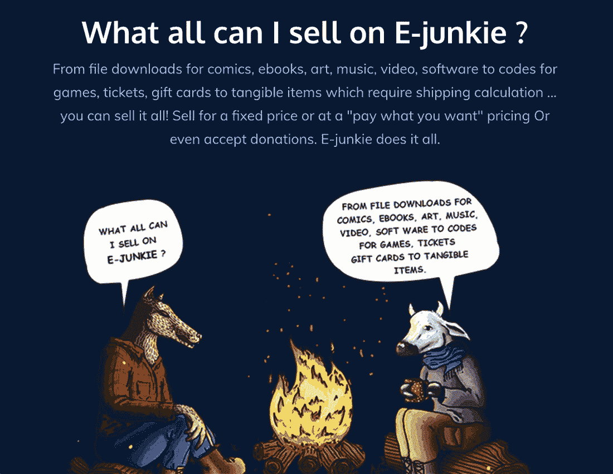

# 克服技术障碍，实现 100 万美元的 ARR

> 原文：<https://www.indiehackers.com/interview/overcoming-technical-roadblocks-to-achieve-1-million-arr-3df1ac487f>

## 你好！你的背景是什么，你在做什么？

嗨，我是罗宾。我从 1991 年开始用 DOS 和基本手册操作电脑，写东西和玩游戏，因为我和其他孩子相处得不好。

当互联网被引入印度时，并没有明确的书面程序。遗憾的是，为了获得访问权限，我不得不求助于“社会工程”和编写木马。决定将我的编码技能用于更容易被接受的用途，我开始用 Flash 制作网站和网络应用程序。给客户的一封拼写错误的电子邮件让我联系到了丹尼，一位前朋克摇滚歌手和电影《旋转》的制片人。他还在美国经营一家初创网络商店。接下来我所知道的就是，我在建造 kevinspacey.com！在一起工作了 18 个月和无数个项目后，我们决定一起发展丹尼的商店，因为我们在同一个地方工作。2003 年，我搬到了亚利桑那州的图森市。

适应土坯房和安静的街道是一种文化冲击。但是使用高速互联网、庞大的公共图书馆系统和咖啡店永远改变了我的生活。最终，我爱上了沙漠。

尽管我一直喜欢科技(现在依然如此)，但我过去常常把它视为达到目的的一种手段；我的短期目标是财务自由，这将使我能够暂停下来，在传统的价值体系中变得非功利。

我的计划是攒点钱，休息一年，完全专注于一个内容发布平台。这是从一个个人项目开始的，在那里我集中精力记录新的观察结果。我最终从谷歌广告中每月获得 300-400 美元。我想，如果我能挣到 3000 美元，我就可以过一辈子了。我把我的花费保持在有史以来的最低水平，为我一年的休假存钱。

为了补充我的收入，我还卖了一个小的图形工具。我向买家承诺，我会在 4 小时或更短时间内给他们送货。每当贝宝发短信给我的手机，告诉我销售情况，我就不得不赶紧回家或者从床上爬起来，用电子邮件发送文件。一旦我受够了这一点，我决定写一个脚本来实现自动化，并将其命名为“贝宝 IPN”我开始出售它，并收取安装费用。

 

## 是什么促使你开始接触电子迷？

事情在 2004 年发生了变化，当时我的几个音乐家朋友请我帮助他们设置 PayPal IPN 脚本，以交付他们的 MP3。即使这对曝光率很大，他们也不想让他们的粉丝去 iTunes 商店买他们的音乐。他们想让他们从自己的网站上购买音乐，避免费用。

大约在同一时间，我收到了贝宝的停止通知，说我不应该使用他们的名字。

这就是电子迷的想法诞生的时候:一个自助服务网站，人们可以上传他们的产品，链接到他们的支付账户，并获得一个在任何地方使用的购买链接。

## 构建最初的产品需要什么？

我在镇对面的服务器农场租了几台刀片服务器，开始编写代码。我不需要很多钱来启动 E-junkie，我写的代码也不复杂。我能够设置服务器，修复域名系统，并自己创建图形。

我白天工作，然后晚上继续工作。当它变得如此之大以至于我需要更多的时间时，我用我的 Adsense 收入雇佣了我工作的网店。

我的方法一直很粗糙；我很少关注“良好实践”我是一个创新者和问题解决者，而不是一个商人。销售和营销对我来说是陌生的。很明显，我的救赎将来自于电子迷，所以我放弃了我的内容发布网站。

大约在 2006 年，Google 找到我，问我是否有兴趣成为 Google Checkout beta 的一部分，并在 E-junkie 中实现它。这改变了游戏规则。那时，E-junkie 只为以数字方式出售任何东西(如文件或访问代码)的制造商提供 PayPal“立即购买”按钮。大多数使用电子迷的人是艺术家、软件开发者和作家。

为了提供两种不同的支付处理器，E-junkie 需要一个购物车。在这一点上，第三方购物车是丑陋的；就我记忆所及，他们没有完成包括文件、访问代码等在内的数字传输。所以我开始在一个灯箱中的商家网站内工作的推车。

当时还没有这样的东西，而且有很好的理由——没有办法实现这样的东西。所以我写了自己的程序，我称之为 JSOD (Javascript on Demand)。通过一些修改，JS 代码在 E-junkie 服务器上生成，然后嵌入到生成购物车的页面的 DOM 中。我称之为“无脂肪车”它变得广泛流行；我们是 TechCrunch 的特色，PayPal 非常喜欢它，我甚至出现在 PayPal 创新会议的横幅上。

我们的客户仍然是 DIY 艺术家，他们不需要太多的定制解决方案。他们喜欢我们的易用性。我们已经消除了在网站上实现电子商务的技术壁垒。像 MTV 和谷歌厨房这样的大公司甚至开始使用 E-junkie。

我成了自己成功的牺牲品。在成为一个人的军队后，我知道我需要人来做客户支持、写文档和开发。我需要建立一个正常运转的企业。

电子迷并不是从宏伟的愿景或总体规划开始的。我们不断添加客户想要的东西，大多数这些功能帮助我们吸引了更多的客户。

TweetShare

有趣的是，E-junkie 的整个想法源于我不想在半夜醒来手动交付，但在那一点上，我在半夜醒来协调任何客户支持电子邮件。我的伴侣 Shivani 帮助了我，但是一起生活和工作也引起了很多个人的紧张。

招聘和团队建设对我来说是如此陌生(记得我开始编码是为了远离人群)。对于我生活中需要的大部分东西(买东西、卖东西、帮忙搬家)，我都去 Craigslist。我喜欢这个网站，我也喜欢克雷格。我给他发邮件的时候他居然回复了。:)

于是很自然地，我在 Craigslist 上发了一个广告，认识了我们的第一个客户支持人员泰森(除了 Shivani 和我)。后来我找到了第二个开发者 Thad。

到那时，我们的服务器群已经不够用了，我们投资了几台自己的机器——运行 CentOS、防火墙、交换机、KVM、带远程访问的电源板等。我们搬到了 Login，一个高度安全的 co-lo 设施。搬家后没多久，我们就被解雇了。手动查找违规的 IP 地址并将其添加到防火墙中，让我们彻夜难眠。

幸运的是，有一家名为 RioRey 的初创公司连夜给我们运来了他们的两个箱子。我能够与他们一起修改固件，并添加一个功能，帮助我们调整针对我们的攻击的过滤。

最初几年的大部分时间都在克服非常明显的技术障碍。既然我们有了 AWS，那些看起来如此简单和愚蠢的事情。电子迷并不是从宏伟的愿景或总体规划开始的。我们不断添加客户想要的东西，大多数这些功能帮助我们吸引了更多的客户。

## 你是如何吸引用户和培养电子迷的？

大部分时间都是一对一的。我在工艺品展销会上遇到一些人，给像我一样手动销售数字产品的人发电子邮件。我研究了独立出书的作者，并给他们发了电子邮件。我在市场营销和支付处理论坛上帮助过很多人，以此来让他们知道我的名字。尽管如此，我还是要说，我的努力更侧重于品牌意识，而不是销售。如果客户的计划或功能看起来更合适，我很乐意让他们参加比赛。

我过去常常在图森和旧金山之间乘西南航班；我曾经在他们的杂志上读到过，他们认为自己从事的是客户服务和驾驶飞机的工作。借鉴他们的书，我们非常重视优质的客户服务，并把我们的许多客户变成了我们的福音传播者。

我们启动了一个转售计划，为我们带来了 20%的业务。这被新管理层取消了，我现在正在恢复它。

## 你的商业模式是什么，你是如何增加收入的？

从一开始，我就不想让艺术家们认为我是来靠他们的努力致富的。我反对削减利润。我们的模式是软件的固定使用费。如果你做出或做了令人敬畏的事情，我看不出有任何理由我应该为你的产出得到报酬。

我们的主要收入来源是商家为使用我们的服务而支付的月订阅费。当商家希望向买家发送产品更新时，我们会对每次更新收取少量费用。一旦我们处理了可观的交易量，支付处理商就和我们分享收益，这很好。

近十年来，我们每年的平均收入为 100 万美元。扣除费用(但税前)，网瘾者一年净赚约 50 万美元。除了工资，我们最大的支出是 PayPal 费用和 AWS 费用，因为我们每个月都要处理数兆字节的数据。

| 月 | 收入 |
| --- | --- |
| 2018 年 12 月 | 77854 |
| 19 年 1 月 | 76317 |
| 2019 年 2 月 | 73605 |
| 19 年 3 月 | 74479 |
| 2019 年 4 月 | 72384 |

我的金钱目标早在 2011 年就达到了，通过努力工作，我买得起金钱能买到的最大奢侈品:自由。我花时间想清楚如何利用这些自由，并最终在 2014 年创办了一家动物救助和有机农场。

我们有一个 20 人的团队帮助我们管理农场。从那以后，我买回了 E-junkie，并在过去的一年里和我的团队一起重建了它。我没有从网虫那里拿任何钱，因为我住在农场的时候只有最低限度的生活费。

尽管我过去喜欢事情尽善尽美，但我并不追求完美；只是改进和完成工作。这种方法帮助我让电子迷起步。

TweetShare

## 你未来的目标是什么？

我在 E-junkie 上最大的失败是离开得太早——我们有一个伟大的团队和了不起的客户，但我们缺乏结构性的领导和统一的愿景。我辜负了我的产品、我的团队和我的客户。现在，我想专注于人，把 E-junkie 变成一家员工所有的公司，拥有更大的团队和更强的领导力。我也想重新关注我对“一生的工作”的真正定义。

我想学习如何销售，以帮助我成长为电子迷；这将有助于实现我的想法，并使它们变得容易实现，同时吸引有才华的人加入我们。

## 你面临的最大挑战和克服的障碍是什么？如果你必须重新开始，你会做什么不同的事？

尽管我过去喜欢事情尽善尽美，但我并不追求完美，只追求改进和完成工作。这种方法帮助我让电子迷起步。但是在以失去机会为代价追求卓越之间有一个平衡。如果我能重来一次，我会在建立电子迷之前学习适当的编码标准。

## 有没有发现什么特别有帮助或者有优势的？

我没有听反对者告诉我“没有人想看电子书”，或者“你不能为了五块钱就给无限的带宽。”我听从了自己的直觉，大多数情况下结果是好的，但也有不好的时候，至少我没有责怪任何人。

 

我相信幸运和不幸。对我来说，有一系列错综复杂的事件发生在我身上，比如在正确的时间遇到正确的人。为什么我在戒掉网瘾之前没有成为亿万富翁，也是因为我没有在正确的时间遇到正确的人。:)在影响事件结果的众多因素中，合适的人可能只是 X 因素。

我选择相信清醒的生活就是工作的生活。我不做工作生活平衡。身边的人都知道。我一周七天每天工作 10 小时。我在我处理的项目之间切换，以避免筋疲力尽。

我的平衡取决于六个关键因素:

*   个人护理，所以我可以有效地运作

*   赚钱的工作

*   利用那笔钱的工作

*   委派窃取你生产力的琐碎任务

*   闲暇时间，也就是我可以发挥创意和进行实验的时候

*   睡觉前的休息时间，这样我就不会睡过头了

我每天维持一个广泛的结构。我限制自己接触那些会让我分心的事物——人、噪音、项目。我喜欢专注，所以我可以确保我(和我周围的人)知道该忽略什么。

## 对于刚刚起步的独立黑客，你有什么建议？

我最大的收获来自鲁米的一句名言:“知道的艺术就是知道该忽略什么。”我们倾向于阅读、学习和了解……这对自由交往很有好处。但是我们知道的比我们需要知道的多得多，这些额外的知识只会让你的大脑变得混乱。

我看到人们试图做下一件大事，却忽略了一些小机会，比如创造有用的工具、实用程序和服务。尤其是当人们辞职去创业时，他们期望在某个不切实际的时期内从生意中获得那样的收入水平。如果你想要的是财务自由，那就降低你的开支，攒够足够你度过一两年的钱。那么那一年年底的目标收入就不应该是你走掉的那一包，而是你维持自己所需的最低。

我仍然是快速而肮脏的“凭感觉完成它”方法的忠实粉丝，但现在我用一个过程来调和它(我不仅仅指代码，而是指任何类型的过程)。

我喜欢加里·马库斯写的《T2·克鲁格》这本书。这是第一本书解释了为什么人和对话不是线性和理性的。能够在我的思考过程中考虑到这一点，帮助我更好地适应社会环境。

克莱·舍基的[认知盈余](https://www.amazon.com/Cognitive-Surplus-Creativity-Generosity-Connected/dp/1594202532/)和丹尼尔·平克的[驱动力](https://www.amazon.com/Drive-Surprising-Truth-About-Motivates/dp/1594488843/)对进一步了解人们有很大的洞察力，如果你有一个团队的话尤其有用。

## 我们可以去哪里了解更多？

网虫的网站是[www.e-junkie.com](https://www.e-junkie.com/)，我的动物救援的网站是[www.peepalfarm.org](https://peepalfarm.org/)。我主要是在沉思 https://facebook.com/locaterobin 的。我还写下了从我退出网瘾到我创办 Peepal Farm 这段时间的思考过程。

对我来说，分享想法和扩展想法是相关的。我很乐意回答你可能有的任何问题。

谢谢大家！

——[<picture id="ember5200520" class="user-avatar ember-view user-link__avatar"></picture>罗宾·辛格](/locaterobin?id=1Ht5ijmoBrZ9o8221Nb2qi0velr2)，电子瘾君子创始人

## 想像电子迷一样建立自己的事业吗？

你应该加入独立黑客社区！🤗

我们是几千名创始人，互相帮助建立有利可图的业务和副业。来分享你正在做的事情，并从你的同事那里获得反馈。

还没准备好开始使用你的产品吗？没问题。这个社区是一个认识人、学习和实践的好地方。随意[随便浏览](/)！

—[<picture id="ember5200525" class="user-avatar ember-view user-link__avatar"></picture>考特兰艾伦](/csallen?id=ibTLPyjwVebnZjMGKvz6ztarnuV2)，独立黑客创始人

27votes