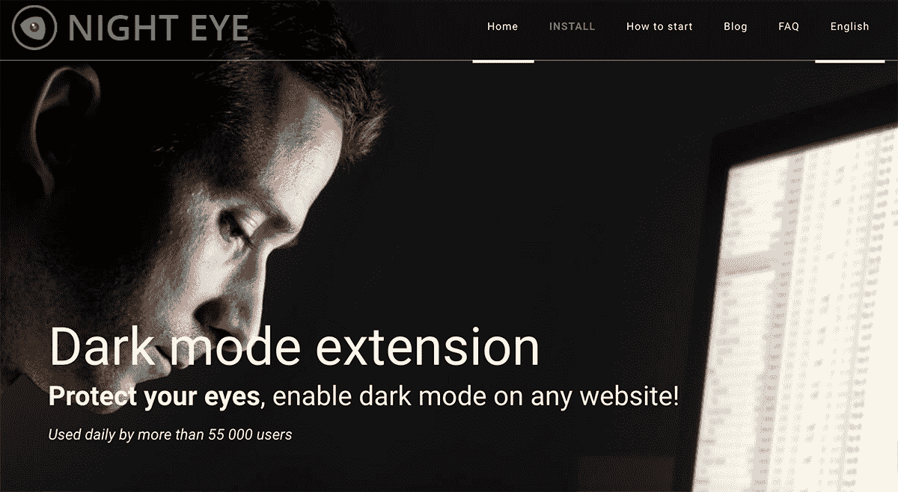
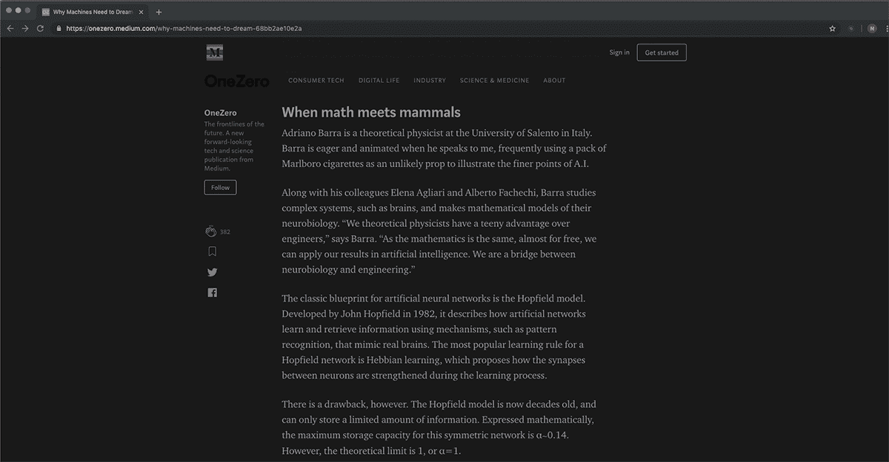
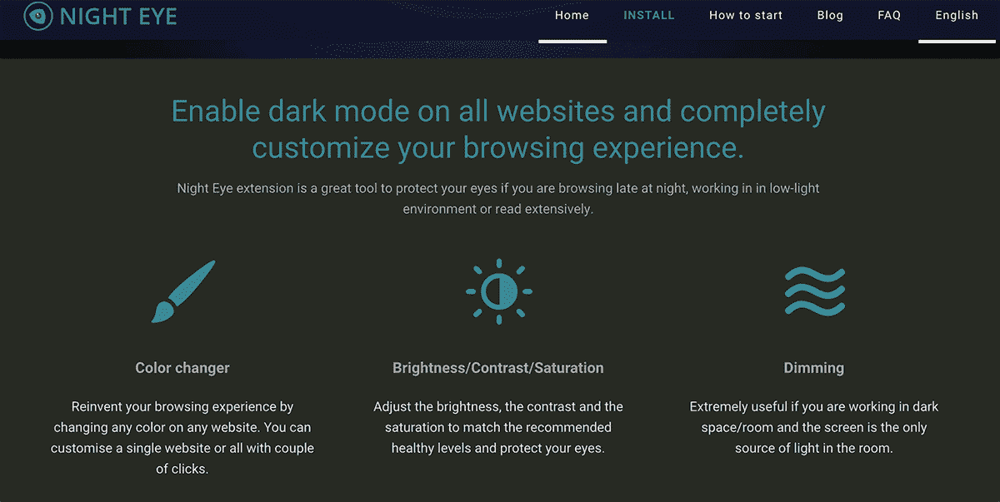

# 克服对“免费”的期望，打造可盈利的产品

> 原文：<https://www.indiehackers.com/interview/overcoming-the-expectation-of-free-to-build-a-profitable-product-cc308a033d>

## 你好！你的背景是什么，你在做什么？

我的名字是 Stanislav Dimitrov (Stan)，我是 [Night Eye](https://nighteye.app/) 的创始人之一，这是一个黑暗模式浏览器扩展，几乎可以在任何网站上工作。

2014 年，我完成了市场营销硕士学位，回到家乡加入家族企业:一家印刷厂。家族企业过去是，现在仍然是我生活的一大部分，但总的来说，科技一直让我着迷，我想创办一家兼职企业。

幸运的是，在我回家的几个月后，我遇到了夜眼的现任联合创始人。我们都在 25 岁左右，渴望从零开始建立一家科技公司。

夜眼是一个浏览器扩展，几乎可以在任何网站上启用黑暗模式。我们开发了一种算法来分析网页的颜色并进行转换，而不是简单地反转颜色。我们作为四个黑暗模式 UI 爱好者开始这个产品来挠自己的痒(这是在趋势之前)。

该扩展主要由软件开发人员、学生、作家、游戏玩家和研究人员使用:这些人花费大量时间盯着他们的屏幕，并且熟悉黑暗 UI 的好处。这些人通常至少有一个黑暗主题的应用程序或网站，并且已经习惯了，例如，使用黑暗 ide 的软件开发人员。

我们的月收入一直在缓慢增长，现在我们的月收入在 1800 美元左右。

 

## 是什么激励你开始做夜眼？

因为我们整个团队都喜欢深色的 UI，所以当我们找不到可以灵活转换颜色的扩展时，我们很沮丧。我们尝试了所有的方法，但是没有一个符合我们的标准。所以我们决定自己动手。

我们先推了 Chrome 扩展。随着下载量的增加，我们觉得是时候进一步开发了 Firefox、Safari 和其他。验证时间花了两个月，在此期间我们增长到了 2000 名 Chrome 用户。

我们是一家小型软件公司，构建过程(尽管具有挑战性)并不新鲜。我们已经有了允许我们开发、维护和持续改进扩展的现有过程。

 

## 构建最初的产品需要什么？

我们把所有的精力都放在了算法上——这个引擎可以转换页面的元素颜色，并创建一个令人愉快的深色模式。在我们确保每个方面都符合我们的标准后，我们继续完成其他主要功能、设计等。

我们花了三个月的时间才启动并运行 1.0 版。但是我们一准备好，就发布了 Chrome 扩展，并开始与我们的早期用户沟通，以进一步开发它。我们花了大约七个月的时间来修复 bug 和不能正确转换的网站。

创建新功能的决策过程非常简单:我们选择了我们认为对*美国*有用的东西。当然，并不是所有的都被我们最初的用户群接受或实际使用。

其中一个特征是变色。本质上，我们开发了一个笨拙但强大的工具，允许用户在任何网站上改变任何颜色。例如，您可以将背景颜色从深灰色更改为黑色，将字体更改为粉红色，等等。但因为它不是真正的用户友好，我们决定删除它，直到我们有更多的时间来改善。

当考虑产品的初始特性时，做对你最有用的事情。如果一个特性需要几个月的时间来开发，并且对发布不是必需的，就不要做。先验证一下。

我们有两个大项目之间的一个小窗口，这使我们能够在夜眼全职工作。在最初的开发阶段之后，只有一名团队成员几乎全职地继续工作。

如果没有耐心的早期用户花时间和精力来测试最初的版本，我们不可能完成这一切。

 

## 你们是怎么吸引用户，长夜眼的？

我们的正式发布时间是 2018 年 5 月 1 日。我们没有任何预发布的登陆页面，但是当扩展在 Chrome 网上商店可用时，我们创建了一个网站。

像 IH 这样的社区帮助我们获得了第一批用户。几个子编辑也有助于发布消息，但结果并不惊人。我们在网站和 Chrome 网上商店的搜索引擎优化上投入了大量时间。SEO 过去是，现在仍然是我们主要的用户获取策略。对我们来说，这是一个缓慢但非常有价值的方法。

如果一个特性需要几个月的时间来开发，并且对发布不是必需的，就不要做。

TweetShare

我们的 SEO 活动非常简单。每个人都能做到；这不是火箭科学。基本的 SEO 过程可以在网上成千上万的指南中找到。我想说的是，我们不做任何神奇的事情，而是把我们的努力集中在正确的事情上。保持耐心。也就是说，不能指望这种方法会很快见效，所以要做好准备。

我们在关键词工具上花了很多时间，比如 AdWords 关键词规划器、 [Serpstat](https://serpstat.com/) 和 [Ubersuggest](https://neilpatel.com/ubersuggest/) 。我们还尝试每周制作书面内容(至少在我们的博客上发布一篇文章)并更新所有扩展商店中的内容。评估我们过去的表现对我们来说也很重要。

除了搜索引擎优化，我们还尝试将 YouTube 作为流量来源，并计划主要在脸书和谷歌搜索上推出付费活动。

对你所有的用户开放。欢迎提问和反馈，了解他们，像正常人一样和他们对话。

TweetShare

## 你的商业模式是什么，你是如何增加收入的？

我们想让我们的商业模式尽可能简单和实惠。我们开始有三个月的免费试用期，之后用户被提示要么订阅 9 美元/年，要么购买 40 美元的许可证。我们预计，在试用到期后，大多数愿意继续使用 Night Eye 的用户都会选择年度订阅。令人惊讶的是，很多人宁愿付一次钱就忘了。

我们商业模式最重要的方面是免费试用。与其他软件不同，我们不需要*任何*个人信息来获得夜眼的免费试用。用户只需去扩展商店，安装它，并享受三个月。这使我们能够接触到更多的人，而不需要他们填写表格，提供个人信息等。

目前，我们每月的收入约为 1，800 美元，在过去的四个月中相对稳定，但有所波动。

我们从这个项目中学到的一个重要教训是，浏览器扩展市场不是最容易建立盈利业务的地方；用户通常认为浏览器扩展总是免费的。索要报酬是我们每天都在纠结的事情。也就是说，我们已经成功推翻了用户不会为浏览器扩展付费的理论。如果我们能做到，任何人都能做到。我不是简单地谈论浏览器扩展的利基；任何被认为艰难甚至不可能的利基市场都可以被征服。但是你需要开发一个人们想要的产品——一个比免费版本更好的高质量产品(T2)。这就是我们一直以来的想法，到目前为止，它是有效的。

但是如果你愿意仅仅为了金钱利益开始一个副业项目，选择一个用户愿意为产品花钱的利基市场。

## 你未来的目标是什么？

我们最重要的目标是提高夜眼的速度，使它在浏览网页时变得不明显。我们目前正在努力减少 30-40%的页面加载时间。这将显著改善夜眼处理网站的方式。

我们还在考虑增加一条路线来增加收入。我们已经收到了很多开发者的请求，要求为他们提供 API，以便为他们的客户网站添加黑暗模式。目前，我们正在考虑用 Wordpress 插件测试这个想法的价值。

我们已经成功地推翻了用户不会付费的理论。但是你需要打造一款人们想要的产品——一款比免费版本更好的*优质产品。*

TweetShare

## 你面临的最大挑战和克服的障碍是什么？如果你必须重新开始，你会做什么不同的事？

我们从第一天开始就面临的最大挑战是，人们并不真的愿意为浏览器扩展付费。由于免费扩展的数量，我们很难解释为什么我们要求订阅费。

大多数用户在使用免费扩展时忘记了他们是用自己的数据付费的，这就糟糕多了。所谓的“免费”扩展通常包括附属链接、广告和其他隐藏的赚钱方式。没错，人们不是用信用卡支付，但如今用数据支付要危险得多。

如果我们不得不重新开始，我们什么也不会改变。在整个旅程中，我们一直牢记两件重要的事情:一个美丽而流畅的黑暗模式和用户支持。

## 有没有发现什么特别有帮助或者有优势的？

向你的所有用户开放。欢迎提问和反馈，了解他们，像正常人一样和他们对话。

每天真正激励我们的两个人是[蒂姆·费里斯](https://tim.blog/)和[海军拉维康](https://fs.blog/naval-ravikant/)。他们每个人都有播客和博客，免费提供大量有价值的信息。

在这一点上，你可能会认为我们的进展是完美的计划，没有什么可以偏离方向，但这远不是事实。我们发布的时机非常重要。我们在苹果宣布 macOS 10.14 Mojave 中的黑暗模式前一个月才推出。这一声明大大激发了人们对黑暗模式的兴趣，我们从中受益匪浅。苹果的这一举动像滚雪球一样推动了黑暗模式趋势，让我们得以快速发展。

## 对于刚刚起步的独立黑客，你有什么建议？

**做**

1.  挠挠自己的痒。看看日常活动中让你烦恼的事，以及目前可用的解决方案。如果他们达不到你的标准，而你认为你能开发出更好的产品，那就去做吧。
2.  耐心点。低着头，给自己时间。
3.  你认为很棒的特性可能并不那么棒，或者根本不需要。所以要和你所有的用户保持沟通。
4.  做任何事情都要真实——设计、复制、对话……所有事情。

**不要**

1.  不要在发布前打磨产品。做得足够好，并征求人们的反馈。
2.  不要在你没有验证的事情上投入太多的精力和时间。
3.  不要因为反对者而气馁。

## 我们可以去哪里了解更多？

我们定期更新我们的博客[https://nighteye.app/blog](https://nighteye.app/blog)，我们也喜欢在[推特](https://twitter.com/@nighteye_ext)上与大家交流。

我们欢迎您在下面的评论中提出所有问题和反馈。不要害羞，想到什么就问什么。

感谢 IH 主持这次采访，让我们有机会发表自己的观点。

——[<picture id="ember5303290" class="user-avatar ember-view user-link__avatar"></picture>斯坦迪米特洛夫](/stan121?id=B7AGnNGFfqWSRR1VHTQzEkmSW0a2)【夜之眼】创始人

## 想像夜眼一样建立自己的事业？

你应该加入独立黑客社区！🤗

我们是几千名创始人，互相帮助建立有利可图的业务和副业。来分享你正在做的事情，并从你的同事那里获得反馈。

还没准备好开始使用你的产品吗？没问题。这个社区是一个认识人、学习和实践的好地方。随意[随便浏览](/)！

——[<picture id="ember5303295" class="user-avatar ember-view user-link__avatar"></picture>柯特兰艾伦](/csallen?id=ibTLPyjwVebnZjMGKvz6ztarnuV2)，独立黑客创始人

31votes