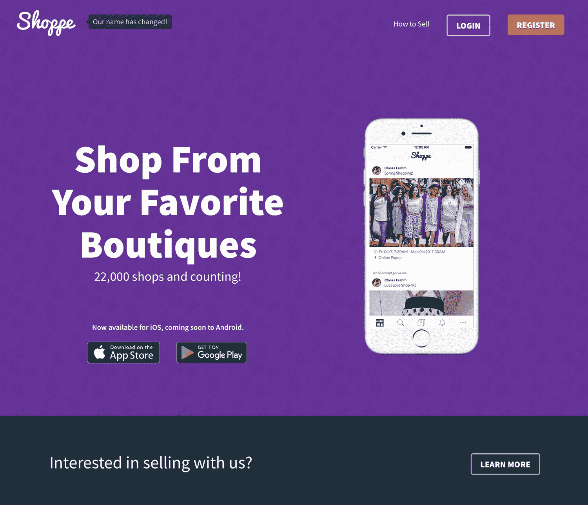

# 利用口碑推荐的力量，每年超过 100 万美元

> 原文：<https://www.indiehackers.com/interview/passing-1m-yr-by-leveraging-the-power-of-word-of-mouth-referrals-33727a5fb4>

## 你好！你的背景是什么，你在做什么？

嗨，我叫赖安。我从小就喜欢物流，并尽可能提高工作效率。我对真/假类型的问题感兴趣，我喜欢构建复杂的工作流。你可以说，软件开发是一种一见钟情。然而，我发现自己对大学教授软件的方式感到厌恶，所以如果你看看我的大学文凭，你会发现上面写着我毕业于一个工业工程项目。

[Shoppe](https://www.shoppewith.me) 是一个小型精品店的社交销售平台。我们通过我们的网络平台和移动应用程序提供一种负担得起的方式来在线销售您的产品。我们最成功的客户通常是直销公司的顾问。他们喜欢它，因为我们为他们节省了大量时间(比如一个月多次节省数小时)，并为他们的客户提供了令人惊叹的购物体验。

自我们推出以来，Shoppe 已经从第一周的 100 名用户增长到现在的 22，000 多名用户。

## 是什么促使你开始接触 Shoppe？

我老婆 2015 年 11 月开始卖 LuLaRoe 服装。到 2016 年 4 月，我们都在拼命通过脸书集团的专辑卖衣服。你会问，“我们为什么不干脆建一个 Shopify 网站呢？”嗯，直销公司都会对他们的顾问施加独特的约束，以保护他们的品牌，控制供求关系。对我们的限制之一是，她不能通过 Etsy、亚马逊、Ebay 或她自己的电子商务网站销售。

一天，当我在父母的阁楼里翻箱倒柜，思考着我是多么鄙视通过脸书卖衣服时，我突然想到了一个主意。为什么我们要通过脸书销售？答案很清楚——*因为没有符合卢拉罗规则的替代方案。*作为一个具体的思考者，这种认识是我能够为我们的第一个 MVP(最小可行产品)制定清晰的功能集所需要的，因为我自己就是一个客户，知道我们需要什么。

第一个 MVP 花了大约六周的时间来开发，剩下的就成为历史了。

 

## 构建最初的产品需要什么？

前四个月我是一个人在经营，因为我既有建造[商店](https://www.shoppewith.me)的技术技能，也有做出合理决策的有限商业知识(由于我的工业工程学位)。这被证明是非常宝贵的，因为我只需要投资汗水资产，而不必克服许多初创公司在多人试图尽可能快地一起行动时面临的沟通障碍。

我的第一个目标是发布一个 MVP(最小可行产品，即一个原型)给我的妻子和她的一些直接同事。该 MVP 需要容纳一个基本的库存和订单管理系统，以及一个简单的电子商务系统。我能做到这一点是因为我在工作和家庭之外的空闲时间工作，通常是早上 5 点到 7 点和晚上 8 点到 10 点。我非常幸运，因为我们的第三个孩子在发布前 10 天出生了，我可以休六周的长假，这给了我大量的时间来处理大量的代码。

我们从 MVP 的角度考虑每一个新特性。我们尽早并经常发布，然后支持该特性并使其成熟。

TweetShare

我们最初的技术栈是一个基于 Django (Python)、Angular 1、Bootstrap v4 和 PostgreSQL 构建的单片 web/API 应用程序。这一切都托管在一个 Ubuntu 14.04 LTS 虚拟机上，每月 5 美元的数字海洋水滴。Stripe 应该被体面地提及，因为我能够卸载(而不是担心)任何支付处理！

此后，我们将 web 和 API 分离出来，并加入了一系列服务，如 Elasticsearch、Redis & Memcached、CDN 和其他各种微服务。

## 你是如何吸引用户和发展专柜的？

为 Shoppe 获取用户对我们来说非常容易，因为他们都是通过口碑推荐来的。我们的客户(零售顾问)都非常团结，所以如果你从一个客户中培养出一个*忠诚的*客户，你就能立即接触到他们所有人。

我们最初接触了我妻子的大约 10-15 个同行，让他们终身免费使用全部功能集(之后的所有客户都需要付费)。这些同事中有几个在公司里地位较高，有很大的影响力，这对公司有很大帮助。我努力询问他们生活中的痛点是什么，然后辨别这些痛点是否可以通过我们的软件解决。

早期每周新增客户的增长率如下:

*   第 1 周:178，29 次付款
*   第 2 周:61，20 次付款
*   第 3 周:103，27 次付款
*   第 6 周:211，96 次付款
*   第 8 周:346，149 次付款

随着我不断地倾听客户的意见并反复反馈，客户开始以每周更快的速度涌入。这被证明对我们的业务至关重要，因为我们的客户不断告诉我们，因为我们对他们的回应，我们获得了他们的推荐。

倾听客户的心声！这使他们成为忠诚的顾客。而忠诚的客户给你带来新的客户！

TweetShare

为了减少这种沟通障碍，我们创建了一个封闭的脸书小组来容纳我们所有的客户。这让我们有了一个众包知识库，并向我们的客户展示我们有多关心他们。这对企业来说是一笔巨大的沟通资产。

注意:我要强烈警告你，当事情出错时，这可能会让你的企业面临很多(非常直接的)批评。当一项服务在高峰时段中断时，你会有很多脾气暴躁的人使用你给他们的肥皂盒来发泄。

## 你的商业模式是什么，你是如何增加收入的？

我们目前有一个收入来源:我们的每月订阅。我们提供免费、9.99 美元和 29.99 美元[的专柜](https://www.shoppewith.me)方案，你付的钱越多，这些方案就越好。我们立即开始向客户收费，并获得了大约 55%的利润率。

这是每月支出的明细:

*   包括创始人分红在内的薪资:32500 美元
*   托管和其他服务:20 000 美元

其余的钱被存入各种银行账户，包括应急基金、支票和储蓄。我们是一个完全远程团队，没有其他主要成本。作为[精益原则](http://theleanstartup.com/principles)的大力倡导者，这对我来说非常重要。

以下是我们去年不同时期的收入情况:

| 月 | 收入 |
| --- | --- |
| 2016 年 5 月 | 2600 |
| 2016 年 7 月 | 58600 |
| 2016 年 10 月 | 83600 |
| 2017 年 1 月 | 110700 |
| 2017 年 4 月 | 109600 |

大约在 2 月份，我们开始注意到注册人数和收入的下降，我们将此归因于客户格局的变化。作为一家公司，LuLaRoe 在四年的时间里经历了爆炸性的增长，传统上通过零售赚大钱是很容易的。

这意味着有许多新的零售商进入市场，希望获得这笔钱，其中许多人已经开始离开，因为最近几个月变得更加困难。事实上，客户说他们离开我们系统的最大原因是因为他们停业了。

我们已经为这些变化做好了准备，并一直致力于抽象我们的平台，以允许其他直销公司的顾问使用它(因为我很笨，没有马上做这件事)。这是我们目前获得客户的主要来源，因为有几个 LuLaRoe 的竞争对手正在进入这个市场。

所有这一切真正令人敬畏的部分是，我们可以将我们在发布时使用的相同技术应用于这些新市场。我们只需要建立一些忠实的客户，让他们通过他们的网络传播我们。而且到目前为止一直有效！

## 你未来的目标是什么，你打算如何实现它们？

从商业角度来看，我们对 Shoppe 的最大目标是成为一个长期可行的企业。为了做到这一点，我们需要不依赖于一个单一的直销公司，因为他们可以很容易地告诉他们的顾问不要使用我们的平台，或开发自己的平台。

从关系的角度来看，听到所有关于我们给了别人多少时间的故事是一种特权。我曾有过几次个人谈话，其中一位客户流下了眼泪，因为他们非常感激我们的系统。

最初，这个平台是为我们的家庭做同样的事情而建立的，看到软件对人们的生活产生如此大的影响真是太酷了。我们甚至有这样一个故事，一位顾客的丈夫去世了，她没有放弃零售业务的唯一原因(因为她忙于管理家务、小生意和全职工作)是因为我们的系统以及它让她的生活变得多么容易。

## 你犯过的最大的错误是什么？如果你必须重新开始，你会做什么不同的事？

以下是我们的一些错误:

*   不是每天一整天都在采访我们的客户。如此重要。
*   没有为我们的服务器实施负载平衡和自动扩展。这导致了许多不眠之夜。
*   用品牌把我们自己封闭起来:我们的名字对我来说曾经是 Roe，这对 LuLaRoe 之外的顾问来说是一个冲突。我们还用几个专为 LuLaRoe 顾问设计的功能来限制自己。

如果我必须重新开始，我认为所有的改变都将是纯粹的技术上的。我会使用更灵活的基于微服务的堆栈。但是，我们目前拥有非常坚实的筹码，所以这并不全是坏事！😆

## 你最大的优势是什么？有什么特别有用的吗？

我妻子和我都是 T2 专柜的顾客，这被证明是一个巨大的优势。它让我不仅能从开发者的角度看问题，还能从最终客户的角度看问题。

我的妻子也很棒，是一个非常聪明的企业家，她不断地推动我变得更好，并认识到趋势。她甚至想出了我们的名字！😍😘

## 对于刚刚起步的独立黑客，你有什么建议？

MVP 所有的东西！不过说真的，拿出最少的，建立它，并把它给一小群致力于你的成功的客户。他们将会是你绝妙想法和营销的最初来源。我见过许多创业公司失败，因为对产品的要求太多太早。有缺陷和没有完整的特性集是可以的！

我们从 MVP 的角度考虑每一个新特性。我们尽早并经常发布，然后支持该特性并使其成熟。这允许我们以较低的成本放弃一个不需要的特性。

*问*和*听*你的客户！这使他们成为忠诚的顾客。而忠诚的客户给你带来新的客户！

另外，这里有一本书推荐:鲍勃·伯格的《积极进取者》。

## 我们可以去哪里了解更多？

*   网址:[https://www . shoppewith . me](https://www.shoppewith.me)
*   乔布斯:https://angel.co/shoppe-with-me/jobs

我们在招人！我们正在寻找网页设计师(图形，字体，时尚的设计)，也是一个基础设施工程师(数据库优化，服务器监控和管理等)。用电子邮件发送你的简历(你做什么，为什么感兴趣，你的简历等等。)到 [【邮件保护】](/cdn-cgi/l/email-protection#b0c2c9d1def0c3d8dfc0c0d5c7d9c4d89eddd5) 。

如果你对我们有任何问题，欢迎在下面提问！

——[<picture id="ember8098784" class="user-avatar ember-view user-link__avatar"></picture>瑞安·弗拉姆](/rlfrahm?id=OtQc0jMAZgRKvmEVE5qSYMr6cCH2)《专柜》的创作者

## 想像 Shoppe 一样建立自己的事业？

你应该加入[独立黑客社区](/)！🤗

我们是几千名创始人，互相帮助建立有利可图的业务和副业。来分享你正在做的事情，并从你的同事那里获得反馈。

还没准备好开始使用你的产品吗？没问题。这个社区是一个认识人、学习和实践的好地方。随意[随便浏览](/)！

—[<picture id="ember8098789" class="user-avatar ember-view user-link__avatar"></picture>考特兰艾伦](/csallen?id=ibTLPyjwVebnZjMGKvz6ztarnuV2)，独立黑客创始人

11votes