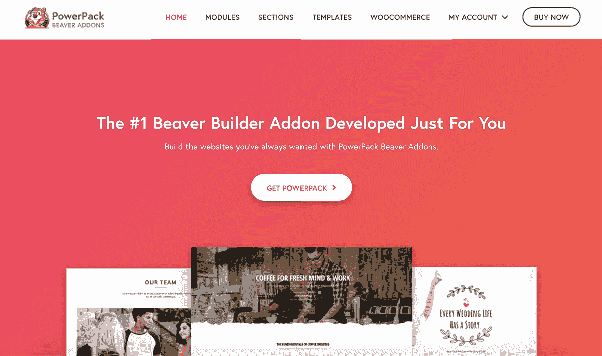
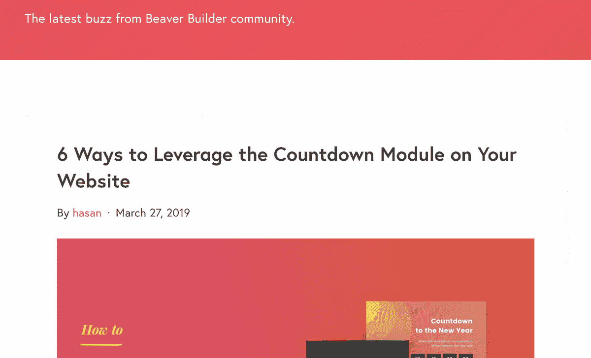
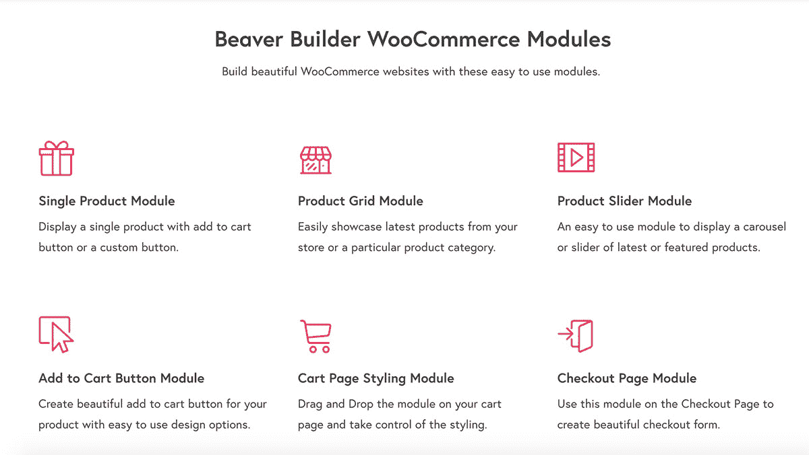

# 暂停我们的数字代理来建立一个 2 万美元/月的 WordPress 插件

> 原文：<https://www.indiehackers.com/interview/pausing-our-digital-agency-to-build-a-20k-mo-wordpress-plugin-aa6b118f62>

## 你好！你的背景是什么，你在做什么？

我叫普内特，我是一名电子和通信工程师，热爱网页设计和开发，职业是代理人。:)10 岁开始编程，不断探索。我对网页设计的兴趣引导我使用 WordPress，我开始构建主题和插件。

我来自印度乌代布尔的一个中产阶级家庭。在大学早期，我对博客产生了兴趣，并在我的城市遇到了另一位博客作者。我们共同创建了这个城市的第一个博客 UdaipurTimes，并负责技术方面的工作。一年半后我离开了 UdaipurTimes，开始做自由职业者来偿还我的大学债务。

毕业后，我不得不在一份跨国公司的工作和冒险从事自由职业之间做出选择。我选择了后者，这是我一生中做出的最好的决定之一。我继续做了五年的自由职业者，存了一些钱来创办我的公司，IdeaBox Creations。

 

组建团队几年后，我们推出了我们的第一个产品，[power pack for Beaver Builder](https://wpbeaveraddons.com/)。PowerPack 用创造性的模块和模板扩展了 Beaver Builder，使用户更容易更快地建立网站。

如今，PowerPack 每月的收入约为 2 万美元。免费版支持超过 10k 个网站，专业版被超过 60k 个网站积极使用。

## 是什么促使你开始使用 PowerPack for Beaver Builder？

PowerPack 的想法是在做一个客户项目时产生的。我们第一次使用 Beaver Builder，并意识到它有一些设计和功能限制。我们环顾四周，找不到任何可靠的东西，所以我们决定根据客户的设计要求建立一些定制模块。

在这之后，我做了一些市场调查，并从我的网络中使用 Beaver Builder 的一些开发者那里收集了一些想法。最后，我和我的团队谈了一下，我们决定开始研究 PowerPack。

我们有一个由对 WordPress 充满热情的设计师和开发人员组成的强大团队，所以我们很容易就开始着手这个想法。我们正在进行的项目帮助我们维持现金流，我们花了额外的时间来构建 PowerPack。

成为你想为之打造产品或服务的社区的一部分。

TweetShare

## 构建最初的产品需要什么？

我们环顾四周，找出了需要立即解决的棘手问题。我们从 Beaver Builder 的脸书小组收集了一些想法，并为 PowerPack 设计了一些特性和功能。

我们的主要焦点是为插件打下一个坚实的基础，以便它在未来可以很容易地扩展。团队记录了代码并创建了可重用的代码块。

大约两个星期后，我们决定试运行 PowerPack，其中包含网站上常见的八个 Beaver Builder 模块。有限的功能集有助于我们专注于重要的东西，以便围绕产品制造轰动效应。

2016 年 6 月 15 日，我们宣布向 Beaver Builder 脸书集团推出 1.0.0 版，反响非常热烈。第一天，我们完成了大约 500 美元的销售额，到第一周结束时，总销售额达到了 2500 美元。

为了建立信任，我们分享了 PowerPack 的[公共路线图](https://trello.com/b/014ePkPw/powerpack-roadmap)，并要求用户分享他们的功能请求和反馈。

AmazeMedia 的所有者 Mark Fayard 帮助我们进行了最初的 PowerPack 品牌推广。我们的客户来自 LeftRightLabs 的 Gretchen 和 Trina 以及 ModernTraction 的所有者 Melanie 帮助我们进行了第一轮测试和产品反馈。

| 年 | 页面视图 |
| --- | --- |
| 2016 | 241628 |
| 2017 | 277896 |
| 2018 | 394853 |

## 你是如何吸引用户并为 Beaver Builder 开发 PowerPack 的？

在对试运行的惊人反应之后，我们确信我们正朝着正确的方向前进。我们开始关注用户反馈和功能需求，以进一步构建 PowerPack，这被证明是增加我们销售额的最佳策略。我们还确保客户的支持请求得到及时回应。

为了保持可见性并获得更多用户，我们开始编写关于 Beaver Builder 的内容，如 how-to、提示、深入教程等。我们还开始了一个“星期五免费赠品”系列，通过提供免费的 Beaver Builder 模板来回馈 Beaver Builder 社区。

这些努力帮助我们在第一个月增加了 30%的网站流量。前三个月的收入在 800 万到 9000 万美元之间。

 

## 你的商业模式是什么，你是如何增加收入的？

为了获得更大的用户群，我们决定推出一个免费/精简版的 [PowerPack](https://wordpress.org/plugins/powerpack-addon-for-beaver-builder/) ，并提交给 WordPress 插件回购。我们通过共享专业版的顶级特性和功能，将追加销售与精简版集成在一起。

在成功运行 PowerPack 一年后，我们引入了一个名为 [WooPack](https://wpbeaveraddons.com/woopack) 的新插件。WooPack 包括面向 Beaver Builder 的 WooCommerce 模块，目标用户是构建 WooCommerce 网站并需要高级样式功能的用户。

在我们创造了前两个产品之后，是时候重新审视我们的定价策略了。我们推出了一个“组合包”，用户可以以 20%的折扣购买这两个插件。这一策略帮助我们增加了 15-20%的收入。

 

## 你未来的目标是什么？

我们目前专注于构建和发展两个新产品 Elementor 的[power pack](https://powerpackelements.com/)和 [WPfomify](https://wpfomify.com) 。

为 Beaver Builder 开发和构建 PowerPack 的经验有助于我们新产品的规划。因为我们所有的产品都是面向 WordPress 生态系统的，所以复制我们的策略更容易。

我们通过建立电子邮件列表和在 Elementor 社区中获得可见性，非常关注内容营销。这帮助我们在流量和收入方面逐月持续增长。

我们的目标是每月总收入达到 5 万美元，并一直朝着这个目标努力。

我们开始关注用户反馈和功能需求，这被证明是增加我们销售额的最佳策略。

TweetShare

## 你面临的最大挑战和克服的障碍是什么？如果你必须重新开始，你会做什么不同的事？

我们最大的挑战是从提供服务过渡到产品开发，并在优质的 WordPress 插件市场将我们自己定位为一个可靠的名字。

我们经常被问到产品开发的经验；一些竞争对手甚至转向负面营销，称我们是“小而不可靠”的团队。但凭借我们的核心价值观、开放的文化以及与观众的定期互动，我们能够克服这一障碍。不到六个月，我们就有了 1000 多名顾客。

在开发我们的下一个产品 Elementor 的 PowerPack 时，我们非常兴奋。我们已经在页面生成器生态系统中确立了自己的地位，因为我们以前有过这样做的经验。

但令我们惊讶的是，我们发现只提供该产品的高级版本并不是正确的选择。尽管我们在正确的时间进入了市场，但不提供该产品的免费版本让我们受到了阻碍。我们失去了大量的用户群，这对我们来说是一个巨大的教训。

| 年 | 收入 |
| --- | --- |
| 2016 | 74923 |
| 2017 | 59760 |
| 2018 | 120399 |

## 有没有发现什么特别有帮助或者有优势的？

冒险进入产品开发的整个过程对我和我的团队来说是一次很好的学习。我们学到了很多关于品牌、定价、客户获取策略、搜索引擎优化和内容营销的重要性。

为 Beaver Builder 构建 PowerPack 是迄今为止最好的决定；一切都感觉很完美。称之为运气和适量的奉献。我们在几乎没有竞争的时候推出了它——Beaver Builder 用户正在积极寻找这样的解决方案，社区对此非常开放。

我们也得到了《海狸建造者》的创作者们的大力支持:贾斯汀·布萨、罗比·麦卡洛和比利·杨。甚至像 WP Builds 的 David Waumsley 和 Nathan Wrigley、ProBeaver 的 Davinder Singh 和 Kim Doyal 这样的 Beaver Builder 粉丝也帮助我们传播了 PowerPack。

我的团队在整个过程中的承诺和热情是如此强大的力量。从设计、开发、测试和错误修复，到内容创作和整体支持，他们对产品投入了 100%以上。

## 对于刚刚起步的独立黑客，你有什么建议？

1.  成为你想为之打造产品或服务的社区的一部分。
2.  与用户进行对话。
3.  根据用户反馈进行构建和改进。
4.  创建内容来教育用户。
5.  保持产品未来的透明度。

## 我们可以去哪里了解更多？

*   [Beaver Builder 的 PowerPack】](https://wpbeaveraddons.com)
*   [IdeaBox 创作](https://ideabox.io)
*   [在推特上联系我](https://twitter.com/psahalot)
*   IndieHackers 上的 [@psahalot](https://indiehackers.com/psahalot)
*   有什么问题吗？欢迎评论，我很乐意回答:)

—[<picture id="ember5204847" class="user-avatar ember-view user-link__avatar"></picture>普内特·萨哈洛特](/psahalot?id=eLAbvsHNQHe5HiVtMJOiQljCt003)，PowerPack for Beaver Builder 创始人

## 想像 PowerPack for Beaver Builder 一样建立自己的企业吗？

你应该加入独立黑客社区！🤗

我们是几千名创始人，互相帮助建立有利可图的业务和副业。来分享你正在做的事情，并从你的同事那里获得反馈。

还没准备好开始使用你的产品吗？没问题。这个社区是一个认识人、学习和实践的好地方。随意[随便浏览](/)！

—[<picture id="ember5204852" class="user-avatar ember-view user-link__avatar"></picture>考特兰艾伦](/csallen?id=ibTLPyjwVebnZjMGKvz6ztarnuV2)，独立黑客创始人

25votes