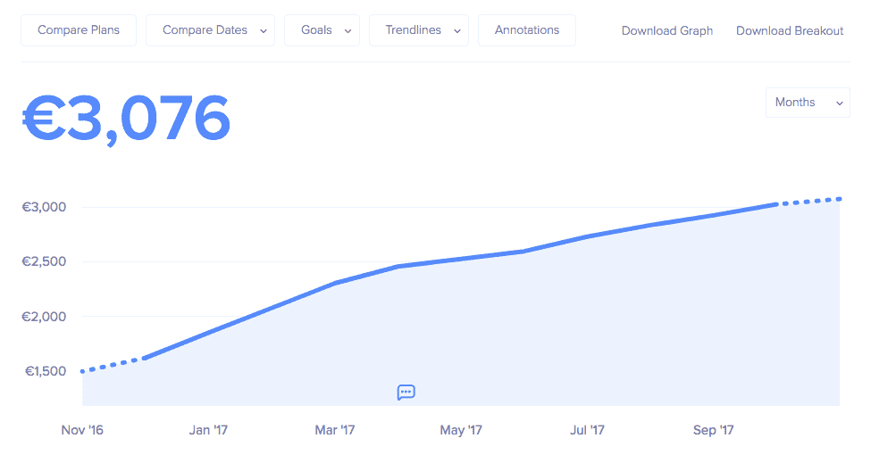
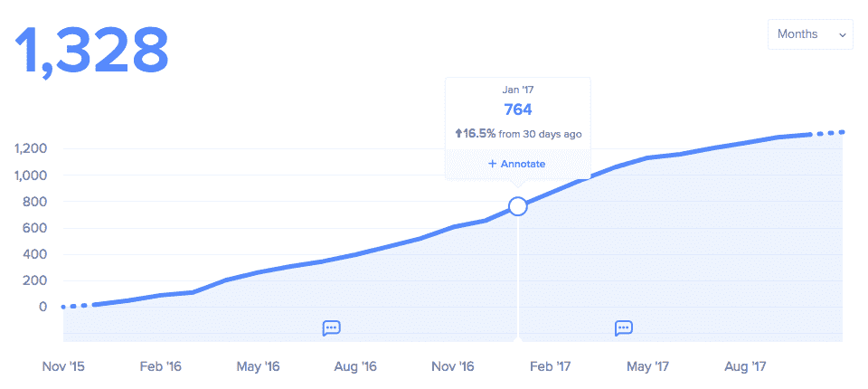
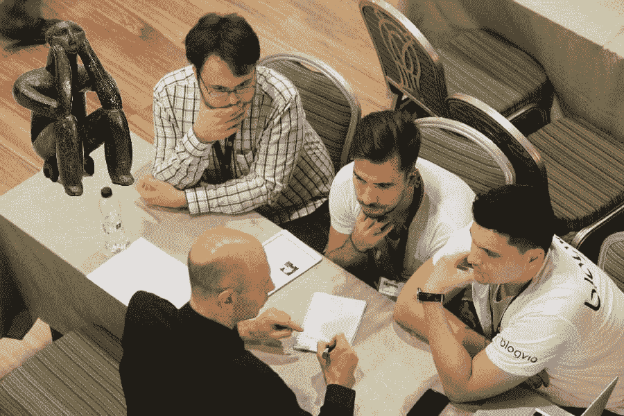

# 从一家数字代理公司转向一家 3000 美元/月的 SaaS 公司

> 原文：<https://www.indiehackers.com/interview/pivoting-from-a-digital-agency-to-a-3k-mo-saas-company-ba5ad6a41c>

## 你好！你的背景是什么，你在做什么？

嘿。我是 Andrei Potorac，我喜欢围绕技术探索新产品创意。今天你们正在阅读的是关于 Widgetic 的文章，这是我和我的伟大的联合创始人 Cristi Necula 和 Andrei Neamtu 一起制作的。在过去的生活中，我们运行数字代理，Vuzum，在那里我们三个人专注于设计，网络和移动。

去年——在前线工作了近十年后——我们决定解雇约 20 人，并暂停代理模式。很痛苦。我们这样做是因为我们觉得是时候将我们的重点转移到 SaaS 了。

这就是我们现在所做的——在 Widgetic，我们开发应用和服务，可以用来增强任何网站或故事。我们的平台主要由小企业、自由职业者和记者使用，他们希望使用交互式小工具将他们的内容带到网络上。

我们为我们的产品建立了几个收入流，一旦我们的产品达到临界质量(几个月内)，我们就通过我们所做的每一个新的集成来增加我们的基本收入。

我们完全集成的基本收入目前是 3.627.50 美元(3，076 欧元)MRR，我们刚刚完成与 CloudFlare 的第四次集成。由于我们最新的集成正在获得动力，我们的 MRR 价格正在略微攀升至 6000 美元以上。

 

## 是什么促使你开始使用 Widgetic？

在我们的代理生涯中，与大大小小的客户打交道，我们意识到他们需要相似的东西。在一个给定的应用程序的表面上，有一个独特的品牌层，有些功能要么启用，要么禁用，但核心功能总是相同的——无论是画廊、视频播放器、播客播放器、音频播放列表、图表、表格、测验等。随着我们开始做更多的研究，我们发现网络上的大多数交互元素都是如此。

在你进入创业的世界之前，我认为重要的是想象你的产品的潜在价值。

TweetShare

所以我们在这里，一遍又一遍地构建同样的东西，就像其他人一样，用他们自己的定制或定制的开源库。这种方法有很多问题，比如客户的前期成本高、交付时间长、维护和功能请求的额外成本、随叫随到的开发人员、每次集成的额外成本等等。

除了这些问题，整个行业都在向云平台过渡，而不支持托管或运行脚本。比如:博客的 Medium，Squarespace，Wix，Weebly，以及其他用于拖放站点的。当被问到时，没有办法将我们的脚本移植到这些平台上。所以我们必须开辟一条路。

## 构建最初的产品需要什么？

最初，我们将这个项目视为一个为博客提供服务的机会，让他们能够在几秒钟内发布互动内容。我们知道出版商喜欢用媒体来强化故事。我们的论点是，因为他们经常出版，这意味着更好地保留了 Widgetic。

所以我们在 2008 年开始了 MVP 的工作，那是最糟糕的一年——不仅仅是因为经济危机，或者我们刚刚开始代理，而是因为向移动的明确过渡。

那是 iPhone 问世的第一年，几个月前刚刚推出，已经有强烈的声音认为 Flash 将会消亡。这一点很重要，因为在当时，Flash 是唯一一个足够通用的工具，可以满足我们想要的交互应用程序的需求。客户工作也是基于 Flash 的，所以我们主要关注它。

因此，基本上我们用 ActionScript 建立了一个原型和一些小部件，但几个月后当苹果公司坚定地表示他们不允许 [SWF](https://en.wikipedia.org/wiki/SWF) 文件在他们的设备上运行时，我们发现这不是正确的方向。我们立即搁置了这个项目，在几年的时间里专注于客户工作，这是明智之举。

如果没有启动 Widgetic 的资金，我们不可能启动 widget IC，所以将这个产品作为一个辅助项目是至关重要的。

TweetShare

一段时间后，JavaScript 库已经发展到我们决定再试一次的程度。我们在 2013 年重新开始兼职工作，大约一年后推出测试版。我们动用了代理商能省下的所有资金和资源来投资这个产品。这一次，我们用开放网络技术构建了它，因此我们的应用程序响应迅速，可以在任何设备上运行。

## 你是如何吸引用户并发展壮大的？

找到合适的用户非常重要。否则，您可能会构建出没人想要的特性。在产品上线后提供支持是常识；首先要找到用户并为他们开发产品，这应该是常识。

我们花了很多时间追踪博客作者，与博客作者交谈，并专门为他们开发功能。我们从来没有质疑过他们是否应该是我们的首要关注点。这让我们将我们的平台命名为 Blogvio。我们甚至将我们的定价模型建立在总浏览量的基础上。

我们找到他们的方法是在每个国家寻找有影响力的人，然后通过电子邮件向他们发送一个免费的演示帐户和一个样本，展示他们写的文章在嵌入小工具后的样子。我们经常使用[博客。这种方法的好处是博客使用我们的应用程序，然后我们今天的目标用户最终发现了我们。](https://www.bloglovin.com/)

在与博客作者进行这些对话时，我们不断被其他领域的人接近，他们偶然发现了我们在谷歌上的小工具，或者他们阅读的博客。这些人要么是使用网站建设者的企业家，要么是寻找他们没有的工具的记者。

没过多久，我们就意识到我们平台的潜力要大得多，而博主只是其中的一个子集。因此，我们将注意力集中在作为企业客户的新闻编辑室和作为合作伙伴的网站建设商身上——这是我们的大部分客户。

我们注意到，只要我们进入一个市场，其他报纸就开始使用我们的应用。这是因为记者阅读他们的竞争对手！:-)所以通常我们不得不联系一个国家的 2-3 个主要新闻编辑室，一旦我们出版了，大多数其他出版物都会发现我们并自己注册。

通常是没有互动团队的新闻编辑室最需要我们的服务。我们使用与博客作者相同的方法，向他们展示如何改进一篇文章，如果它不仅仅是文本的话。

我们使用类似于[的工具合谋](https://www.conspire.com/)来寻找联系方式。当这个工作时，我们与产品的 CMS 集成。当它不满足时，我们会留下一个我们努力实现的请求列表，在我们再次联系之前，它会改进产品。

在这里，你可以看到我们的一些应用程序在不同的文章上直播，包括像赫芬顿邮报和费加罗报这样的网站:[Pinterest](https://www.pinterest.es/widgetic/widgets-in-the-wild/)上的 17 个最佳插件。

为了与网站建设者合作，我们会检查那些有应用程序商店的网站，然后直接整合。大多数网站建设者只有不到 100 万用户，没有市场，所以我们直接与他们的业务开发人员联系，探讨整合是否有意义。一旦他们看到了价值，我们解决了技术问题，他们通常会追加销售他们的计划，我们的应用也可以提供给他们的付费用户，这是一个双赢的局面。参见 Weebly 上的[示例:](https://www.weebly.com/app-center/developer/62242451)

 

## 你的商业模式是什么，你是如何增加收入的？

我们目前有三个收入来源:

*   集成
*   伙伴关系
*   产品

每个集成都将我们的应用作为单独的产品提供，或者与类似的应用捆绑在一起。用户可以单独订阅它们——例如在 Shopify 上——并向我们支付月费。有时他们可以按年付费，这取决于我们集成的平台。这是你可能想探索的东西。当我们以 20%的折扣实现这一目标时，我们的 MRR 翻倍了！

对于合作伙伴关系，这确实取决于我们所做的交易，但通常我们有一个按月收费的基础价格，然后在此基础上我们对每月活跃用户收费。有时合作伙伴更喜欢使用我们的公共 API 来集成应用程序，在这种情况下，他们的用户直接付费。

最后，在[Widgetic.com](https://widgetic.com/)，我们提供多种计划:免费、高级和团队。虽然 team 是面向企业的，但免费和高级主要由标准用户使用。我们对团队计划收取 12 美元/月/用户的费用。保险费是 4 美元/月。

我们学到的一个教训是，人们喜欢支付固定价格。在我们放弃价格/视图模型后不久，我们简化了产品，提高了应用程序的速度，并为我们的合作伙伴提供了更好的定价结构。

## 你未来的目标是什么，你打算如何实现它们？

我们刚刚开始探索的是如何让我们的平台更容易被设计师和开发者使用。从这个意义上说，我们最近整合了 [LaunchPad for Sketch](https://launchpad.animaapp.com/) 。因此，设计师可以在 Sketch 中找到我们的应用程序，在 LaunchPad 的 Widgets 部分。

对于开发者来说，我们正在改进我们的 API，这样他们也可以完全控制我们的编辑器和应用程序。例如，他们可以动态添加内容，用 JavaScript 控制任何应用程序的功能，并定制编辑器以满足他们的需求。这节省了大量的开发时间，并为客户提供了很大的灵活性。

在接下来的几个月中，我们计划将更多的资源集中在我们的 rnterprise 客户端上，用于 A/B 测试内容和布局、从外部控制我们的应用程序的 API、向应用程序动态发送内容的 API、共享小部件等功能。

我们也有人全职为我们的图书馆添加新的应用。我们的路线图上目前有大约 200 款应用，而且这个数字还在继续增长。我们觉得有很大的潜力来探索将我们的应用程序带到 [AR](https://en.wikipedia.org/wiki/Augmented_reality) 上，但我们正在等待苹果在 AR 消费方面的表现。

想象一下，当你到达门口时，你可以戴上眼镜，看到一个餐馆老板制作的食物照片画廊。或者其他人的证明，或者价目表。我们基本上进入了一个新时代，小部件(互动内容的小模块)不仅将成为数字空间的标准，也将成为现实生活的标准。

## 如果你必须重新开始，你会做什么不同的事？

我们搞砸了每一个重大决定。我们使用了错误的技术，关注了错误的用户，实施了错误的商业模式。当然，这些不是我们犯的唯一错误——技术债务仍然是我们今天努力解决的问题，特别是在我们的应用程序上。

我们搞砸了每一个重大决定。我们使用了错误的技术，关注了错误的用户，实施了错误的商业模式。

TweetShare

但是你知道吗？这是一个很好的体验，我们通过迭代达到了这个时间点。现在我们在另一个层面上做事，特别是因为我们开始的时候经常搞砸。

我们最终重写了应用程序，并改变了几次技术。我们发布的每一款新应用都是我们视为 MVP 的新产品。我们只是不写一行代码，除非我们确定一个应用会成功。我们只是在各方面都更好，因为我们过去常常失败，并从错误中吸取教训。

 

## 你最大的优势是什么？有什么特别有用的吗？

如果没有启动资金，我们不可能启动 Widgetic，所以把这个产品作为一个辅助项目是很重要的。这让我们继续与该机构，直到我们建立了一个稳定的 MVP。不从投资者那里拿钱让我们可以自由地按照自己的方式进行实验，直到我们找到一条清晰的前进道路。

该机构本身，以及我们拥有的优秀团队，帮助我们获得了所需的技能和知识，同时也获得了很多乐趣。为此我们很感激。

有许多有用的工具，但并不是每个人都使用它们。有 Medium 和 Twitter，Instapaper(或 Pocket)，还有 Bear(或 Evernote)。这些是用来阅读和写东西的。如果每个人都从这些开始，这可以帮助他们一路走来。这是免费的知识。

## 对于刚刚起步的独立黑客，你有什么建议？

在你进入创业的世界之前，我认为重要的是想象你的产品的潜在价值。其中一部分是理解投资，以及为什么钱只是一种价值储存手段。这种心智模式将长期支持你的决定。创业需要时间。

要做到这一点，你需要两样东西:一个好的开始策略和对完成它意味着什么的洞察力。一个好的战略开始，请阅读罗伯特清崎的**富爸爸，穷爸爸**和**富爸爸的现金流象限**。

我们基本上进入了一个新时代，在这个时代，小工具不仅在数字空间，而且在现实生活中都将成为标准。

TweetShare

一旦你有了这些金融知识，探索股票市场——与你的产品处于同一行业的公司。学习如何投资和购买你认为有价值的公司的股票。

至此，你将了解一家健康的公司是什么样子，你将学会如何解读一家公司的财务状况和人们的期望，最重要的是，你将看到产品如何推动成功。

## 我们可以去哪里了解更多？

有任何问题都可以在 Twitter [@andupotorac](https://twitter.com/andupotorac) 上问我。我随时都有空。在接下来的几周里，我也会查看这篇文章，回答你对我和我的团队的任何问题。

其他有用的链接:

*   [Widgetic](https://widgetic.com/)
*   [Widgetic 博客](https://blog.widgetic.com/)
*   [Andu Potorac 博客](https://medium.com/@andupotorac)

—[<picture id="ember7998353" class="user-avatar ember-view user-link__avatar"></picture>【安杜】](/andupotorac?id=NykaTCVjAyWM5BlZEB2O1mnFs7G2)【widget IC】的创建者

## 想像 Widgetic 一样建立自己的事业？

你应该加入独立黑客社区！🤗

我们是几千名创始人，互相帮助建立有利可图的业务和副业。来分享你正在做的事情，并从你的同事那里获得反馈。

还没准备好开始使用你的产品吗？没问题。这个社区是一个认识人、学习和实践的好地方。随意[随便浏览](/)！

——[<picture id="ember7998358" class="user-avatar ember-view user-link__avatar"></picture>柯特兰艾伦](/csallen?id=ibTLPyjwVebnZjMGKvz6ztarnuV2)，独立黑客创始人

4votes