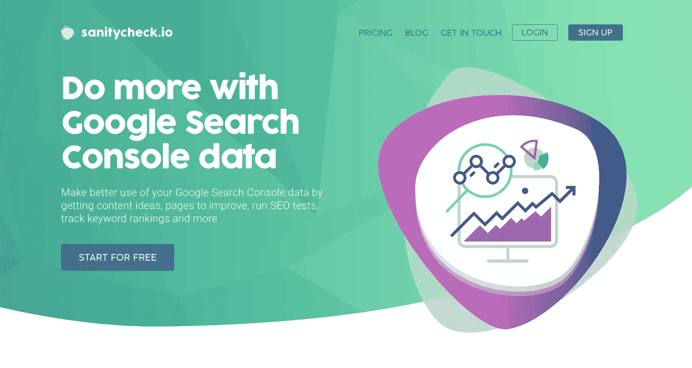
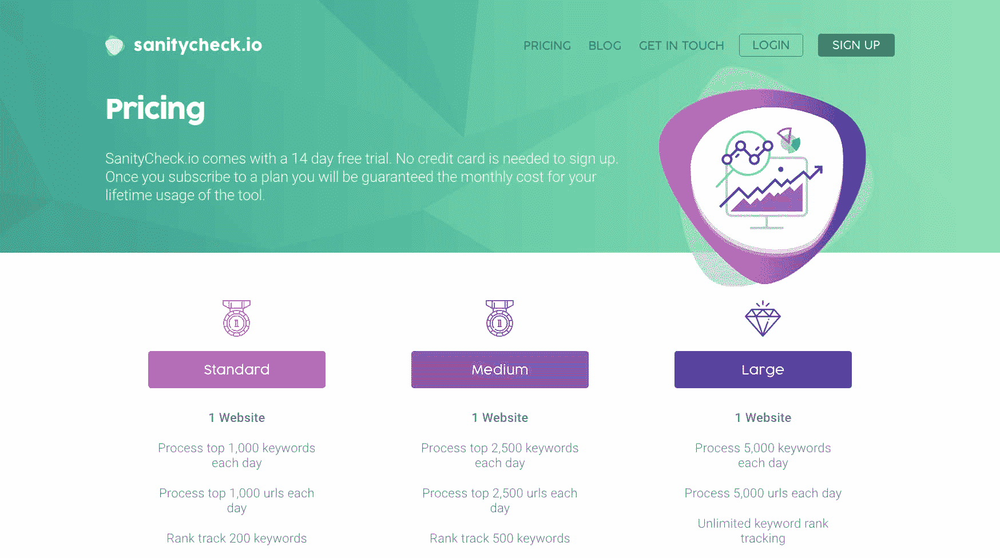

# 面对现实生活中的障碍，推动我的副业向前发展

> 原文：<https://www.indiehackers.com/interview/pushing-my-side-project-forward-in-the-face-of-real-life-obstacles-9313080eb7>

## 你好！你的背景是什么，你在做什么？

嗨，我叫尼克·斯旺，住在英国的布德。

布德是康沃尔郡的一个海滨小镇，拥有可爱的海滩和放松的生活方式。几年前我们搬到这里，为了远离大城市的喧嚣，因为我们想要一个更好的地方抚养我们的孩子。

从 1998 年左右开始，我一直在开发软件和网站，做在线营销。从 98 年开始，我在一个家族企业网站上工作，同时也做各种软件开发工作。2007 年，我为微软 SharePoint 共同创立了一家软件工具公司，并在该领域工作到 2013 年。

在那之后，我不知道该怎么办，所以像往常一样，我最终做了一点联盟营销和搜索引擎优化。当我在谷歌搜索控制台上工作的时候，我对获取某些数据的点击次数感到沮丧，事实上它只提供了 3 个月的数据。有了可用的 API，我开始拼凑一些东西来帮助我自己的工作流程，并停止在 Excel 电子表格中手动记录信息。

快进到今天， [SanityCheck](https://www.sanitycheck.io/) 是一款 SaaS 工具，售价 1100 美元 MRR。

 

## 是什么促使你开始使用 SanityCheck？

我在寻找一个 SaaS 的想法。我做过可下载产品和联盟营销，所以探索和学习新产品/市场是我感兴趣的。启动另一个联盟网站对我来说会非常无聊。

我总是发现我更擅长于“挠自己的痒”这类问题，而不是建立一些东西来解决别人的问题。我发现它为我解决了一些问题，不管你有 0 个还是 100 个其他用户，继续开发这个产品的动力总是存在的。这两种方法我都尝试过，但这总是对我最有效的。

在为联盟网站做搜索引擎优化时，我在谷歌搜索控制台中点击很多东西，并花时间手动跟踪点击量、点击率(CTR)、电子表格中的位置和排名，每当我对页面进行更改时，看看它如何影响谷歌的流量。

有了谷歌搜索控制台 API，我开始四处查看有哪些数据可用。我意识到我可以快速组装一个每天运行一次的工具来存档来自 GSC 的信息。我还可以跟踪点击量、点击率等的变化。为我修改过的页面。这每天节省了大量的时间，一旦我开始使用 API 并查看数据，我意识到还有其他有用的见解和报告可以放在一起。

我有一个 MVP 启动并工作——它实际上是使用默认引导模板的基础。我让几个朋友试了一下，他们马上就能看出它的价值。然后我在我参加的几个脸书 SEO 小组和 Twitter 上发布了这个消息，得到了一些不错的注册和反馈。SanityCheck 的归档部分最初是杀手级特性。如果没有 SanityCheck，你将不得不每月从 GSC 下载电子表格——即使这样，你也会丢失信息。每天自动归档站点的 GSC 数据解决了一个真正的问题。

不过，SanityCheck 仍然只是一个附带项目。我建立它是为了解决我的需求，并帮助我与我的附属网站。事实上，其他人发现它很有用，这是一个很好的奖励——这让我想到，有可能从它那里获得 SaaS 的经常性收入。

## 构建最初的产品需要什么？

主要是我自己的时间。自 2007 年以来，我已经以这样或那样的形式拥有了自己的企业——这样做的主要好处是，我可以主要从事当时能激励我的任何事情。像大多数开发人员一样，我被新的想法和项目所吸引——所以开始使用 [SanityCheck](https://www.sanitycheck.io/) 很容易。

我不是一名设计师——所以营销页面一开始就非常粗略，我对所有的应用程序页面都使用了(现在仍在使用)INSPINIA WrapBootstrap 模板。

我建立 SanityCheck 是为了解决我的需求，帮助我管理我的联盟网站。其他人发现它有用的事实是一个很好的奖励。

TweetShare

我一直使用微软的技术堆栈，因此产品本身是用 ASP.NET MVC、C#和微软 SQL Server 构建的，用于数据存储。我知道现在酷孩子不用这个，但是 38 岁的我已经太老了，不能被归类为酷孩子，我更喜欢用我所知道的快速完成工作。

2016 年 11 月左右开始写第一个代码。到 12 月初，我已经开始让朋友注册并试用它。然后，我慢慢地开始在我参加的各种脸书团体和论坛社区上发布相关内容。

那段时间，我也参与主持了一个小型播客，只有大约 150 名订户，一些早期用户肯定来自那里。

## 你面临的最大挑战和克服的障碍是什么？

2017 年 1 月，我们的第三个孩子出生了。当他 3 周大时，他因细支气管炎和部分肺萎陷而在布里斯托尔儿童医院接受重症监护。随后，他又在当地医院住了 2-3 天，与呼吸作斗争。这是一个非常可怕的时期——但我们不知道这只是热身运动…

三月之后，生活恢复了一点正常，我继续进行健康检查。大约在 5 月份，我准备好了所有的组件，可以开始收取月费了。SanityCheck 每天为注册的网站归档大量数据，所以我知道我必须在某个时候开始收费。

大约在这个时候，我们当时只有 3 岁的大女儿开始身体不适。经过医生的检查，并在第二次检查时被立即转诊到医院——她被诊断患有白血病。突然间，其他事情都不重要了，能够开始对健康检查收费的兴奋被我抛在脑后。

在 3 个月的时间里，我每天都可以专注于工作。

TweetShare

我们再次被紧急送往布里斯托尔儿童医院，在那里我们度过了最初的两个星期。伊莎贝尔变得非常虚弱和孤僻，因为她接受了一次中心静脉导管手术，并开始了高剂量化疗。

令人欣慰的是，在我们与伊莎贝尔的首席顾问的初次会面中，我们得到了这样一个消息:她患有最容易治疗和最常见的白血病，她的年轻也会对她有所帮助，但这仍然意味着要在医院呆很长时间，还要接受 2.5 年的治疗。

在布里斯托尔呆了两周之后，我们被允许回家，伊莎贝尔可以在一家更近的医院继续她的治疗。这仍然意味着每次访问要开 3 个小时的车，有时一周五天。突然之间，搬到农村似乎不是一个好主意。

起初，我认为这不会对我的工作能力产生太大影响。医院里有很多人闲坐着，我有笔记本电脑，所以我想我可以继续工作。但是我忘记了一个 3 岁的小女孩在接受治疗和卧床期间也需要娱乐！

但我也有很多时间坐在医院里，在脑子里计划事情，分清轻重缓急，所以当我可以工作的那一天到来时，我知道该做什么以及如何去做。

我最终在 2017 年 7 月成功打开了计费，当第一批测试版用户开始注册付费计划时，我非常高兴。

谢天谢地，伊莎贝尔已经熬过了许多治疗。在接下来的 18 个月里，她仍然必须每天晚上在家服药，每周验血，每月体检，但生活基本恢复正常，她正在享受上学的第一年。

## 在其他人的平台上构建有负面影响吗？

我的第一家公司取得了有意义的成功，为微软 SharePoint 开发了工具和插件。我们基本上是在填补平台的功能漏洞。每发布一个新的 SharePoint 版本，都有使我们的软件变得多余的风险。

我知道在谷歌搜索控制台 API 上构建 [SanityCheck](https://www.sanitycheck.io/) 的风险，以及它解决的最初痛点之一的存档功能将很容易被谷歌删除，从而提供超过 3 个月的数据。

2017 年，这是通过有限的测试版开始发生的事情:18 个月的搜索数据可供使用。

值得庆幸的是，通过存档数据，利用我在 SEO 方面的经验，以及我自己每天使用 SanityCheck，我能够看到我可以建立的其他东西，例如突出内容想法，CTR 改进机会，SEO 测试，排名跟踪和 PageSpeed 报告的日常运行。

当谷歌在 2018 年 1 月向其他所有人提供搜索控制台的新测试版时，我觉得 SanityCheck 有足够多的其他强大用例来继续作为一个产品——到目前为止，这被证明是正确的。

不管怎样——当我为自己构建工具时，SanityCheck 不会去任何地方。它是我日常 SEO 工作的一个关键部分，所以我对保持它的运行和进一步改进它有浓厚的兴趣。

## 你是如何吸引用户和发展 SanityCheck 的？

当我推出付费计划时，我知道我需要想办法吸引新的试用用户。

Twitter 曾经是获得 beta 版注册的好渠道，Twitter 上有一个很好的 SEO 社区，所以我设置了一些 Twitter 广告，并推广了一些表现不错的推文。这导致了稳定的试用用户流；每天 1-3 次。我也尝试过脸书的广告，即使是最近和长相相似的观众——但没有从他们那里得到好的结果。

另一个很好的来源是个人推荐和推特。似乎试用用户要么注册后就忘记了，要么完全爱上了这个工具，它成为了他们日常工作流程的一部分。这些用户非常友好地在推特上发布关于[健康检查](https://www.sanitycheck.io/)的消息，并转发我的推文——这总是有助于获得一批新的注册用户。

挠挠自己的痒！至少你永远会有一个初始客户。通过自己使用该产品，您将始终有自己关于如何改进它的反馈。

TweetShare

我目前正在研究其他付费广告平台，因为我觉得我可能已经与 Twitter 持平了。

在 SanityCheck 的整个开发过程中，我尝试每月发送一次产品更新，包括销售和收入信息。我还附上了伊莎贝尔的个人最新情况——因为她的诊断对 SanityCheck 的进展速度有很大影响。我不想让测试版用户和客户认为这个工具没有任何好的理由。

我认为，公开我们 2017 年的家庭故事和收入数字有助于人们保持对 SanityCheck 故事的兴趣，并有助于人们保持兴趣，一旦从他们的时间或新功能的角度来看有意义，就会成为客户。

我还从其他开发者和创始人那里得到了很多支持和鼓励，当你坐在医院里，你的孩子正在接受化疗时，这意味着很多。可能比他们意识到的还要多。

 

## 你未来的目标是什么？

[SanityCheck](https://www.sanitycheck.io/) 的目标是围绕营销、转换和产品改进。

随着每月收入的增长，SanityCheck 已经从一个我自己使用的工具，变成了一个如果我需要的话，我可能赖以生存的工具。要做到这一点，我需要找到更多稳定的试用用户来源，并提高转化率。试用转换率目前是 16%——我对此相当满意。但 84%不隐蔽的人通常不会通过电子邮件或应用内消息进行任何形式的互动。我希望能够从他们那里了解更多关于 SanityCheck 缺少什么，以及他们成为客户需要什么。

我也有一些很好的想法来改进你的网站内容，以帮助在谷歌的排名，并从搜索引擎优化的角度看其他有用的数据源。

## 对于刚刚起步的独立黑客，你有什么建议？

挠挠自己的痒！至少你永远会有一个初始客户。通过自己使用该产品，您将始终有自己关于如何改进它的反馈。

## 我们可以去哪里了解更多？

*   网址:[https://www . sanity check . io](https://www.sanitycheck.io)
*   推特:【https://www.twitter.com/nickswan 

我总是很乐意回答其他创始人和企业家关于项目或创业的问题，甚至是关于 SEO 的问题。😊

—[<picture id="ember5305910" class="user-avatar ember-view user-link__avatar"></picture>尼克·斯万](/nickswan?id=xEaNIM5O3rQuB5o5Y3bSZDDXdqA2)【sanity check】创始人

## 想像 SanityCheck 一样建立自己的事业？

你应该加入[独立黑客社区](/)！🤗

我们是几千名创始人，互相帮助建立有利可图的业务和副业。来分享你正在做的事情，并从你的同事那里获得反馈。

还没准备好开始使用你的产品吗？没问题。这个社区是一个认识人、学习和实践的好地方。随意[随便浏览](/)！

——[<picture id="ember5305915" class="user-avatar ember-view user-link__avatar"></picture>考特兰艾伦](/csallen?id=ibTLPyjwVebnZjMGKvz6ztarnuV2)，独立黑客创始人

39votes