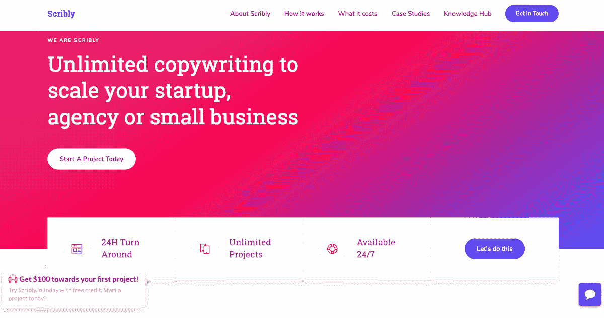
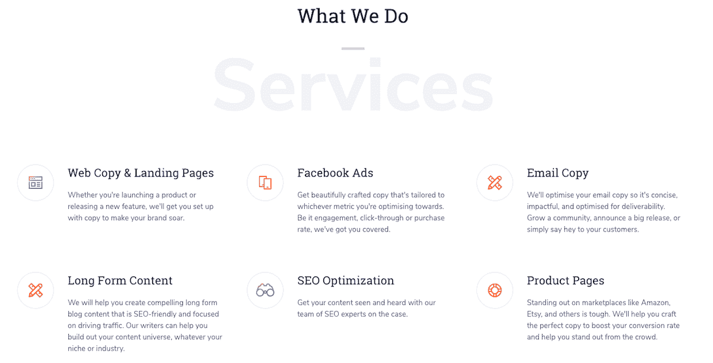
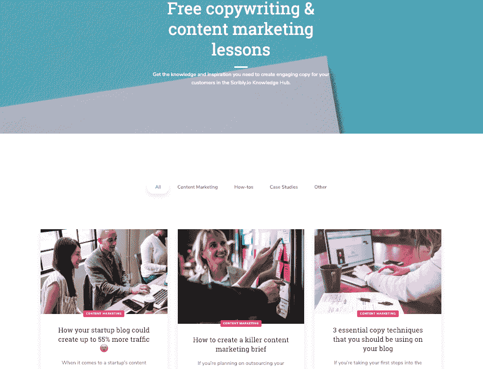

# 克服骗子综合症，把我的热情变成生意

> 原文：<https://www.indiehackers.com/interview/pushing-past-imposter-syndrome-to-turn-my-passion-into-a-business-4b5e223662>

## 你好！你的背景是什么，你在做什么？

嗨！我叫 Dani，是 Scribly.io 的创始人，这是一家帮助初创公司、小企业和机构扩大规模的无限量文案服务公司。

我是第一次创业，背景相当不拘一格。我在大学学过法语和俄语(对，янемногоговорюпоруски！)开始了我为英国政府设计政策的职业生涯。两年来，我试图融入这个圈子，但却一败涂地，于是我决定跳槽，重新接受 UX 设计师的培训。

在我做过的所有可怕的职业决定中，这是迄今为止最难的。理论上，我在一个精英研究生项目中走上了一个有声望的职业道路。但我觉得自己被困住了，好像无法呼吸。在接下来的四年多时间里，我发现自己换了一份又一份工作，从未真正感到安定。我做了这个大跳跃，然而我似乎总是回到同样的不安的感觉。

从那时起，我开始发现自己被我真正喜欢做的事情所吸引:写作。我开始到处找一些业余时间做的兼职文案工作。随着时间的流逝，我发现自己从“真正的”工作中匆匆赶回家，这样我就可以继续做有趣的事情:我的复印工作。一个周六的晚上，当我发现自己在一个自由职业项目上快乐地工作到凌晨时，我意识到我想让这成为我永久的事情。

于是我照做了。

只有几百美元的项目，我在 2018 年 4 月辞去了工作，向未知领域迈出了一大步。我吓坏了，但也火了起来。我对做自由职业者没有任何经验，我从没在辞职那天寄出过手工发票。我甚至不认为我有一个商业银行账户。所以我让自己周围的人都知道一些事情，然后开始工作。

自由职业几个月后，我决定推出一个产品化的文案服务: [Scribly.io](http://scribly.io) 。我们提供基于订阅的文案，以帮助企业扩大规模，成本大约是内部招聘的 50%。

我喜欢把 Scribly 想象成一个为 21 世纪重新定义的机构。我们是完全远程的，一周七天一天 24 小时提供服务(这要感谢几乎每个时区都有作者)，并且削减了所有的物理开销。这使我们能够在不影响质量的情况下提供惊人的价格。

我们所有的作者都是以英语为母语的人，我们做从博客帖子到广告、社交媒体和登陆页面的一切工作。因此，无论您是想让您的内容机器起步，还是想推出一项新服务，我们都会全力以赴，帮助您实现目标。

上个月 Scribly.io 的月收入超过了 1.4 万美元。那对我来说是一个非常重要的时刻，也是一个转折点。开始时是“让我们试试看，看看效果如何”的项目，现在已经成为我的全职工作，并有雄心勃勃的发展计划🙌。

 

## 是什么促使你开始使用 Scribly.io？

我既做过自由撰稿人，也做过雇佣他们的人，我越来越感到沮丧，因为 A)自由撰稿人的市场是多么剥削人(他们基本上不得不出卖自己的灵魂来免费工作)，B)根据需求找到伟大的作家是多么困难。

找到你喜欢的东西，然后大胆尝试。我保证你在成长的过程中会比十年来为别人工作时更了解自己。

TweetShare

已经推出了几个产品化的文案服务，但它们中的许多定价都让我感到困扰。一位智者曾经说过，“如果它看起来好得不像真的，那它就是真的”。无论你如何努力，都不可能以低于 300 美元/月的价格提供高质量、无限制的文案，同时还向你的作者支付他们应得的报酬。一个或另一个遭受——质量或完整性——没有一个感觉像一个好的妥协。

在陷入如何在那个空间创造不同的东西的分析瘫痪之后，最后，我给自己设定了三天的期限，去黑一个网站，发布一些东西，任何东西，然后从那里迭代。就这样，三天后，我不可思议地推出了[. io](http://scribly.io/)。

我提出了这个想法，并与我当时的自由职业客户分享了这个网站——他们中的许多人都是初创公司——并引起了极大的兴趣。基于这一早期验证，似乎需要一种服务来填补这一空白。那时我决定真正尝试一下。

## 构建最初的产品需要什么？

我是一名单干创始人，所以创建、经营和发展 io 一直都是我的责任。

很明显，一个人能做的事情只有这么多，所以从我开始开发 Scribly.io 的那一刻起，我就下定决心要有一种“去他妈的，把它运出去”的心态。我想快速测试所有的东西，这样我就可以一路迭代，并且只做我用现有的现金流可以负担得起的事情。

**scribly . io 离开地面花了多长时间**

正如我之前提到的，我给了自己三天时间来建立并运行最初的网站，这样我就可以验证这个想法。这足以证明这个想法值得追求。

**资助 Scribly.io**

因为它是一项服务，所以 Scribly.io 的融资可能比数字产品更简单。我与我的作家有一个每周付款的政策，每月从客户那里收到付款。因此，最大的财务考虑是确保我有足够的现金流来支付我所有的作家，然后才能获得作品本身的报酬。

我只把赚回来的钱再投资到公司。我从作为自由职业者积累的钱开始，现在我只是通过订阅模式积累现金流。

这意味着我在增加作家数量的速度方面受到了限制，但这对我很有效。正如我之前提到的，Scribly 的所有作家都能得到公平和及时的报酬，这对我真的很重要，因此以这种方式扩大增长也成为了公司诚信的问题。

**作为独立创始人管理时间稀缺**

我有一个非常坏的习惯，开始一项任务，然后被另一项任务分心。因此，为了让自己在开发过程中保持专注，我开始使用 [Trello](http://www.trello.com) 来为网站和增长策略创造积压的想法。

我的男朋友是一名产品经理，当我开始对手头的大量任务感到不知所措时，他帮助我分清主次。这对我来说是另一个关键时刻，因为它让我意识到让其他人加入 Scribly.io 对它的成功至关重要。有一个客观的第二意见来帮助我做出正确的决定——无论是对我自己还是对公司——已经改变了游戏规则。

现在，每个月我都会设定一个主题，并且只把时间花在支持这个主题的活动上。例如，这个月的主题是“口口相传”，所以我围绕帮助我探索这个主题的任务来组织我的待办事项。这让我能够专注于推荐和内容营销的增长实验。

我认为对我来说一个重要的教训是接受我能做的只有这么多。我不是世界上最有耐心的人，学会以一种比我可能喜欢的更慢的节奏过得好确实是一个挑战。

**我的工具箱**

实际上，我现在的角色是运营管理一天几十篇文章的生产，所以我需要创建一个简单但有效的工具套件来帮助我做到这一点。我真的努力克制住“过度工具化”的冲动。我坚持使用我能找到的最简单、最便宜的(/免费)工具，并且只在绝对必要时集成它们。

我目前的工具包是这样的:

*   Webflow —网站建立在 Webflow 的基础上。我购买了一个模板，这让我可以在几个小时内建立并运行一个非常漂亮的网站。现在，我正试图开发这个网站，我发现 Webflow 有点麻烦和限制，但它是让我快速和便宜开始的完美选择！
*   特雷罗(Trello)——我的整个生意几乎都是靠特雷罗经营的。每个客户都有自己的 Trello 板，他们可以根据自己的喜好更新内容任务。使用内置的 Slack 集成，一旦添加了新卡，我就会得到关于 Slack 的通知，并将任务分配给最适合该工作的编写人员。我喜欢我有一个单一的生态系统，在那里我可以真正无缝地管理作者和客户。最棒的是，它是免费的！
*   [Slack](http://www.slack.com)——scribly . io 的作者身处一堆不同的时区，我真的真的非常讨厌电子邮件。所以我创建了一个 Scribly.io slack，这样我不仅可以通知他们新项目的进展，还可以让他们互相联系。作为一名自由作家，这可能是一件相当孤独的事情，我想培育一家公司，让所有的作家感觉他们属于一个扩展的团队，无论他们在世界的哪个角落。
*   [Slite](http://www.slite.com)——我在 IH 遇到了 Slite，我很高兴我遇到了！它基本上是为协作团队设计的 google docs，有一堆非常棒的模板，可以用来做诸如每周检查、计划成长实验之类的事情，并且它与 Slack 无缝集成。我和我的男朋友(他已经成为一个非官方的顾问)每周都有一次检查，来计划和优先考虑未来一周的事情，Slite 完全改变了我们的工作方式！看好这个工具。

 

## 你是如何吸引用户和 grownScribly.io 的？

我认为 io 可以分为两个不同的阶段:

1.  口碑相
2.  数字增长阶段

**口碑相**

我很幸运，因为我已经是一名自由职业者，并且拥有一个非常健康的客户群。这些是我联系的第一批人。我联系了我现有的每一个客户，给他们一个早期报价。事后看来，我本可以做得更好。我没有登陆页面或任何东西来跟踪访问或点击。我只是发了一封个人邮件，第一个月的优惠价格是 999 美元。

在最初的两个月里，我已经把我的七个自由客户转换到 Scribly.io 模式，这是一个好的开始。问题是(现在仍然是)，每个客户都想要一些定制的东西，所以我希望是一个简单的计费模型，实际上最终只是更像是每个转换业务的定制服务。

在这一阶段转变的所有客户都了解我和我的工作。我已经和他们有了很好的关系，所以挑战只是让他们相信，当我把写作责任移交给其他作家时，质量不会有任何改变。我只是免费运行一个试验任务来向客户证明这一点，然后剩下的事情就一帆风顺了。

如果你怀疑新业务会对你现有客户的体验产生负面影响，那就拒绝它。

TweetShare

自那以后，增长完全由人工推广和口碑驱动。快乐的顾客让我们与他们认识的其他人联系，事情就像滚雪球一样越滚越大。我现在已经建立了一个基于奖励的推荐方案，为现有客户提供 50 美元的信贷，用于每个成为付费项目的推荐，但实际上，在最初的几个月，大多数客户都很乐意免费这样做。

正因为如此，卓越的客户体验和客户维系是企业的核心关注点。如果我怀疑新业务会对我现有客户的体验产生负面影响，我宁愿拒绝它。

**数字增长阶段**

从那时起，我现在专注于一个适当的增长计划，包括以下内容:

1.  *内容营销/搜索引擎优化*:我强烈地感觉到，作为一个内容公司，我需要有一个非常热门的网站内容部分。有机流量绝对是我想要集中营销投资的地方，所以我正在把 Scribly 网站的博客部分建设成一个[知识中心](https://www.scribly.io/blog)，提供文案和内容营销课程。我刚开始每周发布两次，现在决定暂时用 [LinkedIn](https://www.linkedin.com/company/18847321) 和 [Twitter](https://twitter.com/scribly_io) 作为我的发布渠道。我正在进行全面的搜索引擎优化分析，以确定我的机会领域。现在我们在“无限文案”上排名第三，但这不是一个高搜索量。和所有的搜索引擎优化一样，这是一个缓慢的过程，我几周前才开始。博客的流量稳步上升，上个月增长了 11.9%。希望在接下来的几个月里，我会开始看到一些有意义的收获。
2.  *Intro offer popup* :我添加了一个小部件，为新访客的第一个项目提供 100 美元的优惠(我使用了 [Magnify](https://www.usemagnify.com/) )。到目前为止，这真的很成功。我从一周一个新的直接线索增加到第一天六个。
3.  *合作关系、推荐和目标登陆页面*:我想为不同的客户群提供一些特别的介绍，所以我为每个客户群创建了目标登陆页面，然后调整了内容，使其更加适合这个细分市场。例如，我有一个启动登录页面、一个代理登录页面和一个更通用的推荐登录页面，用于我现有客户的联系人。我在这里最大的失败是依赖 Webflow 作为我的登陆页面，这使得它不可能进行 A/B 测试。我将很快转向像 Unbounce 这样的工具来改进这个过程。
4.  *投身 IH* :到目前为止，我流量最大的一次高峰是在我的一次[讨论](https://www.indiehackers.com/forum/tips-for-managing-imposter-syndrome-anyone-76511a9577)被刊登在《IH 时事通讯》上的时候。网站的流量在那天猛增，产生了一个付费项目和两个新的作者。
5.  被封锁的内容:我刚刚在网站上发布了一些被封锁的内容。现在在[知识中心](https://www.scribly.io/blog)的每一页上，都有一个 CTA 来访问免费的内容营销日历。将门控内容集成到 Webflow 中是一个非常繁琐的过程，因此解决方案并不像我希望的那样清晰。为了避免花费大量时间寻找技术解决方案，我简单地设置了一个 Zapier 集成，以便以特定形式收集的电子邮件进入 Mailchimp 中的特定部分，然后我在 Mailchimp 中配置了一个自动滴流活动，以便在电子邮件地址提交后立即触发。我这样做主要是为了测试将门控内容作为引导机制的过程。我大概总共花了两天的时间为此创建了所有的东西，并学习了很多东西，但是到目前为止只生成了两条线索，这有点失败。现在将在特定的 SEO 优化登陆页面上使用相同的内容，以增加流量，并看看它如何转化。
6.  *在闲置渠道发帖*:我是许多营销人员/创始人闲置渠道的成员。我在这些频道上发布了断断续续的提议，激起了一些兴趣，但并没有真正带来任何结果。我将停止这种活动，并在未来专注于更有针对性的外联活动。
7.  *黑色星期五失败！哎呀，真失败。在最后一刻，我决定我可能应该运行一个黑色星期五的提议，然后花了几个小时疯狂到凌晨准备一些视觉效果。这是品牌之外的，考虑不周的，总体来说是一个彻底的失败。我把它发布在 LinkedIn 上，并发送给我的整个电子邮件列表。这是一个很大的教训，那就是仓促地做一些没有计划好/想好的事情。我没有线索，可能实际上对品牌有一点伤害。*

**未来任务**

我清单上的下一步是进行一些付费营销实验。我还没有机会就如何解决这个问题制定一个结构化的计划或策略，但我认为 Linkedin 和搜索广告将是我的第一个求助点。

## 你的商业模式是什么，你是如何增加收入的？

这个想法相当简单。根据客户的需求，我们可以按需工作，或者您可以注册以下订阅包之一:

*   2000 美元用于无限内容营销
*   3500 美元，用于任何形式的无限制文案(广告、电子书、登录页面等)。)

由于我们一次只做一个客户待办事项中的一个项目，通常他们每个月会完成大约 15 个项目。我们还为有定制需求的客户提供定制套餐(这主要适用于具有极高量需求的机构)。

**多币种挑战**

我面临的最大问题之一是，我以多种货币支付和获得报酬。

*   我付给作家美元或英镑
*   我的工资可以是美元、欧元、英镑或丹麦克朗

这完全是一场噩梦，因为我的每一步都因为我的银行或支付提供商的蹩脚转换率而赔钱(我使用 Transferwise 无国界账户、Paypal 和本月开始的 Stripe 的组合)。对我来说，这可能是一个持续的挑战，很难准确预测我每个月能挣多少钱。

**当前的财务状况**

现在，该业务的月营业额为 14，000 美元。我的目标是月环比增长 15%。我没有任何开销，我每月最大的支出是为我共事的令人惊叹的写作团队。

| 月 | 收入 |
| --- | --- |
| 2018 年 4 月 | 4679 |
| 2018 年 5 月 | 5421 |
| 2018 年 6 月 | 6253 |
| 2018 年 7 月 | 7003 |
| 2018 年 8 月 | 10818 |
| 18 年 9 月 | 9848 |
| 18 年 10 月 | 11986 |
| 18 年 11 月 | 13153 |
| 2018 年 12 月 | 14679 |
| 19 年 1 月 | 16072 |

## 你未来的目标是什么？

就产品而言，今年我想开始打造 Scribly out，超越仅仅是一家基于服务的公司，还包括客户可以许可使用的数字工具。例如，一些类型的文案遵循公式化的模式(特别是对于登陆页面之类的东西)，我相当有信心这可以通过机器学习在某种程度上产品化。这是一个雄心勃勃的项目，与 Scribly 今天的日常运营并行，但我认为探索它会很有趣！

就收入而言，我的月环比增长目标是 15%，这意味着 2019 年 12 月的预计收入超过 6.5 万美元。这是一个疯狂的目标，几乎 100%可能不会发生，但向月球和所有这一切射击！

当然，我计划好的一切都完全受限于我的时间。这就是为什么今年我想带一个全职的人来帮助 Scribly 运行。现在我什么都在做:运营任务、营销、编辑文章、客户管理、新业务等等。—很多。所以在接下来的几个月里，随着现金流的增长，我想让某人成为 Scribly 的第二号成员。

## 你面临的最大挑战和克服的障碍是什么？如果你必须重新开始，你会做什么不同的事？

我想自从我开始写作以来，我所面临的最大的挑战就是骗子综合症。我为自己迄今为止取得的进步感到非常自豪，然而，当人们问我是做什么的时候，我经常会不自信或自我贬低地回答，就好像我觉得人们不会相信我一样。我现在正在努力工作！

当黑客是没有“类型”的。

TweetShare

从商业的角度来看，当我经常对大量要做的事情感到不知所措时，我也很难知道如何以及在哪里集中精力。事实上，这让我在去年夏天彻底精疲力尽，从那时起，我就开始注意慢慢来。

我倾向于以每小时 100 万英里的速度前进，这个过程的一部分就是学会欣赏这种感觉。

## 有没有发现什么特别有帮助或者有优势的？

专注于客户体验已经在产品中建立了保留。我认为，到目前为止，真正帮助我度过难关的一件事是对客户体验的坚定承诺。我面临着对新业务说不的艰难任务，因为我真的不觉得我们能做到这一点，要么是因为我们没有一个具有合适专业知识的作家，要么就是因为我们已经达到了最大容量。

不过，我认为从长远来看，这确实有助于留住客户。我们的客户保持率目前是 86%，这是惊人的，我希望尽可能接近黄金 100。留住人才是我的一个关键指标，不是为了虚荣，而是因为诚信是我建立这个企业的核心价值观之一，所以我希望这一点始终指导我做出的关于如何发展的决定。

我既有自由撰稿人的经历，又有雇佣自由撰稿人的经历，这无疑也对我有所帮助。它让我超级意识到挑战、挫折以及 Scribly 硬币两面的神奇时刻，并帮助我与客户和作家建立了惊人的关系。例如，我以自己的经历为基础，为新作者和客户设计入职培训。我考虑了我在他们的位置上会遇到的所有关键问题，然后围绕这些问题设计了一个入职流程。

 

## 对于刚刚起步的独立黑客，你有什么建议？

我关于我的背景的开场白故意说得很长。我想给出我所走的攀登式职业道路的全景。我并没有一直向前。事实上，在很多时候，我都觉得自己在后退。

我想强调这一点，因为我真的认为强调成为一名黑客没有“类型”是很重要的。我总觉得自己永远都无法经营自己的事业。我甚至不能*认为*自己是一个企业家——我的背景完全是错误的，我没有读过正确的书，也没有正确的爱好。然而，不到一年后，我就在这里了，把我那蹩脚的 20 美元/小时的自由职业变成了一个产品化的文案服务，现在售价 2000 多美元/月。

我这么说不是为了自吹自擂，而是希望鼓励更多的人尝试一下。我男朋友花了好几年时间告诉我，我能做到，我才有勇气去尝试。

所以让我大声清楚地说:

**你**

**能**

**做**

**它。**

说真的。你可以。

找到你喜欢的东西，然后大胆尝试。当然，可能会出错。但很可能不会。希望你的激情项目会成为你的全职工作，但如果没有，那么我保证你会在这个过程中比十年来为别人工作时更多地了解自己。

记得依靠像 IH 这样的神奇社区。这是我灵感的最大来源，并且在我的旅程中一直是我的生命线。

## 我们可以去哪里了解更多？

如果你想在野外看看风景，[到这里来享受 IH 的特别优惠](https://www.scribly.io/new-startup-offer),它会让你的第一个项目便宜$美元，这样你就可以无风险地尝试一下了。你也可以去我们的[知识中心](https://www.scribly.io/blog)寻求一些提示和技巧，让你自己的内容机器在内部运转起来。

如果有人对我有任何问题，请不要犹豫，在评论中提问。我会试着回答所有的问题。谢谢你邀请我参加独立黑客！

——[<picture id="ember5262606" class="user-avatar ember-view user-link__avatar"></picture>丹妮拉·曼奇尼](/DaniMancini?id=DYw0dTdOScV5pOla8wLrMK87DNA3)【scribly . io 创始人

## 想像 Scribly.io 一样建立自己的事业？

你应该加入[独立黑客社区](/)！🤗

我们是几千名创始人，互相帮助建立有利可图的业务和副业。来分享你正在做的事情，并从你的同事那里获得反馈。

还没准备好开始使用你的产品吗？没问题。这个社区是一个认识人、学习和实践的好地方。随意[随便浏览](/)！

—[<picture id="ember5262611" class="user-avatar ember-view user-link__avatar"></picture>考特兰艾伦](/csallen?id=ibTLPyjwVebnZjMGKvz6ztarnuV2)，独立黑客创始人

65votes