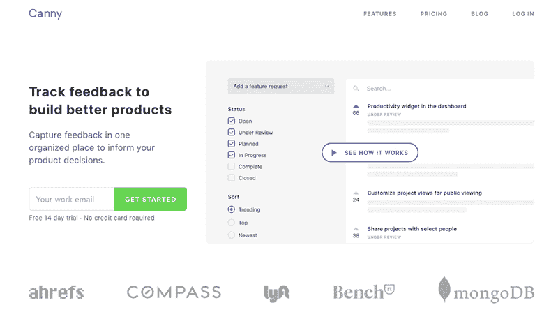
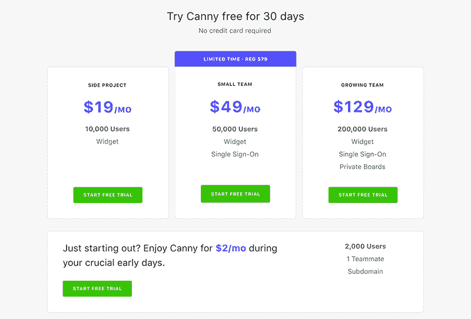
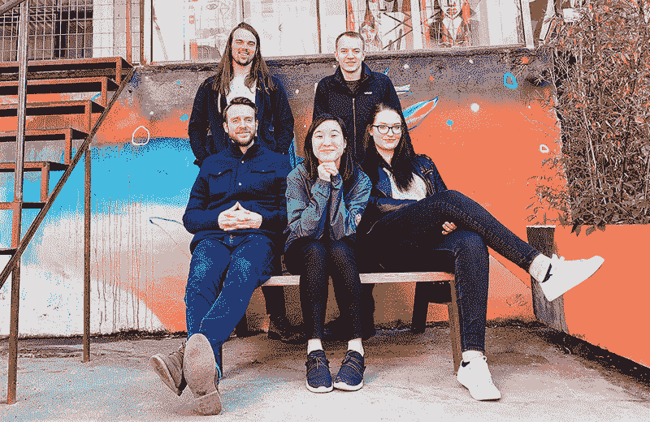

# 离开脸书去 SaaS 创业

> 原文：<https://www.indiehackers.com/interview/quitting-facebook-to-bootstrap-a-saas-business-512b5be159>

## 你好！你的背景是什么，你在做什么？

大家好，我是莎拉·胡姆，我是 Canny 的创始人之一。我在加拿大的多伦多出生和长大。我的专业背景是设计；我学的是平面设计，一毕业就在脸书做产品设计师。在那段时间里，我遇到了我的联合创始人安德鲁，他是脸书的一名软件工程师。

作为一名来自一所小规模设计学校的加拿大人，脸书是我打开大门的一个好方法。事实证明，没有什么能真正让你为成为一名创始人做好准备。一年半后，我辞职去了 Canny。

2017 年 3 月，我和我的联合创始人安德鲁推出了 Canny on Product Hunt。Canny 帮助软件团队做出更好的产品决策。随着软件业务的增长，他们获得了更多的客户，反馈变得混乱。有这么多有价值的见解，但很难透过噪音看到。这时，团队雇佣 Canny 以有组织的方式帮助跟踪客户反馈。

Canny 是完全自举的，我们最近达到了$45K MRR。有了这笔钱，我们开始壮大我们的团队，现在我们是一个幸福的五口之家。

## 是什么促使你开始使用 Canny？

Canny 是我们过去的产品之一 Product Pains 的翻版，在这个社区中，任何人都可以对任何产品提供反馈。它主要集中在我们日常使用的产品上。想想 Yelp、优步之类的公司。我们开始了产品之痛来解决我们的用户问题:公司不善于听取用户的反馈。

这个概念很简单:你可以为一个产品发布新的反馈，或者如果相同的反馈已经存在，你可以投票。我们认为，如果我们能让足够多的人参与进来，公司会注意到并要求他们的公司简介。

 

在给成千上万的用户带来产品痛苦之后，我们意识到我们的方法是落后的。我们需要首先追踪公司。所以我们构建了一个可嵌入的小部件来直接收集反馈。我们将这个小工具定价为 19 美元/月，商家开始付费。这是我们知道我们在做一些事情的时候。

作为产品人员，我们理解为什么反馈如此重要。我们还可以看到，在很大程度上，将反馈组织成可操作的见解是多么困难。团队真诚地想要倾听他们的用户；这是一个非常困难的问题。为了解决这个问题，我们把产品痛苦社区变成了 SaaS 工具 Canny。

## 构建最初的产品需要什么？

当我还在学校的时候，Andrew 和我就开始研究产品痛点。我实际上是把它作为一个最终项目提出来的，并因此获得了荣誉。因为我在设计学校，大部分工作都是设计产品和品牌。功能很少。

当我开始在脸书工作时，Andrew 辞职全职研究产品问题。在我加入他之前，将会有长达一年的折磨。在那段时间里，他开发了产品，壮大了社区。与此同时，他正在耗尽自己的积蓄。

在我离开 FB 加入 Andrew 后不久，我们开始了向 Canny 的过渡。我们能够为 Canny 重用许多产品痛点代码。我们在几个月内把所有的东西都拼凑在一起。我们的客户顺利过渡到一个品牌重塑的产品，拥有更好的 UX。

建造 Canny 非常有趣。我们是设计师和工程师——建筑是我们的乐土。此后不久，情况变得更加困难。我们有功能性产品，但没有营销经验。2017 年 3 月的一个普通日子，我们决定第二天就要发射。

你的产品有多棒并不重要。除非你把自己放在那里，否则人们不会找到你！

TweetShare

## 你是如何吸引用户并变得精明的？

我们启动了产品搜索，进展非常顺利。Canny 最终获得了当天的第二名和本周的第五名。它给了我们一个很大的流量高峰，因为我们把它变成了产品搜索时事通讯。

我们从来没有用 Canny 运行过正式的测试版，但是我们确实有产品方面的问题。几个使用产品痛点的团队加入进来，帮助推动了发布。

真正有帮助的一件事是加入开源社区。Andrew 在脸书的老团队 React Native 在产品出现问题后继续使用 Canny。Canny 的公共性质意味着我们会接触到许多开发人员。一些开发人员开始在他们的团队中使用 Canny。

我们也开始为我们的博客撰写文章。我们的一些帖子登上了黑客新闻的头版，造成了巨大的流量高峰。这些帖子无疑为我们赢得了知名度和客户。然而，它们很不可靠，不可预测。我们已经在这类内容上取得了很大进展，但我们现在需要将重点转向常青树内容和 SEO。

我们在回答 Quora 问题和付费广告方面做了一些努力。它们起作用，但我们还没有发掘它们的全部潜力。

对于一个小团队来说，关注少数关键渠道并深入其中是很重要的。尝试太多的事情通常意味着你没有做好任何一件事。

## 你的商业模式是什么，你是如何增加收入的？

Canny 从来都不是免费的。SaaS 的好处是有一个公认的每月费用的概念。我们提供 Canny 作为订阅服务，按月收费。困难的部分是把这些价格搞对。第一年，我们[改变了四次价格](https://canny.io/blog/saas-pricing-lessons/)。

我们的第一次定价尝试包括每月 2 美元的计划。这是个错误。我们选择了这个便宜的计划，而不是免费的计划。这里的想法是，我们可以淘汰那些不认真使用 Canny 的人。但是没有多少人选择这个计划。我们最终浪费时间去追逐那些最终只有 24 美元/年的人。

 

这里的漏洞是我们没有定义我们的目标受众。我们试图同时瞄准 B2B 和消费者业务。使用案例大相径庭，因此定价完全不一致。

也就是说，我们从最初的用户那里得到了很多关于我们定价的反馈，并且能够自我修正。当我们只试图与一类客户沟通时，我们的信息传递变得更加清晰。

我们的最低计划现在起价为 50 美元/月。我们每月 200 美元的计划最近取代了所有其他计划。通过逐步淘汰那些早期的计划，我们已经能够大幅增加我们的 ARPU。

我们确实提供一些特别计划，但不相信折扣是我们转换的主要驱动力。我们希望 Canny 被视为优质产品，因为它确实如此。不是廉价打折版的 UserVoice。出于同样的原因，我们不太可能会做类似 AppSumo 的事情。

当给你的产品定价时，要尽可能简单。买家不喜欢被搞糊涂。我们也非常相信使用价值指标。根据你的产品找到一个有意义的，并据此收费。我们的客户每月都在自然增长，这让我们保持净负流失率。

## 你未来的目标是什么？

反馈对于整个团队来说都是一个大问题。我们已经精明到了对小团队非常有效的程度。对于更大的团队，我们可以做得更好。我们将更加专注于让 Canny 成为一款电动工具。这意味着我们需要了解我们的大客户所面临的问题。如果我们能构建解决这些问题的功能，我们就能为 Canny 增加更多价值。

我们也加大了市场营销的投入。到目前为止，我们在很少甚至没有营销的情况下做得还不错，但我们可以做得更好。今年早些时候，我们让 Elen 加入了我们的团队，以帮助我们启动我们的工作。我们将专注于制作更多的常青树内容。

我们刚刚开始壮大团队，所以我对我们的潜力感到非常兴奋。很久以来只有我和安德鲁，现在感觉我们可以做得更多。

从第一天起，我们[就开始培养精明的](https://canny.io/blog/saas-startup-ramen-profitability/)。能够用我们赚的钱给人们发工资，这种感觉太棒了。展望未来，我们将继续可持续发展我们的团队。我不想让团队担心拿不到薪水。

我认为每个企业家都需要这种从错误中学习的态度。

TweetShare

## 你面临的最大挑战和克服的障碍是什么？

作为第一次创业者，我们遇到了无数的挑战。你可以一篇接一篇地阅读博文，但有些东西必须亲身体验。

定价是这些挑战之一。一方面，我们有愿意支付数百美元的客户。另一方面，我们的竞争对手以每月 10 美元的价格比我们低。产品创始人因收费过低而臭名昭著。

要考虑的因素太多了，很难找到合适的平衡点。我们认识到定价不是一劳永逸的事情；它应该是与你的公司一起成长的东西。

招聘也是最近的头等大事。我们现在是一个由五名成员组成的快乐团队，但来到这里并不容易。我们最初的几个雇员并不像我们希望的那样成功。第一次坐在招聘桌边有很多东西要学。

能够用我们赚的钱给人们发工资，这种感觉太棒了。展望未来，我们将继续可持续发展我们的团队。

TweetShare 

我很感激我们能走到这一步，但也很害怕。我们现在有一个团队，我们不能让他们失望。作为一个内向的人，一个不喜欢聚光灯的人，我开始接受成为一名领导者。

没有任何挑战能击倒我们，尽管许多挑战让我们沮丧。我认为每个企业家都需要这种从错误中学习的态度。有一个联合创始人对这种情感支持很有帮助。站起来继续努力。

## 有没有发现什么特别有帮助或者有优势的？

我从来没有发现书籍对掌握新技能特别有帮助。对我来说最好的事情就是自己尝试。我通过建立自己的作品集网站学会了如何编码。我通过从游戏中提取精灵并在索尼维加斯制作动画来学习如何制作视频。跳过书本可能节省了我很多时间。当我遇到困难的时候，我会快速地在谷歌上搜索，并以这种方式学习。我更喜欢弄脏自己的手，从错误中学习。

我已经浪费了太多时间迷失在一个话题的博客帖子里。有太多的内容，经常有相互矛盾的建议。最后，我只是被信息过载弄得更糊涂了。当要把事情做完时，我就去做。我最多看了三篇博文，但之后就不再拖延了。我通过自己做这件事学到了更多。

我认为这同样适用于创业。我们已经听过很多次传统的创业建议了。与你的用户交流，做一些不可扩展的事情，等等。除非你亲自去做，否则很难理解这些事情的实际影响。

## 对于刚刚起步的独立黑客，你有什么建议？

认真对待设计好的用户体验。如果你不能解决问题，好的设计不会为你推销你的产品，但是坏的设计会让人们看不到你产品的价值。好的设计是今天的基础。第一印象很重要，尤其是当你以技术换技术的时候。如果一个登陆页面不好，我认为这个产品不好。无数人伸出手来告诉我们，他们欣赏我们的设计。

还有:从第一天开始营销。除非你把自己放在那里，否则人们不会找到你！你的产品有多棒并不重要。你需要启动口碑传播。产品创始人们，我在和你们说话。我知道这很难，但是早点开始会让你受益匪浅。让营销为你工作需要时间和努力。

## 我们可以去哪里了解更多？

今年我们会在 [Canny 博客](https://canny.io/blog/)上写更多！你可以在推特上找到我 [@sarahhum](https://twitter.com/sarahhum) 。如果你对我们的游牧之旅感到好奇，请在 Instagram [@carryoncode](https://www.instagram.com/carryoncode/) 上查看我们。

如果你有任何问题，请随意评论。我很乐意尽我所能提供帮助！

——[<picture id="ember8068843" class="user-avatar ember-view user-link__avatar"></picture>萨拉哼](/sarah?id=Ki2hefWF8Pd19k7jipZAfHEt8X03)，精明强干的创始人

## 想像 Canny 一样建立自己的事业？

你应该加入[独立黑客社区](/)！🤗

我们是几千名创始人，互相帮助建立有利可图的业务和副业。来分享你正在做的事情，并从你的同事那里获得反馈。

还没准备好开始使用你的产品吗？没问题。这个社区是一个认识人、学习和实践的好地方。随意[随便浏览](/)！

——[<picture id="ember8068848" class="user-avatar ember-view user-link__avatar"></picture>考特兰艾伦](/csallen?id=ibTLPyjwVebnZjMGKvz6ztarnuV2)，独立黑客创始人

66votes