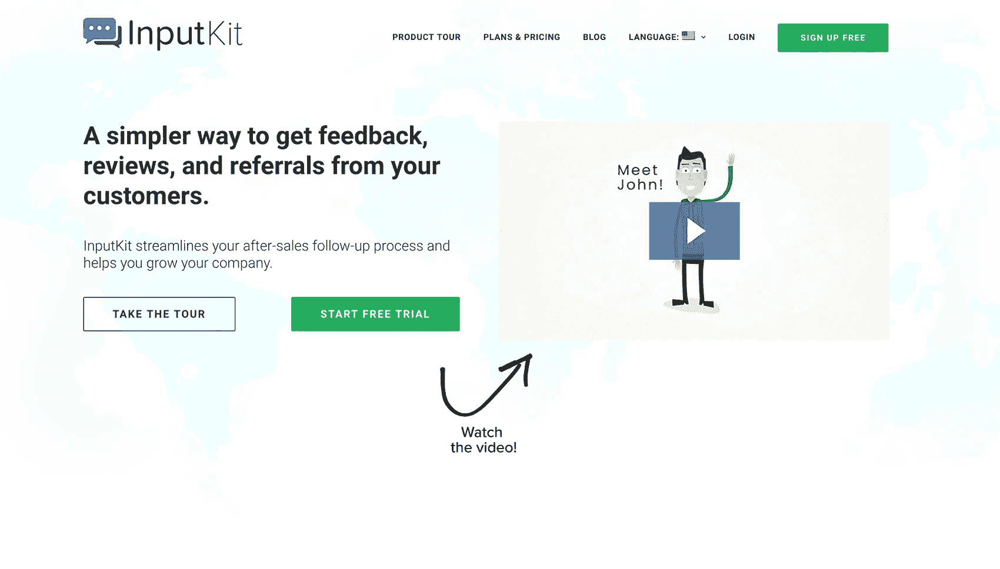
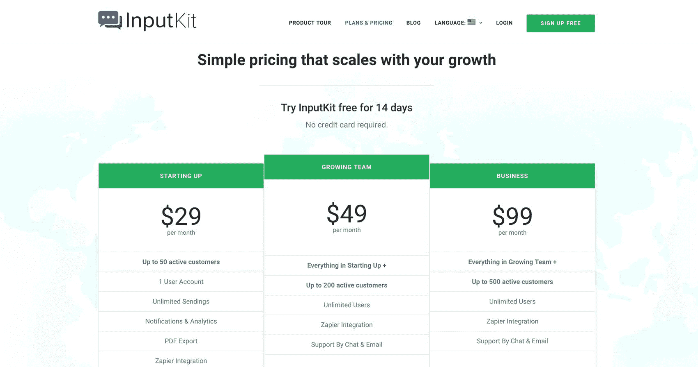
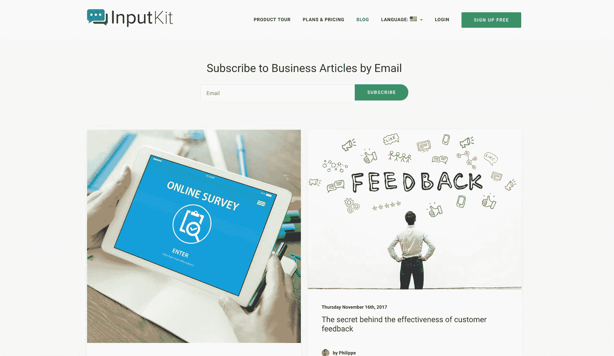

# 辞去工作，全职发展我的 SaaS 公司

> 原文：<https://www.indiehackers.com/interview/quitting-my-job-and-going-full-time-to-grow-my-saas-company-f07b1b6edd>

## 你好！你的背景是什么，你在做什么？

我叫菲利普·吉诺伊斯。我今年 23 岁，住在加拿大蒙特利尔，正在兼职学习软件工程。在过去的一年半时间里，我的好朋友兼商业伙伴 Jean-Philippe 和我一直致力于 [InputKit](https://inputkit.io/en) 。我刚刚辞掉了兼职工作，以便投入 100%的精力。

[InputKit](https://inputkit.io/en) 是一款客户反馈软件，帮助中小型企业主处理售后跟进流程。我们整合了一套最佳实践，如反馈调查和征求、在线评论、推荐、推荐、交叉销售等。，以便他们可以利用被忽视的机会拓展业务。它可以让他们为客户创建定制的跟进策略，并将客户连接到 Zapier 以实现流程自动化。

目前，我们只做直销(网上没有)，每月经常性收入为 1400 美元。

 

## 是什么促使你开始使用 InputKit？

我喜欢软件，喜欢做东西，喜欢帮助别人，所以我一直想在 SaaS 开一家公司。为了促进这一过程，2016 年 11 月，我加入了一个名为 [The Foundation](https://thefoundation.com) 的在线项目，该项目帮助人们从零开始开发产品，最理想的是，创办一家软件企业。

2017 年 1 月，我通过进行想法提取(Idea Extraction)产生了 InputKit 的想法，这是一个过程，通过这个过程，你可以确定一个目标市场，然后试图找出他们想要解决什么样的问题。为了做到这一点，我联系了许多企业主，向他们询问了关于他们的客户、产品、商业模式等问题。，以便从他们那里获得关于他们遇到了什么样的问题以及我如何着手解决这些问题的想法。我就落到了忽视售后跟进的问题上。我花了一个周末的时间使用 Hotgloo 构建了一个快速原型，然后与企业主进行了预售，以验证这个想法。

几周之内，我有了四个顾客。之后，Jean-Philippe 加入了团队，实际构建软件。在这一点上，我仍然有一份兼职工作来支付账单。

## 构建最初的产品需要什么？

我们之前已经开发了几个网络应用，所以我知道这个不会有太大的挑战。我们没有任何资金，用我们自己的钱来启动一切。我们的费用不是很高，大部分的钱都花在了主机和数据库上。

最初，我用记号笔在纸上画了一个草稿，以确保我已经从每个可能的角度考虑过它，甚至包括数据结构(类、属性、数据库表)。整个过程花了我大约四个小时。

实际上，在你开始建设之前，先从别人那里拿钱。如果一个人不愿意预先付款，那么当你的产品准备好了，他们很可能不会付款。

TweetShare

然后我上了 Hotgloo，一个线框原型工具，开始把东西放进可视化网页。总的来说，我花了大约两到三天的时间把所有的东西放在一起。之后，我开始向潜在客户展示，以获得一些预售。

几个星期后，我找到了四个想要完整产品的付费客户。JP 加入了这个团队，带着原型，构建了一个 MVP，它拥有客户入门所需的所有特性。他只在晚上和周末工作，用了大约两个月的时间完成了后端 NodeJS 和前端 VueJS 的使用。

## 你是如何吸引用户和发展 InputKit 的？

我们最初通过主动的对外销售获得了所有的客户。我会给人们打电话，发冷冰冰的电子邮件，在 LinkedIn 上发信息，并提供现场演示——尽一切努力把产品推出去。在 14 个月内，我做了大约 40 次现场演示，并通过电话使用 join.me 做了更多演示。

这一策略为我们赢得了第一批 10 个客户。虽然它帮助我们验证了这个想法，但这是一个棘手的问题，我希望整个过程花费的时间少得多。在这一点上，我们根本没有依靠我们的网站进行销售或营销，我认为这是一个错误。

 

## 你的商业模式是什么，你是如何增加收入的？

我的预售要价是 300 美元，内含成为“创始会员”的激励，其中包括 15%的终身折扣。老实说，300 美元很划算。我认为当时这个产品至少值 1000 美元。我们没有设置支付处理器，所以客户用支票支付，这意味着我必须等几天才能真正收到钱。

目前，我们所有的客户都是按月或按年付费使用我们软件的企业。他们每月支付 50 至 450 美元，平均每月 140 美元。一开始，我们的定价有点即兴——我们根据每个客户的需求提出不同的价格，因为我们没有正式的定价结构。

现在，我们主要通过 Stripe 和 Quickbooks 获得报酬。三四个客户还是用支票付款，一个用银行直接转账。

这是我们的收入增长:

| 月 | 收入 |
| --- | --- |
| 17 年 10 月 | 300 |
| 17 年 11 月 | 800 |
| 2017 年 12 月 | 900 |
| 2018 年 1 月 | 1000 |
| 2018 年 2 月 | 1200 |
| 18 年 3 月 | 1400 |

## 你未来的目标是什么？

就在上周，我们决定彻底改变我们的方法，瞄准一个新的市场。我们将把我们的受众扩大到美国，这意味着我们需要重新思考我们的一些销售和营销策略，并利用一些未充分利用的资源，如网站。因为我们来自魁北克，加拿大的法语区，并且最初只针对我们地区的客户，所以最初的网站是法语的。我已经为我们的网站创建了一个[英文版](https://inputkit.io/)，里面有一个简短的解释视频，并提供免费试用。希望这将有助于建立我们在美国的客户基础。

解释性视频:

[https://www.youtube.com/embed/ZYSj8DFaw3w](https://www.youtube.com/embed/ZYSj8DFaw3w)

随着网站的改版，我们计划继续我们最初的对外销售策略，通过电子邮件联系我们的企业，提供 Skype 演示，并向他们发送我们的网站和解释性视频。我们正在考虑做一些广告，我们一直在尝试在 Quora 和其他基于搜索和响应的网站上回答问题，以增加我们网站的流量。

我们的目标是到 2018 年底每月经常性收入达到 6000 美元。

## 你面临的最大挑战和克服的障碍是什么？如果你必须重新开始，你会做什么不同的事？

我会说，最大的挑战是走出我的舒适区，去打陌生电话、问问题、会见企业主、在大团队面前演示，以及要钱。

我愿意做(几乎)任何事情来留住我们的客户。

TweetShare

通过写下所有这些，我也开始意识到我们想得不够大。如果我必须从头再来一遍，我会立刻瞄准美国市场，在我们获得首批客户后，立即利用在线流量来吸引客户。

## 有没有发现什么特别有帮助或者有优势的？

我认为专注于让你的顾客开心是很重要的。在这一点上，我们有 0%的流失率，我认为这在很大程度上是因为我愿意做(几乎)任何事情来留住我们的客户。

 

## 对于刚刚起步的独立黑客，你有什么建议？

我要给出的最重要的建议是，在你开始建造任何东西之前，先从别人那里拿到钱。我知道这很难接受，但是如果一个人不愿意预先付款，那么当你的产品准备好了，他们很可能不会付款。

我喜欢软件，喜欢做东西，喜欢帮助别人，所以我一直想在 SaaS 开一家公司。

TweetShare

所以，在浪费你的时间去建造一些没有人会使用的东西之前，确保你能得到报酬！

## 我们可以去哪里了解更多？

你可以去我们的网站: [InputKit](https://inputkit.io/en)

如果有人对我们有任何问题，请不要犹豫，在评论中提问。我们会尽力回答所有的问题。

—[<picture id="ember5207148" class="user-avatar ember-view user-link__avatar"></picture>菲力普·吉诺伊斯](/PhilGenois?id=4rDqvGwjrJbtlvwD39i0f6eSKu62)【input kit 创始人

## 想像 InputKit 一样建立自己的企业？

你应该加入独立黑客社区！🤗

我们是几千名创始人，互相帮助建立有利可图的业务和副业。来分享你正在做的事情，并从你的同事那里获得反馈。

还没准备好开始使用你的产品吗？没问题。这个社区是一个认识人、学习和实践的好地方。随意[随便浏览](/)！

——[<picture id="ember5207153" class="user-avatar ember-view user-link__avatar"></picture>柯特兰艾伦](/csallen?id=ibTLPyjwVebnZjMGKvz6ztarnuV2)，独立黑客创始人

30votes