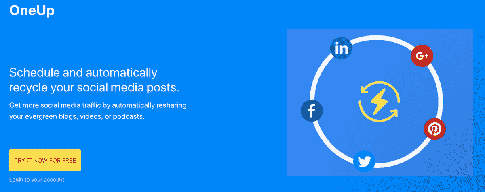
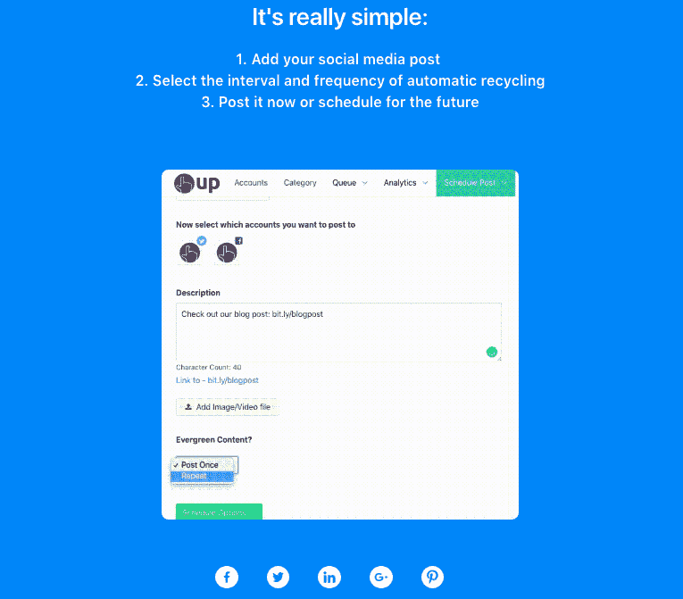
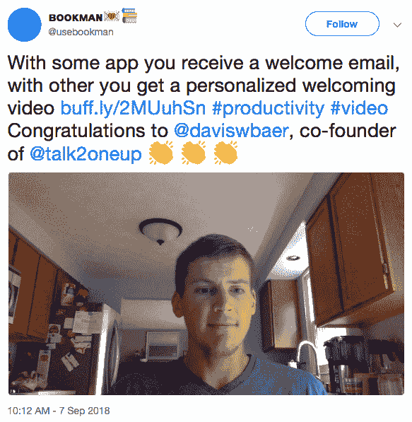

# 辞掉我可怜的日常工作去建立和发展一个有利可图的企业

> 原文：<https://www.indiehackers.com/interview/quitting-my-miserable-day-job-to-build-and-grow-a-profitable-business-973c37b03b>

## 你好！你的背景是什么，你在做什么？

我叫戴维斯·贝尔(Davis Baer)，是 [OneUp](https://www.oneupapp.io/) 的联合创始人，这是一款用于在社交媒体上安排和自动回收你的“常青树内容”的工具。常青内容是受众非常感兴趣的内容，并且没有过期日期，几周、几个月、几年后仍然是相关信息。

如果你想在接下来的五个月里，每月一次在你的脸书页面上分享你公司的最新博客文章，OneUp 让它变得非常容易，并有助于保持你最有价值的内容可见。我们的客户包括初创企业创始人、电子商务店主、小企业主、博客作者、播客、YouTubers 和社交媒体经理。

OneUp 目前每月的经常性收入约为 320 美元。

 

## 是什么促使你开始使用 OneUp？

回到 2012 年，我毕业于宾夕法尼亚州一所名为格罗夫城市学院的小学校，在那里我获得了金融学位。毕业后做过几份公司财务的工作，绝对讨厌。可悲(或者可笑，取决于你怎么看)的是，几乎所有和我一起工作的人都讨厌他们的工作，一周又一周地在痛苦中跋涉，唯一的动力就是周末休假的承诺，或者每年 2-3 周的假期。

几年前，我有机会离开企业金融界，加入了一个大学同学创办的创业公司。我加入公司是为了帮助做市场营销，但我的薪水却比以前低了很多，因为那家公司的创始人只筹集了一小笔朋友和家人的种子资金来启动和运营。

这最终没有成功，因为我们比预计的更快地花完了钱——网站和移动应用程序的开发被外包给了自由职业者，有趣的是，这些开发成本从未真正结束。然而，这个角色给了我很好的经历，让我意识到真正享受工作是可能的。在此之前，我从来没有觉得我的贡献在我工作的大型组织中有什么不同。

开始吧。无论它是成功还是失败，你都会比以往任何时候通过阅读书籍、博客或听播客获得更多的成长。

TweetShare

在花了一点时间做一些自由市场营销和一些无代码的兼职项目后，我加入了 OneUp 的联合创始人 Vishal Kumar。我们创建了 OneUp 来帮助提高 evergreen 内容在社交媒体上的可见性。每当你在社交媒体上分享一些东西，通常只有大约 5%的关注者看到。尽管如此，大多数人投入了大量的时间和精力来创建常青树内容，并且只在他们的社交媒体渠道上分享一次，这保证了他们的大多数追随者永远不会看到那个帖子。OneUp 通过自动驱动流量和对他们努力制作的内容的参与来帮助这些人。

## 构建最初的产品需要什么？

OneUp 始于 2017 年，是 Vishal 的一个兼职项目，他在白天工作的同时，在晚上和周末从事这项工作。他是技术联合创始人，利用几年前在一家社交媒体管理公司实习时获得的领域专业知识，自己创建了一切。从那时起，该产品经历了许多不同的迭代，包括最近的一次重大检修。

 

## 你是如何吸引用户并成长起来的？

Vishal 最初在 Product Hunt 上推出了 OneUp，它在那里做得相当好，吸引了一些首批付费客户。这是一种主要的确认形式，因为除非有人愿意付钱给你，否则你永远不会知道你是否有一个好的产品。不过，我们确实得到了一些竞争对手的认可，比如 MeetEdgar 和 Buffer，他们每年的经常性收入高达数百万美元。

最初的发布提供了与客户交流、解决问题、进行改进以及了解用户正在寻找什么样的功能的机会。几乎我们建造的所有东西都是客户反馈的直接结果。

最近，我们在产品搜索上推出了 OneUp 2.0，并以超过 500 张赞成票获得了当天的第四名。这给了我们一波令人敬畏的流量和注册，许多转化为付费客户。虽然产品搜索的表现提供了很好的社会证明，并可能成为未来流量的一个小来源，但这不是一个长期的成功计划，因为许多产品搜索的人不在我们的目标市场。

我们发现 Quora 是高质量流量的巨大来源。人们有大量的问题要求对不同类型的社交媒体工具进行推荐，所以我们正在努力找到一个接近答案顶部的问题。几乎每个来自 Quora 的人都代表着一个高质量的潜在用户，因为他们都在积极寻找解决问题的方法。

## 有没有发现什么特别有帮助或者有优势的？

是啊！我想利用规模小的优势，正如保罗·格拉厄姆所说，通过在入职体验中给用户带来真正的惊喜来“做不可扩展的事情”。

首先，我试着在每个人注册后给他们发一封私人邮件。那次惨败了。也许是因为我使用的副本，也许是因为我没有足够的个性化，但我从它那里几乎没有得到任何回应。我相信大多数人认为这只是另一封自动邮件。

因此，我开始思考不同的方式，我可以 100%清楚地表明，这是来自联合创始人的个性化信息。我的想法是:我会用 Loom 录制一个简短的个人视频，介绍我自己并指名感谢他们注册，然后通过电子邮件发给每一个新用户。

那也失败了。我发给的每个人都认为这只是一个预先录制的“来自我们创始人的信息”视频，这些视频的点击率接近于零。我了解到，每个人都希望从他们刚刚注册的服务中收到某种电子邮件，如果这些人和我一样，他们通常会立即删除它们。

这就是我利用 OneUp 的不公平优势的地方:大多数注册的人都连接了一个脸书页面，所以我可以通过脸书发送信息，而不是将个人视频发送到他们的电子邮件中。

这造成了巨大的差异！你不能真的伪造或自动化这一点，这导致了这些欢迎视频几乎 100%的回复率。人们通常会对有人花时间为他们录制个人视频消息感到惊讶。

这有三个好处:

1.  它以一个伟大的音符开始了关系，让用户看到公司背后有一个真实的人。

2.  这使得获得反馈更加容易。你已经打开了一个对话渠道，至少建立了一些融洽的关系。我让人们花时间让我知道他们不会使用这项服务，而他们通常会不打招呼就离开。这给了我们找出问题所在的机会，或者他们在寻找我们没有的功能。

3.  一些人对这种个人化的接触感到惊叹，他们在推特上分享了这种接触。以下是我收到的一些回复:

*   “嘿，戴维斯，谢谢你的视频！我可以在 twitter 上分享你的个人信息吗？”
*   “嗨，戴维斯，这是一个伟大的触摸发送您的个性化信息，非常光滑，非常感谢。”
*   “你好，戴维斯，感谢你伸出援手。我喜欢那样！”
*   “谢谢戴维斯！个人视频处理得很好。”
*   “嗨！真是太好了！”

录制每个视频只需要大约 15 秒钟，因此虽然它可能不会永远扩展，但我们没有理由不能至少在不久的将来继续这样做。

这种个性化帮助我们将 Nir Eyal 作为付费客户，他愿意给我们一份非常棒的推荐，我们已经将它添加到了我们的登录页面。对于那些不熟悉的人，Nir 是《Hooked:How to Build Habit-Forming Products》的作者，该书由 Product Hunt 创始人 Ryan Hoover 合著。我已经拥有了他的书，并把它保存在我发给他的个人视频中，这很有帮助。他真的被这种个人风格打动了！

 

## 你的商业模式是什么，你是如何增加收入的？

OneUp 有不同的定价等级，从每月 10 美元到每月 99 美元不等。这些层级基于使用类别，例如您想要连接的帐户数量、您拥有的用户数量以及您安排的帖子数量。

我们目前提供免费试用，但目前选择不提供永久免费层，因为服务所有免费用户需要大量增加支持。我们只是没有足够的人力。

我们计划在不久的将来尝试不同的付费广告渠道，并希望这将带来有利可图的投资回报，这样我们就可以为我们的增长加油了。

我们目前的收入不足以完全支持我们。为了支付租金，Vishal 白天作为一名开发人员工作，但几乎所有的空闲时间都花在 OneUp 上。我很幸运有一个非常支持我的妻子，她有一份体面的工作，这让我可以在 OneUp 上全职工作。

## 你面临的最大挑战和克服的障碍是什么？你未来的目标是什么？

像许多企业家一样，我们犯了早期的错误，构建了我们认为用户想要的功能，却发现没有人真正使用它。现在，我们与用户交谈，了解他们喜欢什么，不喜欢什么，以及他们希望在未来看到什么功能。这有助于我们准确地知道我们应该在路线图上优先考虑什么。

几乎我们建造的所有东西都是客户反馈的直接结果。

TweetShare

与不同的社交网络合作的困难之一是它们的 API 总是在变化，这意味着你必须随时准备适应。这就是 Vishal 的领域专业知识非常有用的地方！

## 对于刚刚起步的独立黑客，你有什么建议？

开始吧。即使是一个小的副业，你也会学到很多关于如何制造东西，也许更重要的是，如何营销你的产品。无论它是成功还是失败，你都会比以往任何时候通过阅读书籍、博客或听播客获得更多的成长。

也就是说，我确实喜欢播客和阅读。说真的，独立黑客播客可能是我最喜欢的播客。科特兰在寻找成功的创始人方面做得很好，这些创始人分享了他们如何发展公司的惊人见解。在听完独立黑客播客后，我总是会受到启发或者有一个“灵光一现”的时刻。

对于任何试图提高搜索引擎优化的人，我强烈推荐布莱恩·迪恩的博客和 YouTube 视频。如果你需要登陆页面帮助，朱利安·夏皮罗的[成长指南](https://www.julian.com/guide/growth/intro)是一个惊人的资源。

## 我们可以去哪里了解更多？

你可以在 [oneupapp.io](https://www.oneupapp.io/) 查看 OneUp，也可以在 Twitter [@daviswbaer](https://twitter.com/daviswbaer) 找到我。

乐意回答评论区的任何问题:)

——[<picture id="ember5203095" class="user-avatar ember-view user-link__avatar"></picture>戴维斯拜尔](/DavisBaer?id=W5HUiHjcI6QDLJqyYyI8cYD4QrV2)，OneUp 联合创始人

## 想像 OneUp 一样建立自己的事业？

你应该加入独立黑客社区！🤗

我们是几千名创始人，互相帮助建立有利可图的业务和副业。来分享你正在做的事情，并从你的同事那里获得反馈。

还没准备好开始使用你的产品吗？没问题。这个社区是一个认识人、学习和实践的好地方。随意[随便浏览](/)！

——[<picture id="ember5203100" class="user-avatar ember-view user-link__avatar"></picture>柯特兰艾伦](/csallen?id=ibTLPyjwVebnZjMGKvz6ztarnuV2)，独立黑客创始人

58votes