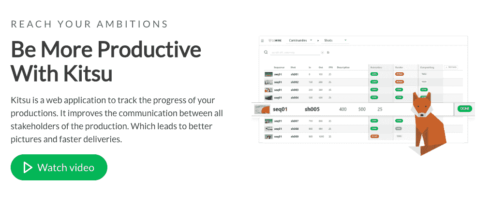
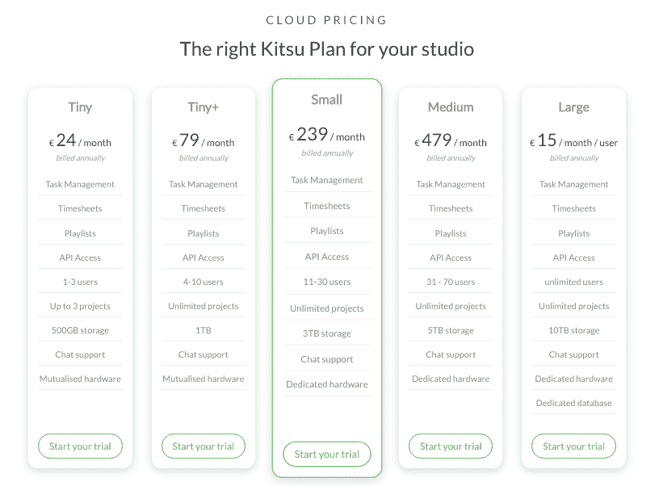
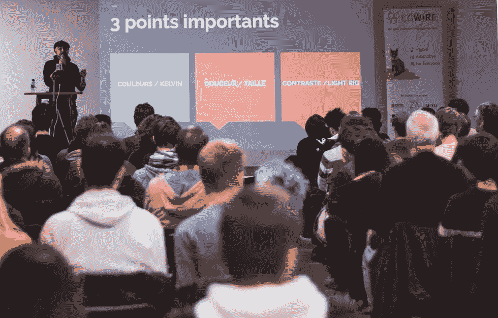

# 离开我的风投支持的创业公司，成为一名独立黑客

> 原文：<https://www.indiehackers.com/interview/quitting-my-vc-backed-startup-to-become-an-indie-hacker-d6b6cea946>

## 你好！你的背景是什么，你在做什么？

你好，独立黑客社区，我是弗兰克·卢梭，今年 37 岁，我建立了做自由和开源软件的公司。

之前我是一名全职软件工程师。后来，作为首席技术官，我联合创办了一家风险投资支持的初创公司，提供开源个人云( [Cozy Cloud](https://cozy.io) )。从那次经历中，我明白自己更适合创业，而不是筹集风投。这也是我选择这个新项目独立黑客方式的原因:CGWire。

CGWire 开发了 Kitsu，一个动画电影行业的项目管理工具。当你创作一部动画作品时，你会在不同的阶段涉及到许多利益相关者。许多创造性的工作需要遵循非常工业化的流程来完成。Kitsu 是一个简单的开源产品跟踪器。它允许您委派任务、报告进度和发送反馈。此外，它还配备了一个强大的审查系统，以验证每一个装运的元素。

今天，20 多个国家的 30 多个工作室和学校使用我们的产品。我们的平均收入为 9000 美元/月，我们有很好的增长前景。

## 是什么促使你开始使用 CGWire Kitsu？

十年前，我在一家名为 HD3D 的公司工作，该公司开发了类似的软件。它得到了法国政府的大量资助。许多工作室和研究实验室都参与其中。听起来不错，但是它有很多缺点。每个决定都需要一致同意，我们在许多不同的主题上工作，合作伙伴可以免费使用软件。这些复杂因素使得事情进展非常缓慢，并且很难建立商业模式。三年后，项目夭折。我很沮丧，因为我们有一个工作产品，我们确定了一个围绕生产跟踪的特殊需求，我们只是不能足够快地做任何事情。

你将会付出很多汗水来实现一个有经验的企业家所做的事情。不要被那些看起来很容易的人愚弄。

TweetShare

几年后，当我不再为之前的公司 Cozy 工作时， [Unit Image](http://www.unit-image.fr/) 工作室的首席执行官莱昂·贝雷尔联系了我。他和我谈到了它的发展问题，并提到他正在寻找开发商。

经过几次讨论，我了解到他遇到了我们在 HD3D 遇到的同样的问题。当前的生产追踪器速度慢，用户体验差。[我在舒适](https://blog.addictedtointer.net/2017/09/26/goodbye-cozy/)的经历中学到了很多，所以我决定给生产跟踪第二次机会，从头再来。

那时候，我没有其他的赚钱方式。莱昂和我讨论了我的项目，我们决定让我每周在他的公司工作 3 天。作为报酬的交换，他让我保留我为他的公司写的代码的所有权。这种安排让我在做项目的时候有一份不错的薪水。

我接触和会见了几十个工作室，谈论生产跟踪。六个月后，我找到了两家工作室，他们准备付钱给我，让我开发一些功能来改进软件。这样，业务需求得到了验证。

## 构建最初的产品需要什么？

一开始，我花了很多时间会见潜在客户，并在 Unit Image 做了一些技术指导。如果你把它算作流程的一部分，从第一天开始，我花了大约 9 到 10 个月的时间让一个产品投入生产。如果你包括我的主机服务，我甚至花了更多的时间:18 个月才有一个主机基础设施和一个在线销售主机服务的网站。

构建一个生产跟踪器比我想象的要复杂得多。工作室有大量的需求，即使在我尽可能地削减了许多功能需求之后。因为它是开源的，我不得不在部署和文档方面做很多工作。

没想到在最初的项目上花了这么多时间。幸运的是，我一直是个多面手，所以我能够编写前端和后端代码。因为我知道产品设计的基础，我的产品与大多数类似的软件相比已经足够好了，甚至比市场上的生产跟踪器还要好。

对于主机基础设施，我得到了我的一个朋友的帮助，他现在仍在和我们一起工作。

法国主机提供商 OVH 也帮了很大的忙，尽管他们的价格很低，而且启动了项目(一年一万台服务器)。我们为每个客户提供一台虚拟机，因此我们的服务器成本很高。

## 你的技术是什么？

对于前端，我使用 Vue.js，我一直在做 SPA，希望有一个简单且文档良好的框架。一切都是现成的，文档也非常棒。它为 Kitsu 做了一件完美的工作。

在后端，我决定应用 [boring technologies](http://boringtechnology.club/) 原理，选择 Flask 作为框架，Postgres 作为数据库。我使用了 Python 框架，因为动画行业几乎专门使用这种语言。所以，作为一个开源项目，用 Python 来做是合乎逻辑的。我们用 Terraform、Ansible 和 Ubuntu 管理我们的主机基础设施。我们将 OVH 公共云用于存储和虚拟机。

我们对所有这些技术都很满意，并且仍然在使用它们。也就是说，我们在用 Flask 处理 WebSockets 时遇到了一些问题。我们可能会在某个时候用另一种技术取代我们的实时事件发布器。

下一个大挑战将是实例同步。我们的许多用户在世界的另一个地方有网站，希望快速访问他们的数据(和数兆字节的视频)。他们中的一些人也希望现场安装。我们已经编写了复制和同步数据的代码，但现在我们必须让它在生产中运行。

## 你是如何吸引用户并发展 CGWire Kitsu 的？

我们的第一批用户是我在做网络时认识的合作伙伴。一开始，我希望我的大部分销售在网上进行，所以我建了一个很酷的网站，做了干净的 Github 库，并在我们的博客上写了内容。这是一个很好的方式来拓宽我的动画领域的知识，并满足技术人员。从那里，我建立了一个在线社区。它让事情变得令人兴奋，并给 CGWire 品牌带来了可信度。

不幸的是，尽管我努力，网上订阅是不存在的。我的第一批客户使用的是他们从 Github 库制作的本地安装。形势并不好。然后，有人推荐我在一个贸易展览会上设立一个摊位(MIFA 市场)。在那里，我遇到了一个对主机订阅感兴趣的客户。他还向另一家工作室推荐了 Kitsu。他们都很小，但他们开创了我想要的订阅模式。几个月后，我早期遇到的一家更大的工作室也购买了订阅。

我慢慢接受了我们最好的收入渠道不是在线营销，而是直销。与此同时，我聘请了一位联合创始人 GWénalle。除了她出色的生产管理技能和企业家精神，她还认识很多业内人士。我们在改进产品包装方面投入了大量精力(教程、文档、更精确的功能等)。

第二年，当我们回到同一个展会时，格温的网络真正发挥了作用，我们连续五天不间断地进行演示。大约在这个时候，我们雇了一个兼职推销员，叫 Jean-Christophe。在那之后，我们与制作更大作品(电视剧和故事片而不是短片)的工作室达成了许多协议。我们在 6 个月内从 10 个顾客增加到 30 个。

我们做的另一件事是组织聚会，这很有帮助。我们注意到会见销售线索的活动发生得不够频繁。因此，我们决定通过每月组织关于最佳实践的聚会来开展我们自己的活动。我们召集了一群活跃的人一起学习。对我们有帮助，对整个行业也有帮助，超级满足。

## 你的商业模式是什么，你是如何增加收入的？

我们的商业模式基于两个收入来源:功能添加和托管服务。就像我之前解释的那样，我们从第一天开始就对我们添加的所有新功能收费，现在仍然是这样。

第二个流来自我们的云托管服务。基本上，我们像任何 SaaS 一样，通过订阅来销售我们的解决方案。大多数工作室不使用信用卡，所以我们主要出售年度订阅，并通过电汇获得报酬。他们中的一些人想要按月订阅，在这种情况下，我们使用 Stripe 向他们收费。

在过去的六个月中，我们从这两个流中平均收取 9000 美元/月的费用。如果我们摊平托管服务的收入，我们的 MRR 是 3500 美元/月。

2019 年，我们改进了产品并改进了产品包装。然后我们雇了一个兼职业务员，让我们更快的获取客户。最近，我们通过“成功包”增加了付费支持，因为我们花了太多时间做主动支持。

如果你和传统公司做 B2B，我建议你提供的每一项服务都要收费。当你不瞄准创客或创业公司时，购买过程要长得多，人们一直在谈判。因此，提出更高的折扣价格比直接给出一个合理的价格更容易销售。不要为提高价格而感到羞愧！随着你的产品和服务越来越好，收取更多的费用是正常的。

## 你未来的目标是什么？

我的目标是建立一个 10 到 30 人的公司，每个人都能很好地平衡工作和生活。梦之队将远程工作，并遵循[软件工艺原则](https://manifesto.softwarecraftsmanship.org/)。理想情况下，我们会获得高利润，因为当你总是追逐每一分钱时，就很难创新。

至于产品，如果它是人们用来运行电视动画工作室的默认工具，那就太好了。我们想确保它与工作室使用的所有其他软件集成。

我们将继续通过活动促进工作室之间的合作，但我们对此没有特定的目标。也就是说，能够举办欧洲最大的 CG 艺术家最佳实践会议将是一项重大成就。

就个人而言，我希望能够采用一种数字游牧生活方式，享受一些小退休，并建立一个稳固的工作生活平衡。过去八年在我的项目上的工作非常美好，但也令人筋疲力尽。

## 你面临的最大挑战和克服的障碍是什么？

我们面临的最大挑战是销售。我是一名工程师，而 GWénalle 是一名经理，所以做网络营销对我们来说还不错，但是做销售真的超出了我们的舒适区。

我们现在做得更好了。我找到了一位导师来帮助我，我们有了新的队友。我们定义了一个透明的流程，并养成了良好的 CRM 习惯。但这仍是我们不断改进的一个领域，尤其是对于大宗交易。

## 如果你必须重新开始，你会做什么不同的事？

如果我不得不重新开始，我会更早地优化销售流程，或者我可能会寻找一种更简单的产品，我可以很容易地适应其他市场。目前，动画市场很小，这使得我们更难增长。从像 Seth Godin 这样的利基市场开始，推荐是很棒的。但如果你太具体，就很难突破到其他领域。

当你总是追逐每一分钱时，很难创新。

TweetShare

我会做的另一件事是更早提高价格，对我的产品更有信心。对价格的友好会阻止你以应有的速度增长。当你带来大量价值的时候缺乏自信是无稽之谈！

## 有没有发现什么特别有帮助或者有优势的？

[书籍帮了我很大的忙](https://blog.addictedtointer.net/books/)，对于这个项目，他们三个特别:

*   *精益运营*给了我一个框架，让我知道从哪里开始。
*   旋转销售给了我复杂销售的基础知识。
*   自我是我的敌人，是你让我从一个管理 20 个人的工作跳到了一个兼职开发人员的低薪职位

一路上，我们遇到了帮助我们的人。他们充当布道者，分享他们的网络。当你投入额外的工作时，比如做开源、分享最佳实践和培养一个社区，人们会欣赏这一点，他们会给予更多的帮助。

最后，我们加入了一个名为 Creatis 的孵化器。一开始，我持怀疑态度，但他们满足了我们的要求:销售和创业指导、法律咨询和一些额外津贴(比如一个举办聚会的地方)。他们不采取股权，他们只收取我们每个月，并没有问我们太多的时间。我们的导师 Madjid Yahiaoui 也是一位非常好的教练。

最后但同样重要的是，我们获得了一些资金:巴黎银行同意向我们提供 4.5 万€的贷款，这让我的联合创始人得以招聘。我们从法国 CNC 那里获得了 30k€的子公司来投资我们的基础设施。不是真正的“经典”独立黑客的方式，但它仍然是钱。

## 对于刚刚起步的独立黑客，你有什么建议？

有太多的事情要说...

据我观察，除了电子商务，自举 B2B 公司比 B2C 公司更容易。如果你选择 B2B，创业公司和制造商是更好的目标，因为他们总是在寻找最好的软件并快速做出决定。

另一件重要的事情是每周都有进步。如果你经常有新的东西要说，这会让你讲故事更容易。你的客户、你的队友和你的家人会因为你的项目而更加兴奋。最后，你会一直感到有动力，这会增加你成功的机会。

从第一天开始寻找赚钱的机会。公司是一个金钱进出的系统。如果你的钱不是来自客户，在某个时候你的系统就会崩溃。资助是会上瘾的，不带来任何价值也能生存很久。大多数项目都失败了，所以如果你除了投资之外没有做太多赚钱的事情，你所有的努力可能都是白费。

我看到的常见错误是人们低估了软件的难度。构建软件是困难的，需要大量的奉献。意味着你不能追逐太多的想法，或者仅仅因为某项技术很酷就使用它(比如 ML、区块链、AR 等)。你必须致力于一个问题，理解它的背景，并迭代一个解决方案。这是一个永无止境的过程。

而且，说实话，大部分独立黑客一开始业务能力都很差。你会付出很多汗水来实现一个有经验的企业家所做的事情。不要被那些看起来很容易的人愚弄。他们可能处于更好的生态系统中，有更好的初始培训或资金，或者只是更好的网络。

你将不得不在每个领域学习很多东西；书籍、博客和社区是你最好的朋友。自己学习，向你的同伴问很多问题。如果我今天从零开始，我会从《再作品*》(这是每个创业者的必读)这本书开始，从一开始就涉足独立黑客社区。*

 *## 我们可以去哪里了解更多？

我们有一个网站，并出现在许多社交媒体平台上。如果你住在法国，来参加我们的聚会，我们很乐意与你分享啤酒！

*   [网站](https://cg-wire.com)
*   [博客](https://medium.com/@cgwirenews)
*   [推特](https://twitter.com/cgwirenews)
*   [我们的聚会](https://www.meetup.com/Infrastructure-et-film-danimation/)

有时，我会在我的个人博客上写一些有好建议的文章。

欢迎在下面的评论区提出任何问题，我很乐意给你更多的细节！

——[<picture id="ember8080130" class="user-avatar ember-view user-link__avatar"></picture>弗兰克·卢梭](/Frank_Rousseau?id=v6kERrEbTRT2u8yGYrFULo2BCNH3)，CGWire Kitsu 创始人

## 想像 CGWire Kitsu 一样建立自己的事业？

你应该加入独立黑客社区！🤗

我们是几千名创始人，互相帮助建立有利可图的业务和副业。来分享你正在做的事情，并从你的同事那里获得反馈。

还没准备好开始使用你的产品吗？没问题。这个社区是一个认识人、学习和实践的好地方。随意[随便浏览](/)！

——[<picture id="ember8080135" class="user-avatar ember-view user-link__avatar"></picture>柯特兰艾伦](/csallen?id=ibTLPyjwVebnZjMGKvz6ztarnuV2)，独立黑客创始人

28votes*