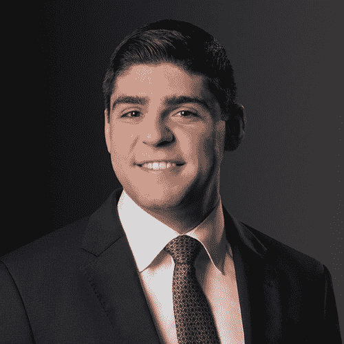
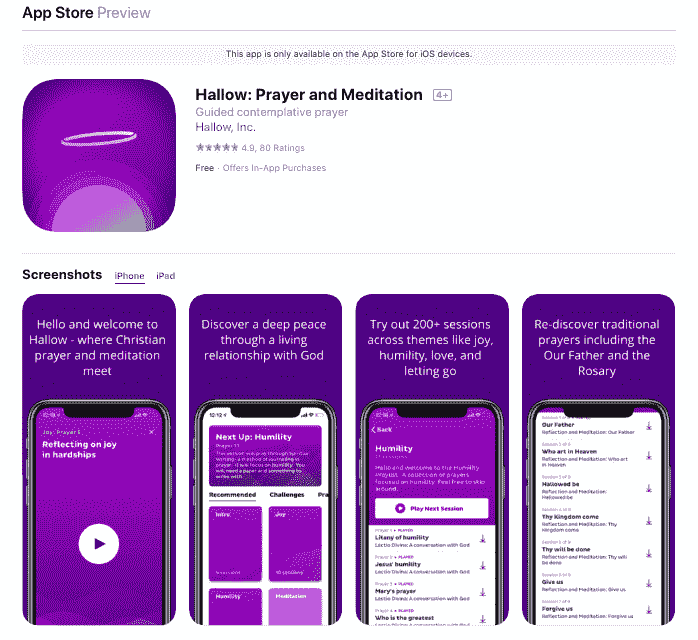
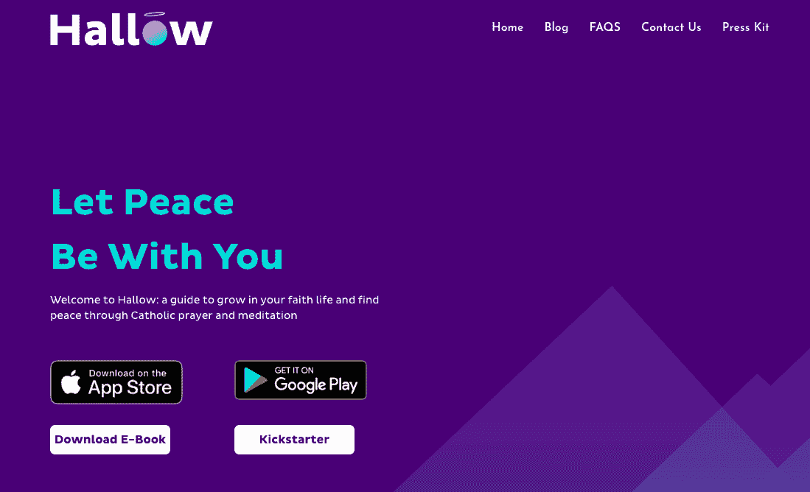
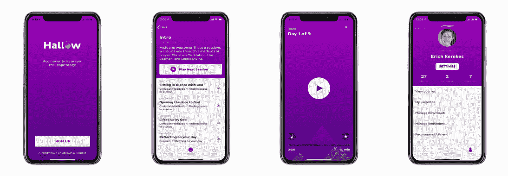
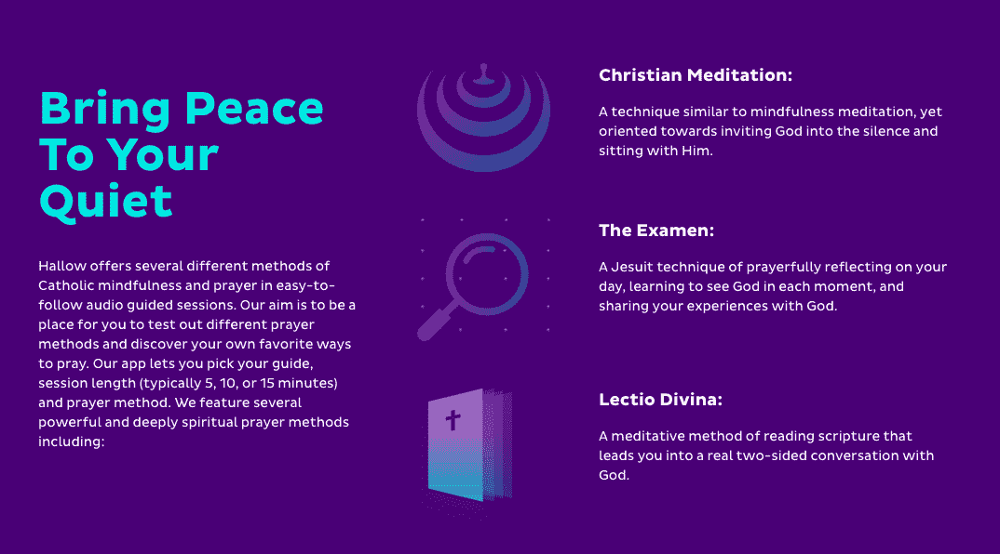

# 辞掉工作去追随我们的召唤

> 原文：<https://www.indiehackers.com/interview/quitting-our-jobs-to-follow-our-callings-d5a3ed60d6>

## [ 钱宁](https://twitter.com/channingallen)感谢做联合采访！告诉我们你的背景和你在万圣节做什么。

[ Alessandro DiSanto, Head of Finance at Hallow](https://www.linkedin.com/in/alessandro-disanto-3a92906a) 

我的名字是 Alessandro DiSanto，我最近刚刚辞去了我梦寐以求的金融工作，试图通过推出一款音频引导冥想祈祷应用程序 [Hallow](https://www.hallow.app/) 来帮助世界各地的人们改善他们的信仰生活。不用说，有不少同事怀疑我是不是疯了。

我出生在宾夕法尼亚州的哈里斯堡，在一个信奉天主教的意大利裔美国人的大家庭中长大。我的信仰一直是我生活中的一大部分，但我绝不会称自己为福音传道者。从圣母大学毕业后，我立即在纽约市的一家大型投资银行找到了一份工作，两年后，我搬到了芝加哥，成为了一名私募股权投资者，负责收购和发展科技企业。这是我梦寐以求的工作，回报令人难以置信，但它很快开始主宰我生活的方方面面。在 100 小时工作周结束时，我环顾四周，意识到我与家人、朋友、信仰甚至健康的关系都在迅速恶化。

这就是万圣节的由来。在过去的几年里，在我最好的朋友亚历克斯·琼斯的推荐下，我尝试了一些流行的冥想应用程序，虽然我发现它们对我在一天中创造一个宁静的时刻很有帮助，但这种体验似乎应该是宗教之旅的第一步。因此，当亚历克斯去年再次打电话给我，提出通过将现代的数字用户体验与教会 2000 年的冥想和沉思祈祷实践相结合，帮助人们学习如何祈祷的想法时，我立即知道这是我喜欢在自己的生活中使用的东西。

没过多久，我就意识到，有许多像我们一样的人渴望一种方法，将正念这个流行的主题带入他们的信仰生活。八个月和两次测试后，我们建立并推出了 Hallow，这是一个手机应用程序，提供基督教传统的音频引导冥想祈祷会议。在不到一个月的时间里，我们在苹果应用商店获得了超过 4k 的下载量和 4.8 星的评级。

 [ Erich Kerekes, Co-Founder of Hallow](https://www.linkedin.com/in/erichkerekes) 

我的名字叫埃里希·克里克斯，我在伊利诺伊州芝加哥郊外的巴林顿长大。我去了圣母大学，获得了计算机科学和工程学位。然而，我没有在毕业后从事软件工程，而是在麦肯锡的管理咨询部门度过了最后三年。这三年中的最后一年是在湾区，由麦肯锡(McKinsey)提供燃料，我在那里为高增长的科技公司提供上市和增长战略服务。

也许比我的职业背景更相关的是我的信仰背景。我出生并成长在天主教家庭，但是在我的信仰生活和我与上帝的关系中有起有落。在发现了我们以前不知道的强大的冥想和冥想祈祷技巧后，我们决定建造 [Hallow](https://www.hallow.app/) 让世界更容易接触到它们。

Hallow 位于流行的正念趋势和基督教信仰的交汇点。它提供不同冥想祈祷技巧的音频指导会议，以帮助用户探索与上帝联系的新途径，并在他们的信仰生活中成长。我于 2018 年 7 月全职加入 Hallow，担任联合创始人兼销售和营销主管。

 

## [ 钱宁 ](https://twitter.com/channingallen) 是什么激励你入门《圣器》？

[ Erich Kerekes, Co-Founder of Hallow](https://www.linkedin.com/in/erichkerekes) 

我们创始团队中的每个人都是 Hallow 的目标市场。我们是年轻的成年人，生活在充满压力的环境中，有基督教背景，但在我们与上帝的个人关系上有些局限。更具体地说，我的祷告生活大多是片面的，相对重复的。我会告诉上帝我的一天，为一些事情感谢他，为一些事情道歉，并要求一些事情，但很少花时间与他一起沉默或倾听。在同一时间点，除了这些，我唯一练习的真正的祈祷是我已经记住的——我们的父亲，万福玛利亚，等等。虽然这些本身就非常强大，但它不允许建立关系所需的双向对话。

最后一个关键因素是，在工作世界所有的疯狂和无情的喧嚣中，我们都在寻找一种找到平静的方式。我们的联合创始人亚历克斯通过一个流行的正念应用程序转向冥想。我自己转向自然和徒步旅行，在寂静中寻找平静。在我们团队的每个案例中，我们的方法都是有效的，但并不完全令人满意，感觉它们缺乏灵性，与我们的基督教信仰脱节。

每天花些时间弄清楚你感觉生活在召唤你做什么。

TweetShare

随之而来的自然问题是“在基督教信仰中存在着什么样的沉思、反思和平静的做法，可以带来类似的和平，但以一种与上帝相连的方式？”经过几个月的研究，与朋友、家人、教授、宗教兄弟姐妹、牧师交谈，并阅读了许多书籍，很明显，在这个十字路口有许多经过考验的真正的祈祷方法。在了解它们之后，我们将它们应用到我们个人的祷告生活中，发现它们非常有效。接下来的问题是:“我们怎样才能把这些祈祷技巧以一种容易理解的、直观的、方便的方式传播到世界上？”没过多久，一个移动应用解决方案胜出，Hallow 诞生了。

当时，我们的创始团队在多个领域任职——我们中有两人在管理咨询公司(麦肯锡)，一人在私募股权公司(GTCR)，一人在一家基于信仰的公司(动态天主教)。关于我们是如何决定离开这些工作去 Hallow 的，我只能指出一点:祈祷。我知道独立黑客和其他创业网站上的文章很可能充满了更具分析性、更具逻辑驱动力的论点，但如果我说祈祷以外的任何东西是我们辞职并全职献身于 Hallow 的决策过程中的驱动因素，那我是在撒谎。我们清楚地感受到召唤。

## [ 钱宁](https://twitter.com/channingallen)什么东西成了建筑最初的产品？

[ Erich Kerekes, Co-Founder of Hallow](https://www.linkedin.com/in/erichkerekes) 

从这个想法的第一个概念到第一个测试版的发布，MVP 花了大约四个月的时间。又过了四个月，我们才在同一天同时在 App Store 和 Play Store 上线。我们的联合创始人亚历克斯(Alex)在 Swift 参加了一个为期两周的速成班，并与一个朋友合作，在原生 iOS 中编写了该应用的第一个版本，而第三个朋友则尝试了第一个 UI 设计。

几个月后，业务的其他部分(例如，编写内容、录制、营销、合作伙伴)开始占据大部分时间，我们认为最好将开发外包出去。应用程序的开发、品牌和设计是我们最大的支出(每项不到 5 万美元)。我们从一开始就知道，每天有超过 4000 个新应用出现，移动应用领域极难进入，保护起来更是难上加难。几乎你做的任何东西都可能在任何时候被复制。因此，品牌是市场上最大的竞争优势之一，而设计是其中的关键部分。我们知道我们想对宗教采取不同的方式。我们不想说教，也不想守旧派。我们想成为一家酷的、现代的硅谷科技公司，用轻松的方式与上帝交流。

开发过程中最大的问题是，作为一个 MVP，我们需要哪些功能，以及如何对我们希望包含在应用程序中的功能进行优先排序。对此，我们收到的最有价值的建议是需要定义一个“北极星度量”。你的公司试图从整体上实现的一个指标是什么——一个与整体使命最密切相关的指标？经过几次交谈后，我们决定将北极星指标定为每周祈祷完成(WPC)。可以通过两种方式直观地增加 WPC:(1)增加祈祷者人数，(2)增加每人祈祷次数。在定义了这个度量标准之后，我们可以对任何给定的特性对 WPC 的影响进行粗略的估计，这将决定特性的优先顺序。例如，实现为祈祷设置提醒的功能可能会显著影响祈祷的次数，而在线提交支付相对于在 App Store 中提交支付可能影响较小，因此会在列表中被优先排序较低。

对我们来说幸运的是，与任何拥有实体产品/原型的初创公司相比，这两项最大的支出仍然相对微不足道，因此资金不是一个大的障碍。除了创始团队捐款，我们还运营了 Kickstarter，筹集了 2.5 万美元(目标是 2 万美元)，并通过朋友和家人的一轮融资筹集了一些资金。

除了技术方面，产品本身的最大部分是在音频指导会议。我们尝试了 10-12 种不同的声音作为应用程序的选项，并选择了两种听起来最舒缓和真实的声音。因为这两个人也是创始团队的一部分，而不是承包商，我们分配股权，不为录音本身支付现金。

 

## [ 钱宁 ](https://twitter.com/channingallen) 你们是如何吸引用户并成长为 Hallow 的？

[ Erich Kerekes, Co-Founder of Hallow](https://www.linkedin.com/in/erichkerekes) 

我认为获取客户的方式分为三大类:(1)人们经历了你解决的问题，认识到这是一个问题，甚至在听到你的产品之前就积极寻求解决方案；(2)正在经历你解决的问题，但尚未承认它是一个问题或寻找解决方案的人；(3)从你的产品中获益的人，但是还没有接触到你正在解决的问题。

为了更具体，我将在 Hallow 的上下文中重新定义它们。对我们来说，(1)是那些已经是基督徒的人，他们在冥想，并且已经在他们的信仰中寻找冥想的方法，或者已经实践了一种基督教冥想的形式，只是在寻找一种更方便的方法来这样做。(2)在某种程度上正在为他们的祈祷生活而奋斗，但还没有向自己承认他们觉得较少参与祈祷的天主教徒，以及(3)可能是一些群体，包括“精神但不宗教”的人，他们可能从进一步探索他们的信仰中受益，或者可能是一个更专注于圣礼但尚未发展或试图发展与上帝的个人关系的宗教人士。

基于这些定义，很容易看出，组(1)将是最容易和最便宜的获取组。他们会偶然发现我们的网站，因为他们已经在谷歌上搜索诸如“作为一个天主教徒如何冥想”之类的东西正是在第 1 组中，我们进行了 beta 测试，并进行了首次发布。联系这个群体就是联系我们的朋友和家人，建立一个登陆页面/搜索引擎优化，并找到这些客户。

确定这些客户类型后，我们必须想办法接触他们。我们作为一个团队坐下来，确定了 10 种方式:

1.  **人脉**:最明显的一个，每个人都从哪里开始。我们有八个人在 Hallow 上工作(算上兼职人员)，我们每个人都通过社交媒体(尤其是 LinkedIn)联系我们的网络，我们很容易就联系到了超过 10，000 人。
2.  Kickstarter :虽然其中一部分当然是为了筹集资金，但这也是在发布前建立兴趣列表并帮助我们宣传的一种令人惊叹的方式。很自然地，我把这个贴在了我们的个人社交媒体账户上，并要求朋友和家人也这样做。
3.  **内容营销**:我们写了[博客](https://www.hallow.app/blog)关于我们个人的信仰生活和我们认为对我们的用户会有帮助的建议。
4.  **大使**:因为我们的公司是使命驱动的，我们有一些人有兴趣帮助我们成功，仅仅因为他们相信传播上帝的话。因此，我们为他们创造了一种方式，让他们以大使的身份正式参与，帮助建立当地的祷告团体，或者为他们的校园/雇主带来荣耀。
5.  **亲临活动**:因为我们是基督教 app，已经有那么多活动把我们的目标受众组织在一起。在发布的第一个月内，我们每周都去参加一个新的基督教/天主教会议或聚会，以建立形象并与潜在客户交谈。
6.  伙伴关系:很难夸大伙伴关系的重要性。发布后，我们立即开始接触教区、天主教会议和其他有组织的宗教活动。任何把你的目标市场聚集在一起的地方都是一个好地方。
7.  **媒体**:我们立即在我们的网站上建立了一个[新闻资料袋](https://www.hallow.app/press-kit)，以确保来自媒体的任何人都可以获得他们撰写文章所需的一切(参考其他文章、关于团队的事实、高质量的产品照片、常见问题等)。).然后，我们找到了写过类似文章的记者(就我们而言，是任何与基督教或正念相关的文章)，并追踪他们的电子邮件地址或 LinkedIn 页面，通过个人信息与他们联系。
8.  社交媒体:很明显的一部分是在脸书、Instagram、Twitter、YouTube 等网站上为 Hallow 创建我们自己的页面。此外，我们在脸书和 Reddit 上找到了已经存在的最相关的群体，并在那里获得了兴趣。
9.  **影响者**:与媒体推广相关，这是联系那些在你的空间里已经有一些信用和体面的追随者的人。你不太可能获得大人物的兴趣，但是从拥有 1-10K 追随者的人开始可以是一个很好的开始。我们发现，在 Instagram 上直接发消息的人最成功，他们的粉丝达到了那个水平。
10.  **付费营销**:我把这一条放在最后，因为除了在 Kickstarter 期间的一次短暂测试，我们都打算避免付费营销，直到我们对产品进行了重大迭代，并建立了强大的用户基础。但毫无疑问，它属于这个列表，并且是区分我上面列出的客户类型的好方法。可以肯定的是，我们针对第(1)组和第(3)组客户的广告截然不同。

## [ 钱宁 ](https://twitter.com/channingallen) 你的商业模式是什么，你的收入是如何增长的？

[ Alessandro DiSanto, Head of Finance at Hallow](https://www.linkedin.com/in/alessandro-disanto-3a92906a) 

在早期，我们作为创始团队进行了一次重要的讨论，内容是我们是否应该建立一个非营利组织，寻求资助，并提供完全免费的 Hallow 服务，或者我们是否应该建立一个商业上可行的，以盈利为目的的商业模式。

我们选择后者有一个主要原因。作为一个组织，我们的目标是将祈祷带给尽可能多的人，通过帮助他们发展与上帝的关系，努力帮助他们从根本上改善生活。我们相信，实现这一使命的最佳方式是打造一流的产品，提供人们愿意为之付费的体验，让我们实现盈利增长并对产品进行再投资。归根结底，我们的收入模式是我们尽可能创造最好应用的动力，并避免成为另一个在 Windows '98 时代设计的基于信仰的免费应用。

对自己不知道的事情要坦诚，承担责任，想清楚。

TweetShare

在我们决定不提供完全免费的应用程序后不久，我们就采用了免费增值模式。在我们的第一次 beta 测试中，我们很早就听说，在无法测试内容质量的情况下，预先付费下载提供原创内容的应用程序(而不是像网飞这样的第三方内容分销商，或者至少是网飞/百视达的原创内容)会受到很大的质疑。我们发现，鉴于内容的信仰性质，这种情绪特别强烈，因为有许多免费的祈祷应用程序整合了基督教信仰中存在的绝大多数死记硬背的祈祷。

我们的免费内容包括为期九天的入门挑战，向用户展示三种最受欢迎的冥想祈祷形式(基督教冥想、Exman 和 Lectio Divina)，加上使用这些技术的日常祈祷，以及念珠。我们的优质内容库以“祈祷者”为中心，专注于不同的情感和生活主题(例如，爱、谦逊、做决定、放手)和挑战，探索流行祈祷和基督教信仰元素背后的深层神学(例如，我们的父亲、降临节、大斋节)。

我们将高级订阅的价格定为每月 8.99 美元，每年 59.99 美元，终身订阅为 199.99 美元(最受欢迎的世俗冥想应用程序有 20-30%的折扣)。为了吸引用户订阅高级服务，我们目前提供所有内容的 30 天无风险试用，然后才收取任何费用。目前所有的支付都是通过 App Store 和谷歌 Play 商店直接进行的。

 

## [ 钱宁](https://twitter.com/channingallen)你未来的目标是什么？

[ Alessandro DiSanto, Head of Finance at Hallow](https://www.linkedin.com/in/alessandro-disanto-3a92906a) 

我们的目标是将 Hallow 打造成为全球 20 亿基督徒通过祈祷与上帝建立关系的主要工具。带着这个目标，我们有一个漫长而令人兴奋的产品功能、祈祷内容和其他工具的管道，这将使我们能够执行我们的愿景。

首先，我们专注于继续扩展我们的内容库，为我们的用户提供一个引导性的资源，让他们在生活中的每一次经历中都能祈祷。从创建额外的以日常通勤、跑步或处理成瘾为中心的实用列表，到将我们的挑战图书馆扩展到其他神学主题，包括圣礼、福音和圣徒的生活，我们有自己的工作要做。

我们还专注于提供强大、现代和直观的用户体验。我们的长期目标还包括为我们的用户开发社交功能，以帮助建立社区和祈祷习惯。

## [ 钱宁 ](https://twitter.com/channingallen) 你所面临的最大挑战和克服的障碍是什么？如果你必须重新开始，你会做什么不同的事？

[ Alessandro DiSanto, Head of Finance at Hallow](https://www.linkedin.com/in/alessandro-disanto-3a92906a) 

随着 2018 年底的临近，我们知道我们希望在 12 月初推出，以利用假期期间的宗教情绪。但是从开发的角度来看，我们也受到资源的限制，每一个小时都需要启动，所以我们不打算在上线之前构建我们想要的所有网络功能。我们优先考虑上线，并在以后找出任何小故障，而不是可能错过圣诞节消费期，以确保一切正常。

我们最终忽略的主要工作流程是支付接受，特别是苹果在 App Store 中的使用条款。我们在发布时的主要促销策略是通过促销代码向基于信仰的组织提供折扣，以帮助传播口碑，我们已经成功地在许多教堂的公告中谈判了印刷广告。然后，在发布后的第二天，在苹果对我们的应用程序进行第六次审查时，他们通知我们，使用促销代码进行折扣定价明显违反了他们的使用条款，这可能会让成千上万的用户期待我们不再能够提供的折扣。

幸运的是，我们没有很多用户写信来寻求支持，即使有，大多数也理解我们的故事，但我们还是让我们的用户失望了。这是我们最不希望发生的事情，尤其是在发布的时候。

尽管苹果在发布之前已经五次批准了这款应用的促销代码功能，但我们本可以更仔细地看看使用条款。这个故事的寓意是，当一个团队快速前进时，大的风险很容易被忽略。当谈到权衡自己设定的最后期限和反复检查你是否错过了重要的事情时，多花几天时间来确认一下可能是值得的。

[ Erich Kerekes, Co-Founder of Hallow](https://www.linkedin.com/in/erichkerekes) 

早期，我们出于渴望，招聘得太快了。花点时间招聘，在聘用他们之前，尽可能地了解这个职位。你雇佣的第一批承包商很可能是为了执行你所知甚少的技能。对于一个在某个领域只有肤浅知识的人来说，听起来像是某个领域的“专家”是非常容易的。如果你没有尽职调查，你很可能很早就做出了糟糕的招聘决定，这不仅是浪费时间和金钱，还会让你在最重要的几个月的增长中受挫。花点时间去了解一些你要招聘的主题，一旦你记下了这些，在雇佣某人之前，一定要询问推荐人。我的经验之谈是，现在要确保你能得到至少三份推荐信，这些推荐信不只是说“是的，他们工作做得很好，我没有任何抱怨”，而是更像是“没有这个人，我们的组织/部门就不会有今天”，或者“他们一贯超越任何期望。”

## [ 钱宁 ](https://twitter.com/channingallen) 你有没有发现什么特别有帮助或者有利的事情？

[ Erich Kerekes, Co-Founder of Hallow](https://www.linkedin.com/in/erichkerekes) 

读了很多。尤其是在创业中，你必须戴很多帽子，这意味着你会戴上一些你从未戴过的帽子。幸运的是，在你之前的其他人也戴过类似的帽子，也写过相关的书。

关于书籍和资源，我确实发现一些经典的顶级创业书籍是有帮助的。其中最重要的是本·霍洛维茨的《关于困难的困难的事情》和安迪·格罗夫的《T2 的高产出管理》。这可能是显而易见的，但你永远不能对你所涉及的特定行业读太多。对我们来说，这意味着大量阅读关于祈祷技巧和基督教的书籍。几乎是 C.S. Lewis 的所有主要著作(我最喜欢的可能是《纯粹的基督教》、《大离婚》、《螺旋带书信》和《痛苦的问题》),还有像阿维拉的圣特蕾莎的《内部城堡》和圣十字若望的《攀登卡梅尔山》这样的书

对我们有巨大帮助的最大因素之一(当然，这完全不受我们的控制)是正念的趋势。对这个领域的兴趣绝对激增，顶空和镇静各有数千万用户，心理健康宣传正在兴起，甚至将冥想作为医学治疗的处方形式。此外，就在上周，Calm 实际上成为了第一家正念独角兽，它筹集了 8800 万美元的 B 轮融资，使正念作为一个类别受到了更多的关注。

 [ Alessandro DiSanto, Head of Finance at Hallow](https://www.linkedin.com/in/alessandro-disanto-3a92906a) 

无论你的背景如何，走出去与人交往的价值都不会被夸大。对于那些马拉松式开发杀手级解决方案的程序员来说，有一些话要说，但是我不相信不离开你的公寓就能建立一个真正伟大的企业。

对我们来说，由于我们来自不同的专业背景，接触从牧师到主教、风投到博士的思想领袖，并在我们能找到的每一个与信仰相关的会议上奔走呼号，绝对是至关重要的。这是我们如何找到我们的主要顾问，这是我们如何得到我们的第一个主要合作伙伴的介绍，这是我们如何微调我们的祈祷内容。

对我们来说，没有因为害怕伤害我们的友谊而隐瞒任何事情，并且通过承认我们的每一个偏见而做到 100%透明，这使我们能够在转变过程中真正最小化个人摩擦。这并不容易，但是坐在负面情绪上对任何人都没有帮助，而且通常会伤害到所有相关的人。

TweetShare

一般来说，每个人都喜欢认为自己是专家，尽管我们都非常忙，但在你表现出想要有所作为的真诚愿望后，寻求别人的建议很少会被拒绝。永远不要在没有要求介绍给另一个可能对你的想法感兴趣的人之前就离开谈话。在一个关键的社交网络的中心，你很快就能找到一个能在你的人生轨迹中大幅提升的人。

最后，从技能的角度来看，搞清楚沟通对我们创始团队来说是绝对关键的。团队成员生活在美国的五个城市，每个人都有非常不同的专业背景，弄清实际的沟通过程也很重要(对 Slack 大喊，因为它是一个很棒的工具)，但因为我们都是很好的大学朋友，所以有效地弄清层级和角色隔离是成败的关键。不可避免的是，关键的反馈需要在任何团队中传达，需要对个人的工作方式进行调整，但是当传达信息的人在你的婚礼上时，传达这种信息会造成额外的紧张。对我们来说，没有因为害怕伤害我们的友谊而隐瞒任何事情，并且通过承认我们的每一个偏见而做到 100%透明，这使我们能够在转变过程中真正最小化个人摩擦。这并不容易，但是坐在负面情绪上对任何人都没有帮助，而且通常会伤害到所有相关的人。

## [ 钱宁 ](https://twitter.com/channingallen) 你对刚刚起步的独立黑客有什么建议？

[ Erich Kerekes, Co-Founder of Hallow](https://www.linkedin.com/in/erichkerekes) 

在阅读了无数书籍并与许多企业家、风投和教授交谈后，最重要的是三条建议:

1.  专注于产品，直到你有一个明显的竞争优势，你知道客户愿意支付。
2.  尽可能长时间避免付费广告。首先关注产品和 LTV，只有当你有有利的 LTV/CAC 比率时，才在付费广告上大量投资。
3.  最初几个月甚至几年没有极高的增长是可以的(事实上，这通常是有利的)。极高的增长不仅会带来许多难以应对的挑战，还会导致低效的解决方案(你只会追求最快的方案)，并对投资者的未来抱有不切实际的期望。最后，试图尽可能快地增长可能会导致你仓促达成糟糕的交易，或者通过抓住终生价值/留存率较低的客户来实现增长。我可以继续说很长时间，为什么在最初的一两年里，不管客户和收入开始滚滚而来时感觉有多好，都不要踩油门。

[ Alessandro DiSanto, Head of Finance at Hallow](https://www.linkedin.com/in/alessandro-disanto-3a92906a) 

提前计划你的日子和星期。从你的第一天开始，到你卖出最后一份股票的那一天，你能做的事情会比你能做的事情多得多。分清主次是一项关键技能，我发现只有当我写下事情时，我才能做好。每天晚上，列出你第二天需要完成的关键事情，包括一件如果没有其他事情完成，这一天仍然会很有成效的事情。另外，留一些弹性时间。事情总是会出现，需要处理，你应该有灵活的时间，不要让这些事情影响你的关键优先事项。

这听起来很蠢，但只要谷歌一下就知道了。那要么成为专家，要么找一个。你很可能戴的帽子比你的手指还多。你需要对你从未听说过的事情负责。无论是它的销售和使用税法，苹果 App Store 的使用条款的小字，还是最好的游击营销手法，你不搞清楚，别人也搞不清楚，过一段时间就成问题了。对自己不知道的事情要坦诚，承担责任，想清楚。你会惊讶在谷歌上五分钟可以回答多少问题。

睡觉。不管是六个小时还是八个小时，找到你需要的量，真正保持精神饱满，不要妥协。建立一个企业需要不断创造性地思考和横向跨越工作流程的能力。当你睡眠不足时，生理上不可能处于最佳状态。总有一些时候你需要一周 100 小时的冲刺，但这不应该是你的现状(药物不是一个可行的长期替代方案)。

祈祷吧。不仅仅是因为我们有你可以下载的完美冥想祈祷应用程序，而是因为它是值得的。不管上帝对你来说是什么，也不管他是谁，每天花些时间来弄清楚你感觉你在生活中被召唤做什么。我保证这是值得的。

## [ 钱宁](https://twitter.com/channingallen)哪里可以去了解更多？

[ Erich Kerekes, Co-Founder of Hallow](https://www.linkedin.com/in/erichkerekes) 

首先，请随意下载 Hallow 来了解更多关于产品本身的信息——我们在[应用商店](https://itunes.apple.com/us/app/hallow-prayer-and-meditation/id1405323394?mt=8)和[谷歌 Play 商店](https://play.google.com/store/apps/details?id=app.hallow.android)都有售。我们现在正在促销，如果你在 2019 年 3 月 6 日之前下载，你将获得**3 个月的免费试用**！否则，请随意点击以下任何链接，了解更多信息:

*   网址: [www.hallow.app](https://www.hallow.app/)
*   博客:[https://www.hallow.app/blog](https://www.hallow.app/blog)
*   https://www.facebook.com/HallowPrayer/
*   推特:[https://twitter.com/HallowApp](https://twitter.com/HallowApp)
*   领英:【https://www.linkedin.com/company/hallowapp/ 
*   YouTube:[https://www.youtube.com/channel/UCE-zo9x 3 fqts 9 k1 hpjlq 3 a/playlists](https://www.youtube.com/channel/UCE--zo9X3FqtS9k1HpJLQ3A/playlists)

当然，请随时在下面的评论中向我们提出任何问题，我们会很乐意回答！

——[<picture id="ember5266491" class="user-avatar ember-view user-link__avatar"></picture>埃里克](/ekerekes?id=nieIvIH4vRUooKeDcomfHNWqRG93)销售负责人&圣器营销:祈祷与冥想

## 想像《圣器:祈祷与冥想》一样建立自己的事业吗？

你应该加入[独立黑客社区](/)！🤗

我们是几千名创始人，互相帮助建立有利可图的业务和副业。来分享你正在做的事情，并从你的同事那里获得反馈。

还没准备好开始使用你的产品吗？没问题。这个社区是一个认识人、学习和实践的好地方。随意[随便浏览](/)！

——[<picture id="ember5266496" class="user-avatar ember-view user-link__avatar"></picture>考特兰艾伦](/csallen?id=ibTLPyjwVebnZjMGKvz6ztarnuV2)，独立黑客创始人

17votes