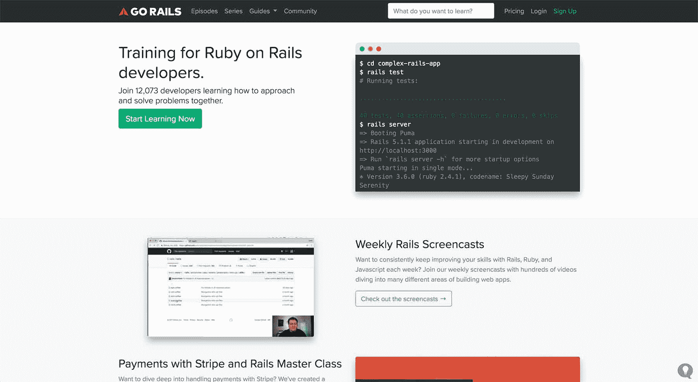
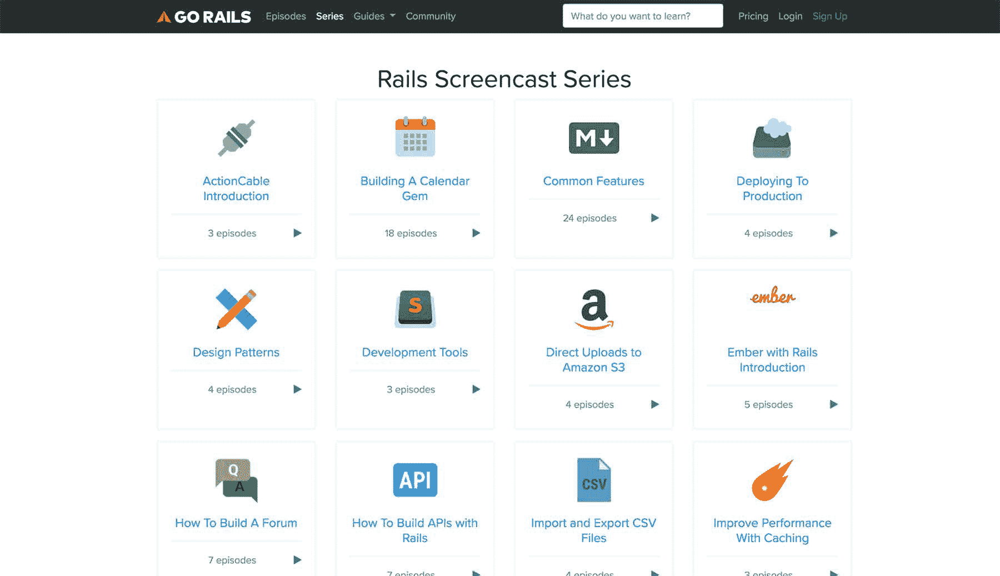
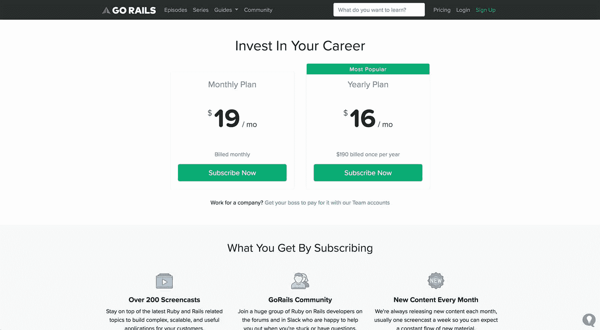

# Rails 和收入:如何建立一个电影放映业务

> 原文：<https://www.indiehackers.com/interview/rails-and-revenue-how-to-build-a-screencast-business-8999c7ac7f>

## 你好！你的背景是什么，你在做什么？

我叫克里斯·奥利弗，是密苏里州圣路易斯的一名软件开发人员。四年来，我一直在为一个面向 Ruby on Rails 开发人员的教育网站 [GoRails](https://gorails.com/) 工作。

如今，GoRails 的月收入约为 15，000 美元。

 

## 是什么促使你开始使用 GoRails？

在 2014 年之前，我是许多企业和初创公司的 Ruby on Rails 顾问。我已经厌倦了用我的时间来换取金钱，决定用一个领域(【gorails.com】[)来记录我的 Rails 实践，并把它变成一个产品。](https://gorails.com/)

最初，我记录了如何在 Mac 上安装 Rails，以及如何在 GoRails.com 的 Ubuntu 上部署 Rails。这些只是我自己的笔记，我会不断更新，很快其他人开始参考它们。这在第一个月就产生了几千个访问者，我意识到我在那里有了一批观众，我可以和他们一起工作并向他们销售产品。

## 构建最初的产品需要什么？

我的第一个迭代是为访问 [GoRails](https://gorails.com/) 的 Rails 开发者构建课程。这对我很有意义，我开始录制两个初始课程。我没有意识到的是电影剧本创作会有多难。

我花了五个月的时间来计划、录制、编辑和完成前两门课程。这比我预期的要花更多的时间，因为我不太习惯录制截屏。我的日常工作是每天录制 15 分钟的视频，不管我是否会在以后扔掉这些视频。我只是需要实践来创造我喜欢的内容。

在销售方面，GoRails.com 已经是一个 Rails 应用，有几个我之前发布的教程的静态页面。为了销售课程，我用 [Stripe](https://stripe.com/) 和课程功能建立了支付，以使用 Wistia 观看视频，跟踪你的进度等。这并没有花很长时间，因为我以前也做过类似的东西。

我的日常工作是每天录制 15 分钟的视频，不管我是否会在以后扔掉这些视频。我只是需要练习。

TweetShare

最初，我推出了这两个课程，每周大约有一个销售。经过两个月，只有九个销售，我意识到他们将需要大量的营销，使他们对我继续可行。相反，我决定转而以每周截屏的形式提供视频。Railscasts 几年前就已经倒闭了，在 Rails 社区中留下了一个巨大的空白，所以我认为这是我营销视频的一种更简单的方式。旋转后的第二天，我有了 14 个新订户，我知道我走上了正确的道路。

 

## 你是如何吸引用户并发展 GoRails 的？

因为在我推出付费课程之前，我已经向 GoRails 发布内容一年了，所以我拥有了那一年我建立的所有 SEO 和访问者的优势。那段时间，我在收集那些有兴趣了解更多 Rails 知识的人的电子邮件地址。这给了我一个可以从第一天开始就向其发起攻击的受众，这对于在我发起攻击时给我一些信心非常重要。

在获得一些初步的关注后，我必须想出一个营销我的电影的方法。我解决这个问题的方法是转向每周截屏，每隔一周发布一次免费截屏。这让我可以在 Reddit、Rubyflow 和我的电子邮件列表上分享很多内容。我知道这些用户会查看我提供的其他剧集，并希望最终订阅付费内容。

我想说 GoRails 的大部分增长都来自这些免费内容。如果我报道了一个热门话题，它经常会被分享，如果我报道了一个图书馆，作者也喜欢分享视频，以获得他们自己作品的更多使用。我将免费内容上传到 YouTube，这不仅让我在那里获得了观众，还让我免去了一些非常高的视频托管成本，如果所有的免费内容都托管在 Wistia 上，我就会承担这些成本。这是同时建立社区和客户群的好方法。

因为在我推出付费课程之前，我已经在 GoRails 上发布了一年的内容，所以我在那一年建立的所有 SEO 和访问者中占有优势。

TweetShare

我构建的另一个重要功能是一个供订阅者提问的论坛。后来我向公众开放了这个网站，但最初它只对付费用户开放，以保持问题的高质量。我想为 Rails 开发人员提供一个地方来询问架构问题或他们在 StackOverflow 上无法得到很好答案的问题。这给了我一种公开回答问题的方式(而不是通过电子邮件),这不仅帮助了提问的人，也帮助了任何可能通过谷歌无意中发现这个主题的人。

我花了成百上千个小时在论坛、电子邮件、Twitter 和 StackOverflow 上回答 Rails 的问题。我这样做并不是要把人们推向 GoRails，而是帮助他们——如果人们发现我的答案有帮助，他们很可能会查看我正在做的事情，并在某个时候在 GoRails 上结束。

## 你的商业模式是什么，你是如何增加收入的？

首先， [GoRails](https://gorails.com/) 通过订阅赚钱。我为年度用户提供个人和团队计划和折扣。当我开始使用 GoRails 时，我只是复制了 Railscast 美元/月的定价，并很快意识到要再赚 100 美元/月需要做多少工作。在那个价格点上，需要很大的成交量才能维持生计。从那以后，我把价格提高到 19 美元/月，这是一个更可持续的业务。

最初，我只接受 Stripe 的信用卡支付，但后来我增加了 PayPal 支持，这已经增长到接近我收入的三分之一。世界上有很多顾客没有信用卡支付，而我以前只是忽略了他们。虽然 PayPal 受到很多人的讨厌，但如果你有一个具有国际吸引力的产品，它真的会打开你的潜在客户市场。

在 GoRails 的整个生命周期中，增长一直非常稳定。唯一的例外是我决定将价格从每月 9 美元提高到每月 19 美元。我在黑色星期五宣布了价格变化，并告诉任何人他们的“折扣”是现在购买并永远锁定 9 美元/月的价格。之后，他们必须支付新的 19 美元/月的价格。那个月，我从锁定旧价格的人那里获得了大约两倍的收入。

 

如今，GoRails 每月从 Stripe 和 PayPal 订阅服务中赚取约 1.5 万美元。我唯一的花费是:

1.  Wistia (视频托管)-300 美元/月
2.  [Profitwell](https://www.profitwell.com) (留住老客户)-100 美元/月
3.  [Mailjet](https://www.mailjet.com) (电子邮件提供商)-10 美元/月

我也使用 [DigitalOcean](https://www.digitalocean.com) 进行托管，但这最终会从我在 GoRails 教程中分享的推荐链接中免费获得。

## 你未来的目标是什么？

我未来的目标实际上是围绕推出新产品。我已经发布了一个名为 Hatchbox.io 的工具，它是 Rails 开发者将 Rails 部署到他们自己的服务器上的一种非常简单的方式。与 Heroku 这样的公司相比，这是一个省钱的好方法，对任何 GoRails 客户来说都是一个很好的促销。

我还想试着改变 GoRails 上的一些东西。每周一次的屏幕广播产生了大量的内容，客户经常会不知所措。我发现一般有两类客户:希望不断学习的人和寻找即时问题答案的人。每月订阅业务模式并不真正适合这两种客户类型，我想探索一些其他的业务模式，看看它们是否能更好地工作。这可能是出售课程，以及每周的屏幕播放、辅导等。基本上，我会在今年的每个季度尝试一个新想法，看看效果如何。我想更好地为这两类顾客服务。

## 你面临的最大挑战和克服的障碍是什么？如果你必须重新开始，你会做什么不同的事？

第一年，我最大的挑战是付房租。到了八月，我已经开始了每月订阅，每月赚 450 美元。这是一个不错的开始，但肯定不能弥补过去八个月几乎为零的收入。我最终找到了一份工作，并继续兼职制作电影。

那一年后， [GoRails](https://gorails.com/) 每月收入约为 3500 美元，这已经非常接近一个可维持生活的收入了。因为我住在密苏里州的圣路易斯，所以我的生活费用很低，第二年我就可以回去全职研究 GoRails 了。

现在 GoRails 更加成熟，客户流失是主要的挑战。Rails 不再是热门的新框架，这使得注册比我关注 React、Vue.js 等要慢得多。此外，一般来说，教育企业不得不应对大量的人员流失。在某种程度上，你可以把我们比作健身房会员。你付钱去接触一些东西，但是你仍然要自己做艰苦的工作，不管是解决问题还是用代码解决问题。

## 有没有发现什么特别有帮助或者有优势的？

对我来说，最重要的事情之一是了解要做的工作框架。这是一个非常奇妙的视角，让你站在客户的角度，从他们的角度去思考，找出你应该做什么。如果你对此感兴趣，可以看看克莱顿·克里斯滕森的《T2 与运气竞争》这本书。

多年来我养成的另一个习惯是观察其他企业是如何运作的。我订阅了几个邮件列表，比如 Ramit Sethi 的，只是为了看内容，了解他的电子邮件营销风格如何为他们带来数百万美元的收入。我还花了很多时间观察 Twitch 和 YouTube 等其他企业，了解它们的顶级内容制作人是如何让事情运转起来的。观看你的竞争不会给你带来很多有利于你的创造性的想法，但是在一个无关紧要的领域成功的企业可以。

## 对于刚刚起步的独立黑客，你有什么建议？

应该是显而易见的，但是你应该花更多的时间去了解你的客户，比你想象的要多。了解他们的目标以及他们试图通过业务实现的目标，你会立即发现改进产品的机会，从而帮助他们实现目标。

我想提的另一件事是耐心。这将比你想象的要花更多的时间，尤其是如果这是你的第一笔生意。

很多人想知道“产品市场适合”到底是什么意思。这个术语真的很模糊，很难描述。我想说的是，看看我在销售课程和每周截屏之间做的小小调整。我开始尝试推出一些课程，结果第一天就有了 10 个订阅者和一大堆对剧集的请求。

区别？我没有改变我正在制作的内容，我只是改变了包装。当你的客户叫嚣着要更多并拉着你前进的时候，那就是你知道你开始得到更适合市场的产品的时候。不断改变事物，直到你找到其中的一个时刻。

## 我们可以去哪里了解更多？

你可以在[gorails.com](https://gorails.com/)查看 GoRails，为了方便 Rails 应用的自托管，可以查看 hatchbox.io

如果你想了解我的工作，你可以在[推特](https://twitter.com/excid3)上关注我。

我很高兴在下面的评论中回答你们的任何问题！谢谢你邀请我参加独立黑客！

——[<picture id="ember8044196" class="user-avatar ember-view user-link__avatar"></picture>克里斯·奥立弗](/excid3?id=MsRmfzuZj6MWMeZjRHuetztoIQw2)，戈赖尔斯的创始人

## 想像 GoRails 一样建立自己的事业？

你应该加入[独立黑客社区](/)！🤗

我们是几千名创始人，互相帮助建立有利可图的业务和副业。来分享你正在做的事情，并从你的同事那里获得反馈。

还没准备好开始使用你的产品吗？没问题。这个社区是一个认识人、学习和实践的好地方。随意[随便浏览](/)！

——[<picture id="ember8044201" class="user-avatar ember-view user-link__avatar"></picture>考特兰艾伦](/csallen?id=ibTLPyjwVebnZjMGKvz6ztarnuV2)，独立黑客创始人

45votes