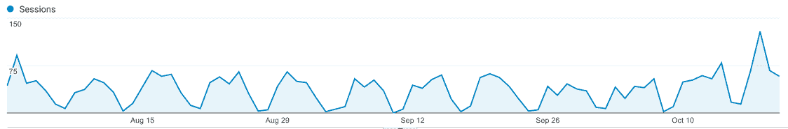
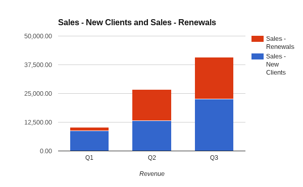

# 凭借具有领域知识的强大团队，达到每月 18，000 美元

> 原文：<https://www.indiehackers.com/interview/reaching-18k-mo-with-a-strong-team-with-domain-knowledge-378c4a818c>

## 告诉我们关于你自己和你正在做的事情。

嗨，我是艾略特·加姆斯。我在一个招聘人员的家庭中长大。我很外向，成长过程中在学校表现不好。我本质上一直是一个企业家，比起努力取得好成绩，我总是对创办小企业更感兴趣。

我从事专业工作已经 10 年了，这 10 年的大部分时间我都在芝加哥经营一家小型招聘公司，在那里我被很多人认为是开发人员的人才代理。除了经营自己的公司，我还在 Groupon 做过一段时间的技术招聘。在那之后，我在芝加哥共同创立了 Dev Bootcamp，在那里我主要负责确保所有从这个项目毕业的学生都能在毕业后找到工作。

我的生意叫做[人类预测](https://humanpredictions.io)。我们有一个 SaaS 产品，它是一个技术人员(工程师、设计师、QA、DevOps、数据科学家和产品人员)的数据库，根据他们更新公共社交档案的方式，突出显示这些人中谁最有可能换工作。我们主要与技术公司的工程领导和/或招聘人员合作，帮助他们避免与可疑的机构招聘人员合作，而是在内部进行所有的招聘。

我们白手起家，没有筹集任何资金的计划。我们有 3 个全职创始人和 5 个兼职承包商。承包商每周的工作量各不相同。

## 你是怎么想出人类预测这个主意的？

我和我的搭档[“h”](https://www.linkedin.com/in/johnhundrieser)在芝加哥经营着一家小型招聘公司。我们的招聘公司就像芝加哥的科技人才中介一样。我们不再代表那些寻找高级开发人员的公司工作，而是尽可能地关注与高级开发人员的交往。每当这些开发商准备搬迁时，我们都想帮助他们搬迁，探索芝加哥发生的酷事。

我一直是一个很大的人际关系招聘者，我相信在试图向他们推销工作机会之前，应该先了解他们。那时，我每周要和技术人员开大约 20 次会，其中许多人我以前见过，有些人我只是刚刚认识或被介绍给他们。在每周大约 20 次的会面中，我发现 1-2 个准备换工作的新人。这个比例对我来说效率很低，所以我试着做了一个实验，安排了一周 20 次会议，但是只和那些已经工作了两年多的人。那一周，我手下有 7 个人并没有“积极地”寻找新工作，但他们都去和创始人/首席技术官等喝咖啡，探索外面还有什么。

我恍然大悟，我意识到按任期对我每周遇到的人进行排名对我的业务有着巨大的影响。这个解决方案将成为人类预测。

## 是什么让产品开始运作的？

实验周的七个人中有一个是我的朋友[大卫](https://www.linkedin.com/in/dapick)，他在布伦特里工作。他告诉我，“我不是在找另一份技术工作。我已经建立了一个小的储蓄账户，我想冒险创业。不要向我展示技术工作，告诉我一些你知道的初创公司，它们处于非常早期的阶段，创始人拥有领域知识。”David 现在是我们的 CTO :-)

和大卫一样，我也有一小笔储蓄，因为 Dev Bootcamp 在 2014 年被 Kaplan 收购了。我们请大卫帮助我们为我们的招聘业务开发一个工具，以便更好地对芝加哥的人进行排名和优先排序，确定我们应该在那周或那月会见哪些人。大卫开始在晚上和周末工作，在一两个星期后，他有了一个工作 MVP，我和他用它来做我们的招聘生意。这个工具优先考虑了我应该试着和谁安排会议，使用它的第一周导致了一些很好的会议，其中一次通过我们的招聘业务成功地安排了工作。

## 是什么说服你们全职潜水的？

我们开始告诉其他几个 CTO/招聘人员朋友我们已经建立了什么，他们有兴趣尝试一下。这对他们来说效果很好，所以他们问是否可以付钱让我们继续使用它。David 在周末实施了 Braintree，接下来的一周我们拿到了第一笔付款。[人类预测](https://humanpredictions.io)很快从那里开始有了自己的生命。

与此同时，我的导师戴夫·胡佛(Dave Hoover)在演出间隙与镇上其他早期创业公司一起做天使投资。在团队、我们的领域知识和我们已经在内部工具/MVP 上取得成功的事实之间，他无疑是在火上浇油，告诉我们应该继续下去。从创业的角度来看，他认为我们是构建这个的合适团队。

大约在这个时候，我还遇到了一个叫贾斯汀·马萨的家伙，他在食品行业建立了一个数据驱动的业务，他比我更了解数据/产品领域。贾斯汀很快也成了我的导师，他也强烈认为我们应该继续下去。

在几个朋友试用了我们的应用并喜欢上它之后，我们想看看不认识我们的人是否也会有同样的感觉。我上了 LinkedIn，找到了几个我不认识的招聘人员/工程负责人，我联系了他们。我最终获得了一些演示，并能够将它们转化为客户。当我们看到不仅仅是我们的朋友喜欢我们的应用程序时，我们意识到我们可能有所发现。

一周后，大卫决定辞职，全职和我们一起工作。与此同时，我和 h 决定停止招聘业务，全力专注于产品。我们推出了一个非常简单的 MVP。我们很早就决定要瞄准那些了解优质招聘的酷公司，让他们和他们的反馈推动产品向前发展。

## 你是如何吸引用户和发展业务的？

我们在 2015 年 10 月正式推出了[人类预测](https://humanpredictions.io)。没有真正的启动建设——它发生得很有条理，也很快。到目前为止，我们还没有做多少销售或营销工作。我们获得新客户的方式是通过现有客户的口碑和直接销售。我在 LinkedIn 上找到招聘人员、工程领导者和初创公司创始人，并通过电子邮件联系他们。但是除了发送冷冰冰的电子邮件和向朋友展示产品，我们到目前为止还没有做过任何营销。

目前我们有 45 家公司在使用我们，总共有 60 个用户。鉴于我们更关注产品，而不是销售/营销，我们在跟踪转化率或诸如此类的事情上一直不太科学。也就是说，我们为其做演示的客户大约有 70%的转化率。

这是我们最早的谷歌分析:-)

## 你的营收背后有什么故事？

我们从正式推出产品的那天就开始收费了。我们都有白天的工作，所以我们想如果我们要离开他们，我们要确保我们正在建造的产品是人们愿意付钱的。我们最初的财务目标很简单:每个月我们都应该看到收入增长，如果没有，我们就应该认真讨论这个产品是否有市场。

我们的 CTO 来自 Braintree，因此安排支付对我们来说比其他人更容易:-)我们选择 Braintree 就是因为这个原因，并在几天内开始运行。

我们推出时，每个用户每月收费 200 美元。我们已经算定了最初的价格。我们使用过其他招聘产品，我们知道我们想要比他们更低的价格，因为我们太新了，我们的产品是真正的 MVP。我们向每个用户收取无限制访问我们的数据库的费用。

从那以后，我们几次提高了价格，首先从每月 200 美元提高到 300 美元，最后提高到今天的每月 350 美元。我们目前正在对该应用进行一些重大更新，并计划于 2017 年在 Q1 再次提价。我们还停止了包月服务，开始按季度或按年收费(900 美元/季度或 3000 美元/年)，以此来增加收入，并与我们的客户建立更长期的关系。我们发现，当我们的客户持续在招聘和人际关系上投入时间，而不是在这里或那里使用应用程序一两个月时，他们是最成功的。当他们注册了至少一个季度，我们就有更多的时间来展示我们的价值，并赢得他们的长期用户。

目前，HumanPredictions 在 MRR 每月收入 12，750 美元，新客户每月收入约 5，000 美元。到目前为止，我们最大的一个月是 8 月，在新客户和老客户之间我们赚了 19，000 美元。

## 你未来的目标是什么？

我想在 2017 年拥有一个六位数的月收入。我希望有 500 多家公司使用我们的应用程序。我一直想做的就是做生意。我希望[人类预测](https://humanpredictions.io)成为下一代招聘产品的第一个产品。

我们最近开始成为 IDEO 新的创业伙伴计划的创始公司，明年我们将与 IDEO 密切合作。IDEO 专注于指导我们并与我们合作创新，然后我们处理执行。我们知道如何构建软件，我们了解我们的客户，但 IDEO 用他们的交互设计印章和他们的设计/服务/商业研究深度填补了巨大的空白。我们第一次 sprint 的 IDEO 团队是一个交互设计师，一个认知心理学家和一个人类学家！我们还与他们的内部团队合作，尽我们所能帮助他们。我们不想只是拿走他们的知识而不给予回报。回馈也让我们的产品在设计和 UX 招聘方面变得更好。

## 如果你必须重新开始，你会做什么不同的事？

当我们推出时，我们向招聘机构销售。我们很快了解到，大多数机构采取交易和垃圾邮件的招聘方式。在做了 3 个月的产品后，我们意识到科技公司是更好的目标客户，他们给了我们感兴趣的反馈。代理商想要批量选择我们认为正在寻找的所有人，并向他们发送垃圾邮件。科技公司有意招募人才，并出于特定的原因追逐特定的人。来自科技公司的反馈推动了许多变化，极大地改善了我们的应用程序。在我们开展业务的前 3 个月，我们从代理处获取反馈，并以此为基础进行建设。如果我能回到过去，我会专注于向科技公司而不是代理商销售我们的产品。

此外，我会更聪明地把钱存起来，让它持续更长时间，这样我就不用那么担心财务问题了。在创办这家公司之前，我习惯于赚更多的钱，但没有攒够钱。

我们目前是分布式的，这很好，但也有它的挑战。我们在过度沟通和超越高层以确保我们都在同一页上方面仍然做得更好。分发仍然会带来挑战，但我们会不断推出新的流程，以确保我们保持一致，并朝着相同的目标努力。在竞争激烈的拥挤环境中工作也很困难。

## 对你真正有帮助的是什么？

我小的时候一个导师告诉我，“不要马上开公司。找一个自己喜欢的行业，拼了老命，把这个行业里里外外都学了，然后开公司”。我真的为我们团队的领域知识感到骄傲。我们的首席技术官拥有深厚的数据专业知识，并在几家成长期公司工作过，因此他体验过科技招聘的好、坏和丑。我生长在一个招聘人员的家庭，在我的整个职业生涯中，我一直从事科技招聘工作。h 曾为一些非常著名的软件公司做过招聘和人事工作，比如 ThoughtWorks、DRW 贸易公司、prism 等等。

## 你会和有抱负的独立黑客分享什么建议？

做企业家很可怕。对自己温柔一点。有时候你会想你到底在做什么。我从导师、播客和创业阅读中得到的所有反馈都表明这非常正常。要有韧性。

就我个人而言，我很喜欢导师。我喜欢寻找靠自己成功的人，并从他们那里获得建议。导师不仅会给你很好的建议，而且许多人会成为你工作的粉丝，并竭尽全力帮助你。找到导师，给他们买咖啡/啤酒/无论什么，并获得他们的建议和帮助。

另一条建议是对你的同事要有意识。找到你信任的人(你不能和你不信任的人一起创业)，他们价值观一致，技能互补。

最后，在你熟知的空间里建立一个公司。

## 我们可以从哪里了解更多信息？

*   邮箱: [【邮箱受保护】](/cdn-cgi/l/email-protection#99fdf8eff0fdd9f1ecf4f8f7e9ebfcfdf0faedf0f6f7eab7f0f6)/[/【邮箱受保护】](/cdn-cgi/l/email-protection#0f674f677a626e617f7d6a6b666c7b6660617c216660)/[/【邮箱受保护】](/cdn-cgi/l/email-protection#94f1f8f8fdfbe0e0d4fce1f9f5fae4e6f1f0fdf7e0fdfbfae7bafdfb)
*   推特:[@ David pick](https://twitter.com/davidpick)/[@ his nice](https://twitter.com/hisnice)/[@ Elliott garms](https://twitter.com/elliottgarms)
*   LinkedIn: [达皮克](https://www.linkedin.com/in/dapick) / [约翰·亨德里泽](https://www.linkedin.com/in/johnhundrieser) / [埃利奥特加姆斯](https://www.linkedin.com/in/elliottgarms)

你也可以看看 Crain 的中的[这篇文章，这是我写的一篇名为](http://www.chicagobusiness.com/section/20s-2015?recipient=Garms)[招聘的未来](https://www.linkedin.com/pulse/future-recruiting-elliott-garms)的博客文章，我们的专题是[2016 年顶级人力资源技术和招聘工具第三名](http://recruitingdaily.com/the-top-hr-technology-and-recruiting-tools-of-2016)。

你也可以在下面留言，我会尽量回复你的！

——[<picture id="ember5247392" class="user-avatar ember-view user-link__avatar"></picture>elliottgarms](/elliottgarms?id=3tWcrisfEQd3sWmHCLQok7gYAz43)，人类预言的创造者

## 想像人类预测一样建立自己的事业吗？

你应该加入独立黑客社区！🤗

我们是几千名创始人，互相帮助建立有利可图的业务和副业。来分享你正在做的事情，并从你的同事那里获得反馈。

还没准备好开始使用你的产品吗？没问题。这个社区是一个认识人、学习和实践的好地方。随意[随便浏览](/)！

——[<picture id="ember5247397" class="user-avatar ember-view user-link__avatar"></picture>柯特兰艾伦](/csallen?id=ibTLPyjwVebnZjMGKvz6ztarnuV2)，独立黑客创始人

6votes