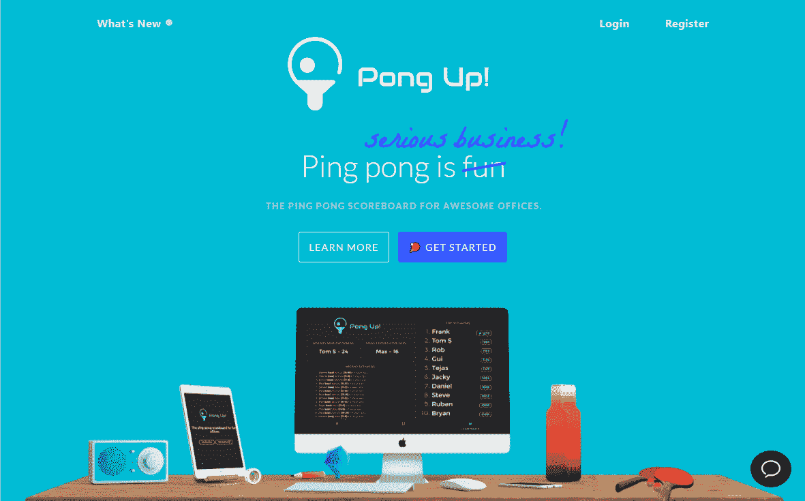

# 通过一个有趣的附带项目，在第四个月达到 300 美元/月

> 原文：<https://www.indiehackers.com/interview/reaching-300-mo-in-the-fourth-month-with-a-fun-side-project-bdb1ead219>

## 你好！你的背景是什么，你在做什么？

嗨！我叫丹尼斯，是澳大利亚悉尼的一名网络开发人员。从电子项目到网络和移动应用程序，我一直喜欢兼职做一些事情。我目前正在做 [PongUp！](https://getpongup.com) —一个有趣的办公室乒乓球比分追踪器和排行榜。

如今，大多数工作场所都有乒乓或乒乓球设施。这是办公室的额外津贴之一，可以激发同事之间的竞争天性。PongUp 的建立就是为了促进这一点——一个让玩家可靠地记录他们的乒乓球分数、计算排名并跟踪他们的统计数据的系统。

最重要的是，PongUp 从一开始就专注于设计。这使得公司可以在其乒乓球区的大屏幕电视或平板电脑上部署 PongUp 的仪表板，作为其办公环境的一个很好的补充。

自推出以来的四个月里，PongUp 已经跟踪了 8000 多场乒乓球比赛，目前，MRR 的价格为 300 美元。

 

## 是什么促使你开始使用 PongUp？

与许多其他技术办公室一样，乒乓球在我们的工作场所一直很有竞争力。我们一整天都在互相挑战，主要是为了炫耀的权利。有一天，在我们所有平常的闲聊中，有人建议我们应该开始追踪分数，作为证明谁是更好的玩家的更可靠的方法。当然啦！我们对现有资源进行了快速搜索，但找不到符合我们需求的解决方案。

那时我一直在做另一个更大的副业项目。注意到企业家应该一次只专注于一件事的普遍建议，我强迫自己暂时忽略这个想法。事实证明，这个建议并不总是正确的，至少对我的情况来说是这样。

我的另一个项目进展缓慢，我失去了动力。

TweetShare

几周后，我会重新审视这个想法。我的另一个项目进展缓慢，我失去了动力。那时，我很兴奋能够开始一些新的东西，而 [PongUp](https://getpongup.com) 看起来像是一个有趣且包含的项目。作为我们会在办公室内部使用的东西，它有更多的加分。

## 构建最初的产品需要什么？

在制作《T4》的时候，我有一份全职工作(现在依然如此)。时间确实是一个制约因素，它迫使我对 MVP 中包含的内容进行创新。

我也不确定人们是否会觉得这款应用有用，即使是在我的工作场所:

*   人们愿意在每场比赛后记录他们的分数吗？
*   人们会在最初几天的兴奋后感到无聊，然后停止使用该应用程序吗？

这带来了一个困难的困境:一方面，在验证这个想法之前，我不想花太多时间来开发一个完美的应用程序。另一方面，在我的同事中发布一个半生不熟的解决方案，我会感到尴尬。(毕竟，我们是一家对工作质量有高标准的网站开发机构。)

为了解决这个问题，我决定避免编写任何代码，而是使用一个附带 Google 表单的 Google Sheet 来收集比赛结果。这样，我就不必担心任何前端设计、用户流或代码质量，并且我有一个简单的方法来验证这样的工具是否有吸引力。

小规模和早期推出，开始获得用户的反馈，并使用它来推动下一组功能。

TweetShare

最终，我开始慢慢地改进谷歌表单，添加公式来计算每场比赛的 Elo 积分，并计算出每位球员的排名。看到人们每天用庞古普语记录比赛，即使是原始形式的比赛，这非常令人振奋。

很快，人们开始要求在我们乒乓区的平板电脑上部署应用程序，这就是我开始为 PongUp 构建一个合适的前端应用程序(使用 Ionic)的时候。

在接下来的 6 个月中，我们继续使用这种设置，在此期间记录了 722 个匹配，同时仍然在后端运行 Google Sheets 来存储所有数据并执行所有计算。

最后，在 2017 年 3 月，我开始在 Laravel 重建后端，目标是让世界各地的其他团队和办公室也可以使用 PongUp，并支持进一步的增强，如 Slack integration，这是非常需要的。

如果你感兴趣，那份旧的电子表格仍然可以在这里找到:【https://goo.gl/5NK78p[。](https://goo.gl/5NK78p)

## 你是如何吸引用户并发展 PongUp 的？

与我之前的项目相比，我决定采取不同的方式推出 [PongUp](https://getpongup.com) ，这是为了在发布前更注重建立吸引力，而不是仅仅建立并希望用户出现。这包括:

*   在编写第一行后端代码之前，创建一个登录页面
*   发布前建立邮件列表
*   在发布前与用户接触，以确定功能和价格
*   启动产品搜索
*   即使在发布后，也要继续花时间在营销工作上

这种对用户反馈和建立牵引力的关注到目前为止得到了很好的回报，因为 PongUp 在使用和增长上都超过了我的其他项目。

我尝试过的一个有趣的增长技巧是给那些已经注册了高级计划的早期用户发送个性化的乒乓球。

我花时间定制每个球，以匹配公司的颜色和品牌，并为每张附带的明信片制作个人欢迎信息，作为对他们注册的感谢。

我希望这些定制的球能得到一些 Twitter 的喜爱和分享，这将有助于传播关于 PongUp 的消息。虽然这种情况到目前为止还没有发生，但是当这个包裹到达他们的办公室时，用户仍然会感到惊讶和感激。这为他们与我分享他们的反馈打开了大门，并真正有助于持续改进应用程序。

## 你的商业模式是什么，你是如何增加收入的？

PongUp 有一个免费层和附加层。免费版限于每月 5 个用户和 50 场比赛，但除此之外可以使用所有功能。我喜欢这种模式，因为它让用户有机会充分探索应用程序，只有当应用程序为他们带来价值时，他们才开始付费。

plus tier 整个团队每月花费 15 美元，有无限的玩家和比赛。

到目前为止，收入增长稳定，呈线性趋势。

| 月 | 收入 |
| --- | --- |
| 2017 年 3 月 | 0 |
| 2017 年 4 月 | 0 |
| 2017 年 5 月 | 10 |
| 2017 年 6 月 | 160 |
| 2017 年 7 月 | 205 |
| 2017 年 8 月 | 325 |

## 你未来的目标是什么？

主要目标是继续为我当前的用户群开发功能，让他们的钱花得更值。有太多的事情正在进行中。我要做的下一个功能是为每个玩家定制漂亮的图表，以显示玩家的分数和等级随时间的变化。

时间确实是一个制约因素，它迫使我对 MVP 中包含的内容进行创新。

TweetShare

从长远来看，我在考虑横向扩展，以支持其他办公室游戏，如桌上足球和主机游戏(例如:FIFA，PES)。平台确实已经在一定程度上支持这些游戏了。例如，我们已经在 [PongUp](https://getpongup.com) 中跟踪我们的 PES 匹配和排名。挑战在于如何为这些不同的受众量身定制营销信息。

收入方面，我希望在未来 6 个月内达到 1000 美元 MRR。为了实现这一目标，我必须探索新的营销渠道，并努力更好地衡量现有渠道，以了解它们的有效性。这方面还有很多要学的！

## 你面临的最大挑战和克服的障碍是什么？

到目前为止，我最大的挑战是平衡添加新功能和花时间营销产品。

我通常倾向于编写新功能，因为这是我擅长的，而营销仍然是一项相当痛苦的工作。别以为我有解决办法。对我来说，这仍然是每天的一场战斗，但我一直在努力为每项活动分配时间，以此迫使自己同等重视这两个领域。

如果有机会，我可能不会做任何不同的事情。事实上，我会将我在这里学到的东西应用到未来的项目中——也就是说，小规模地、尽早地推出，开始从用户那里获得反馈，并使用它来驱动下一组功能。

## 有没有发现什么特别有帮助或者有优势的？

我是贾斯廷·杰克逊[产品人俱乐部](https://productpeople.club/)的成员，在一个专注于构建和发布产品的产品人社区中真的很有帮助。尤其是作为一个 solo 开发者。有一个地方来激发想法和获得帮助是无价的。[独立黑客论坛](https://www.indiehackers.com/forum)似乎也在增长，可能是另一个在线“闲逛”的好地方。

另一件非常有用的事情是我在 [PongUp](https://getpongup.com) 中设置的聊天工具。虽然我很少能实时回复聊天信息(与世界上大多数地方处于不同时区的一个缺点)，但我总是确保通过电子邮件跟进所有信息。

这些用户问题让我了解了用户的想法，哪些功能受欢迎，以及应用程序的任何部分是否对新用户来说太过混乱。我已经能够主要根据这些反馈不断改进应用程序。

我之所以使用 [small.chat](https://small.chat) 是因为我喜欢它在 Slack 中处理线程的方式。它也是免费的，这使得它比像对讲机这样的替代品更有吸引力。

## 对于刚刚起步的独立黑客，你有什么建议？

我的旅程还很早，我还在学习，所以我不会说我有所有的答案。然而，以下是我学到的一些东西，并发现很有帮助:

*   从小处着手。非常小。把你的宏伟愿景记在心里，但是要分解它，并朝着它迭代地构建。它总是关于持续的小进步，而不是一个大的启动。
*   甚至在编写任何代码之前，先构建一个登录页面。它迫使你更深入地思考一些事情，比如正在解决的棘手问题以及目标受众是谁。在那些漫长的日子里，当你埋头构建项目时，这也是一个很好的动力来源，让你对最终目标有所了解。就像对待你的代码库一样对待它，并不断迭代地改进它。
*   你的第一个项目很可能不会带来积极的财务投资回报。然而，不要回避为你的产品收费(即使价格很低)。你将更多地接触到产品开发的非技术层面，比如营销、文案和定价，这些你都可以应用到未来的项目中。
*   如果可能的话，你自己的产品。它带来了很多动力，并确保你不会很快厌倦它。
*   营销比编码难多了。没有“你好世界”来开始，结果通常是模糊的，难以衡量，而且更难“通过做来学习”，因为你不能仅仅通过解决玩具问题来学习营销技能。

## 我们可以去哪里了解更多？

你可以在 getpongup.com 打一场乒乓球，尤其是如果你的工作场所有一张乒乓球台的话。你也可以关注 PongUp 的[推特账号](https://twitter.com/getpongup)来获得新功能的更新。

我很乐意听到你对这个应用程序的想法，如果你有任何问题，请在下面的评论中告诉我！

——[<picture id="ember7998942" class="user-avatar ember-view user-link__avatar"></picture>丹尼斯·王](/dennisong?id=d7Yzx2EAiBNNMUyEcfiBJzyVlj63)，PongUp 的创造者！

## 想像 PongUp 一样建立自己的事业！？

你应该加入[独立黑客社区](/)！🤗

我们是几千名创始人，互相帮助建立有利可图的业务和副业。来分享你正在做的事情，并从你的同事那里获得反馈。

还没准备好开始使用你的产品吗？没问题。这个社区是一个认识人、学习和实践的好地方。随意[随便浏览](/)！

——[<picture id="ember7998947" class="user-avatar ember-view user-link__avatar"></picture>考特兰艾伦](/csallen?id=ibTLPyjwVebnZjMGKvz6ztarnuV2)，独立黑客创始人

6votes