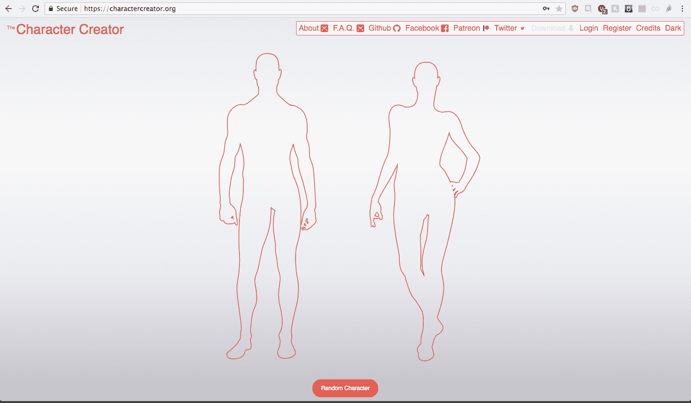
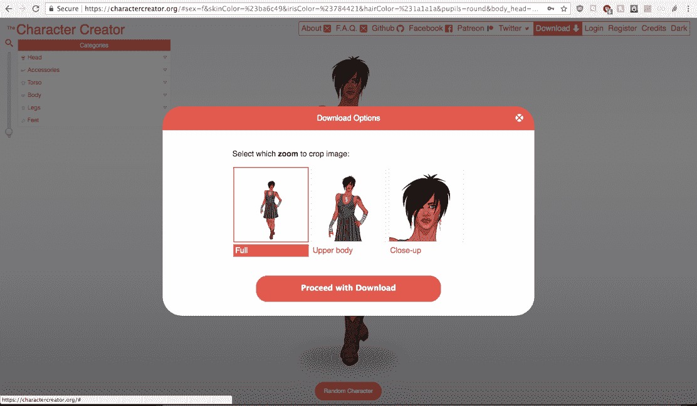
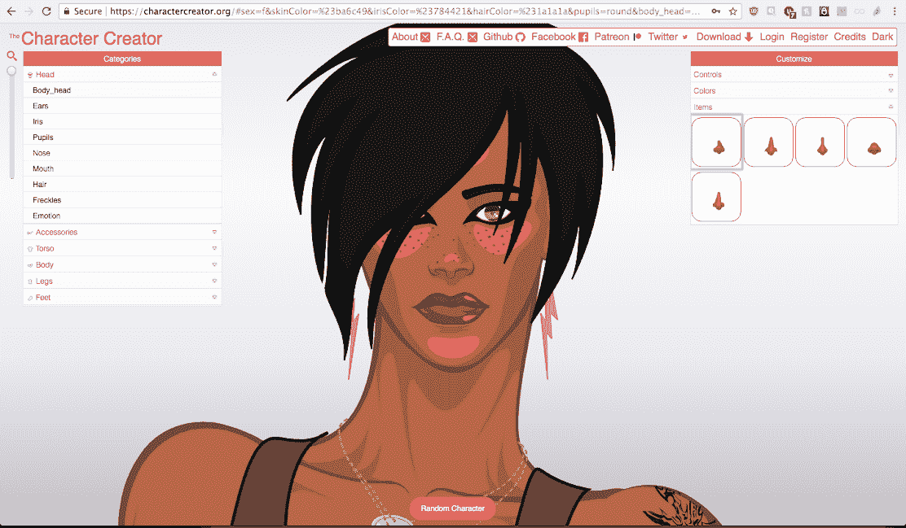

# 作为一名漫画家实现拉面盈利成为自学成才的开发者

> 原文：<https://www.indiehackers.com/interview/reaching-ramen-profitability-as-a-comic-artist-turned-self-taught-dev-a3581516fd>

## 你好！你的背景是什么，你在做什么？

我的名字是弗雷德里克，我是一个漫画艺术家和网站开发人员。我从小就在家用电脑上编程，在我的画桌前画漫画。我做过一段时间的漫画铅笔工，最终成为了一名网络开发人员。这两个技能最终融合在一起，这就是我如何想到的角色创造者。

角色创建器是一个网络应用程序，可以帮助故事讲述者以一致、真实的手绘风格来可视化他们的角色。只需点击通过一系列的选项和菜单，并根据您的选择建立您的角色。它还有一个下载按钮，因此您可以在存储设备上保存矢量文件的副本。

我建立了角色创建器来帮助我改进角色创建过程，使它更快更容易。作为一名开发人员，我可以看到重用代码的好处，但作为一名艺术家，没有复杂的方法来做到这一点。

每当漫画家画一张新的画板，他们都是从零开始。通过切换到矢量艺术作为媒介，并将字符视为代码位，我能够对组成字符的所有元素进行分类，并在每次需要它们作为新字符的一部分时以模块化的方式重用它们。然后每个项目只抽取一次，所有人都可以使用。

组织这些图画的另一个好处是，你可以设计一个算法来帮助从这些元素的大量选择中创建原始的、随机的字符。这些随机出现的角色往往会令人惊讶，并从它留给我们的最初印象中激发故事。

## 是什么激励你开始接触角色创造者？

我当时正在做一个漫画书项目，这个项目开始失控了。我以我能想象到的最有趣的方式着手这个项目...但这也意味着它是以最复杂的方式在 T4 完成的。这最终会让我筋疲力尽，并使项目进展缓慢。那个痛点让我去寻找更好的做事方法。

那时，我已经把我的软件换成了 Linux，开始玩免费的图形程序，这时我发现了矢量图形程序 [Inkscape](https://inkscape.org/) 。它让我重新发现了矢量图形。几年前我在学校的时候就尝试过这种格式，但是那时候我并不像现在这样感兴趣。

可缩放矢量图形(SVG)的特性让我非常清楚地认识到，这是我可以尝试和测试我的理论的媒介。

为了能够按照我的设想构建应用程序，我不得不学习用 JavaScript 编码。起初，我使用了所有我能想到的库，并向朋友寻求帮助，以获得一个最小可行的产品。

我在某个时候用过 [Snap.svg](http://snapsvg.io/) 和 [jQuery](https://jquery.com/) 甚至 [D3](https://d3js.org/) 。但这只是一个快速简单的方法，让一个版本启动并运行，让人们可以给我们一些反馈，开始产品的第一次迭代。但是随着时间的推移，我选择移除所有的库，并用自定义函数替换项目中的所有用例。我不得不两三次重构部分代码，但每次迭代都是一种改进。今天还有提高的空间。

这个网站开始时有一些访问者，但很快就逐渐减少了。在过去的六年里，我尽可能地更新网站，更新的强度各不相同。我修复了一些错误，在路线图上添加了所有的特性，并确定了我要做的顺序。

直到三年后，流量才开始有机增长。人们开始发现它，并产生足够的兴趣，花时间创造他们自己的角色。可供选择的物品库存必须达到临界质量，才能使类似游戏的界面具有吸引力和沉浸感。

我从未考虑过其他选择。它总是关于打基础，这样我就可以尽快得到好的东西。角色的创造过程是这个项目中最让我感兴趣的，也是我无法停止思考的问题。我也觉得我有能力实现它。

我目前的财务状况就像一个艺术家。我的拉面还没有盈利，但我正在谈判一份可能在短期内改变这种状况的合同。希望它会成功，我们将开始壮大队伍...或者也许不会，我们将继续自举，直到我们找到下一个机会！

## 构建最初的产品需要什么？

我把这个项目设计得尽可能轻巧。就代码而言，还有保持代码运行的成本。除了我的基本生活费用之外，基本上没有烧钱的费用(每月 20 美元的服务器费用)。

我是故意这样做的，这样项目就不会因为缺乏资金而受阻。我在网上自学了 JavaScript、CSS 和矢量图形。在构建组成应用程序的各个部分时，我一步一步来。六年过去了，我仍然觉得我才刚刚开始。

我希望 UX 尽我所能做到最好。所以我把它分解成创造一个原创角色的所有步骤。从最初的页面加载开始，一对轮廓被绘制在屏幕上。你点击你想要的。从第一次点击这个网站开始，你就立刻发现自己处于角色创造的过程中。从那时起，我一直关注保持相同的用户体验水平，直到用户选择下载他们的作品。

花了大约四年的时间编写代码，在 It 部门做了六年不同的工作。为了提高性能和满足编码标准，代码库至少被部分重构了三次。在每一步，我都会添加一个新功能，通常是当时最紧急或最重要的功能，一些更重要的功能需要一年多的时间来准备所有的艺术和代码，这样新功能就完成了。

我不得不在一开始就做出决定，限制每种性别只能申请一种体型，但这只是暂时的。随着队伍的壮大，我计划增加更多的体型。它在路线图上...但是先别问我发货日期！

资金来源于我工作时的日常工作和我不工作时的储蓄。今天我从 Patreon 赚了一点，从广告赚了一点，还有一些自定义绘图和编码，这让我可以全职工作。

我的一些朋友在一开始就给了我很大的帮助，他们编写了一些我自己无法理解的特性。一些朋友继续捐款，帮助我。一个亲密的朋友，Robin Millette，帮助我为 MVP 设计了一个轻量级的后端，所以它可以在创纪录的时间内运行。另一个朋友，马克西姆·圣·希莱尔是数字营销的专家，他给了我如何提高网站流量的好建议。

## 你的技术是什么？

这个项目中的一切都围绕着以最方便的方式显示 SVG。我使用 HTML 是因为 SVG 是它不可分割的一部分。我使用 JavaScript 是因为它是当今网络浏览器的编程语言。简单高效。

后端是一个 GNU/Linux 虚拟机上的 [CouchDB](https://couchdb.apache.org/) 的实例，该虚拟机为带有 [Caddy 2.0](https://caddyserver.com/) 的站点提供服务。

根据我的经验，代码库已经随着时间的推移得到了改进。最大的变化之一是移除了除一个库之外的所有库，以提高项目的整体重量，并尽可能快地保持加载时间。

在这个过程中，我发现最大的技术挑战(有很多)是如何让应用程序从服务器加载 SVG，并将其放入浏览器和页面。我花了很长时间才弄清楚所有的来龙去脉，在这个问题解决之前，我花了很多时间在论坛上和朋友们谈论这个问题。

## 你们是如何吸引用户，壮大角色创作者的？

起初我没有太多的发射。我只是在 2014 年 1 月中旬在 twitter 上宣布了这件事。一些人对两性之间的差异感到愤怒(他们那时没有所有相同的项目，今天仍然没有。)在这次软文发布后不久，关注度就逐渐下降了。它花了大约三年的时间，把它打造成了一个可靠的产品，可以获得并保持人们的兴趣。

尽管我已经做了很多年，但逐渐涌入的流量还是让我大吃一惊。正是这种突如其来的兴趣促使我增加了新的功能，允许用户保存他们的作品，并在以后进行进一步的编辑。我和我的朋友罗宾开始建立一种方法来注册用户，并允许他们在将角色保存到云中后上传到网站上。这将使该应用程序不仅仅是一个一次性的好玩的噱头，更是用户的创意中心。

数据点:

*   单日最高访问量记录是 5 月 18 日的 9525 名用户
*   过去 30 天内有 213，133 个用户
*   去年有 1，594，388 名用户
*   比上年增长 152.33%
*   过去 3 年有 240 万用户
*   平均会话持续时间为 5 分 03 秒
*   停留时间超过 1 分钟的用户平均停留时间为 9:43 分钟

自从该网站的第一个概念验证版本以来，我的大部分精力都放在了改善用户体验上。剩下的就是为男性和女性模板添加新的服装和配饰。

如果我有营销预算，它将全部用于改进产品。当一个产品很棒时，人们会谈论它，这胜过你能买到的任何其他形式的广告。我总是专注于让角色创造过程更好。

我确实让我的社交媒体账户保持活跃，主要是通过发布新的项目，这些项目会在应用程序中添加进来。

几年前我尝试过使用邮件列表，但是运气不太好。我使用的服务是根据你的列表大小收费的，不管你每月发出多少封电子邮件，所以随着我的列表增加，维持服务的价格对当时没有任何收入的项目产生了影响。

我的增长策略从在我的域名中使用关键词开始，确保网站响应迅速，文本内容可以被搜索引擎访问到。将 90%的工作放在用户体验的前 10 秒。

## 你的商业模式是什么，你是如何增加收入的？

我还在探索商业模式。我有一个 Patreon 页面，我按需制作艺术和代码，并在网站上显示广告。这个项目还没有盈利，但我看到它在稳步增长。我觉得它随时都有可能起飞，但我已经准备好让它继续下去，即使它没有起飞。

在开始的时候，尽可能精益地构建你的项目，这样它就不会太快耗尽你的精力。

TweetShare

收入来自于流量，而流量的增长很大程度上取决于我在网站上投入了多少持续的努力。

我不使用支付系统，除了通过 Patreon 的用户和 Paypal 的合同工作。

到目前为止，收入的最大变化是当我在网站上添加广告时。它是在一个独立黑客论坛上被推荐给我的，一家提供展示广告的公司也找到了我。这是我目前为止最经常性的被动收入。它给了我新的信心，让我相信随着时间的推移，只要付出正确的努力，就能取得成功。

## 你未来的目标是什么？

我有一个不同的功能，我想添加到网站的想法。这不是正式的路线图，但也可能是。我想继续改进角色的创建过程，并添加一些功能来管理角色之间的关系。我看到了一个完整的角色创造者的连接版本，在那里你可以与其他创造者分享你的角色，并建立在彼此的故事之上。

就项目财务而言，我正试图避免在这个项目上负债。这就是为什么我只花收入中的钱，否则我会让项目独自进行。当收入增加时，我将开始发展团队，更频繁地更新功能、漏洞修复和新项目，并引入许多要求的功能，如各种体型、姿势和动作姿势。

我认为现在最大的障碍是试图增加收入，达到拉面盈利的程度，并期待着团队的有机增长。

## 你面临的最大挑战和克服的障碍是什么？

最大的挑战是平衡日常工作和正在获得牵引力的副业项目，尤其是当它仍处于预收入阶段时。我总是努力攒钱，这样我就可以暂时过上简朴的生活，这样我就可以在工作间隙有更多的时间专注于项目。

我学到的最好的经验是，在开始的时候建立一个尽可能精益的项目，这样它就不会太快烧毁跑道。从一开始就自己做每一件事，我不得不真正停下来，想想它应该是什么样子，应该如何运作。我从以前的一个项目中学到了很多，那里的一切都太复杂了。

## 有没有发现什么特别有帮助或者有优势的？

我做的最好的决定是遵循精益方法，尽早开始，经常迭代。一旦我有了一个原型，它就可以在网上获得，我在 twitter 上宣布了它。从那时起，六年来我一直在改进它。这个项目比我预期的更早获得了关注；如果我不从一开始就公开分享我的原型，我永远也不会获得这些流量。

我从其他艺术家那里学到的一个习惯是收集我喜欢的人和事物的照片。我把它们放在文件夹里，用它们来激发新的服装和配饰、新的表情和动作姿势。

做你的下一个产品，不要找借口。

TweetShare

有一件事很有帮助，那就是我写的一篇关于独立黑客的帖子。当时不知道如何提高我的收入，我在公告板上贴了一个问题，很多人建议我在网站上放广告。我找到了在我的帖子回复中被推荐最多的一个。他们不是很感兴趣，但仍然愿意尝试，但就在提交之前，另一家广告公司找到了我，他们有更好的提议。这给了我一个新的经常性被动收入来源。

与其说是数量，不如说是我可以指望它一段时间的事实。我感觉到我对未来的看法发生了转变，这给了我信心，也让这个项目以一种奇怪的方式变得更加真实。从那时起，我更加相信这个项目在财务上的成功。

## 对于刚刚起步的独立黑客，你有什么建议？

做你的下一个产品，不要找借口。如果你有好东西，人们会蜂拥而至。不断改进你的想法，直到它让其他人兴奋起来。

人们经常错误地认为游客会神奇地对他们的东西感兴趣。你必须以最有利的角度展示这件东西，并让购买体验变得愉快。会让你想再体验一次的东西。

## 我们可以去哪里了解更多？

前往[角色创建者](https://charactercreator.org)创建你的第一个角色！

我总是问人们:有什么东西我还没有，但绝对需要包括在内？

乐意回答下面评论中的任何问题！

——[<picture id="ember8183611" class="user-avatar ember-view user-link__avatar"></picture>弗雷德里克·吉蒙特](/ubik?id=A0xOpoOI4beLDGPBk5nQfxzm0AI3)，人物创造者的创始人

## 想像角色创造者一样建立自己的事业吗？

你应该加入[独立黑客社区](/)！🤗

我们是几千名创始人，互相帮助建立有利可图的业务和副业。来分享你正在做的事情，并从你的同事那里获得反馈。

还没准备好开始使用你的产品吗？没问题。这个社区是一个认识人、学习和实践的好地方。随意[随便浏览](/)！

——[<picture id="ember8183616" class="user-avatar ember-view user-link__avatar"></picture>考特兰艾伦](/csallen?id=ibTLPyjwVebnZjMGKvz6ztarnuV2)，独立黑客创始人

12votes