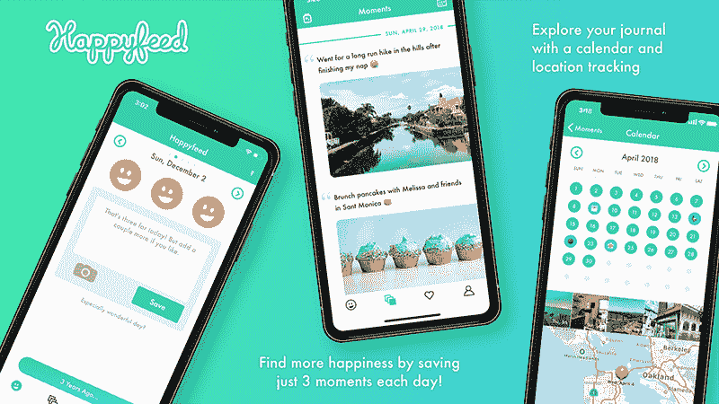
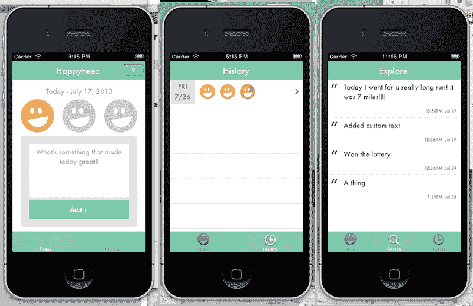
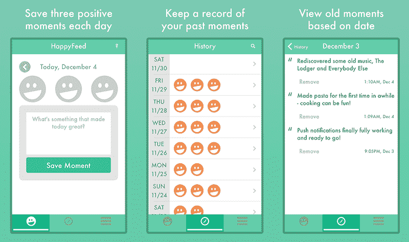
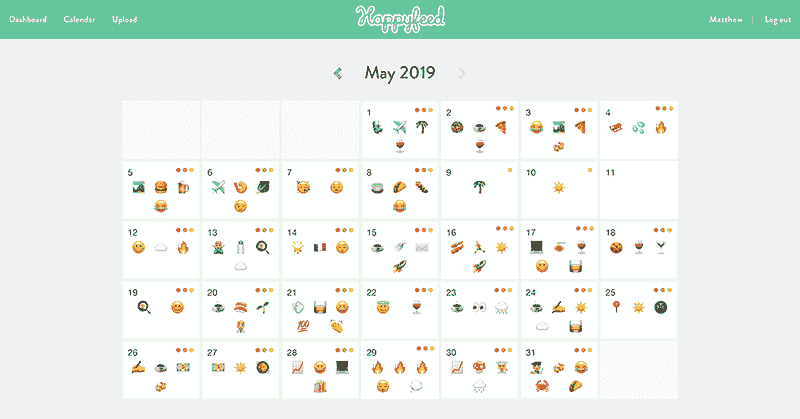
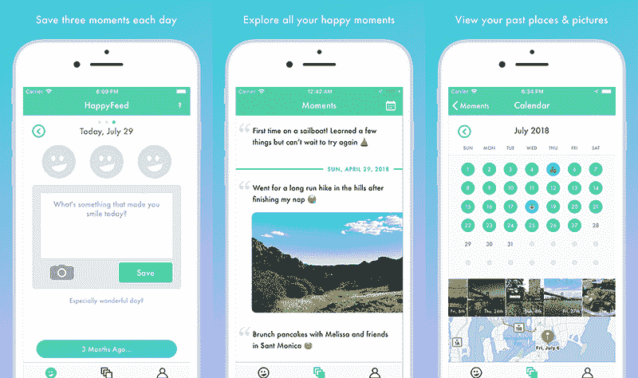

# 做好一件小事，实现拉面盈利

> 原文：<https://www.indiehackers.com/interview/reaching-ramen-profitability-by-doing-one-tiny-thing-well-c6b78b7303>

## 你好！你的背景是什么，你在做什么？

你好！我是马特·坎德勒。我是一名布鲁克林的软件开发人员，偶尔做做界面设计师，也是一款 iOS 和 Android 版感恩日志应用 [Happyfeed](https://www.happyfeed.co/) 的创始人。

你很有可能已经从日益发展的心理健康博客和播客采访中听说过感恩日志(看着你，贾斯汀·坎)。如果你还没有，这里有一个快速概述。积极的心理学家发现，每天记录三件你感激的事情可以帮助你的大脑重新布线，更多地关注积极的事情。我为我的博客[写了一篇文章，总结了一些研究](https://www.happyfeed.co/research/what-is-a-gratitude-journal)。简言之，杯子是半满的。😄

80%的 Happyfeed 用户是女性，其中大多数年龄在 25-34 岁之间。女性患抑郁症的可能性大约是男性的两倍，这或许可以解释这些人口统计数据。Happyfeed 目前拥有约 1500 名每日活跃用户和 150 多名付费用户。考虑到年度订阅和月度订阅之间的差异，我们每月从 App Store 获得大约 350 美元。

 

## 是什么促使你开始使用 Happyfeed？

在 Happyfeed 之前，我是一个事件分享平台(姑且称之为“事件 Twitter”)的设计者和联合创始人。当很明显我们需要关闭公司时，我开始担心我下一步要做什么。我的联合创始人是一名工程师——在我们创办自己的公司之前，谷歌就想聘用他，而且似乎对他有一点创业精神的需求会更高。然而，我只是在我们的网站上工作了一年半左右的时间才成为一名“设计师”。我没有广泛的投资组合，我的一个项目彻底失败了。我想成为一名产品经理，但我缺乏经验，甚至无法通过优步的电话筛选。

我需要填补我投资组合中的一些空白。2013 年，移动网络仍让人感觉新鲜。Instagram 刚刚被脸书收购，响应式设计还没有出现。我决定设计并开发一个简单的应用程序，这是我在创业公司黑暗时期养成的一个习惯——感恩日志。积极心理学越来越受欢迎，我一直在关注几个博客，寻找让自己更快乐的技巧和诀窍。[埃里克·巴克的博客](https://www.bakadesuyo.com/)是我的最爱，感恩日志是一个反复出现的话题。

*有趣的事实:Happyfeed 最初的想法是建立一个只包含积极消息的过滤 Twitter 流(2016 年大选后我们都会喜欢的东西)。*

## 构建最初的产品需要什么？

当我开始 Happyfeed 的时候，我不会认为自己是一个“程序员”。我在大学里学的是机械工程，一直喜欢编程项目——相比之下，应用程序能有多难呢？我们刚刚关闭了自己的创业公司，我的联合创始人已经搬到了纽约。我还在帕洛阿尔托，渴望建造一些东西。快乐食物就是那个东西。我的生活包括写求职信，调整我的在线文件夹，以及破解我的新想法。

经过短暂的搜索，我在网上找到了一门由保罗·赫加蒂教授的关于如何开发 iPhone 应用程序的免费课程。这门课程有十节课。我决定每周看两次讲座，独立完成家庭作业，并开始计划如何为*开发我的*应用。时间表很严格，但很舒适，让我保持专注。

Happyfeed 的 1.0 版本很简单。我希望一切都是基于云的，所以我使用[解析](http://parseplatform.org/)作为后端，所有的应用程序代码都在 Objective C 中。没有照片，没有删除，没有编辑，没有提醒，没有条纹。你可以建立一个账户，每天输入三个感激值，如果你跳过了一天就返回。

 

那是我生命中最美好的几个月:学习如何做一些全新的事情，朝着一个明确的目标努力，每天骑自行车去帕洛阿尔托的菲尔茨。我破产了(就像三位数的银行账户，从我哥哥那里借钱破产了)，但这很令人兴奋！

夏末，我在一家初创公司找到了一份产品工作，住在纽约的时候，我不得不把快乐食物转移到晚上和周末。从开始到结束，我认为在 App Store 中获得 Happyfeed live 大约需要四个月的时间。

## 你是如何吸引用户并种植 Happyfeed 的？

我认为，最好的增长方式就是在产品能够完全实现其主要目标的时候就把它们推出去。这到底是什么意思？Happyfeed 的 1.0 版本没有通知、删除、编辑、照片或任何附加功能。工作正常，没有崩溃(好吧，可能前几个版本崩溃了)。

我可能在我的脸书账户上发布了发布，但我想也就这样了。我朋友 Karen 在 Instagram 上发了点东西(谢谢 Karen)。

最好的增长方式就是在产品能够完全实现其主要目标时就把它们推出去。

TweetShare 

在发布后的几年里，Happyfeed 大部分时间都被忽视，处于维护模式。我会为新的 iOS 版本更新代码，并偶尔添加一个大功能，如照片上传、提醒和连续跟踪。通常，这是由用户就错误或特性请求进行接触而触发的。Happyfeed 是我的副业:一个让我感觉良好的小应用。它帮助人们变得更快乐，这就是我所需要的。

2016 年出现了一个转折点，当时我意识到我只有大约 40 名日活跃用户。差不多一万注册用户，40 个就尴尬了！但我每周仍会收到快乐用户的电子邮件。也许可怕的保留是一个可修复的产品问题？我决定试着修复它。

首先，我使用 [Mixpanel](https://mixpanel.com/) 为应用程序中的每个关键动作添加了分析，并头脑风暴了增加 dau 的方法。两个简单的功能挽救了这一天，并在接下来的几个月里让我的 DAUs 增加了数百个:

*   **每日通知**:多年来，Happyfeed 都有提醒，但每天都是同样的事情。我受到联盟发送的有趣的每日提醒的启发(是的，我当时是单身)，并决定每天发送独特的提醒。社交货币的想法是其中很大的一部分:我可以分享哪些在对话中可以重复使用的东西？像一个双关语或有趣的事实。
*   **倒退**:我一直很喜欢使用 [Timehop](https://www.timehop.com/) ，但我意识到我有比旧的社交媒体帖子更好的东西。Happyfeed 每天都有你明确标记为积极的事情。所以我编写了一个简单的“记忆”功能，并把它发送给用户。这是一个巨大的成功！第一个版本只是写着“一年前”、“六个月前”等的白盒。

| 月 | 用户 |
| --- | --- |
| 9 月 16 日 | 40 |
| 17 年 2 月 | 500 |
| 2017 年 5 月 | 900 |
| 9 月 17 日 | 1100 |
| 17 年 12 月 | 1200 |
| 18 年 1 月 | 1800 |
| 18 年 4 月 | 1500 |
| 2018 年 7 月 | 1200 |

这是一段美好的成长时期，它凸显了右功能的影响。你会注意到新年决心人数的大幅下降(每年都会发生)，以及 2018 年的大幅放缓(来自实验和免费增值的引入)。我还发布了一些从未真正流行起来的东西:

*   Web 应用程序:哦，天啊，我以为这会是个大工程。我在 React/Redux 中构建了整个系统，并使其对移动设备非常友好，因此 Android 用户可以使用它。问题是 Happyfeed 并不是人们与桌面联系在一起的东西。这是对该应用程序的一个很好的补充，使用起来很有趣(当我记得它存在的时候)，它教会了我一些新的编码语言。然而，这个网络应用每天只有几十个活跃用户。
*   **月评**:如果 Happyfeed 可以总结你过去的每个月，岂不是很酷？我想是的。所以我写了一封电子邮件，把用户最喜欢的十个单词和五个表情符号汇总在一起，并可以选择用推特发布出来。它通常与蟋蟀一起被接收，并且在发送时经常是巨大的电子邮件问题的原因(比如每个人发 12 次垃圾邮件😫).
*   **应用重新设计(2.0)** :我想在发布 2.0 版本(免费增值)时更新应用的外观，让免费用户感受到一点爱。老实说，这一点也不影响使用数量。不过，我现在确实更喜欢这个造型了！

 

最近，我发布了 Happyfeed 的 Android 版本，并对提醒发送系统做了一些重大更新。它现在在 Firebase Cloud Messaging 上，我确信这些消息实际上正在被传递。增长又开始令人兴奋了——自发布以来的过去两周，每周增长 8%。(不过，产品搜索的发布在[是个巨大的失败](https://www.indiehackers.com/post/1755c5bfc2?commentId=-LgTqV1WiSgj9W0MR-Cz)。)

我的理念是在付费功能最有用的时候展示它们。

TweetShare

## 你的商业模式是什么，你是如何增加收入的？

2018 年 5 月，Happyfeed 终于获得了第一笔订阅收入。我们有一个免费增值的商业模式。主应用程序是 100%免费的，并将永远免费，但有一个“Plus”版本提供了一些额外的功能，如日历视图、每天更多的帖子和离线模式。

 

**定价:**我为定价苦恼了几个月。在推出“Plus”的前一年，我会在我所有的客户回复中添加一句关于定价的话，以尝试了解他们愿意支付的价格。我以 2.99 美元/月的价格登陆，现在想知道我是否能以 4.99 美元的价格做得一样好。值得测试！

在推出 Plus 后的几个月里，我每隔几周就会宣布新的付费功能。例如，离线模式让我的付费转化率大幅提升。这些公告也是让老用户重新养成习惯的好借口。

**转化为付费版:**我觉得自己在寻找合适的时机让用户试用付费版方面做得相当不错。例如，在完成他们的第 10 天之后，我在应用程序中 ping 他们，让他们了解付费功能，比如每天更多的帖子。我在这里的理念是，在特性最有用的时候尝试呈现这些特性。让他们知道有试用期也有帮助。我从三天开始，一直到一周。此外，衡量转换率和弹出窗口上的 A/B 测试副本也很重要。✌️

今年 1 月，Happyfeed 终于开始盈利。怎么会？我们达到了 100 个付费用户，但这主要是因为我通过将数据库转移到 MongoDB 上而削减了每月 130 美元的成本。

一点建议:许多软件工具提供“启动”定价或伪加速器，你可以免费使用一年左右。我发现我们的数据库软件 MongoDB 有一个[启动加速器](https://www.mongodb.com/startup-accelerator)，所以 Happyfeed 被接受免费使用一年。谷歌也为 Firebase 提供了类似的产品，[面向初创公司的谷歌云](https://cloud.google.com/developers/startups/)。

削减成本是变得有利可图的最简单的方法之一！🔪

| 月 | 收入 |
| --- | --- |
| 18 年 4 月 | 0 |
| 2018 年 5 月 | 45 |
| 2018 年 6 月 | 80 |
| 2018 年 7 月 | 90 |
| 18 年 8 月 | 103 |
| 9 月 18 日 | 133 |
| 18 年 10 月 | 157 |
| 11 月 18 日 | 187 |
| 18 年 12 月 | 210 |
| 19 年 1 月 | 245 |
| 19 年 2 月 | 256 |
| 19 年 3 月 | 286 |
| 19 年 4 月 | 297 |
| 19 年 5 月 | 301 |
| 19 年 6 月 | 350 |

## 你未来的目标是什么？

像大多数独立黑客一样，我的最终目标是达到这样一个点，即我可以独自在 Happyfeed 上工作。这意味着我将需要大约 5000 名付费用户——只有现在的 40 倍。😅

我正在认真考虑今年秋天为 Happyfeed 筹集一轮种子资金。我很清楚(至少在消费软件领域)你需要一些初始资本来快速成长。我希望能够雇用有才华的设计师、营销人员和开发人员。要实现这一目标，Happyfeed 需要表现出几个月的强劲增长。理想情况下，我将能够在夏季结束时将 dau 增加到 5000，并按比例增加订阅量(可能达到 750)。

削减成本是变得有利可图的最简单的方法之一。

TweetShare

我要怎么去那里？从产品到营销的大量实验和学习。大多数人通过口口相传或搜索应用程序商店找到快乐饲料，因此有一个巨大的错过的机会...其他频道。

总的来说，我在积极心理学和习惯的博客和写作方面取得了一些成功。这是下一步，以及更经常地接触记者和任何对这个主题感兴趣的人。一两篇客座博文会很有帮助。

总的来说，我认为我已经做了一个应用程序，现在保留得非常好，让用户感到高兴。我只需要增加漏斗的顶部。

## 你面临的最大挑战和克服的障碍是什么？如果你必须重新开始，你会做什么不同的事？

独自经营一家消费互联网公司非常困难*。感觉你要么是一个曲棍球棒成长的成功，要么是一个巨大的失败。这也涉及到很多运气(好的和坏的),你的用户会比其他企业更加古怪，更加不可预测。*

 *我犯了很多错误，但这些是迄今为止最大的错误:

*   **会话令牌**:如果有一件事用户真的不想要，那就是有一天它出现在你的应用程序中，却不能访问他们的账户。嗯，我曾经试图限制会话令牌的长度，但忘记在应用程序中构建一些东西来让用户注销——所以每当他们打开它时，它就会崩溃。当然，他们可以重新安装应用程序，但搅拌要容易得多。不要忘记优雅地处理错误！
*   **邮件**:他们说你应该测量两次，切割一次。我说衡量 100 次，尝试打破你能想象的任何方式，在发送任何东西之前不要做任何最后的编辑。有一次，我给 20，000 名用户发了一封电子邮件，里面少了一个`</a>`标签，所以邮件的后半部分就变成了一个链接。哦。
*   发射:我在发射方面运气一直不好。我在产品搜索上的帖子通常会遭到反对，我没有努力从适当的来源获得新闻，我仍然没有真正搞清楚脸书集团或 Reddit。这里有很多我要学的东西。
*   **与用户对话**。去年秋天的大部分时间，我都在制作一个“致谢”专题。不幸的是，它主要是在我的脑海中，我没有从用户那里得到足够的反馈。我在感恩节(没有人在线的一天)推出了它，它的使用率如此之低，以至于我在接下来的一个月就把它删除了。一些艰难的谈话会让我节省几个月的工作。

## 有没有发现什么特别有帮助或者有优势的？

一些保持快乐前进的事情纯粹是运气。心理健康领域的一位有影响力的人不时会了解这款应用，并与他或她的追随者分享。这通常会导致一周 10 次的兴奋，超出我的承受能力。我在想办法创造更多这样的时刻。

阅读一直对我有很大的帮助。我发现有几本书特别有用:

*   *[《精益创业》](https://www.amazon.com/dp/B004J4XGN6/)* :这几天可能看起来过时了，但这是我读的第一本关于创业的书。我们大多数人都知道关于 MVP 的建议，但很少有人真正遵循。
*   *[影响力](https://www.amazon.com/Influence-Psychology-Persuasion-Robert-Cialdini/dp/006124189X)* :这一个怎么推荐都不够。这更像是一本心理学读物，但涵盖了销售和说服他人的一些重要概念。
*   *[定位](https://www.amazon.com/dp/B006B7LQ90)* :又一个古老却伟大的。

我也几乎痴迷地听创业播客。以下是我最喜欢的几个:

*   *[本周在初创公司](https://podcasts.apple.com/us/podcast/this-week-in-startups-audio/id315114957)* :从我第一次创业开始，我就一直在听 Jason。他已经接近 1000 集了，所以每个人都会有收获。他很固执己见，但这会引出更有趣的采访。
*   *[独立黑客播客](https://www.indiehackers.com/podcast)* :不仅仅是因为我们在这里讨论独立黑客。我喜欢各种各样的客人和话题。考特兰擅长帮助客人讲述他们的故事。
*   *[YC 播客](https://podcasts.apple.com/us/podcast/y-combinator/id1236907421)* :克雷格是一位采访大师，喜欢找有趣的人聊天。我最喜欢的是 YC 公司的伪事后诸葛亮。
*   对于我们其他人来说:我真的很享受迈克和罗布之间的互动。这很容易听，他们都有一个实用的方法来解决共同的问题。
*   *[20 分钟风投](http://www.thetwentyminutevc.com/category/podcast/)* :了解风投是如何思考的很好，他们几乎都参与过这个项目，还有一群伟大的创始人。有时感觉有点照本宣科，但仍然很好。

当然，还有像独立黑客这样的社区。尤其是在我发布 happy feed 2.0 版本的时候，这个社区对我来说是一个完美的逃避和资源。非常感谢所有努力让这个团队变得积极和富有成效的人！

## 对于刚刚起步的独立黑客，你有什么建议？

让它成为一次学习经历。无论你选择做什么，确保你在这个过程中不断学习新的东西。当我在 React/Redux 中构建了 Happyfeed 的 web 应用程序后，我能够使用这些技术找到合同工作。这款应用本身并不成功，但它的技术让它值得努力。偶尔你会学到新东西*和*产品会起飞。🚀

**不要为你最初的产品感到尴尬。**我会说一千遍，但我不相信大发射。对我来说，一个 MVP 只需要做一件小事，并且把它做好(没有崩溃或者重大错误)。Happyfeed 随着用户的需求而慢慢成长，这是一种非常特别的感觉。

坚持确实是关键。我无法告诉你有多少次我把 Happyfeed 当作一个永远不会成功的愚蠢想法而不予考虑。谁会为一款美化了的笔记应用付费？如此私密的东西怎么能扩展呢？感恩会成为一种奇怪的趋势吗？你必须忽略这些想法，继续前进。

## 我们可以去哪里了解更多？

如果你想尝试一种新的健康习惯，一定要试试 [Happyfeed 应用](https://www.happyfeed.co)。如果你对马特 happyfeed.co 有任何产品反馈或想法，欢迎直接发邮件给我。

偶尔，我会在[媒体](https://medium.com/@mattkandler)上写一些关于产品和创业的文章，你可以在 Twitter[@ matt handler](https://twitter.com/mattkandler)上找到我。

我希望这次采访对你有所帮助！如果有任何共鸣，或者你在自己的创业公司遇到过类似的问题，我很乐意尽我所能提供帮助。这里没有太多的消费者应用程序，这无疑是一场独特的斗争。

—[<picture id="ember8168115" class="user-avatar ember-view user-link__avatar"></picture>马特·坎德勒](/mattkandler?id=INOhnoZoBycbarZEDQC53959RL02)【happy feed 创始人

## 想像 Happyfeed 一样建立自己的事业？

你应该加入独立黑客社区！🤗

我们是几千名创始人，互相帮助建立有利可图的业务和副业。来分享你正在做的事情，并从你的同事那里获得反馈。

还没准备好开始使用你的产品吗？没问题。这个社区是一个认识人、学习和实践的好地方。随意[随便浏览](/)！

——[<picture id="ember8168120" class="user-avatar ember-view user-link__avatar"></picture>柯特兰艾伦](/csallen?id=ibTLPyjwVebnZjMGKvz6ztarnuV2)，独立黑客创始人

26votes*