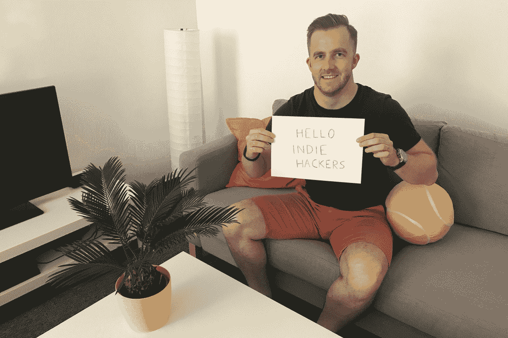
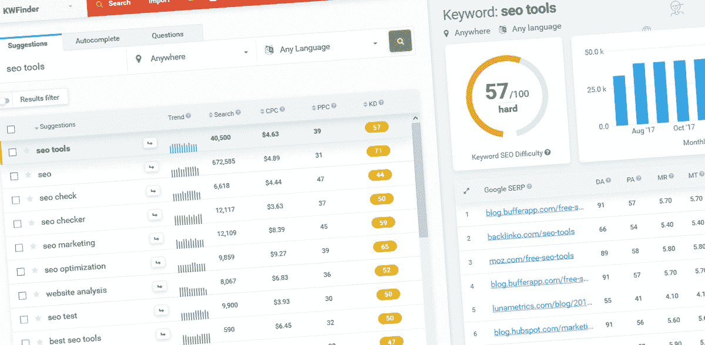

# 安然度过失败，引导一家 22 万美元/月的 SaaS 公司

> 原文：<https://www.indiehackers.com/interview/riding-out-failures-to-bootstrap-a-220k-mo-saas-company-19f3172f86>

## 你好！你的背景是什么，你在做什么？

我的名字叫彼得。我来自斯洛伐克，是 [Mangools](https://mangools.com/) 的创始人兼 CEO。我在大约 12 岁的时候开始编程，并立即被这样一个事实所吸引，即我可以用很少的钱创造一些有可能吸引全世界成千上万人注意的东西。

我一直想拥有自己的在线产品，最好是 SaaS 的产品，由一个由才华横溢的人组成的小团队提供支持。因此，我开始开发各种“项目”，并开始自己创建功能齐全的原型。它们并不总是最漂亮或编码最好的应用程序，但它们确实有效，我能够相对快速地启动它们。最重要的是，我能够在没有外部投资的情况下做到这一点，除了时间之外，我自己没有任何成本。公平地说，这花费了我很多时间，而“错过的机会成本”是一笔不应该被忽视的开销。但是你明白了。

 

不考虑成本效益，我推出了一个又一个失败的产品。因为我的产品都没有盈利，为了维持生计，我不得不兼职为客户做些自由职业。我从来不热衷于用我的时间去换取金钱来为别人的项目工作，我更喜欢从我自己建造的东西中获利。

就在我开始认为我永远不会看到本土成功的时候，我创造了 [KWFinder](https://kwfinder.com/) ，一个简单易用的关键词研究工具。第一个版本在一个月内就准备好了，我把它发表在了 HackerNews 和 Reddit 上，就像它之前的许多其他项目一样。除了这一次，反馈出乎意料地积极。说完，旅程开始了！

## 是什么促使你开始使用芒果？

开始吧。你得试试。做任何事情——试着改进一些东西或者创造一个你自己真正需要的工具。你会在这个过程中学习。

TweetShare

像许多独立黑客一样，我开发了一个产品来解决我自己当时正在解决的一个问题。很简单，我需要一个工具来进行关键字研究，这样我就可以找到竞争较少的热门利基市场。当时已经有多个工具了，可惜(或者说幸运)，我一个都不喜欢。它们要么难看，不能用，要么不适合移动。

没有找到任何适合我的需求，我决定创建自己的基于网络的，简单的关键字搜索工具。

## 构建最初的产品需要什么？

真的很简单。我在一个月内基于一个丑陋的意大利面条代码创建了第一个版本，尽管它确实有很多问题。不管怎样，人们喜欢它。更有甚者，他们中的一些人说他们愿意为此付出代价！于是我开始工作，两个月后，我推出了一个改进很多、更稳定的版本。

在接下来的 18 个月里，我这个不起眼的项目达到了每月 5000 美元的经常性收入，几乎不需要维护。

我个人生活中的某些事件让我在职业生涯中做出了一些重大改变。我决定不再仅仅为了挣工资而去做我不喜欢的项目，我只会做我真正感兴趣和热爱的事情。也许有点天真，但我感觉很好。我立即停止了与客户的合同工作(对不起伙计们！)，然后我开始独自在 KWFinder 上工作。不久之后，弗兰蒂塞克和马丁上船了。

## 你们是如何吸引用户，种植芒果的？

好的产品会自我销售，我知道我有好的产品。它真正需要的只是一个催化剂——一些能让它进入少数用户手中并开始传播的东西。这正是 HackerNews (ShowHN)和 Reddit 上第一波自我推销所做的。从那以后，这种工具的受欢迎程度自然增长。我收到了很多积极的反馈，用户在论坛和问答网站上写评论和推荐。

如果你失败了，再试一次。很快就会失败。因为你会失败，至少一开始会。

TweetShare

为了进一步推动增长，我在发布后不久就创建了一个联盟计划。有了一些加盟的经验，我把它设计得超级容易加入并开始赚钱。没有初始批准过程或复杂的注册表格。相反，我们开发了一个内部流程，帮助我们识别不良行为者的任何有害行为，以便我们能够快速有效地消除它。时至今日，联盟计划是我们最好的营销渠道，产生总收入的 10%左右。

前两年我真的没有做任何营销。这种工具或多或少是有机增长的，从最初 18 个月的 5000 美元到两年后在 MRR 的 25000 美元。

| 月 | 收入 |
| --- | --- |
| 2015 年 1 月 | 2465 |
| 2015 年 7 月 | 4787 |
| 2016 年 1 月 | 10769 |
| 2016 年 7 月 | 20211 |
| 2017 年 1 月 | 86530 |
| 2017 年 7 月 | 125490 |
| 2018 年 1 月 | 192527 |
| 2018 年 7 月 | 223000 |

Maros 现在是我们的营销主管，他于 2016 年 8 月加入我们。我们启动了一系列不同的营销策略，测试了多种营销渠道，其中最重要的是我们的内容营销。我们制作定期的博客文章和专门的内容单元，比如 SEO 指南。尽管他们没有带来任何显著的流量，我们的内容频道帮助我们与观众建立关系和信任。

## 你的商业模式是什么，你是如何增加收入的？

我们的商业模式基于免费增值定价策略。我认为“免费”是有史以来最好的营销技巧。当然，它吸引了“永远免费”的用户，但它也吸引了大量的关注和口碑推荐，最终转化为收入。

付款通过 PayPal 和 Braintree 收取。我们公司的总部设在斯洛伐克，所以我们没有 Stripe。

我们最终达到了一个目标，那就是我们想要更积极地推动增长。我们希望在这方面有策略和意图，并希望利用我们现有的观众作为资源。更重要的是，我们想使我们的收入来源多样化。我们认为 KWFinder 过于专业化，因此太容易受到潜在市场波动的影响。

考虑到这些因素，我们决定为我们的客户构建有用的工具，让他们可以用于日常的 SEO 任务。在接下来的两年里，我们推出了 [SERPChecker](https://serpchecker.com/) 、 [SERPWatcher](https://serpwatcher.com/) 和 [LinkMiner](https://linkminer.com/) 。尽管这些工具都是独立运行的，但它们与 KWFinder 以及彼此之间可以协同工作。

每个人都是独一无二的，每个成功的故事都需要独特的配方。

TweetShare

我们的商业模式不同于 Moz 或 Ahrefs，它们是 SEO 工具行业最大的玩家。我们不想创建一个强大的，一体化的搜索引擎优化工具。我们希望有独立的、简单的、高度集中的工具，这些工具相互关联，但最终是自主的。为了实现这一目标并维持一定的秩序，我们创建了 Mangools，这个品牌涵盖了我们所有的工具，并为计费和支持提供了一个中心点。

这种方法有利有弊。虽然在 Google 中很难对每种工具分别进行排名，但交流每种工具的用途和好处更容易，因为它们是不同的。独立的工具也带来了简单性和易用性——这是我们在设计它们时最为看重的品质。

提示:修改价格时要小心。正如在各种案例研究中提到的，价格翻倍并不总是导致收入翻倍。

 

## 你未来的目标是什么？

从第一天开始，我们的目标就一直保持不变:让我们的业务更强大，让我们的工具更好，同时保持它们的简单易用。我们目前正在计划如何通过收购继续增长。我们正在寻找小型在线 SaaS 企业，这将(在最好的情况下)与我们目前的工具集协同工作。

为了给我们的客户带来更多的价值，我们正在将 [SiteProfiler](https://siteprofiler.com/) 添加到我们的 SEO 工具组合中。

## 你面临的最大挑战和克服的障碍是什么？如果你必须重新开始，你会做什么不同的事？

我唯一可能会改变的是，我会声明尽快全力以赴完成这个项目。我失去了将近两年的时间，继续接受我不喜欢的合同，而不是把全部时间放在这个项目上。这从一开始就是有利可图的，我可以很容易地在几个月内完成转换。

## 有没有发现什么特别有帮助或者有优势的？

我做任何事情的能力既是我的优点也是我的缺点。虽然我自己能够很快推出一个产品，但我无法扩展它，因为我无法委派任何工作来腾出时间推动增长。

当我们的设计师 Frantisek 和我们的开发人员 Martin 在 2016 年 3 月加入我，帮助创建新版本的 KWFinder 时，情况发生了变化。影响是巨大的。从那时起，其他一些人加入了这个团队，Mangools 继续以稳定的速度增长。

## 对于刚刚起步的独立黑客，你有什么建议？

每个人都是独一无二的，每个成功的故事都需要独特的配方。这就是为什么简单地复制其他人/事很少奏效。停止阅读博客，听播客，分析一切，等待下一个十亿美元的想法。你只是在浪费时间。如果你从来没有把自己放在一个应用它的位置上，你为下一个伟大的想法储存的所有知识都是毫无价值的。没有行动，就没有任何意义。

开始吧。你得试试。做任何事情——试着改进一些东西或者创造一个你自己真正需要的工具。你会在这个过程中学习。新的想法将会出现。如果你失败了，再试一次。很快就会失败。因为你会失败，至少一开始会。:)

我相信暴力方法。毕竟，它对我有效。

## 我们可以去哪里了解更多？

如果你想了解更多关于我们或 SEO 的信息，请查看我们的 [Mangools 博客](https://mangools.com/blog/)。

——[<picture id="ember5217019" class="user-avatar ember-view user-link__avatar"></picture>彼得·赫尔巴西克](/PeterHrbacik?id=9XFOFnuxXCMJu6fuHm49C83DVk72)【曼古尔斯】创始人

## 想像 Mangools 一样建立自己的事业？

你应该加入[独立黑客社区](/)！🤗

我们是几千名创始人，互相帮助建立有利可图的业务和副业。来分享你正在做的事情，并从你的同事那里获得反馈。

还没准备好开始使用你的产品吗？没问题。这个社区是一个认识人、学习和实践的好地方。随意[随便浏览](/)！

——[<picture id="ember5217024" class="user-avatar ember-view user-link__avatar"></picture>考特兰艾伦](/csallen?id=ibTLPyjwVebnZjMGKvz6ztarnuV2)，独立黑客创始人

106votes