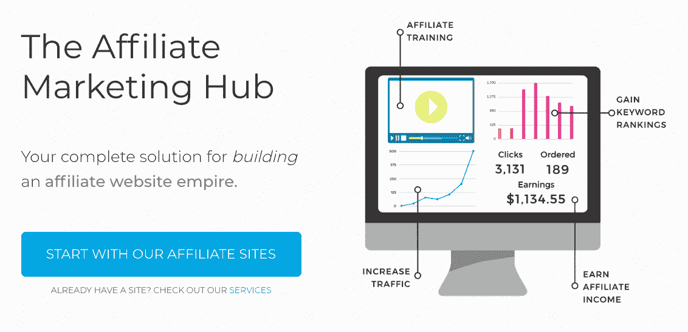
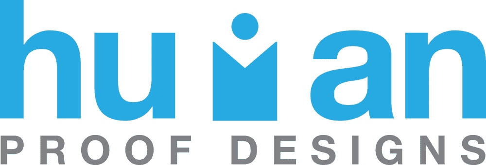
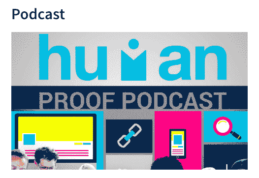

# 将一个人的生意发展成百万美元的生意

> 原文：<https://www.indiehackers.com/interview/scaling-a-one-man-operation-into-a-million-dollar-business-ffe556e16d>

## 你好！你的背景是什么，你在做什么？

我是唐·威尔斯，来自英国，但目前住在台湾台北。我从 2008 年(那时我是一名英语老师)开始住在台北，但从 2013 年左右开始全职在线工作。我目前正在从事[人体验证设计](https://www.humanproofdesigns.com/)，它是我在 2013 年末创建的，并发展到目前的状态。HPD 在联盟营销领域提供培训和服务。

我们的旗舰产品是我们的“为你做”会员网站。任何人，从初级会员营销人员到更有经验的人，都可以使用我们的服务。

2017 年，我们实现了 110 万美元的销售额，这是我们首次突破七位数的门槛。2018 年，我们希望达到 130 万美元。

 

## 是什么促使你开始人类验证设计？

我创办了 HPD，因为我注意到有很多人在 Flippa 上出售垃圾“交钥匙网站”，人们都在狼吞虎咽，期望自动赚钱。

我知道这些人会失败，因为他们买的是垃圾，但他们不会明白为什么会失败，因为他们不熟悉产品或业务。所以我想提供更好的东西，一些合法的东西，这实际上可以帮助人们开始“为你做”的服务。然后，我意识到我还必须创建大量的培训，因为大多数人不知道这些网站上线后该做些什么。

因此，HPD 和它的博客诞生了。那时，我还在兼职教英语，也在用我自己的网站收入。我赚的每一美元都用来帮助 HPD 扩大规模，所以这在很大程度上是一项自助业务。

一开始很难验证这个想法，因为我主要是在和骗子竞争。我知道“为你做”的服务一定很受欢迎，因为我有很多自己的附属网站，我生活和呼吸着网络营销。我个人与企业的联系帮助我们获得了一些吸引力。我在博客上记录了我学到的东西和我成功运用的技术，所以人们自然会被我们和我们的产品所吸引。

## 构建最初的产品需要什么？

因为我已经成功地经营了几个自己的网站，所以我已经知道制作一个像样的联盟网站需要什么。最困难的部分是弄清楚最初的报价到底包括什么。我想做一些负担得起的东西，所以我开始提供 250 美元左右的网站，不包括任何内容。然而，我意识到人们需要内容，也需要搜索关键词。他们不希望我只是挑选利基，给他们一个骨架网站，让他们继续下去。

因此，随着时间的推移，我们增加了我们的网站，并相应地定价。然后，这只是一个调整的情况，直到我们找到了甜蜜点。我们基本上是想以最合理的价格给人们最大可能的东西。这导致我们创建了“为你做”的网站，提供大约 10，000 字的内容、关键字优化、页面搜索引擎优化、一个完整的网站，以及一个从那里开始发展网站的计划/蓝图。

这是一个不断发展的过程，我们将在未来几周内更新我们的报价。随着联盟营销的变化，我们的受众也发生了变化，人们对我们的需求也不可避免地发生了变化。最终，我们的决策是基于对需求的响应。如果人们想要 X，并且我们可以包含它，我们会的。

我原本想先为人们建立网站，然后让他们浏览和购买。问题是，我最初基本上没有钱(我自己的互联网营销努力支付我的租金)，也没有观众。所以我不想建立一堆网站，为它们的内容付费，然后被它们困住，希望有人来买它们。

因此，我开始建立网站的佣金。这意味着客户将预先付款，然后我将开始这个项目，这是一个更具可扩展性的方法，随着更多订单的到来，我能够雇佣帮手。

 

## 你是如何吸引用户和开发人性化的设计的？

我在上面提到了这一点，但基本上我们已经做了，并且仍然在做:

1.  写好内容，在大家蜂拥而至的时候高枕无忧。

哈哈没有，开玩笑的。

然而，好的内容是我们工作的很大一部分。我们专注于教授联盟营销，所以这吸引了我们的观众，他们中的许多人最终雇用我们的服务。我们已经开始销售课程，这需要时间来获得牵引力，但内容营销是其中的一大部分。我最初曾考虑免费提供网站，让用户订阅培训，但我觉得这不太实际，我不想为了盈利而劫持人们的网站。最后，我对我们走过的路很满意。

最初我们专注于 SEO，虽然我们仍然这样做，但我们也为现有受众设计内容，所以不是我们创建的每个帖子都以在谷歌排名为目的。有时候你的读者只是需要阅读一些东西，不管是否有人在搜索它。

如果我要做一些不同的事情，我会更关注我的观众需要什么，而不是我想给他们什么。

TweetShare

2.  在我们有名字和品牌之前，我和这个领域的其他有影响力的人进行了很多接触。

这当然需要时间，因为有这么多的“大师”和人教联盟营销，我最初并没有真正重视。实际上，很公平。过了一段时间，人们开始看到我在做好事，一旦一两个有影响力的人开始推荐我，让我为他们做客座博文，或者让我上他们的播客，那么其他有影响力的人也开始做同样的事情。

他们中的许多人现在都是我的朋友(有些甚至是在现实生活中)，所以社交网络是在这个领域获得成功的重要因素。事实上，我希望我没有等了六个月才鼓起勇气开始做这件事！在某一点上，推荐流量是我们最高的转换流量来源，所以它只是去显示如何重要的网络。

 

3.  积极参与脸书团体和论坛。

花时间在脸书会让你觉得你在工作，但实际上你是在浪费时间，所以这是一把双刃剑。也就是说，在我所处的位置，这是我的观众经常光顾的地方，这也是我如何建立自己的权威并赢得用户群的原因。通过回答人们的问题，参与社区活动，以及只在相关的地方(非常重要)删除我的内容的链接，我已经能够在脸书上获得很多关注。

也是品牌传播者的好去处。每当人们要求对我们的服务进行评论，或者询问使用哪些服务时，这些群体中有许多 HPD 客户非常乐意向我们推荐，而我在这些群体中也很活跃，这使得这个过程更加有机。

## 你的商业模式是什么，你是如何增加收入的？

每个月我们都会列出我们研究和建立的“现成的”联盟网站。其中一些是“老”网站，我们在上市前六个月建立的，所以人们可以挑选它们并跳过一些沙盒期(谷歌不喜欢对全新网站进行排名的时期)。还有其他的，比较便宜，因为是全新的，一造出来就上市了。

我们有一些网站，人们委托我们建立，所以他们还没有准备好上市，但我们会尽快建立有人支付。不过，我们正在从这些网站中转移出来，只专注于那些准备好立即恢复的网站。

我们也做定制网站，人们给我们带来他们的利基想法，我们基于自己的专业知识和关键字研究，围绕这些利基建立网站。除此之外，我们还有一些补充服务，比如文章写作、SEO、链接建设等等。我们最初没有提供这些，但人们一直在问，我们凭什么拒绝他们！

追加销售、额外服务和增加客户的终身价值是我们业务增长的一种方式。我们还扩大了我们列出的网站数量，以及前面提到的补充服务。我们现在是一个庞大的团队——200 多名自由职业者提供服务，以及一个大约 10 人的核心领导团队。

我们已经试验了付费广告，但结果从来没有定论。有时看起来我们挣的比花的多，但有时，差得远。考虑到点击付费应该比搜索引擎优化更清晰，点击付费可能会令人沮丧。然而，有一件事做得非常好，那就是升职。7 月，我们通过提供为期两周的大规模促销活动，在服务上提供折扣，实现了 115，000 美元的收入。尽管有折扣，这仍然是我们有史以来第二好的一个月。

我们的一些服务只有 10%的利润，而其他服务有接近 50%的利润，所以我们必须小心我们促销的产品。2017 年，我们有几个月在对利润最低的产品进行促销，几个月的收入都有突破，然后想知道为什么我们几乎没有赚到钱。哎呀！

我们发现许多最大的买家都是回头客。我们有很多品牌传播者和一次又一次从我们这里购买的人。这是因为这些年来我们改进了运营部门，将曾经最弱的部门变成了最强的部门。

 

## 你未来的目标是什么？

在我们扩展 HPD 的整个过程中，我们也一直在扩展我们自己的联盟网站组合，因为说到做到很重要。如果我们自己不积极参与，我们就不能只教联盟营销。我们有高效的流程和有才华的团队，如果只是为别人而不是我们自己建立网站，那将是一种浪费。

因此，我们未来两到三年的增长很大一部分将来自更积极地扩大我们的投资组合。我们还与一些人合作，帮助他们发展自己的网站，我们也可能考虑成立一个基金。

## 你面临的最大挑战和克服的障碍是什么？如果你必须重新开始，你会做什么不同的事？

当事情真正开始发展时，我们在运营方面遇到了很多困难。我们只是没有足够的人来满足需求，最终我们不得不退款给客户。我们的声誉当时受到了打击，因为现在在脸书团体中称赞我们的那些人会去那里抱怨我们有多慢。

如果你想提升你的事业，你必须提升自己。

TweetShare

我们已经解决了所有这些问题，现在最困难的是继续扩大规模，以满足我们一直以来雇佣的员工的工资。我们仍然非常盈利，但随着你获得更多的费用，增长最终开始放缓，你必须努力平衡账目。

如果我要做一些不同的事情，我会更关注我的观众需要什么，而不是我想给他们什么。不过，对许多企业来说，这可能是真的。我也会更早开始建立关系网，更早雇佣我的团队。

## 有没有发现什么特别有帮助或者有优势的？

当我们遇到运营问题时，吉诺·维克曼的书《牵引力》帮了我们大忙。它真的改变了我的生活，就像广告宣传的那样。此外，加入各种社区，如[炸药圈](http://www.tropicalmba.com/dc/)，与其他有商业头脑的人建立联系也非常重要。

如果你想提升你的事业，你必须提升自己。不只是心态，而是一切。

## 对于刚刚起步的独立黑客，你有什么建议？

不要害怕根据新信息发展和改变你的产品或服务。这将会有一些收益递减，因为你不能一直改变，但你必须不断创新，并对新的需求和客户反馈做出反应。

## 我们可以去哪里了解更多？

www.humanproofdesigns.com 是跟上业务发展的最佳地点。

在我们免费的[脸书小组](https://www.facebook.com/groups/1165987043433051)中，我们也有一群相当投入的观众！

 

—[<picture id="ember5305225" class="user-avatar ember-view user-link__avatar"></picture>人体样张](/HumanProof?id=1OIMGRlG5cgZon5oupaBmZwf6QA2)

## 想像人类验证设计一样建立自己的事业吗？

你应该加入独立黑客社区！🤗

我们是几千名创始人，互相帮助建立有利可图的业务和副业。来分享你正在做的事情，并从你的同事那里获得反馈。

还没准备好开始使用你的产品吗？没问题。这个社区是一个认识人、学习和实践的好地方。随意[随便浏览](/)！

—[<picture id="ember5305230" class="user-avatar ember-view user-link__avatar"></picture>考特兰艾伦](/csallen?id=ibTLPyjwVebnZjMGKvz6ztarnuV2)，独立黑客创始人

46votes