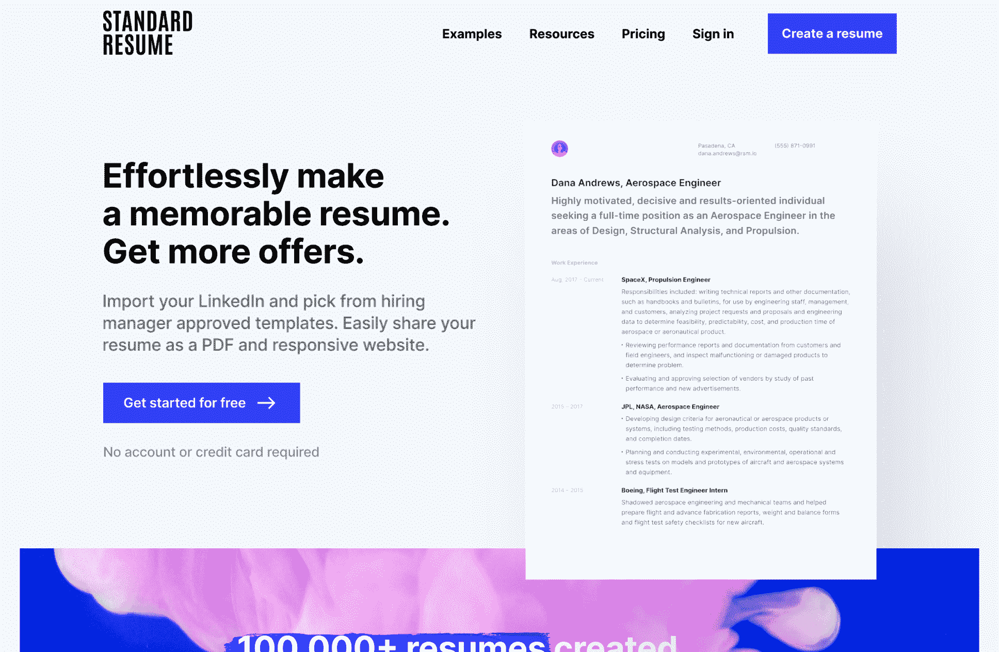
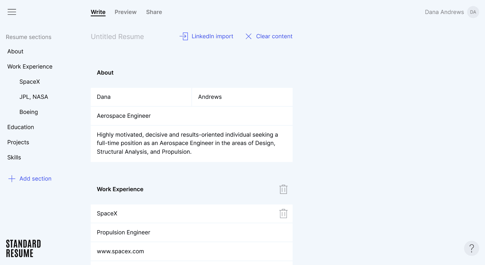
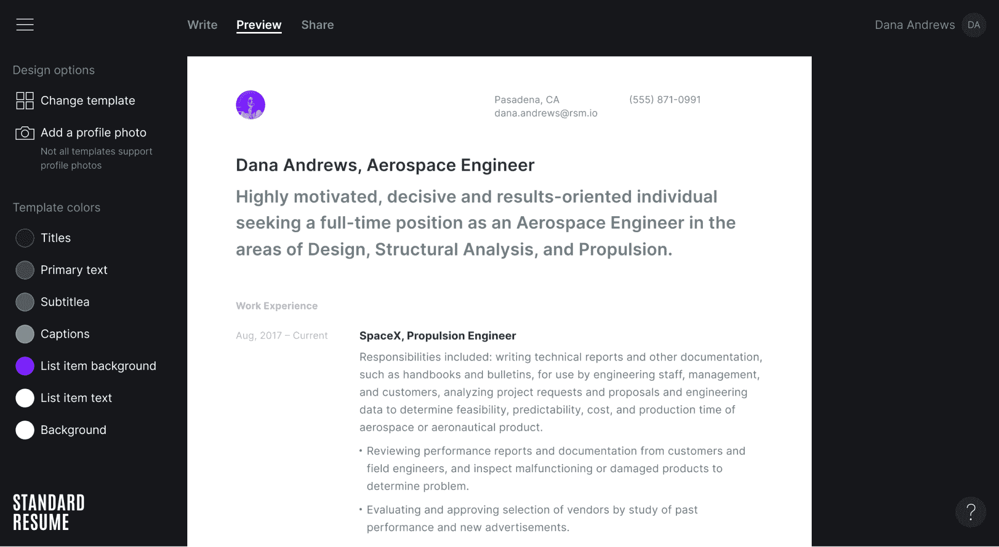

# 挠挠自己的痒让我辞掉白天的工作，全职自举

> 原文：<https://www.indiehackers.com/interview/scratching-my-own-itch-let-me-quit-my-day-job-and-bootstrap-full-time-de5bfdeaa9>

## 你好！你的背景是什么，你在做什么？

嗨！我是 Riley Tomasek，[标准简历](https://standardresume.co/)的创始人之一，这是一个允许任何人创建漂亮简历的应用程序。

在全职制作标准简历之前，我是一名软件工程师和创始人。我共同创立了 [Flight](https://flight.app/) ，并在 Dropbox 等几家初创公司担任软件工程师。

标准简历是一个 web 应用程序，可以轻松创建 PDF 和 web 简历。导入您的 LinkedIn 个人资料，并从招聘经理批准的模板中选择。轻松分享你的简历作为一个 PDF 格式和响应网站。

标准简历已经帮助创建了超过 100，000 份简历，我们的月收入是 3000 美元。

## 是什么促使你开始使用标准简历？

五年前，我申请工作，想要一份好看的简历。我尝试了一些现有的解决方案，但并不喜欢它们，所以我最终从零开始构建一些东西。这是一个可以打印成 PDF 格式的静态网站。我的朋友莎莉和思南设计了它，现在是我的共同创始人。

我们决定建立一个简单的编辑器，可以生成简历网站，并发布了它。几周后，也就是 2015 年 5 月，我醒来后收到通知，说标准简历已经发布到 Product Hunt。凯文·威廉·大卫把它贴了出来，我们已经有了几百个支持票。

尽可能快地验证一切。最好的方法是让人们付钱。

TweetShare

我们最终成为了当天的第一产品，并获得了几千名新用户。不久后我开始在 Dropbox 工作，我们继续支付账单，但在其他方面忽略了它。

两年后，在 2017 年 6 月，我们决定添加几个最受欢迎的功能作为付费订阅。我们完成了功能，设置了 Stripe 用于计费，并继续将其作为一个附带项目运行。

2020 年 5 月，我决定要致力于建立一些有利可图和可持续发展的东西。我已经受够了风险投资创业公司的包袱。标准简历仍在增长，这似乎是一个尝试的绝佳机会，所以我最近把它变成了一个全职项目！

## 构建最初的产品需要什么？

正如我前面提到的，第一个版本非常简单。它固执己见，没有定制，只有一个简历模板。产品焦点与简单的技术组合相结合，使其能够快速构建。第一个版本花了几个月的周末和晚上。

当我开始全职制作标准简历时，我们决定重建整个应用程序。知道我将有更多的时间和精力来开发这个应用程序，我们决定让它更加强大。这也意味着它的构建更加复杂。

我已经为此工作了大约两个月，我们几乎准备好了一个完整的版本。

## 你的技术是什么？

我们将 [Firebase](https://firebase.google.com/) 用于我们的数据库、认证、云功能和应用托管。它允许我们以很少的开销和维护开始。

网站运行在 [Next.js](https://nextjs.org/) 和 [Vercel](https://vercel.com/) 上。我们希望我们的营销页面是静态的，但也需要服务器呈现网络简历。服务器渲染是为了 SEO，静态页面是为了性能。

该应用程序和网站都使用 [React](https://reactjs.org/) 和常用的库。传统上由服务器处理的事情，由 JavaScript Firebase 云函数来完成。

我们最大的技术挑战和唯一的主要变化是 PDF 简历的创建。我们最初使用一项服务来创建 PDF 简历，但无法使它们与我们的设计相匹配。在制作最新版本的标准简历时，我们构建了一个自定义的 PDF 呈现器。这是一项繁重的工作，但它使我们能够生成比任何竞争对手都要好的 pdf 文件。

## 你是如何吸引用户和发展标准简历的？

我们已经发布了两次产品搜索，这是我们增长的主要原因。我们的第一个发布周有 12，000 次页面浏览，平均每周 1，500 次。我们的第二次发布有 10，000 次页面浏览，平均每周 4，000 次。

当你寻求反馈时，大多数人会告诉你他们认为你想听到的，而不是事实。

TweetShare

除了寻找产品之外，由于顾客的满意和独特的产品，我们的增长靠的是口碑。我们是唯一能够[导入您的 LinkedIn 个人资料](https://standardresume.co/linkedin-resume-builder)并将其转化为简历的简历生成器。

我们最近开始探索几种不同的增长策略，包括内容营销/SEO、赞助和广告。到目前为止，我们已经创建了一个[简历示例](https://standardresume.co/examples)和[简历写作资源](https://standardresume.co/resources)的集合。

由于时间尚早，我们没有任何结果可以分享，但请关注我们的产品页面以获取更新。

## 你的商业模式是什么，你是如何增加收入的？

我们是通过付费订阅赚钱的免费增值产品。2017 年 5 月开始收费时，我们的价格是 5 美元/月或 20 美元/年。第一年后，我们看到 MRR 缓慢的线性增长，达到 440 美元。我们的 MRR 在 2019 年 5 月继续线性增长至 1000 美元，然后在 2020 年 5 月回升至 2700 美元。

| 月 | 收入 |
| --- | --- |
| 17 年 9 月 | 255 |
| 18 年 3 月 | 390 |
| 18 年 9 月 | 600 |
| 19 年 3 月 | 860 |
| 2019 年 9 月 | 1370 |
| 3 月 20 日 | 2700 |

我们从第一天开始就使用条纹。这很棒，我肯定会推荐给任何刚开始的人。Stripe 的安装速度很快，在我们使用它的三年里没有出现任何问题。能够快速改变价格对于提高我们的 MRR 至关重要。

过去两年，我们在 MRR 的大部分增长都来自于价格和产品的变化。通过试验价格，我们能够在不改变产品的情况下增加我们的 MRR。我们还对我们的免费增值模式做了一些小的改变，增加了转化率。

## 你未来的目标是什么？

我们目前的重点是增加流量。我们没有在营销上花太多时间，我们认为有很多增长的机会。

我不相信设定与具体结果、日期或数字相关的目标。我们不断地重新评估什么对我们来说是重要的，并尽最大努力去做。Jason Fried 写了一篇文章,与我们对目标的想法非常吻合。

## 如果你必须重新开始，你会做什么不同的事？

我们的流失率很高，因为大多数人每隔几年只需要几个月的简历。我们从一开始就知道这一点，但事实证明这是一个比我们最初想象的更大的问题。

高流失率使我们难以增加客户终身价值，这反过来意味着我们不能从每个新客户身上赚很多钱。许多营销渠道获取客户的成本比我们从他们身上获得的要高。

因此，如果我们重新开始，我会花更多的心思在如何减少客户流失上。五年内改变你的商业模式或产品要困难得多。

## 有没有发现什么特别有帮助或者有优势的？

拥有良好的分析和收集用户反馈的方法对我们的成功至关重要。分析让我们保持诚实，并让我们很容易衡量我们所做的每一项改变的影响。用户反馈帮助我们区分工作的优先次序，并知道我们的更改何时解决了预期的问题。我肯定会推荐建立体面的分析和尽早收集用户反馈的方法。

我们很幸运能够在没有争取客户的情况下取得今天的成绩。我们非常感谢产品搜索社区的早期采用和宝贵的反馈。

## 对于刚刚起步的独立黑客，你有什么建议？

做一些人们确实需要的东西并为此收费。这听起来很简单，但做起来却出奇的难。当你寻求反馈时，大多数人会告诉你他们认为你想听到的，而不是事实。

我们很幸运，因为标准简历是从解决我自己的问题开始的。如果你没有足够的运气来解决你自己的问题，确保尽可能快地验证一切。最好的方法是让人们付钱。这是一个比别人说的任何东西都好的信号，甚至比注册和使用等非付费指标都好。

更多一般建议，请查看海军的推特风暴[如何致富(没有运气)](https://twitter.com/naval/status/1002103360646823936)。它有很多直接适用于创业公司的智慧。

## 我们可以去哪里了解更多？

您可以查看我们的[网站](https://standardresume.co)或 [Twitter](https://twitter.com/StandardResume) 了解更多信息。

要取得联系，你也可以[给我发邮件](/cdn-cgi/l/email-protection#e5978c89809ca59691848b81849781978096908880cb868a)或者在 [Twitter](https://twitter.com/rileytomasek) 上关注我。

不要犹豫，在下面添加任何问题或评论。

——[<picture id="ember8073886" class="user-avatar ember-view user-link__avatar"></picture>莱利·托马塞克](/rileyt?id=9IhCopQClbaWluVtnmnfpldc9hk2)【标准简历创始人

## 想像标准简历一样建立自己的事业？

你应该加入[独立黑客社区](/)！🤗

我们是几千名创始人，互相帮助建立有利可图的业务和副业。来分享你正在做的事情，并从你的同事那里获得反馈。

还没准备好开始使用你的产品吗？没问题。这个社区是一个认识人、学习和实践的好地方。随意[随便浏览](/)！

—[<picture id="ember8073891" class="user-avatar ember-view user-link__avatar"></picture>考特兰艾伦](/csallen?id=ibTLPyjwVebnZjMGKvz6ztarnuV2)，独立黑客创始人

16votes