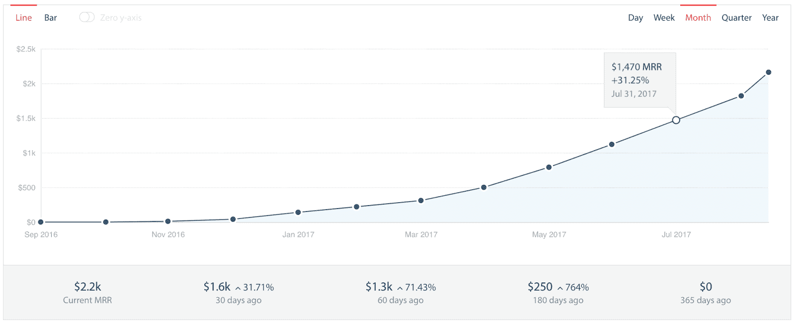
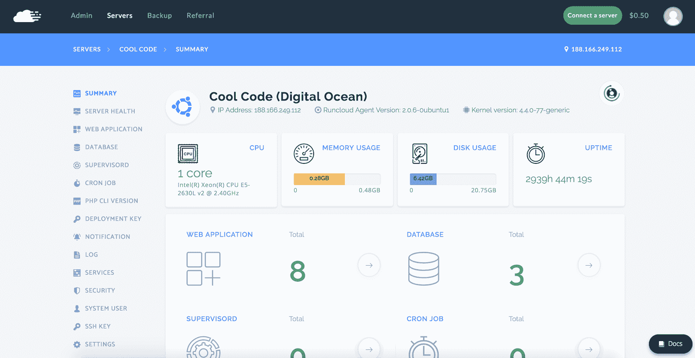

# 通过首先为我们自己建造向开发商销售

> 原文：<https://www.indiehackers.com/interview/selling-to-developers-by-building-for-ourselves-first-694c99cac1>

## 你好！你的背景是什么，你在做什么？

你好，首先我要感谢你给我这个机会上独立黑客。

我叫阿里夫·图奇曼。我目前在马来西亚的新山，在那里我领导我的创业公司[酷码](https://coolcode.my)。我在获得理学硕士学位时，从一个技术创业项目开始编写酷代码，早在一月份，我们的团队发布了 [RunCloud.io](https://runcloud.io/) ，这是我们自己的云服务器面板。

[RunCloud.io](https://runcloud.io/) 是一款 SaaS，帮助你在云托管提供商上设置、配置、管理和监控你的 VPSes(虚拟私有服务器)，更具体地说是针对 PHP web 应用。你的 VPS 可以在 Linode，Vultr，Digital Ocean，Amazon Web Services，Google Cloud Platform，或者任何其他提供商上，只要他们运行的是 Ubuntu 16.04(目前)。

 

## 是什么促使你开始使用 RunCloud？

我们构建了 RunCloud 来帮助我们自己的 web 开发人员以及他们在开发、部署和维护过程中面临的问题。根据他们的反应，我们看到了软件产品化的潜力——我们知道它可以帮助其他开发者解决同样的问题。

故事真正开始于两年前。我的合作伙伴 Fikri 接受了这个想法，并认为也许我们可以为虚拟主机提供商开发一个工具，但当时我们没有现成的稳定的产品。我们很快意识到，由于 WHM、CPanel 和 Plesk 等老牌公司的存在，该领域的市场竞争非常激烈。

因此，在 2016 年初，我们调整了我们的解决方案，以更好地满足 PHP 开发人员和自由网页设计师的需求。鉴于我们自己就是 PHP 开发人员，这是一个更贴近我们内心的市场。

我们通过观察市场和调查竞争对手，验证了这种较窄产品的想法。确实有竞争对手，但没有像 CPanel 或 Plesk 这样的主要参与者。当时，我们这个领域的企业也只有 2-3 年的历史。检查他们的特点，我们相信我们可以为市场提供更好的东西。

我和我的合伙人都是计算机专业的毕业生。阿米尔和我更喜欢移动应用程序开发。我的另一个合伙人 Fikri 在安全和 web 方面更有经验。此前，Fikri 还创建了一项 VPN 服务，并出售了订阅服务。

为了将 RunCloud 打造成为一家企业，我必须担任首席执行官的角色。阿米尔担任首席运营官的角色，领导我们的营销工作，而 RunCloud 架构背后的大脑 Fikri 成为首席技术官。

当我们开始开发这个产品时，我们只是刚从硕士学位毕业的大学生。我们没有工作经验。所以说实话，从钱的角度来说，没有太多多余的。

幸运的是，我们也是单身的大学生，不需要太多就能生存。

## 构建最初的产品需要什么？

首先想到的是我们的 MVP 应该是什么样子。

我们想要一个，但它必须比竞争对手的更好。我们没有很多钱来雇佣额外的帮手，所以我们花了更长的时间来开发它。

为了获得良好的客户体验，我们认为我们的登录页面和文档也必须处于最佳状态。你不知道准备一个网站，撰写技术文档，或完善客户流程和体验需要多少工作。现在，我相信它需要和构建实际的软件一样多的工作。

正如我提到的，我们最初是为虚拟主机提供商开发软件，然后我们就转向了这个领域。在准备发射之前，花了一年时间来改变最初的原型。当时机到来时，我们在来自马来西亚的开发人员和程序员中进行了一次相对安静的发布。从那以后，它一直很受欢迎。

你可能想知道我们如何资助自己。Fikri 主要在 SaaS 工作，而 Amir 和我则负责客户的移动应用工作。完成这件事需要一定程度的信任。如果没有，你可以想象你们三个之间的关系会如何破裂。我想我有很好的朋友和伙伴。

关于我们的 [RunCloud](https://runcloud.io/) 解决方案。它主要基于 PHP Laravel。我们的代理软件位于客户的服务器上，是用 Golang 开发的。

我们最初的版本是用 Node.js 构建的，但是每当服务器上的 Node.js 进行自我升级时，我们都会遇到一点麻烦。目前，我们只支持部署全新的 Ubuntu 16.04 LTS。

一路上，我们得到了马来西亚技术大学 MAGICX 孵化器项目、马来西亚 JOMWEB 开发者社区、马来西亚全球创新中心等的支持。也有许多个人支持者，多得数不清。没有他们，我们就不会有今天，我们永远感激他们的帮助和支持。

我想我们很幸运在马来西亚有一个好的创业生态系统。

## 你们是如何吸引用户并壮大 RunCloud.io 的？

我们的第一次试运行是在 2016 年 11 月的 JOMLAUNCH4 上，这是由马来西亚的 JOMWEB 开发者社区举办的一次活动。我们甚至赢得了 1000 令吉的最佳项目奖。

从那以后，阿米尔和我开始尽可能地分享一切。Reddit、ProductHunt、黑客新闻、替代网站、启动目录、论坛、博客等等。但是没有重大突破。我们甚至尝试联系博主进行评论，但当然大多数回复的是付费评论包。由于我们真的没有钱，所以我们没有购买任何付费评论。

我们从来不知道它会成功还是失败，但我们相信我们的产品，只是继续努力。

TweetShare

我们还创建了一个采访全球 PHP 程序员的 YouTube 频道。那些同意参加我们节目的人真是太棒了。从他们那里可以学到很多东西，所以请随时查看频道并订阅。PHPPNW 会议的组织者 Tessa Mero 向我们介绍了一些伟大的嘉宾，如 Ben Edmunds、Ed Finkler、Chris Hartjes 等。

我认为对我们起作用的是，我们从一个非常好的产品开始。在那之后，我们需要花时间建立关系网，了解人们。Tessa Mero 帮我们介绍了一些要面试的 PHP 程序员。我们从来不知道它会成功还是失败，但我们相信我们的产品和它的好处，所以我们只是不停地努力。

我们肯定会从现有客户那里获得很多好评。我相信他们在向其他开发者传播信息方面帮助很大。自从发布我们的推荐(联盟)计划，我们看到越来越多的评论来自我们的客户，这有助于带来更多的流量，线索和新的转换。

| 月 | 浏览量 |
| --- | --- |
| 2016 年 11 月 | 11561 |
| 2016 年 12 月 | 4641 |
| 2017 年 1 月 | 4596 |
| 2017 年 2 月 | 3060 |
| 17 年 3 月 | 15788 |
| 2017 年 4 月 | 12206 |
| 2017 年 5 月 | 14136 |
| 2017 年 6 月 | 12688 |
| 2017 年 7 月 | 14173 |
| 2017 年 8 月 | 19756 |

我们对社交媒体、搜索引擎优化和电子邮件营销相当陌生。几个月前，我们开始了电子邮件营销，但主要是为了与现有客户沟通。

## 你的商业模式是什么，你是如何增加收入的？

我们从第一天开始收费。通过与竞争对手的比较，我们知道我们有一个好的产品，他们对更少的功能收取更多的费用。我们的套餐很简单。一个免费账户和一个每月 10 美元的账户可以使用无限数量的服务器。那是我们当时唯一知道可以赚钱的方法。(当然，后来事情发生了变化。)

我们使用 Braintree 向客户收费。对于我们这样一家马来西亚公司来说，这是向来自世界各地的客户收费的最简单的解决方案。

在没有外部投资的情况下发展 RunCloud 让我们在业务方向和创造力方面有了很大的自由。

TweetShare

到目前为止，我们已经接触到来自全球 20 多个国家的大约 2，300 名用户。从目前的转化为付费用户，我们的 MRR 一直在稳步增长，每月 24-29%。

本月(2017 年 9 月)我们有望增长到略高于 2，800 美元。最重要的是，我们刚刚推出了备份服务，这是可供客户购买的可选附加服务。

我们看到许多客户的接单率都很高。除了每月 10 美元的收入，我们可能会首次突破每月 4000 美元。

 

我认为这与我们从传奇人物杰·亚伯拉罕身上学到的增加收入的经验是一致的。通常只有三种方法:

1.  更多顾客
2.  每位顾客的购买量更大
3.  更频繁的购买(来自回头客)

作为一家 SaaS 企业，我们已经在做第三件事了。我们一直在努力获得更多的客户，这是第一点。现在，我们终于有了第二个。

通过备份服务，我们增加了一些客户可以付费购买的东西。说实话，这不是初衷。我们收到了很多要求备份功能的反馈，所以我们实现了它。虽然几个月前我们确实有其他计划和优先事项，但我们决定倾听客户的需求。我认为这已经得到了很好的回报。

沿着这些思路，我想分享戴恩·麦克斯韦([TheFoundation.com](https://thefoundation.com/welcome?))的一句名言:“在商业中，你会犯很多错误，如果你做对了一件事，你会做得很好——倾听你的客户。”很棒的建议。

老实说，说到我们自己的生存， [RunCloud](https://runcloud.io/) 提供的还不够支付我们自己的工资。我们仍然接受定制的移动和网络应用工作。有时，我们会提供与编程相关的培训。我们从 RunCloud 获得的收入很可能会重新投入到业务中。在马来西亚生活时赚取美元确实有助于生活费用，因为与美国或欧洲相比，他们是低的。

## 你未来的目标是什么？

我们有很多。最终，我们希望 [RunCloud](https://runcloud.io/) 能够为团队中的每个人及其家人提供美好的生活。到一天结束时，这就是一切。

说到产品，我们有更多的特性可以推出来帮助我们的客户解决他们作为 PHP 开发人员的日常挑战。

我们正在为 RunCloud 开发一个 API，因为这是我们客户的一个很大的请求，所以他们可以为自己的客户开发一个面板。另一个顶级功能请求是团队功能，以便他们可以分配其他用户来帮助管理他们的 RunCloud 面板中的服务器。

随着收入的增长，我们将把它重新投资到业务中。很快，我们将在在线广告和付费评论方面更加积极。我们还将在内容营销方面投入大量资金，为我们的客户和 PHP 开发人员提供优质内容。

我们现在面临的挑战是资金不足。我想你现在可能已经猜到我们没有在广告上花太多钱。只是到处做些小测试。推销和接受投资是很诱人的。我还在考虑。我们可能会引入投资者，但能够在没有外部投资的情况下发展 RunCloud，在所有权、业务方向、创造力等方面给了我们很大的自由。

我们担心的另一件事是可能进入市场的新玩家。作为失败者，一个朋友曾经分享说，你应该担心新来者，而不是老牌玩家。

## 你面临的最大挑战和克服的障碍是什么？

我们在 RunCloud 中面临的挑战是，一旦我们推出产品，我们对产品的稳定性有点担心。由于我们一开始并不知道 RunCloud 的具体表现如何，所以我们收到了大量的 bug 报告。

我们花了大约两个月的时间发布了一个更稳定的版本。因此，从这一点上，我了解到我们需要在试运行前对大量用户进行测试，而我们以前只在内部做过。

 

我们自筹资金开发产品，并自行营销。由于资金有限，我们没有全力推进营销，因此我们交替使用零成本营销约四个月，通过脸书团体和社区获得牵引力。我们还把我们的服务放在云托管论坛上。

对我来说，有机增长是可以的，但有时会感觉业务增长缓慢。因此，如果我在使用我们自己的资金的同时准备和计划一些早期的资金筹集，那会更好。

国际市场渗透也是我们最大的问题之一。经营一家拥有全球目标受众的企业并不像听起来那么容易。找到合适的渠道和关系需要时间。所以，对我来说，为了知道结果，一个快速的执行计划是在短时间内反复试验的必要条件。

积极参与到目标受众的团体或社区中，对于确保产品的知名度易于传递是非常重要的。换句话说，找到有问题并且想要或需要你为他们准备的解决方案的人是件好事。

由于受众遍布全球，不同的时区对我们来说是一个巨大的挑战，因为我们需要计划我们的支持时间和团队成员的轮换。作为一家 SaaS 的初创公司，我们试图优先考虑非常好的客户体验。

我想，在某种程度上，由于英语不是我们的母语，这也带来了一些挑战。我们的网站最初包含许多语法错误——也许现在仍然如此。这看起来一点也不专业，尤其是当你在全球竞争的时候。但我们已经尽了最大努力来改善这一点。

## 有没有发现什么特别有帮助或者有优势的？

RunCloud 在瞄准科技市场的特定利基市场方面做得非常有效。我做了大量的市场调查，研究了适合我们商业模式的趋势。这项研究必须与我们的首席技术官在开发产品时所做的事情保持一致。

我很重视和许多自由网络开发者以及一些科技公司的首席技术官交朋友。从那里，我了解到他们对 RunCloud 的需求，以及我们如何改进和增强它。

我有时会沉迷于用户界面/UX，以确保用户在使用我们的软件时会留下深刻的印象。因此，我起草了很多，并直接与我们的前端开发人员合作，以确保一切顺利运行，看起来真棒。

我以前很少看书，但 RunCloud 改变了这种思维模式，现在我主要阅读关于商业、金融的书籍，以及关于在科技创业行业取得成功的书籍，如阿什利·万斯(Ashlee Vance)的[埃隆·马斯克:特斯拉(Elon Musk)、SpaceX 和对美好未来的追求](https://www.amazon.com/Elon-Musk-SpaceX-Fantastic-Future/dp/B00UVY52JO)。这个新习惯激励了我——为了保持动力，我需要知道我正在走向成功。

我认为我们的另一个优势是我们是为开发者开发产品的开发者。因此，我们完全理解开发人员的想法和感受，这有助于规划开发和营销我们的产品。

## 对于刚刚起步的独立黑客，你有什么建议？

如果你正在创建一家科技创业公司，找到一个好的团队非常重要。每个人都带来了适合团队和产品开发需求的不同专业和技能。有了一个好的团队，产品就能以优秀的方式交付。

作为一家科技公司的创始人，请记住，你自己可能会很艰难，但你应该首先向你的团队成员和合作伙伴支付工资。保持团队的积极性非常重要。

无论你的业务领域或收入模式是什么，都要时刻关注市场趋势。

该领域的市场竞争非常激烈，因此我们调整了我们的解决方案，以更好地满足 PHP 开发人员的需求。

TweetShare

向前看，不要限制自己。以团队领导的身份思考。你的每个团队成员都是各自角色中的领导者，所以不要在创业中表现得太专横。没有必要成为那种类型的领导者。

无论你从事什么行业，都要选择合适的导师。这是继续朝着正确方向前进的必要条件。

不要依赖业务之外的人、力量或资金来发展业务本身。不管外界因素如何，你必须成为你事业的主要推动力。

在你将面临的斗争中自我发展对继续前进很重要。

持续关注你的顾客；不要过于关注竞争对手的活动，以至于忘记了自己的事业。专注于改善你自己的业务，并确保与它相关的每个人都有良好的客户体验。

我认为杰夫·贝索斯说得最好，“专注于客户，而不是竞争对手。”

## 我们可以去哪里了解更多？

你可以在 [runcloud.io](https://runcloud.io) 和我们的博客 [blog.runcloud.io](https://blog.runcloud.io) 了解更多关于 RunCloud 的信息。

我们在我们的脸书主页([http://fb.com/runcloud.io](http://fb.com/runcloud.io))和推特([http://twitter.com/runcloud_io](http://twitter.com/runcloud_io))上发布关于 RunCloud 的更新。

我们还有一个 Youtube 频道。

除了教程视频，我们还有一个名为“RunCloud Show”的专属频道。这个节目邀请开发人员开放并与世界交流，我们探索他们正在做什么，他们正在做的项目，并分享他们迄今为止所做的专业知识和经验。我们邀请过的一些伟大的客人包括 Concrete5 CMS 的创始人 Franz Maruna、脾气暴躁的程序员、PHP 测试倡导者 Chris Hartjes、EC-CUBE 团队、日本排名第一的开源购物车等等。

—[<picture id="ember8231252" class="user-avatar ember-view user-link__avatar"></picture>ariftukiman](/ariftukiman?id=xUZuEsd7j8QpNWjNW7nm1gxt2L63)，RunCloud.io 的创建者

## 想像 RunCloud.io 一样自己创业？

你应该加入独立黑客社区！🤗

我们是几千名创始人，互相帮助建立有利可图的业务和副业。来分享你正在做的事情，并从你的同事那里获得反馈。

还没准备好开始使用你的产品吗？没问题。这个社区是一个认识人、学习和实践的好地方。随意[随便浏览](/)！

—[<picture id="ember8231257" class="user-avatar ember-view user-link__avatar"></picture>考特兰艾伦](/csallen?id=ibTLPyjwVebnZjMGKvz6ztarnuV2)，独立黑客创始人

12votes