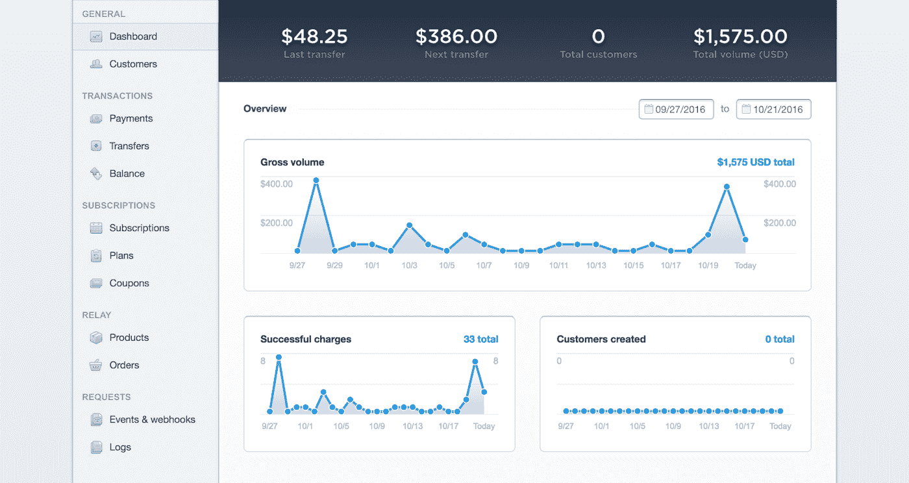
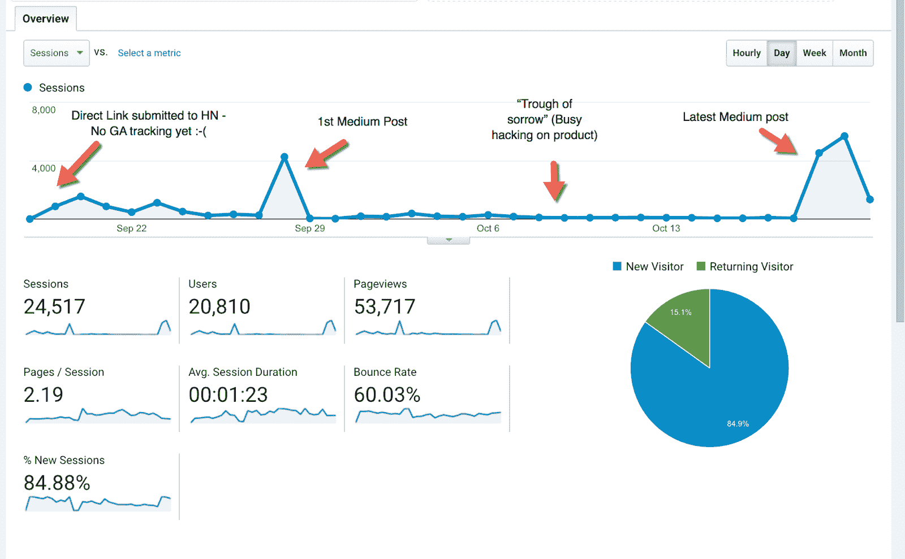
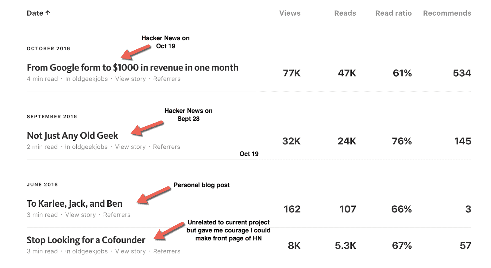

# 为一个被忽视的利基市场服务，以发展一个有利可图的技术工作平台

> 原文：<https://www.indiehackers.com/interview/serving-an-overlooked-niche-to-grow-a-profitable-tech-job-board-edf86b44ab>

## 告诉我们关于你自己和你正在做的事情。

我叫约翰·惠勒，是一名 37 岁的程序员。我正在制作《OldGeekJobs.com》的第一集。

年龄歧视是科技就业中一个众所周知的问题。29 岁是谷歌的平均年龄，马克·扎克伯格说“[年轻人只是更聪明](https://www.cnet.com/news/say-what-young-people-are-just-smarter)”像那样一概而论是非常不公平的。像我这样没有为独角兽工作过的老年人没有价值的想法显然是荒谬的。

在[老极客工作](https://oldgeekjobs.com)背后的想法是，雇主事先知道年龄较大的申请人(35 岁以上)会申请，这让那些申请人觉得申请很舒服。

距离上线已经 36 天了，24 天前我实现了 Stripe。从那以后，我卖每张 25-50 美元的招聘广告赚了 1575 美元。

## 你是怎么开始做以前的极客工作的？

9 月 15 日，我读了蒂姆·布雷关于科技领域年龄歧视的[“老极客”帖子](https://www.cnet.com/news/say-what-young-people-are-just-smarter)，然后立即注册了[OldGeekJobs.com](https://oldgeekjobs.com)并贴出了一个基于谷歌表单的 MVP。它被提交给了《黑客新闻》,获得了 500 多张赞成票，所以我开始用 Python 和 PostgreSQL 构建一个更合法的版本。在之前有一个[，在](https://storage.googleapis.com/indie-hackers.appspot.com/content/old-geek-jobs-before-screenshot.png)之后有一个[。](https://storage.googleapis.com/indie-hackers.appspot.com/content/old-geek-jobs-after-screencast.gif)

## 让事情运转起来需要什么？

2011 年，我为易贝卖家开发了几款 SaaS 应用，这是我的主要收入来源。最赚钱的是[一个易贝反馈提醒](https://feedbackboost.com)。

没有广告，运行一个工作板的资本要求非常低。到目前为止，我只需要花 9 美元注册域名，花 10 美元购买一个便宜的数字海洋实例。

我没有也不想要员工。我喜欢工作板很容易单独工作。我也非常相信创业不需要联合创始人。

## 你是如何吸引用户和发展业务的？

黑客新闻、 [Inc](http://www.inc.com/suzanne-lucas/how-to-get-a-tech-job-when-youre-really-old-like-35.html) 和 [QZ](http://qz.com/784118/someone-created-a-tech-job-board-for-people-over-30/) 。最好的流量来源是黑客新闻。我已经做了三次 HN 首页:第一次是[到我网站的直接链接](http://qz.com/784118/someone-created-a-tech-job-board-for-people-over-30)，接下来是两个中型帖子(这里[这里](https://blog.oldgeekjobs.com/not-just-any-old-geek-13caa19bc187#.c6jzmn9rj)和[这里](https://blog.oldgeekjobs.com/from-google-form-to-1000-in-revenue-in-one-month-3f5cd75b6089#.e8ajmnk8h))。谷歌分析数据如下。(可惜我第一次做黑客新闻的时候没有跟踪码。)

收入主要来自我的博客文章。未来的计划是围绕两个主题继续发帖:你永远不会太老，你不需要一个共同创始人来取得成功。我的另一份工作给了我这样说的可信度，我想用老极客乔布斯做第二个更好的例子。

吸引观众很难，但很有趣。现在我使用媒体和推特。从九月开始，我已经分别吸引了 [465](https://medium.com/@johnwheeler) 和 [646](https://twitter.com/_johnwheeler) 的关注者。我对这些小数字感到非常自豪，并期待着它们的增长。以下是我的中等统计数据:

接下来，我将实施基于订阅的计费，并向初创公司和科技公司的人力资源部门发送冷邮件。我会把我收到的媒体副本发给他们，并解释这次任务。我认为这很容易推销，因为旧的极客工作有双重服务:它为阅读黑客新闻和独立黑客等网站的有经验的候选人提供服务，同时让公司证明他们促进了多样性。

## 你未来的目标是什么？

我想继续关注用户体验。大多数求职公告板都很烂，我把重点放在速度和简单性上。我还想继续培养观众。这是对我来说最重要的两件事。

## 如果你必须重新开始，你会做什么不同的事？

我对自己取得的进步非常满意，不会做任何改变。我希望我能早点开始！

## 你会和有抱负的独立黑客分享什么建议？

注意力是我们生活中最大的财富，所以不要把注意力浪费在无所事事或做无关紧要的事情上。遵循本杰明·富兰克林的时间表，努力工作，保证充足的睡眠。

不要自欺欺人地说今天能做的事明天就能做。学会节俭，省下你的钱。养成阅读和写作的习惯。做你感兴趣的事情。不要让工作阻止你实现自己的梦想:每天抽出一两个小时做自己的事。最好是最佳时段。

## 我们可以从哪里了解更多信息？

在 Twitter ( [@_johnwheeler](https://twitter.com/_johnwheeler) )和 [Medium](https://medium.com/@johnwheeler) 上关注我。请在下面给我留言。查看[我的博客](https://blog.oldgeekjobs.com)，今天在[旧极客工作](https://oldgeekjobs.com)上发布你的工作。

——[<picture id="ember8106961" class="user-avatar ember-view user-link__avatar"></picture>约翰·惠勒](/johnwheeler?id=9qh1rGTEQFNAGDkjifvQJKSopN43)，旧极客工作的创造者

## 想像以前的极客工作一样建立自己的事业吗？

你应该加入独立黑客社区！🤗

我们是几千名创始人，互相帮助建立有利可图的业务和副业。来分享你正在做的事情，并从你的同事那里获得反馈。

还没准备好开始使用你的产品吗？没问题。这个社区是一个认识人、学习和实践的好地方。随意[随便浏览](/)！

—[<picture id="ember8106966" class="user-avatar ember-view user-link__avatar"></picture>考特兰艾伦](/csallen?id=ibTLPyjwVebnZjMGKvz6ztarnuV2)，独立黑客创始人

8votes