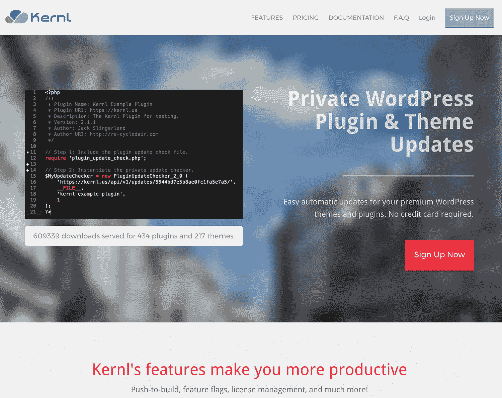
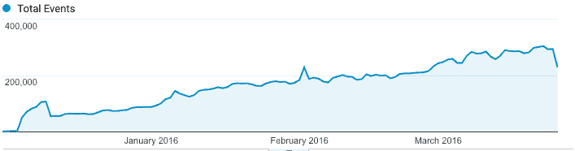

# 发货快，我的副业项目增长到 550 美元/月

> 原文：<https://www.indiehackers.com/interview/shipping-fast-and-growing-my-side-project-to-550-mo-d14d8268e1>

## 你好！你的背景是什么，你在做什么？

你好！我是杰克·斯林格兰，我是 [Kernl.us](https://kernl.us) 的创始人。

我从 1998 年左右开始从事 web 开发(查看我在[重建的星球大战网站](http://re-cycledair.com/starwars/Entrance.html))，目前是北卡罗来纳州罗利 CA Technologies 的高级软件工程师。

Kernl 最初是一个 WordPress 插件，但随着时间的推移，它逐渐演变成一个 WordPress 开发工具平台。很多不同的人使用 Kernl，但是客户群主要由自由职业者和 WordPress 营销机构组成，他们需要一种简单的方式来部署他们的代码。

Kernl 平均每天提供 120 万次更新状态检查，每月收入约 575 美元(还在增长)。

## 是什么促使你开始与 Kernl 合作？

早在 2010 年，我是一名全职 WordPress 开发者，在一家营销机构工作。那时候我还是个相当初级的学生，但是我觉得我的生活将会是*所以*如果我不需要手动上传新的主题和插件版本到客户端站点来部署改变的话会容易得多。我开始做 Kernl 的前身，但是当时我生活中有很多事情要做，所以我停止了工作。

快进到 2015 年。当我想起 WordPress 更新的想法时，我正在寻找一个兼职项目来学习一些更新的技术。我四处逛了逛，发现只有一个服务是按照我想要的方式来做的，所以我就一头扎了进去。

事后看来，不做更多的市场验证就直接投入这样一个项目是愚蠢的，但我最初的意图不是试图赚钱，而是学习新技术，并希望解决我自己遇到的问题。

## 构建最初的产品需要什么？

与大多数兼职项目一样，在构建[内核](https://kernl.us)时，时间是我花费最多的资源。一旦我精通了 Kernl 背后的技术，我花了大约 4 个月的时间让产品进入 MVP(最小可行产品)状态。如果我能够全职工作的话，可能需要 2-3 周的时间，但是我只能在周末和偶尔的晚上工作几个小时。

在我做这个的时候，我的日常工作对我来说并不那么有趣，所以我经常用 Kernl 来保持我的情绪，让我对软件保持兴奋。如果你对你正在建造的东西不感兴趣，那就开始觉得有点太像工作了。

在 Kernl 的早期，我努力做的一件事就是确保把事情减到最少。我认为大多数从事兼职项目的人都有这些宏伟的愿景，但是如果你真的想完成它，那么你需要把这些愿景收回来，专注于 MVP。我知道 Kernl 要想成功，至少需要支持插件和主题的更新。任何过去的事情都只是分散注意力。

往大处想，但要记住:不出货，无所谓。

TweetShare

关于 Kernl 的技术选择，我认为 MEAN stack (MongoDB，Express，AngularJS，Node.js)是一个不错的选择。我已经知道 Angular，对 Node 有一些经验，对 Mongo 还不太熟悉。我觉得你在一个项目上花的“创新代币”是有限的，而我的代币花在了 Node 和 Mongo 上。

到目前为止，这是一次很好的经历，除了尝试管理 Mongo。有一段时间，我在 Digital Ocean 上为 Mongo 建立了一个高可用性设置，但我就是无法正确配置它。最终我切换到 [Compose.io](http://compose.io) 来托管我的 Mongo 集群。这无疑是我每个月花的最好的 18 美元。它*就是用*工作，这是用软件难得的。

 

## 你是如何吸引用户并发展 Kernl 的？

与过去相比，我采用了一种不同的方式来发布产品。我决定以 alpha 模式免费发布 Kernl，并告诉客户它不会永远免费。即使推出了免费的 alpha 版，获得最初的几个活跃客户也很困难。

我最初在《黑客新闻》上发布了 Kernl，在那里它获得了很好的评论和一些注册。我还把它发布到了 WordPress subreddit 上，这也有助于获得一些注册。

除了这两个来源，我在 Twitter 上非常活跃了大约一个月。我会不断地跟踪那些寻找方法来更新他们的私有插件和主题的人。有一段时间，我尝试了谷歌 Adwords，但它转化的人很少。我想将来我可能会用更大的广告购买量再试一次，尽管现在这超出了我的预算:)

人们常说运气是你创业成功的最大因素。运气当然不吃亏，但我相信努力发挥的作用更大。当我们的一个竞争对手在几周内几次宕机时(其中一次宕机长达数天)，Kernl 的运气变好了。当这种情况发生时，我在 Twitter 上积极让人们了解 Kernl，回答问题，并向人们保证 Kernl 是一个更好的服务。

结果是大约 75 名新用户涌入，其中很大一部分人实际上还在使用这项服务。这反映在我们的流量数字中，在 2015 年 12 月初，你可以看到它大幅跃升。

## 你的商业模式是什么，你是如何增加收入的？

Kernl 遵循基于订阅的商业模式。我早期做的一个决定是没有免费层，而是做了一个不需要信用卡的 15 天试用。部分原因是我想要认真的客户，但我也希望人们能够在没有任何摩擦的情况下尝试它。

早期，Kernl 可以作为 alpha 免费使用。我不相信对早期版本的软件收费，所以我也不想让我的客户付费。我用 alpha 测试了新的特性，解决了扩展性问题，并获得了客户的反馈。

一旦我觉得 Kernl 达到了一个我满意的特性里程碑，我就决定把它转移到 beta 版。beta 和 alpha 之间唯一的不同是我不想在 beta 中引入任何新的东西。它的整个目标是增加稳定性和测试覆盖率，然后将现有用户转变为付费用户。

从测试版到发布版的过渡非常简单。首先，我为 Kernl 的每个成员创建了 Stripe 帐户和订阅。然后我给了他们试用期(15 天),让他们把计划和信用卡搞定。到试用期结束时，Kernl 已经有了很多客户，并且在第一个月就赚了 150 美元！到现在已经一年多一点了，Kernl 的客户群还在持续增长。这个月，克恩支付了 597 美元。考虑到每月大约 85 美元的开销，这是相当可观的。

以下是我们自 2016 年 3 月以来的收入情况:

| 月 | 收入 |
| --- | --- |
| 2016 年 3 月 | 148 |
| 2016 年 6 月 | 272 |
| 2016 年 9 月 | 404 |
| 2016 年 12 月 | 443 |
| 2017 年 3 月 | 554 |
| 2017 年 6 月 | 597 |

## 你未来的目标是什么，你打算如何实现它们？

我一直很糟糕的一件事是积极营销[内核](https://kernl.us)。在获取用户方面，我还有很多事情可以做得更好。例如:

*   博客:Kernl 真的需要一个博客。我希望能够向人们展示 Kernl 及其不断增长的工具套件的有用性。
*   广告:我在广告方面做得很糟糕。无论是在会议上，PPC(点击付费)广告，还是其他方式。我应该做得更多。

考虑到这些因素，我的目标是在未来 12 个月内将我的客户数量翻一番。我认为，如果我花时间跟踪大量线索，并在广告和内容营销上加倍努力，这是可能的。我目前的客户群对这个产品很满意，所以我相信我可以花一些时间来更有策略地开发内核，而不是开发更多的功能。

## 你面临的最大挑战是什么？

可能我在制作《内核》时面临的最大挑战是精疲力尽。尽管 Kernl 是我非常热爱的事情，但是在工作了八个小时之后，试图回到家做一个兼职项目是很困难的。在将近两年的时间里坚持这样做对学习如何完成事情很有帮助，即使你没有很多连续的时间来工作。

如果你对你正在建造的东西不感兴趣，那就开始觉得有点太像工作了。

TweetShare

我也面临一些相当棘手的技术问题。当我开始 Kernl 的时候，我真的没有想到它会达到现在的规模，所以我确实做了一些让我背上技术债务的选择。

例如，Kernl 最初存在于数字海洋中一个 5 美元的小水滴上。当我开始达到每秒 30 个请求，每秒 150 个突发请求时，出现了一些严重的问题。它现在有一个高可用性设置，包括一个负载平衡器、2 个反向代理、3 个应用服务器、一个缓存服务器和一个由 Compose.io 托管的数据库。

高可用性对我来说非常重要，因为很多人都依赖内核工作。在开始时，向上扩展和向外扩展更容易设计，但这可能会导致更多的干扰。如果我一开始就担心这些事情，我可能根本不会推出 Kernl。

## 你最大的优势是什么？有什么特别有用的吗？

每个开发人员都喜欢认为技术是他们最大的优势，但实际上我认为超级以客户为中心是[克恩](https://kernl.us)最大的优势。当客户有问题时，我总是试图做出响应，并且我总是努力让客户知道 Kernl 的新功能。

老实说，克恩尔经历了很多运气。我最大的竞争对手在 Kernl 推出 beta 版时遇到了一些严重的问题，我尽可能地利用了这一点。这也意味着我必须确保克恩尔比他们好得多，我认为这是一种很好的压力。

运气当然不吃亏，但我相信努力发挥的作用更大。

TweetShare

## 对于刚刚起步的独立黑客，你有什么建议？

设定目标:让目标变得现实，但还是要设定目标。我只告诉过我妻子的一个目标是，我想让 Kernl 能够支付自己的费用，并每月支付一顿丰盛的晚餐。Kernl 显然已经远远超过了这个目标，所以我设定了其他目标。重要的是要有奋斗的目标。

检查您的 scope:在我构建它的时候，很难确保 Kernl 的 scope 没有失控。如果你让你的项目范围失控，你将永远无法完成。往大处想，但要记住:不出货，无所谓。

玩得开心:说真的，这真的很重要。如果你玩得不开心，就很难保持动力。

## 我们可以去哪里了解更多？

如果你需要一个更好的 WordPress 开发工作流程或者对 Kernl 很好奇，可以查看 [https://kernl.us](https://kernl.us) 。你可以在 twitter 上关注 [Kernl，了解 Kernl 的最新消息，或者在 twitter 上关注我(](https://twitter.com/kernl_) [@jackslingerland](https://twitter.com/jackslingerland) )。如果你有任何关于 Kernl 的具体问题，欢迎在下面评论，我很乐意回答！

—[<picture id="ember8079941" class="user-avatar ember-view user-link__avatar"></picture>杰克·斯林格兰](/kernl?id=pR2OyrfkvNU5OFGl5Xzz7eyBYGs1)【Kernl 的创造者

## 想像 Kernl 一样建立自己的事业吗？

你应该加入[独立黑客社区](/)！🤗

我们是几千名创始人，互相帮助建立有利可图的业务和副业。来分享你正在做的事情，并从你的同事那里获得反馈。

还没准备好开始使用你的产品吗？没问题。这个社区是一个认识人、学习和实践的好地方。随意[随便浏览](/)！

—[<picture id="ember8079946" class="user-avatar ember-view user-link__avatar"></picture>考特兰艾伦](/csallen?id=ibTLPyjwVebnZjMGKvz6ztarnuV2)，独立黑客创始人

4votes