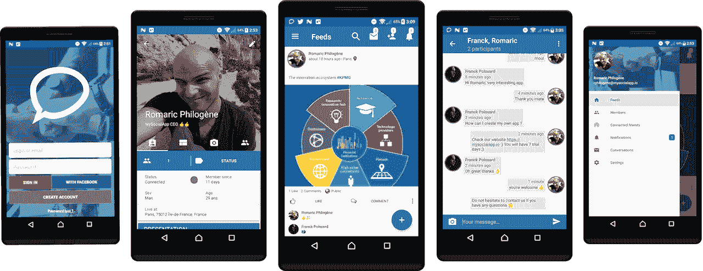
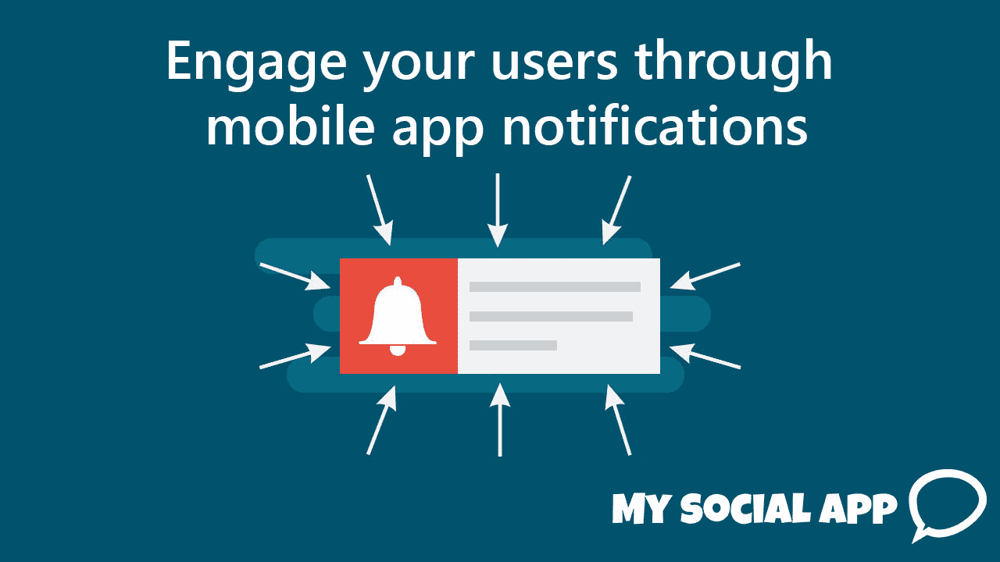
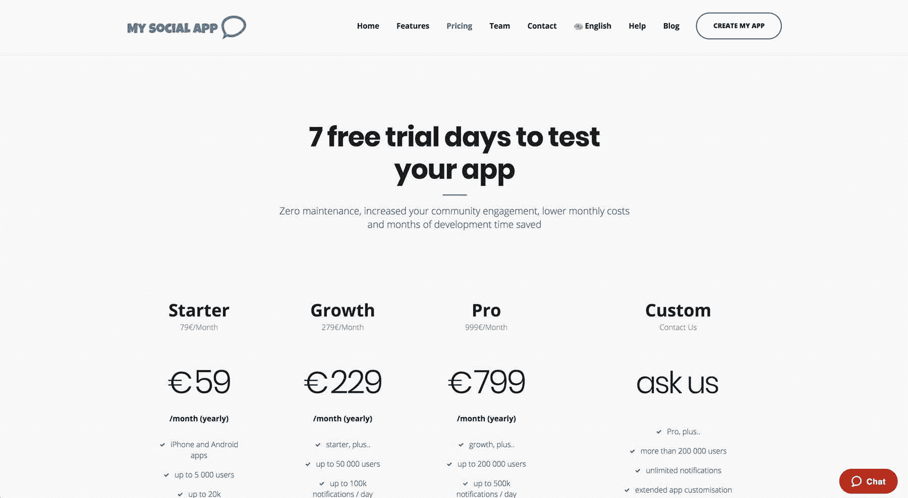
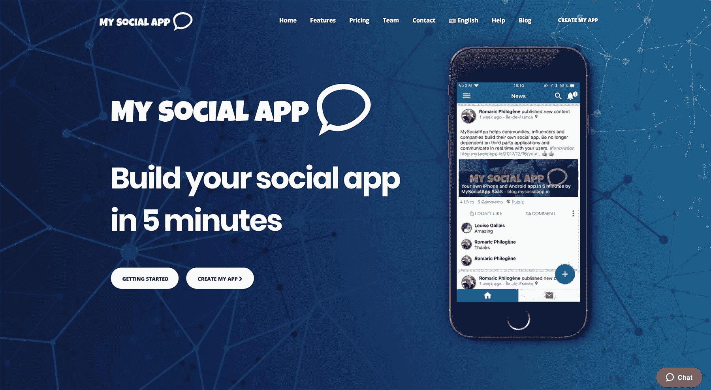

# 社交媒体平台即服务:增长至每月 8 万美元

> 原文：<https://www.indiehackers.com/interview/social-media-platform-as-a-service-growing-to-8k-mo-2e608c3258>

## 你好！你的背景是什么，你在做什么？

你好，我是罗马里奇·菲罗格内。我和[皮埃尔·马夫罗](https://twitter.com/deimosfr)、[雷米·德莫](https://twitter.com/_RDemol)以及奥雷连·博凯一起创立了[我的社交应用](https://mysocialapp.io)。MySocialApp 是一个 SaaS，帮助公司和社区构建他们自己的 iPhone 和 Android 社交应用。

在法国学习了电子学之后，我决定搬到英国继续走这条路，但是三个月后，我的身份证被偷了(我的错)，因此我需要回到法国。这是个预兆吗？我一直热衷于计算机、编程、底层系统；我喜欢想象和建造东西。而这件人生大事让我重新考虑了自己的职业前途……我开始一边工作一边学习，成为 Ullink(金融软件公司)的精通系统工程师，以及 Sirdata(数据营销公司)和 MySocialApp 的软件工程师。

mysociapp(MSA)于 2017 年 9 月推出，每月收入 8k 美元。我们的客户主要是品牌和协会(体育联合会、赛车运动和论坛)。

 

## 是什么促使你开始使用 MySocialApp？

在启动 [MySocialApp](https://mysocialapp.io) 之前，我在 2014 年推出了[noustomards](https://www.nousmotards.com/)，这是法国摩托车手的顶级社交应用。作为一名骑自行车的人，我想要一个能让我认识其他骑自行车的人一起在欧洲道路上旅行的应用程序。我喜欢被挑战，这是一个严重的技术挑战，我们接受了。

我们花了三年时间在晚上和周末工作来开发和改进这个平台，却没有赚到足够的钱来支付运营费用。Nousmotards 现在拥有超过 7 万名用户，其中 30%的每日活跃用户需要付费。可悲的是，六月份我发生了一场严重的摩托车事故，所以我再也不能骑车了。这是你生活中让你想要前进和创造新事物的那种事件。

这不仅仅是一种直觉。在我们花在 Nousmotards 上的三年时间里，许多人联系我们，询问我们是否在为其技术基础设施使用预制的解决方案，这让我们想到了 MySocialApp。

## 构建最初的产品需要什么？

我们都是经验丰富的工程师，我们为 MySocialApp 构建了 100%的技术——这对于快速运输来说是一个巨大的优势。当时我们都在做全职工作。正如我们常说的，我们每个人都做了第二天的工作。

我们认为，使这一产品成为有用产品的最低要求是:

*   iPhone 和 Android 应用程序(您可以自定义徽标、颜色、背景、用户资料和功能)
*   推送通知
*   用户的帐户管理功能
*   与第三方应用程序集成(Zapier、CRM、ERP、AWS、Google Apps、Twilio……)
*   通过 Google Play 和应用商店进行完整构建和应用部署
*   客户端应用后端基础设施的完整构建
*   支付整合(感谢 [Zoho](https://subscriptions.zoho.eu/)
*   支持集成(感谢 [Zendesk](http://zendesk.com/)

为了最大限度地降低成本，我们跨数据中心管理自己的服务器集群。这与长期使用昂贵的亚马逊 AWS 或谷歌云平台等云解决方案相比，减少了账单。当客户订阅时，他们承诺至少一年。

以下是我们使用的技术组合:

*   Java / Kotlin
*   迅速发生的
*   戈朗
*   板簧罩
*   库伯内特斯
*   码头工人
*   卡桑德拉
*   弹性搜索
*   兔子 q
*   Bash)

我们利用了两年来在运行 Nousmotards 时学到的经验教训:我们收到的反馈让我们能够轻松地构建我的社交应用。今天，我认为有必要花些时间来构建一些一旦客户开始依赖它就很难改变的东西。

我们现在面临的最大挑战是将我们的重点从工程转向销售。我们已经认真考虑了产品营销对企业生存能力的影响有多大。

 

## 你们是如何吸引用户，让我的社交应用成长起来的？

我们在 2017 年圣诞节推出了[我的社交应用](https://mysocialapp.io)🎄作为给我们不耐烦的客户的礼物。我们从 9 月份开始宣布这一消息，并向我们在摩托车行业建立的合作伙伴和联系人发送冷冰冰的电子邮件。这些邮件中有 40%转化为邮件交换，但只有一封转化为销售。

我对不能通过电子邮件展示 MySocialApp 的潜力感到恼火，我担心我高估了这个产品。所以我预约了通信机构和潜在的最终潜在客户，比如中型公司(大约 500 名员工)。

作为一名开发者，我认为一旦你有了一个好的产品，它就会自己卖出去。我大错特错了！

TweetShare

在这些新联系人中，100%的人都有兴趣尝试我的社交应用。

我们是如何发现潜在客户的？我们的高级 LinkedIn 账户是最有效的。LinkedIn 的过滤器允许你搜索任何职位的人，因此它是一个寻找和涉及合适联系人的非常好的工具。营销自动化是我们新的主要关注点，我们对其进行投资以最大限度地提高销售转化率。

| 月 | 收入 |
| --- | --- |
| 17 年 9 月 | 0 |
| 17 年 10 月 | 0 |
| 17 年 11 月 | 0 |
| 2017 年 12 月 | 5500 |
| 2018 年 1 月 | 8300 |

2018 年 1 月 24 个月合同和 12 个月合同中的收入因素

我们的舒适区是远离市场需求，大部分时间埋头写代码。但是 SaaS 的企业不仅仅包括编写好的代码，它们还意味着解决现实世界的问题。你必须接近你的客户，为他们的问题提供最好的解决方案。

倾听顾客的心声有助于我们改善对我们的销售至关重要的小细节。因此，倾听你的客户，但不要忘记相信你的指标。

## 你的商业模式是什么，你是如何增加收入的？

我们的收入模式基于每月和每年的订阅计划。从€的 59 英镑/月到€的 999 英镑/月不等，年费大约有 23%的折扣。

我们的成本大约是每台服务器 130€。每台服务器可以托管大约三到五个客户端，我们备份每个客户端的数据，这增加了额外的成本，但保证即使在出现故障的情况下，他们的数据也不会丢失。我们的利润率在 45%到 80%之间，取决于计划和客户对应用的整体使用方式。

与 SaaS 通常的做法不同，我们的定价不是直接针对每个用户，而是基于使用类型。

*   入门:最多 5k 用户(小型社区)
*   增长:高达 5 万用户+ 1 万 API 调用/天(中型社区)
*   专业:多达 20 万用户+ 50 万 API 调用/天(扩展社区+专业使用)
*   企业:超过 200，000 用户+每天无限制的 API 调用+自定义功能(专业版使用)

订户有七天的免费试用期来测试该应用程序。入职流程的每一步都是自动化的，从应用创建、支付，到苹果和谷歌商店的构建和部署。

我们使用 Zoho 和 Stripe 来处理支付。一旦我们收到付款确认，MSA 将继续创建应用程序。订户可以随时升级和降级他们的订阅…自动化是金！

一条重要的经验法则:你是否必须做任何任务两次以上？自动化它们！

自动化使我们能够将额外的空闲时间投入到量身定制的客户入职培训中。我们毫不犹豫地与每个客户单独联系。这就造成了销售转化的巨大差异。

为了让客户更容易决定是否继续使用我们的平台，我们允许他们在注册后立即下载并创建自己的 [MySocialApp](https://mysocialapp.io) 的“预览版”。这是一个非常重要的功能！为 Android 发布应用程序需要两个小时，为 iPhone 发布应用程序需要一个星期。我们的新客户不想等这么久。

**你有 5 分钟的时间来转化你的客户——明智地使用这段时间！**

我们的大多数客户都订阅了我们的增长和职业年度计划。我们还有两个“企业”用户，这使他们能够添加定制特性，并且对 API 调用没有限制。

为什么首发计划没有更受欢迎？事实上，客户一开始喜欢尝试启动计划，但是一旦他们成长起来，他们想要更多的东西，比如指标、通过使用 webhooks 的营销自动化，以及对 API 的访问。这是他们升级到成长或专业。

 

## 你未来的目标是什么？

我们希望让我们的平台越来越多地连接到第三方产品。这包括为最流行的语言(Python、Java、Javascript、GoLang)提供 SDK，以直接与我们的用户应用程序进行交互，并实现无缝的业务集成。我们还打算给那些大量依赖脸书、Twitter、LinkedIn 的人以超能力，让他们通过自己的应用建立社区，并与社区进行透明交流。

我最喜欢的科技故事之一涉及 WhatsApp 团队，该团队服务于 9 亿用户，仅有 50 名工程师。我不得不承认，这是我个人的目标——为客户大规模提供和管理应用程序，而不需要扩大我们的团队。真的有可能吗？我喜欢这么想。

当你有明确的目标时，更容易下定决心。我真的觉得这就是成功和失败的区别。

TweetShare

除了上面提到的产品目标，我们所有人都有一个稳定的收入流来支付银行贷款的目标。我住在法国巴黎的市中心，虽然这里的生活成本很高，但就机会而言，这里也非常棒。到了这一步，额外的时间和持续的努力是值得的。

## 你面临的最大挑战和克服的障碍是什么？如果你必须重新开始，你会做什么不同的事？

作为一名开发者，我认为一旦你有了一个好的产品，它就会自己卖出去。我大错特错了！这是一个典型的工程错误。事实上，我们必须花和开发产品一样多的时间来营销产品。

今天，我知道一个可行的产品甚至在你写一行代码之前就需要被定义、设计和销售。这是提前节省时间并只交付真正需要的东西的最佳方式！

定义我们的 SaaS 商业模式并不像我们想的那么简单。“客户会为哪些功能付费？在所有可用的功能中，我们应该明确地向客户推销哪些功能？我们应该选择免费增值模式还是付费模式？我们应该提供试用期吗？如果是，持续多长时间？”所有这些问题都需要被提出和回答。花点时间质疑你对商业模式做出的每一个决定，即使你已经有客户了，也不要犹豫去改变它。这就是你将如何调整和找到最好的公式。

在技术方面，出于性能的考虑，我们必须重写一个新的 API 版本。我们的问题是保持与以前版本的回溯兼容性。我花了整整 30 天重写这个新版本，并将旧数据迁移到新数据库，同时防止我们的客户出现任何停机。我想，为了避免让我们的用户心烦意乱，我必须确保我们运行多个版本，同步数据，并以“只读”模式维护前一个版本。

## 有没有发现什么特别有帮助或者有优势的？

正如我之前提到的，我认为我的摩托车事故给了我一个启动[我的社交应用](https://mysocialapp.io)的机会。它帮助我回答了如何让这些年的发展盈利的问题。今天，我继续吸取积极的教训，因为我们的增长逐月增加。

在巴黎市中心(我们大多数合伙人的所在地)生活和工作有助于我们比生活在巴黎郊区发展得更快。我不知道它在其他国家是如何运作的，但是在法国大部分的总部都在巴黎。

 

## 对于刚刚起步的独立黑客，你有什么建议？

**提示 1:设定你的个人目标**

你的目标是什么？关于我自己，我有具体的目标，帮助我专注于我正在做的事情，并给我最好的成功机会。这种方法也帮助我的妻子非常支持我的日常工作。相信我，不要低估目标的力量！

**秘诀二:玩运动**

通过练习运动和户外活动来照顾自己。这对你的思维和创造力很重要。我每周训练三到五次，我也有运动目标要实现。；)无论如何都要挑战自己…

**提示三:决心**

这就完成了第一个技巧。当你有明确的目标时，更容易下定决心。我真的觉得这就是成功和失败的区别。永不放弃的人致力于增加他们成功的机会。我喜欢认为总有一天，我所有的努力都会有回报。永不放弃！

## 我们可以去哪里了解更多？

*   [MySocialApp.io](https://mysocialapp.io)
*   [我的社交应用博客](https://blog.mysocialapp.io)
*   [我们的文档页面](https://support.mysocialapp.io)

感谢阅读！如果你有任何问题，请在下面的评论中告诉我。

—[<picture id="ember8116382" class="user-avatar ember-view user-link__avatar"></picture>罗马里奇·菲洛涅](/ev0xmusic?id=tA7oV5tgGrdxcKRFt3sUVCfw1uD3)【CEO&mysocial app 创始人

## 想像 MySocialApp 一样建立自己的事业？

你应该加入[独立黑客社区](/)！🤗

我们是几千名创始人，互相帮助建立有利可图的业务和副业。来分享你正在做的事情，并从你的同事那里获得反馈。

还没准备好开始使用你的产品吗？没问题。这个社区是一个认识人、学习和实践的好地方。随意[随便浏览](/)！

——[<picture id="ember8116387" class="user-avatar ember-view user-link__avatar"></picture>考特兰艾伦](/csallen?id=ibTLPyjwVebnZjMGKvz6ztarnuV2)，独立黑客创始人

14votes