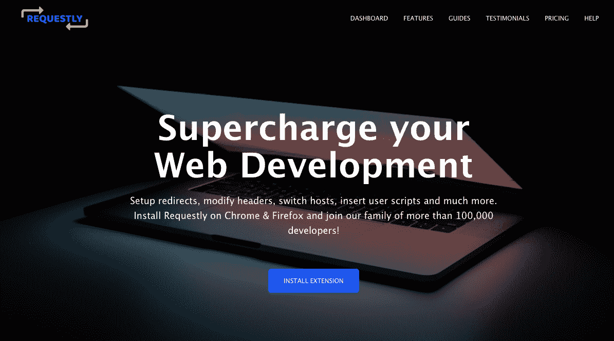
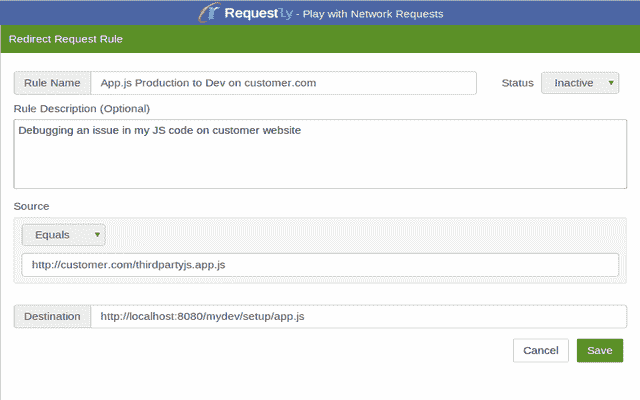
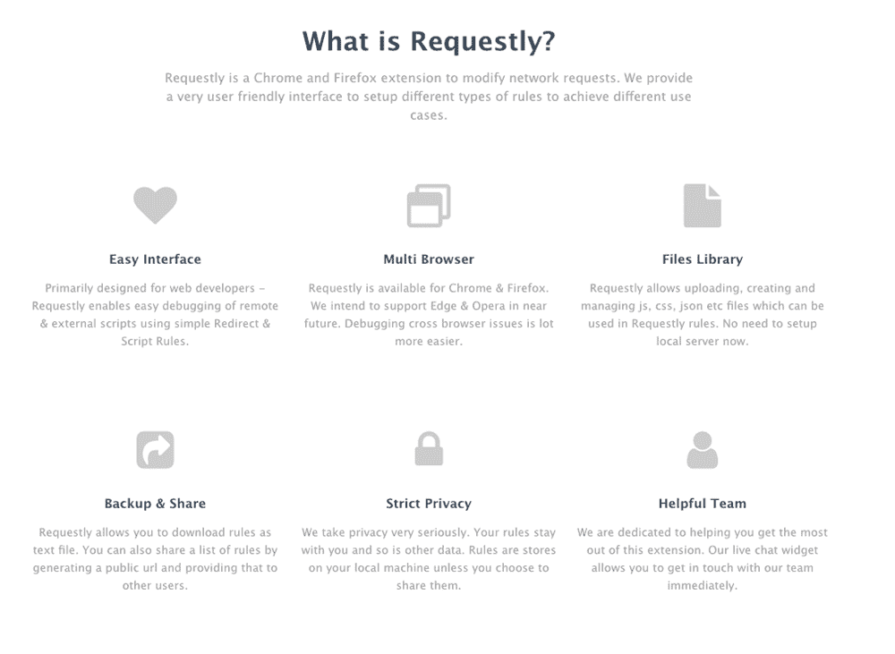

# 为我自己(和其他 80，000 名用户)解决问题

> 原文：<https://www.indiehackers.com/interview/solving-a-problem-for-myself-and-80-000-other-users-c2b415aafd>

## 你好！你的背景是什么，你在做什么？

嗨！我是 Sachin，一个有超过七年行业经验的热情的软件工程师。我职业生涯的大部分时间都在从事数字营销。这些天，我在一家美国初创公司兼职做数据科学家。我把剩下的时间花在我的兼职项目上，比如[requested](https://requestly.in/)。

Requestly 是 Chrome 和 Firefox 的扩展，它可以设置重定向、改变 API 端点、修改请求和响应头、插入用户脚本等。Requestly 始于五年前，只有一个用例:将生产 JS 重定向到开发 JS。Requestly 的有机增长突飞猛进。如今，Requestly 被全球超过 10 万名开发人员使用。

我在今年 4 月推出了付费计划，现在 Requestly 已经有 50 多个付费用户，总计每月约 500 美元。

【T2

## 是什么促使你开始使用 Requestly？

回到 2013 年 3 月，我正在开发一个数字营销产品，该产品需要客户网站上的一个脚本。有许多产品需要脚本才能运行:VisualWebsiteOptimizer、Optimizely、MixPanel、Hotjar、Google Analytics 等。我们过去常常提供脚本的缩小版本，但是如果客户有问题，这使得调试相当困难。此外，一旦问题在我们这边得到解决，如果不要求客户更新到修复版本，我们就无法测试或验证更改。

六个多月来，我一直在努力调试外部 JS。由于这个问题也适用于其他广为人知的产品，我试图在 StackOverflow 和其他论坛上寻找解决方案，但没有运气。

但我已经具备了构建 Chrome 扩展所需的基础知识。一天晚上，当我在开发另一个 Chrome 扩展( [StackEye](https://chrome.google.com/webstore/detail/stackeye/pihfndpmcafdecheofkjfkadecoogigm) )时，我正在浏览 Chrome API 文档，无意中发现了 [webRequest API](https://developer.chrome.com/extensions/webRequest) 。一个想法闪过我的脑海:我们可以使用 Chrome 扩展将生产 JS URL 重定向到本地 JS URL 吗？

我很快构建了原型(有很多硬编码，没有 UI)。这个解决方案似乎对我很有效。对于每一个网址，我都修改了代码，重新构建，然后加载到 Chrome 中。事情看起来很好，直到我不得不向团队中的一个非技术人员解释这一点。她真的很难使用。我意识到这个解决方案不太适合非技术人员，所以我开始考虑构建一个 UI 来管理重定向规则(创建、编辑、删除、激活和停用)。

## 构建最初的产品需要什么？

当我开始工作时，我做的是全职工作，所以我唯一的空闲时间是在周六。我每周六都工作，直到 2014 年 6 月第一次发布。我花了三到四个月的时间才推出第一版。

在从事副业项目时，需要记住的是文档；我确保详细描述了 GitHub 中的每一个小变化，这样无论我在哪里停下来，都很容易重新开始。

我有过一些前端开发经验，帮助很大。我迅速拿起 [BackboneJS](http://backbonejs.org/) 开始开发。

我面临许多技术挑战，比如如何维护数据的两个副本，如何保持这两个副本之间的同步，等等。在阅读了更多的 Chrome 文档后，我能够克服这些技术挑战。我自己设计了 UI，一个朋友通过不断的反馈帮助了我。又过了几个月，我终于可以发布第一个版本了。

 

## 你是如何吸引用户并按需增长的？

在构建了 Requestly 的第一个版本后，我去谷歌搜索相关的查询:

*   在 chrome 扩展中重定向 URL
*   在 chrome 中修改标题
*   重定向 Javascript
*   调试生产 JS

我发现了很多 StackExchange 的问题(很多都没有答案)，并在那里发布了答案。我的第一批用户就是从 StackExchange 获得的。我还在 Reddit 和 Hacker News 等平台上分享了 Requestly，这进一步推动了增长。我开始分享用例(一次一个),这真的引发了讨论。很快就引起了像 [Smashing Magazine](https://twitter.com/smashingmag/status/595569886669201408) 、 [Lea Verou](https://twitter.com/LeaVerou/status/1013624845974716416) 和 WebToolsWeekly 的注意。这种曝光对解释 Requestly 的工作很有帮助。

我还看到人们分享他们自己不同的用例，这开始创建一个网络。这些使用案例的一些示例包括:

1.  亚马逊微笑-重定向[www.amazon.com](http://www.amazon.com/)到 smile.amazon.com
2.  阻止色情网站
3.  阻止脸书
4.  删除 utm 参数等。

然后我意识到，规则的分享是一项繁琐的工作；用户必须手动重现规则。所以我开发了 SharedList 功能来简化这个过程。这使得共享方面更容易访问——用户只需生成一个 URL，然后将该 URL 传递给另一个用户。

在看到用户以如此多的不同方式使用 Requestly 后，它帮助我认识到 Requestly 也可以被需求较小的用户使用。这帮助我通过在 Twitter、Reddit 和博客帖子上分享更多的用例来促进数量的增长。

| 年 | 用户 |
| --- | --- |
| 15 年 1 月 | 500 |
| 16 年 1 月 | 5000 |
| 17 年 1 月 | 20000 |
| 18 年 1 月 | 50000 |
| 19 年 1 月 | 80000 |

作为一名工程师，我一直认为，如果你开发了一个伟大的产品，你就会获得用户。但现实世界并不是这样。

TweetShare

## 你的商业模式是什么，你是如何增加收入的？

我在 2019 年 4 月推出了 Requestly Premium。由于 Requestly 已经拥有大量用户，许多用户在一周内就愉快地订阅了高级计划。我做了一个用户调查，以了解用户对优质产品的反应，他们是否愿意支付，他们愿意支付的大概价格，他们会给当前产品打多少 NPS 分，等等。

我使用 [Hotjar](https://www.hotjar.com) 进行调查，结果让我大吃一惊:

*   大约有 2000 人参与了调查
*   超过 85%的用户对当前的功能非常满意(评分为 4 或 5)
*   超过 10%的用户愿意升级:
    *   0.99 美元/月:10%
    *   2.99 美元/月:约 2%
    *   4.99 美元/月:约 1%
    *   6.99 美元/月:约 1%
    *   不愿支付:约 86%

许多用户评论了大量的功能、现代的用户界面以及使用起来有多简单。调查结果让我对市场和愿意为此付费的用户数量更有信心。他们也给我上了非常重要的一课:与用户沟通极其重要，可以帮助你决定产品的价值。

以下是我们的主要收入来源:

*   **高级订阅:**按需遵循免费增值商业模式。有一个青铜(免费)计划，有体面的限制功能。主要是喜欢升级到高级计划的高级用户。
*   **外包:**将 Requestly 视为一种产品，许多人都留下了深刻的印象，并被要求开发该产品。这种情况继续存在。但我没有把外包的收入计入 Requestly 的总收入。
*   广告:免费用户可以在屏幕的左下方看到一个小的 Carbon 广告。

在收到一些询问后，我决定提供企业计划，使公司的许可证管理和支付变得容易。目前有两家企业要求使用。我计划在不久的将来做几件事来建立更多的收入渠道。赞助就是其中之一。

由于 Requestly 的受众相当小众(主要是 web 开发人员)，不同的 SME 可能会对通过 UI、电子邮件或博客帖子展示他们的业务感兴趣。“请求规则”页面的点击率为每天 5000-6000 次浏览。

| 月 | 收入 |
| --- | --- |
| 19 年 1 月 | 210 |
| 19 年 2 月 | 180 |
| 19 年 3 月 | 145 |
| 2019 年 4 月 | 470 |
| 19 年 5 月 | 610 |
| 19 年 6 月 | 440 |

## 你未来的目标是什么？

我一直受到[邮差](https://www.getpostman.com/)的启发；它展示了一个技术产品如何成长并获得巨大的用户群。如果 Postman 用于创建请求，Requestly 用于修改请求。

Postman 在 Chrome 商店上有 300 多万用户。这让我知道了有多少人可以接触到。但是，不用看得太远，我的目标是到 2020 年底达到 20 万用户。

我的下一个目标是创建一个公共的规则库，用户可以在这里方便地直接搜索和导入规则。该存储库将包含常见用例的规则，如更改 API 版本、阻止社交媒体网站、删除 CSP 头等。

这将有助于搜索引擎优化，并会帮助用户更容易地开始。

与你的用户沟通是非常重要的，可以帮助你决定你的产品的价值。

TweetShare

## 你面临的最大挑战和克服的障碍是什么？如果你必须重新开始，你会做什么不同的事？

**对 API 的依赖** : Requestly 是一个浏览器扩展，因此它依赖于 Chrome 和 Firefox APIs。如果这些 API 在未来发生变化，可能会导致 Requestly 的特性集发生变化。这是摆在面前的最大挑战之一。我已经开始构建一个独立的电子应用来解决这些问题。

**UX 挑战**:我面临的一个持续的挑战是在不过度复杂的情况下给产品增加更多的功能。由于 Requestly 更多的是一个面向技术的产品，我已经看到用户在设置规则时犯了一些错误。我认为这是每个科技产品面临的挑战之一。我一直在改进用户界面来帮助解决这个问题。

技术转变:网络开发的快速转变对我来说是另一个挑战。正如我前面提到的，我是从 Backbone 开始的(即使今天 90%的代码都是用 Backbone 编写的)。但是为了更好的性能，我最近开始重写 React 的整个 UI。

我最大的错误是没有建立一个登录选项。目前，超过 90%的用户在没有登录的情况下使用 Requestly，这让我很难就产品更新进行沟通。

以下是我在构建 Requestly 时学到的一些经验:

*   在脑海中设计你的产品。在我的情况下，我为自己建立了它，然后与他人分享。
*   设身处地为客户着想。从客户的角度考虑问题，而不是从工程师的角度。说起来容易，但有时会很难。

 

## 有没有发现什么特别有帮助或者有优势的？

对我来说，一个很大的优势是问题陈述从一开始就非常清楚。我清楚地知道我的问题是什么，以及如何解决它。我已经知道谁在挣扎，所以我很容易分享产品作为解决方案。

通过在 StackOverflow 上回答问题和看别人的回答，我也学到了很多。如果你想在某个特定的技术领域磨练自己的技能，我建议每个人都这么做。

## 对于刚刚起步的独立黑客，你有什么建议？

作为一名工程师，我一直认为，如果你开发了一个伟大的产品，你就会获得用户。但现实世界并不是这样。你得找到你的用户群。你做得越早越好。我艰难地学会了这一点。如果你刚刚起步，记得在开发产品之前确定你的受众。这似乎是显而易见的，但是当你想到一个价值百万美元的产品时，很容易忘记基本原则并重复这些错误。

我推荐几本书:

1.  [牵引力](https://www.amazon.com/Traction-Startup-Achieve-Explosive-Customer/dp/1591848369)
2.  [精益创业](https://www.amazon.com/Lean-Startup-Entrepreneurs-Continuous-Innovation/dp/0307887898/ref=sr_1_3?keywords=the+lean+startup&qid=1562356247&s=books&sr=1-3)

我从这两本书里学到了为你的产品建立一个读者群是多么的重要。建立一个登录页面并要求用户提交他们的电子邮件可能并不总是奏效。

## 我们可以去哪里了解更多？

你可以从 [Chrome 商店](http://chrome.google.com/webstore/detail/requestly/mdnleldcmiljblolnjhpnblkcekpdkpa)获得你需要的。你可以在[媒体](https://medium.com/@requestly_ext/)或者我们的[博客](https://www.requestly.in/blog/category/articles/)上找到所有有趣的文章。所有重大更新都在[推特](https://twitter.com/@requestly_ext)上公布。如果有什么我可以帮忙的，你也可以通过邮件联系: [【邮件受保护】](/cdn-cgi/l/email-protection#0f6c60617b6e6c7b4f7d6a7e7a6a7c7b6376216661) 。

如果任何人有任何问题，请在评论中提出，我很乐意回答。

——[<picture id="ember5250372" class="user-avatar ember-view user-link__avatar"></picture>萨钦贾因](/sachinjain024?id=LXHJiXMhDlW3rEmcPbY990oH8vD2)【YC】创始人

## 想像 Requestly (YC W22)一样建立自己的事业吗？

你应该加入独立黑客社区！🤗

我们是几千名创始人，互相帮助建立有利可图的业务和副业。来分享你正在做的事情，并从你的同事那里获得反馈。

还没准备好开始使用你的产品吗？没问题。这个社区是一个认识人、学习和实践的好地方。随意[随便浏览](/)！

——[<picture id="ember5250377" class="user-avatar ember-view user-link__avatar"></picture>柯特兰艾伦](/csallen?id=ibTLPyjwVebnZjMGKvz6ztarnuV2)，独立黑客创始人

17votes