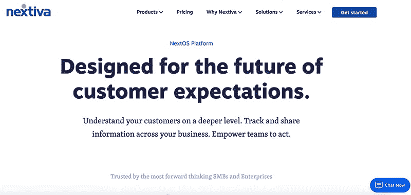
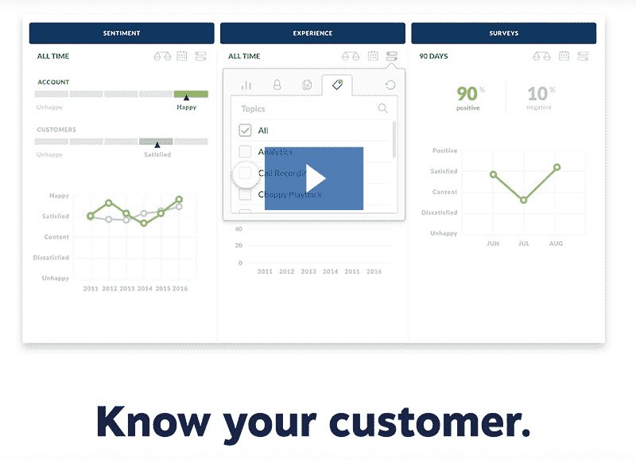
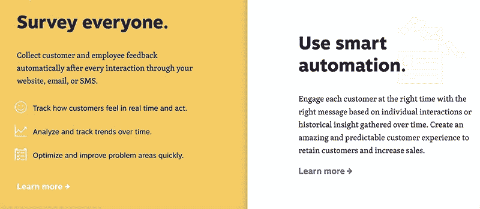

# 解决问题，帮助每家公司，同时保持高效

> 原文：<https://www.indiehackers.com/interview/solving-a-problem-to-help-every-company-while-staying-efficient-cfb4970823>

## 你好！你的背景是什么，你在做什么？

大家好，我叫托马斯·戈尔尼，是总部位于亚利桑那州斯科茨代尔的商业通信公司 [Nextiva](http://en.wikipedia.org/wiki/Nextiva) 的联合创始人兼首席执行官。

 

我一直对技术感兴趣。我 11 岁时得到了我的第一台电脑——一台雅达利电脑——并学会了自己编码。我后来做电脑配件生意，1996 年移民美国前做过销售。

当我来到美国时，我加入了一家初创公司，经历了我的第一次大成功——也是我的第一次大失败。我们卖掉了我来这里工作的公司，这使我一夜之间成为百万富翁；但是当网络泡沫破裂时，我失去了我的钱。但就在我开始建立新公司之后。我热衷于为自己的想法下注。

我一生都是企业家。我创办、建立并出售了几家公司，包括 [IPOWER](https://www.ipower.com/) ，最终[在 2011 年以近 10 亿美元](%5Bhttps://podcasts.apple.com/ca/podcast/ep-137-from-broke-to-a-%241b-sale/id1018988393?i=1000409357245%5D(https://podcasts.apple.com/ca/podcast/ep-137-from-broke-to-a-%241b-sale/id1018988393?i=1000409357245))出售了该公司；以及 2018 年发售的 [SiteLock](https://www.sitelock.com/) 。

2008 年，我与特雷西康拉德(Tracy Conrad)和一个小型创始团队共同创立了 Nextiva。我们的目标是彻底改革和检修有 100 年历史的商业通信行业。如今，Nextiva 是美国最大的私营商业云通信公司。完全靠亚利桑那州斯科茨代尔的办公室起家；加州圣克拉拉；墨西哥瓜达拉哈拉；和乌克兰基辅。

我热衷于为自己的想法下注。

TweetShare

2017 年[我和史蒂夫·沃兹尼亚克在我们的年度 NextCon 大会上坐下来](https://www.nextiva.com/nextcon/videos/16/steve-wozniak-tomas-gorny.html)讨论了建立创新者文化、史蒂夫的幸福理论以及技术的未来。

Nextiva 在 2018 年 5 月推出了一个名为 [NextOS](https://www.nextiva.com/why-nextiva/nextos-platform.html) 的商业通信平台，允许企业在一个地方而不是多个应用程序上跟踪客户通信，从而将产品扩展到电话服务之外。我们现在提供一整套工具，包括电话服务、文本、电子邮件、聊天、调查、分析等。

 

## 是什么促使你开始使用 Nextiva？

2006 年，我们为 IPOWER 寻找新的电话系统。我们最终注册了一个昂贵的系统，但我们对服务和质量感到失望。在经历了 VoIP 领域缺乏创新和低水平客户服务的挫折后，我产生了 Nextiva 的想法。

在创建和运营数家公司之前，我经常处理与电话服务相关的挑战。令我惊讶的是，对于一项重要的行业业务服务，还没有重大创新。更重要的是，我一直经历着可怕的客户服务。我想，如果我对此感到沮丧，那么其他许多人肯定也会如此。

我和我的团队意识到，我们正在寻找其他公司没有提供的东西，我们看到其他企业也在努力寻找同样的东西。所以我们决定在这个问题上做点什么。2008 年，Nextiva 迎来了第一个客户。从那时起，我们的业务呈指数级增长，如今我们在全球多个办事处拥有约 1，000 名团队成员。

也许对我来说最激动人心的部分是，我们已经超越了 VoIP，从整体上解决了商业通信危机。在过去的十年里，我们从与客户的交谈中了解到，分散的沟通工具会导致对客户旅程的不完整了解。许多公司不是知道客户是否收到电话、短信、电子邮件等等，而是争先恐后地在几十个不同的应用程序之间切换。与此同时，他们的客户变得越来越沮丧。

在创办任何公司之前，我总是与目标客户一起验证这个想法，以确保我们正在创建实际需要的工具。

商业沟通中存在一个巨大的危机:公司与客户沟通的方式和客户真正想要的东西之间存在差距。顾客想要轻松的体验。他们希望被记住。

商业沟通多年来一直处于危机状态——即使现在公司从客户那里听到的比以往任何时候都多(特别是社交媒体和如此多的联系渠道)，他们对这些沟通的理解也因为管理方式而减少。我们想为此做点什么。但我们知道，我们不能只是向市场推出另一个应用程序；我们需要为企业提供一种轻松体验的方式。所以我们开始制造产品来改善未来的工作和客户体验。

我们创立这家公司是为了帮助世界上的每一个企业(无论其规模和阶段如何)建立、推广和管理他们的组织。从一开始，我们就通过让企业获得易于使用、功能强大且价格合理的先进技术来营造公平的竞争环境。

今天，我们提供 Nextiva Business Suites，它将我们最流行的沟通、协作和客户参与工具捆绑在一起。

## 构建最初的产品需要什么？

我们白手起家，没有电信经验，只有一个小团队。Nextiva 是完全自筹资金的，我们后来为 NextOS 进行的创新是由我们当前产品的收入资助的。

我们试图避免大的财政承诺。对于长期合同和低性能保证来说，做一些非常昂贵的事情不是我们的风格。

TweetShare

当我们准备推出 NextOS 时，有 200 多名软件工程师正在为这个项目工作。NextOS 上市花了我们四年时间。产品设计在整个开发过程中不断发展，并将继续发展，因为我们专注于帮助用户提供当今消费者想要的客户体验。

四年前，人们对这些领域的期望非常不同。明年将会与今天有所不同——我们一直关注工作领域及其发展方向。

 

## 你是如何吸引用户并发展 Nextiva 的？

大多数人都知道 Nextiva 是一家商务电话服务提供商，我们有一个健康的客户推荐流、有机流量和对我们工作的认知。

人们正在搜索 NextOS 的解决方案和功能，这些解决方案和功能超越了商务电话服务，包括 CRM、聊天和调查，但很少有人同时搜索所有这些产品，或者与分析、人工智能和自动化相结合。企业知道他们需要这些工具，但没有多少人熟悉 NextOS，甚至不知道存在像 NextOS 这样的解决方案。

我们让企业了解我们提供的更大价值。我们的有机流量持续上升，这是我们营销团队的一大关注点。

以下是几年来有所帮助的几件事:

*   我们在 NextOS 发布之前就宣布了我们的意图，并且提供了一个早期的注册表格。一旦产品准备就绪，我们就开始捕捉知名度和需求，以帮助推动销售。
*   2018 年和 2019 年，我们用我们团队的视频进行了 LinkedIn 收购，导致 2018 年数千次关于 NextOS 和 2019 年 Nextiva Business Suites 的观看。
*   我们试图避免大的财政承诺。对于长期合同和低性能保证来说，做一些非常昂贵的事情不是我们的风格。我们更喜欢灵活地营销和花钱，包括限制承诺。在 Nextiva，我们的座右铭是灵活、节俭和快速。

## 你的商业模式是什么，你是如何增加收入的？

我们的产品价格极具竞争力，使所有企业(不仅仅是大型企业)都能获得一流的技术。基于订阅的平台很有帮助。

NexTV 是我们每周一次的内部电视节目，让我们的员工了解 Nextiva 的时事，并在社交媒体上以独特的方式窥视我们的公司。我们还在其他方面使用视频——我们的团队会用个性化的感谢视频直接回应客户的赞誉。

2016 年，我们开始举办 NextCon，这是我们为合作伙伴和客户举办的年度会议，旨在联系和提供销售和营销会议、动手操作 Nextiva 产品培训、激励性演讲者、网络和认可活动以及高级认证机会。我们发现，该会议极大地提高了我们合作伙伴发展业务的能力，进而发展了我们的业务。

我们真的专注于确保我们的客户满意，我们的产品提供价值。令人惊叹的服务是我们对我们的团队和客户的承诺，我们每天都在袖手旁观。

我们的业务模式包括接触客户的多种途径。我们有一个协助中小企业客户的内部销售团队，管理大客户的企业销售团队，我们还有一个渠道销售团队。

渠道销售团队是商业通信领域的典型代表，他们由渠道合作伙伴组成，这些人拥有自己的业务，转售你的服务。我们已经看到了我们的巨大成功。我们一直在努力使我们的销售计划变得更好。

我相信钱是提供价值的副作用。

## 你未来的目标是什么？

我心中有工作的未来，我总是提前思考。我问自己，“明天企业需要什么？”我有很多解决方案，可以让我的生活更轻松。

忠于自己和 Nextiva 的方式很重要。我们是真实的，以客户为导向，以团队为中心。2018 年 5 月，在庆祝 Nextiva 十周年的同时，我们推出了商业通信危机的答案:NextOS。NextOS 是一个集成的商业通信平台，包括从 CRM 和调查到分析和聊天的一切。客户的反应非常积极。我很期待看到我们未来 10 年的发展方向。

## 你面临的最大挑战和克服的障碍是什么？如果你必须重新开始，你会做什么不同的事？

刚移民美国的时候，我因为东欧口音被低估了。我被认为是一个有着奇怪口音的愚蠢的年轻人，人们不把我当回事。起初，这让我很困扰，但我知道当人们低估你时，它会带来很多好处。这是一种可以利用的力量。

我坚持不懈地建立自己的公司，这让我来到了加州，两年后，它被卖掉了，我成了一个千万富翁。我开始做从未做过的事情，比如投资其他公司而不是自己。我围绕我的净资产设定目标，这是一个错误。然后网络泡沫破裂了，我损失了一大笔钱。我几乎破产了，我比以往任何时候都有更多的义务。

失败后，我立即着手建立新的公司。这些经历帮助我形成了自己的商业原则:

*   以身作则
*   如果你不去衡量，你就不会进步
*   和优秀的人在一起
*   没有退出策略
*   你能做的最好的投资是对你自己的投资
*   相信你自己

## 对于刚刚起步的独立黑客，你有什么建议？

一路走来，我学到了很多东西，但我最喜欢的一点是，失败是我们最大的老师。如果你把一次失败视为未来如何做得更好的信息，它就等同于免学费。我这辈子失败过很多次，我最崇拜的人也是。我明白了接受失败是创新的关键之一。

我学到的另一个教训是谨慎招聘。寻找那些你真正喜欢的有创业精神的人。我们都在工作上花了很多时间；建立一个由善良的人组成的团队是值得的，他们像人一样互相关心。从那个地方招聘总比只凭技能招聘好。技能是可以教授的，但态度是固有的，可以对你公司的文化产生积极或消极的影响。

最后，专注于为客户和员工提供令人惊叹的服务。

## 我们可以去哪里了解更多？

你可以在社交媒体上找到 [Nextiva](https://twitter.com/Nextiva) 和 [me](https://twitter.com/TGorny) 。如果你有任何问题，请在下面留下评论，我会尽力回答。

【www.nextiva.comT4[领英](https://www.linkedin.com/company/nextiva/)

——[<picture id="ember5307275" class="user-avatar ember-view user-link__avatar"></picture>托马斯·戈尔尼](/TomasGorny?id=ShGa7pqI85cNf33q1FjHFOpYUhm2)，Nextiva 创始人

## 想像 Nextiva 一样建立自己的事业？

你应该加入独立黑客社区！🤗

我们是几千名创始人，互相帮助建立有利可图的业务和副业。来分享你正在做的事情，并从你的同事那里获得反馈。

还没准备好开始使用你的产品吗？没问题。这个社区是一个认识人、学习和实践的好地方。随意[随便浏览](/)！

—[<picture id="ember5307280" class="user-avatar ember-view user-link__avatar"></picture>考特兰艾伦](/csallen?id=ibTLPyjwVebnZjMGKvz6ztarnuV2)，独立黑客创始人

10votes