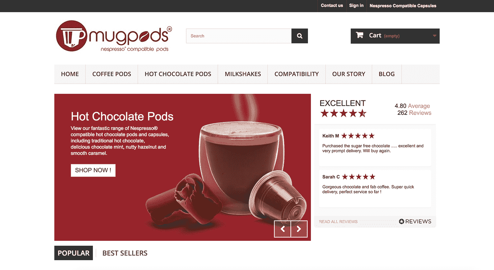

# 采购世界上第一个引导产品的成本超过 15，000 美元/月

> 原文：<https://www.indiehackers.com/interview/sourcing-a-world-first-product-to-bootstrap-to-over-15-000-mo-eff0fb2d0e>

## 你好！你的背景是什么，你在做什么？

我叫杰克·布拉姆霍尔，我是 [mugpods](https://mugpods.com) — Nespresso 兼容豆荚的联合创始人。

我的背景多种多样。我 16 岁离开学校，开始了全职工作，做学徒，负责一家小保健品公司的网站。从那以后，我在多家公司担任过许多角色，包括桌面支持、服务台、服务交付和营销。从十几岁开始，我就一直想拥有自己的企业，从高中参加青年企业到从十几岁开始经营一些网上商店，边干边学。

Mugpods 创建于 2015 年，是一家专门销售 [Nespresso 兼容豆荚](https://mugpods.com/nespresso-compatible-pods.html)的电子商务商店，包括热巧克力、咖啡和奶昔——大多数都是世界首创！Mugpods 的目标是英国，但现在也在欧洲各地销售。

我们最大的成就之一是在第一个月出货约 1000 台，此后每月平均以 40%的速度增长，*和*的出货量均实现了收入增长。现在的挑战是保持这样的增长水平！

[

mugpods 主页。](https://mugpods.com) 

## 是什么促使你开始使用 mugpods？你最初的目标是什么？你是怎么想出这个主意的？

在 mugpods 之前，我倾向于创办已经处于饱和市场的企业。这是我第一次真正幸运地看到了现有市场中的一个缺口，发现了一些还没有的东西。

最初的想法来自于我坐在办公桌前，听得见我们办公室的 Nespresso 机器，同时全职工作，提供服务。我想知道为什么 Nespresso 咖啡机只有咖啡(别管价格)，因为几乎所有其他主流“pod”机器都允许这么多品种，从茶到奥利奥口味！

我开始在网上搜索 Nespresso 的任何一种热巧克力豆荚，我在澳大利亚找到了一家制造商。他们为 Nespresso 机器创造了世界上第一个多饮料系列，并正在寻找国际合作伙伴。在我的搜索过程中，我发现了多个脸书页面/请愿书，要求这类产品。使用[谷歌关键词研究工具](https://adwords.google.com/home/tools/keyword-planner)我也能够看到明确的需求。当样品到达时，它们在我们的机器上工作得很好，味道也很棒。

最初的计划是一年销售一托盘产品——假日基金！如果它增长超过这一点，这将是一个奖金！我不知道如何为整个项目融资，也没有从外国(尤其是 16000 公里以外的国家)进口的经验，我和我的联合创始人都是全职工作。

## 是什么让你做好准备并开始发货的？

我们发了好几封电子邮件才说服制造商，让他们相信我们对整个项目是认真的。他们问我们是否有现有的合作关系等等，这是非常正确的，我们显然没有。为了证明我们有多认真，我用了一个周末的时间使用开源平台 [Prestashop](https://www.prestashop.com) 亲自建立了电子商务商店，我还创建了 mugpods.com 网站[。](https://mugpods.com)

我和我的联合创始人同意获得个人贷款来购买初始股票，然后我们下订单。到达目的地后，我们只需边走边学习关于进口、商品编码、税收等方面的知识。

最初，我们从我的联合创始人父母的车库开始。我们通过 PayPal 接受付款，立即开始接受订单。每天晚上，我都会去接我的联合创始人，去他父母的车库，打包订单，把包裹带回家，然后早起把它们送到邮局。我使用的软件可以每 2 分钟检查一次邮箱，并自动打印装箱单以加快处理速度。由于几乎没有营销，*我们在两周内售罄*！

随后，我们缺货，不得不等待更多的到货，随着我们的成长，这种情况不断重复，每次都购买更多的库存。

随着我们的成长，我们到了下班后去是不够的阶段。因此，我的联合创始人的妈妈成了我们的日间打包工！不到 6 个月，我们的车库就不够用了，我们搬到了自己的共用办公场所，那里有仓库货架，我的联合创始人辞去了工作，全职从事 mugpods 的工作。

## 你的商业模式是如何运作的，你用了什么策略来扩大你的客户群？

我认为我们的商业模式非常简单——我们从制造商那里购买产品，进口，然后以更高的价格出售，确保有足够的利润来推动增长。

我认为有许多营销活动和工具帮助我们在流量生成方面实现了增长:

1.  Google Organic——我们在 SEO 方面做了很多工作，从常规的博客文章，到建立反向链接，再到额外的网站页面和内容。
2.  CPC——最初我们花了一大笔钱，但我遇到了一个叫做 [Opteo](https://www.opteo.com?afmc=2n) 的工具，我不能推荐它来减少花费，同时增加转化率和与你的 Adwords 活动的相关性。
3.  社交媒体——我发现脸书是最好的兴趣驱动因素之一，尤其是当你有产品要卖的时候。我们还定期举办比赛来提高参与度。
4.  评论——我们使用[reviews.co.uk](http://reviews.co.uk)自动向我们的客户请求评论，这有助于 SEO 和减少废弃购物车。
5.  外联——我们联系了博客和 Instagrammers 来推广我们的产品。

除此之外，我们还在多个市场推出了产品，包括乐天、易贝和亚马逊。

| 月 | 会议 |
| --- | --- |
| 八月 | 5385 |
| 九月 | 7500 |
| 十月 | 8846 |
| 十一月 | 11346 |
| 十二月 | 14231 |

## 你未来的目标是什么，你打算如何实现它们？

从中期来看，我们的目标是继续在英国市场增加 [mugpods](https://mugpods.com) ，因此我们将继续提高库存水平，以满足需求。

从长远来看，我们的自然发展将是运送更多的国际包裹。

自动化是我们成功的关键，因为我们能够用最少的员工每天运送数百个包裹。我不断改进我们的技术，比如英国皇家邮政的 API 自动生成邮资标签。

## 你面临的最大挑战是什么？如果你必须从头开始，你会做什么不同的事情吗？

从流程的角度来看，任何手动的东西都应该尽快删除。不要离开它，因为随着你的成长，它会变成一种真正的痛苦。

技术——我遇到了一个问题，我们的网站还没有 SSL，但它需要在结账支付和各种 API 中启用。这个转变有点痛苦，确实在一段时间内影响了我们的搜索引擎排名。所以我的建议是从一开始就遵循最佳实践。

钱——“现金为王。”因为我们有实物产品，而且需求逐月增长，我们的问题就变成了现金流。你必须不断控制你的资金，提高运营效率，让每一分钱都发挥作用。如果可以的话，获得额外的资金来缓冲。

## 你觉得有帮助的优点和事情呢？

我们最大的优势是:

*   世界一流的产品。
*   多样化但高质量的营销策略。
*   在我们最需要的时候，来自朋友和家人的帮助。
*   自动化和精益流程。

## 对于刚刚起步的独立黑客，你有什么建议？

我认为 [mugpods](https://mugpods.com) 已经向我证明，只要问一个以“为什么”开头的问题，仍然有机会从天而降。

现金为王。无论你是像我们一样拥有实体产品，还是正在开发应用程序或 SaaS，你都需要资金来发展。所以，要么准备一笔现金来保护你，要么立即开始创收，即使数额很小。

我特别喜欢 Tim Ferris 的《每周 4 小时工作制》——主要是因为他关于自动化和减少花费在手工任务上的时间的精神和建议。

## 我们可以去哪里了解更多？

您可以在 mugpods.com[的](https://mugpods.com)查看我们的网站。请随时通过我们的联系页面或在[脸书](https://www.facebook.com/mugpods)给我们发消息。对于那些有 Nespresso 咖啡机的人，我们很乐意让你尝试我们的产品，或者告诉你的朋友，他们现在可以在咖啡上省钱，甚至可以为他们的 Nespresso 咖啡机买热巧克力和奶昔！

对于任何想从网络、营销或一般运营(会计等)方面寻求创业建议的人，请在下面留下你的问题和评论。

—[<picture id="ember5267221" class="user-avatar ember-view user-link__avatar"></picture>jackbramhall](/jackbramhall?id=Ps76symmikgvukBWVHVRyNfkJng1)，mugpods 的创造者

## 想像 mugpods 一样建立自己的事业？

你应该加入[独立黑客社区](/)！🤗

我们是几千名创始人，互相帮助建立有利可图的业务和副业。来分享你正在做的事情，并从你的同事那里获得反馈。

还没准备好开始使用你的产品吗？没问题。这个社区是一个认识人、学习和实践的好地方。随意[随便浏览](/)！

—[<picture id="ember5267226" class="user-avatar ember-view user-link__avatar"></picture>考特兰艾伦](/csallen?id=ibTLPyjwVebnZjMGKvz6ztarnuV2)，独立黑客创始人

3votes