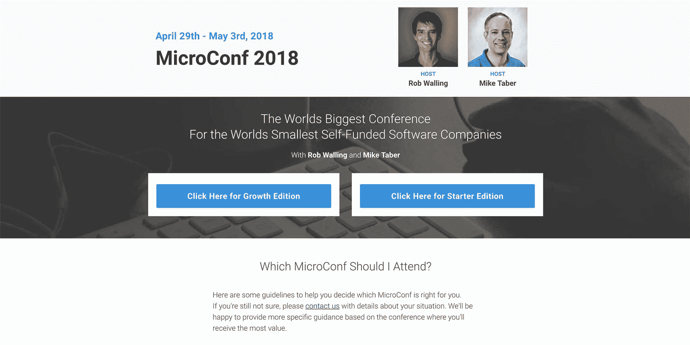
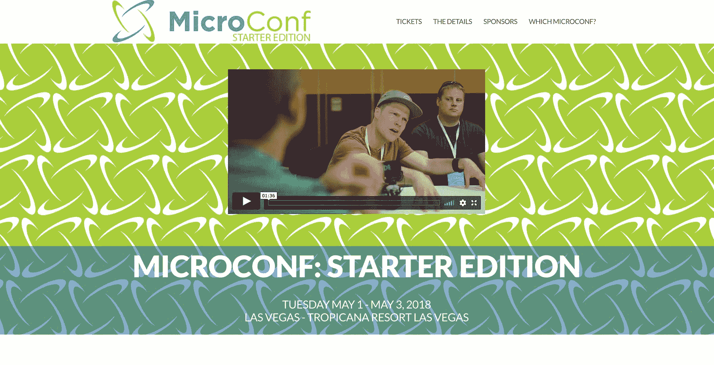
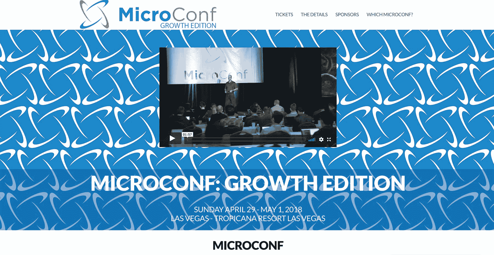
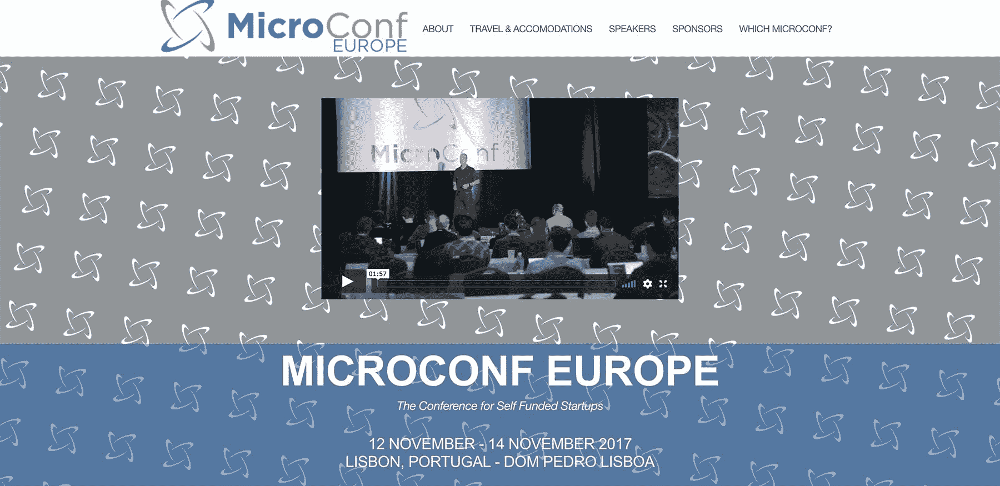

# 为互联网企业家创办和发展一个会议

> 原文：<https://www.indiehackers.com/interview/starting-and-growing-a-conference-for-internet-entrepreneurs-dd59fe060b>

## 你好！你的背景是什么，你在做什么？

我叫[迈克·泰伯](https://twitter.com/singlefounder)，我是[微 Conf](https://www.microconf.com) 的联合创始人。我在纽约北部的罗彻斯特理工学院获得了计算机工程的学士和硕士学位，具有设计硬件和软件的背景。

在我搬到波士顿地区之前，我从 99 年到 01 年为 Clearwire Technologies 工作，从 01 年到 03 年为 Wegmans 工作。2003 年，我被一家名为基座软件的安全初创公司聘为第四名全职工程师。当它在 2005 年以 7500 万美元售出时，我的股票期权总共价值 8000 美元。请不要计算百分比，因为这很令人沮丧。

2005 年离开基座软件公司后，我开始自己创业，从那以后一直是个体经营。包括我离开大学前运送的东西，在我的职业生涯中，我已经通过多个企业推出了大约 12 种产品。

作为背景，Micropreneur Academy，LLC 是 MicroConf 的托管公司。它也是为我们其他人服务的[创业公司](https://www.startupsfortherestofus.com)播客和 [FounderCafe](https://www.foundercafe.com) 的保护伞公司，后者是我们为在线创业者提供的私人社区。今天我将主要讨论 MicroConf。

MicroConf 是一个面向自筹资金、基于互联网的企业家的会议，这些企业家希望与其他志同道合的人建立联系并向他们学习。它吸引了来自世界各地的企业家，他们希望建立一个稳定的企业，成为自己命运的主人。

与其他企业家见面，无论是网上还是面对面，对你的生意来说都比你意识到的要重要得多。

TweetShare

我们的与会者避免对创业采取“摇摆不定”的方式，主要有两个原因。

1.  第一，真的风险很大。你要么大获全胜，要么回家，这绝对不是一个 50/50 的机会。
2.  第二，在你的一生中，建立一个可行的企业的机会是有限的。把它们赌走是没有意义的，而为栅栏摇摆基本上就是赌博。

当我们举办每一次会议时，MicroConf 背后的业务都有一个戏剧性的收入高峰，所以衡量短期收入可能会有一点误导。然而，提供一种规模感是很重要的。以下数字仅代表 2017 年的业务活动:

*   总收入超过 420，000 美元(每月约 35，000 美元)
*   三次会议(入门版、增长版和欧洲)
*   所有三个会议总共约有 550 名与会者

 

## 是什么促使你开始使用 MicroConf？

肯定不是因为我们想经营会议业务！:)

2009 年，我与罗布·沃林(Rob Walling)合作开发了一个名为“微型企业家学院”的在线课程。这是一个关于各种主题的课程模块的集合，我们会打包并每月发布给会员。回想起来，这个课程的名字令人困惑，因为它也是公司本身的名字。最终这个社区被更名为 FounderCafe，内容被抛弃。

2010 年，我们为其他人开办了创业播客，这样我们就可以实时分享我们学到的东西，并为创业者提供可行的建议。我们也知道，作为在线课程的营销渠道，它会比博客好得多。播客比博客简单得多，这并没有什么坏处。

我们决定创建 [MicroConf](https://www.microconf.com) 的最大原因之一是，我们参加了其他几个会议，这些会议似乎应该迎合像我们这样的人，我们感到格格不入。坐在某人旁边，很容易找到在他们所做的事情上成功的人，但是很少有人是在家工作的软件企业家。2011 年初，我们中的一个人想出了一个主意，让我们的学院成员和播客听众一起参加一个面对面的活动。

*“如果有一个迎合像我们这样在家工作的自费软件企业家的会议，那不是很好吗？组装一个能有多难？”*

我能找到的提到 MicroConf 的最早的邮件是 2011 年 2 月 8 日，也就是我们注册域名的同一天。会议计划于 6 月 6 日至 7 日在拉斯维加斯的里维埃拉举行，主要是因为那是我们能在短时间内找到的最便宜的地点。

我们没有策划会议的经验，所以我们边做边学。我曾经和主修食品和酒店管理的人一起上过大学，所以我利用这些关系来寻求建议和联系。最终，是这些人将我们与拉斯维加斯的一家酒店联系起来，这家酒店对我们来说是最划算的。

在你的一生中，建立一个可行的企业的机会是有限的。把它们赌走是没有意义的，而为栅栏摇摆基本上就是赌博。

TweetShare

为了验证这个想法，我们与学院内部和我们个人网络中的人进行了几次非正式对话，以判断他们是否会参加会议。我们还根据第一年 200 名与会者的想法制作了一份电子表格，列出了我们的预期预算，因为在我们的创业泡沫中，自雇软件企业家的数量似乎在我们周围激增。除此之外，我们很少进行验证。

我们很自信，但同时也厌恶风险。我们研究了在 MicroConf 彻底失败的情况下降低风险的方法。在我们宣布任何事情之前，我们知道我们的收支平衡数字是多少，我们在与酒店谈判时非常小心。如果我们由于人数不足而不得不在最后一分钟取消，我们没有任何签字的文件使我们陷入困境。

除了营销学院课程之外，我们俩都在发展各自的业务。我们做着自己喜欢的事情，收支平衡，但这并不意味着我们赚了很多钱。我们两个人都无法承受超过 2000-3000 美元的损失，当时我们有一个疯狂的想法，认为我们实际上能够从中赚钱。

## 构建最初的产品需要什么？

从公开发布到召开会议，我们只有大约 12 周的时间来整合一切。我现在回头看这是疯狂的，但我们有动力和健康的无知，这真的很有帮助。一般来说，我们分工如下:Rob 负责寻找演讲者，我负责寻找赞助商。

我们分担了其余的责任，例如处理酒店和现场物流，但大多数决策花费的时间都超过了预期。我们不知道什么是重要的，什么是不重要的，很多时候决策变得更加困难，因为预算是一个不断变化的目标。对于一个会议，有一些固定成本和许多可变成本，这些可变成本根据与会者的数量或合同的最低数量而变化。我们知道我们想要多少与会者，但是在你知道实际的与会者人数之前，几乎不可能知道某样东西的确切成本。

因为我们参加过其他的会议，我们觉得我们对自己的会议想要看到的东西有一个很好的认识。我们决定开一个两天的会议，因为一天觉得太短，两天以上又觉得太长。最初的计划是有 12 个演讲者，每天 6 个，类似于我们在其他地方看到的。复制其他会议形式意味着我们不需要从头开始创造一切。

有一件事我们认为会比现在更有帮助，那就是让我们的演讲者邀请他们的观众。这包括像诺亚·卡根、T2、希滕·沙阿、T4、帕特里克·麦肯齐、拉米特·塞西、安德鲁·沃纳和其他一些我们认为相对比较知名的人。由于他们的努力，我们有一些新的与会者报名，但没有我们希望的那么多。

事实证明，在 MicroConf 上，一个单独的演讲者可能不会有太大的吸引力。我们的观众大多是内向的软件开发人员，所以说服他们特地坐飞机去见他们崇拜或追随的人是极不可能的。如果他们已经对是否参加持观望态度，那么看到一个梦幻般的演讲者名单可能会让他们崩溃，但没有一个演讲者会这样做。

## 你是如何吸引与会者参加第一届 MicroConf 的？

当我们最初推出 [MicroConf](https://www.microconf.com) 时，我们不知道如何在会议上填补席位，所以我们做了我们真正知道如何做的唯一一件事。我们对待它就像对待其他软件产品发布一样。最初的几个星期是用来告诉人们关于会议的情况，并增加我们网站的流量。我们有一个邮件列表，他们可以注册，并明确表示，如果他们在名单上，当我们“推出”时，我们会让他们获得会议的折扣门票。

后端系统只不过是一个 EventBrite 账户和一个 PayPal 订阅。当时真的没有其他选择。它运行得很好，我们知道推动销售将比支付系统更重要。

2011 年 3 月 10 日，我们在[黑客新闻](https://news.ycombinator.com/item?id=2309389)上宣布了 MicroConf，它得到了相当冷淡的回应。我们还在博客和个人电子邮件列表中发布了公告。几周后，我们录制了播客的第 39.5 集，[宣布 MicroConf](http://www.startupsfortherestofus.com/episodes/episode-39-5-announcing-microconf-the-conference-for-self-funded-startups-and-single-founders) 为“自费创业公司和单身创始人的会议”。

门票于 2011 年 4 月 5 日开始发售，每张价格为 499 美元，我们告诉大家，一周后的 4 月 13 日，价格将上涨到 599 美元。第一天我们卖了 31 张票，但在接下来的六天里只多卖了 9 张。截至 4 月 12 日，我们只卖出了 40 张预售票。我们标准的学院月度发布活动通常会在最后一天通过发送额外的电子邮件带来更多的销售，所以我们这样做了。我们设法卖出了 9 张票，使我们在第一周卖出了 49 张票。

不幸的是，我们的目标是 200 名与会者，所以当我们甚至没有达到这个数字的 25%时，我们觉得我们可能有麻烦了。除了明显的失望之外，我们非常担心我们是否能吸引足够多的与会者，至少达到收支平衡。我们打开了我们的个人邮件列表，我们的播客参与者，我们的学院成员，在几个播客上做了一圈，并单独邀请了我们知道的我们认为愿意花钱参加的人。

有一次，我们甚至给我们的与会者发了电子邮件，给他们提供了一张价值 99 美元的“带一个朋友”的门票。就像我们尝试的其他事情一样，它增加了一些参与者，但并没有真正改变现状。我们当时没有意识到，但这是一个巨大的错误。我们最终陷入了亏本卖票并试图增加销量的境地。幸运的是，没有多少人接受我们的提议，所以没有那么糟糕。

在接下来的 11 周里，我们东拼西凑，找到了 105 名注册与会者，包括演讲者、赞助商和我们。我们离会议只有两个星期了，但我们仍对是否要进行下去犹豫不决。

我们非常幸运，不需要向酒店交任何形式的押金或预付款。当你在销售现场活动的门票时，你需要确保场地已经锁定，而我们没有钱做出财务承诺。直到会议召开前 11 天，我们还在反复讨论合同的最终版本。换句话说，我们在拖延时间。

回想起来，我们非常幸运，他们没有在那之前强行提出这个问题。到 6 月份，拉斯维加斯的气温可能会达到 100 华氏度，因此这并不是会议旺季。我想他们只是很高兴有人在六月的周一和周二询问场地。

最终，是我从微软和红门软件获得的一对赞助挽救了第一届 MicroConf 免于一场彻底的灾难。这些赞助使我们从严重的赤字变成勉强的盈余。这两项赞助是 MicroConf 今天存在的真正原因。没有人接受我 100 万美元的赞助，这本来会让事情变得容易得多。

我们犯的最明显的错误是没有给自己足够的时间，没有足够早地开始营销。如果我们在几个月前发布公告，我们可以建立更多的信任，或者与我们的一些演讲者一起做播客，以帮助建立信誉，并向人们推销更多的参与价值。我们的时间太短了，人们几乎没有足够的时间来计划。我们只呼吁那些可以心血来潮去拉斯维加斯几天参加周一和周二会议的人。

这也没有给我太多的时间来获得赞助。大公司往往有年度预算，如果他们提前几个月知道你的存在，就更容易获得赞助，这样他们就可以为此分配部分预算。

一个新的会议面临的最大挑战是他们是新的。没有人确切知道会发生什么。你要求人们在旅行、酒店和会议机票之间花费大量的钱，希望你能兑现你的承诺。他们相信你能做到。如果你在第一年没有做到这一点，你可能会很难成功，因为回头客和口碑推荐对一个会议来说非常重要。人们在做这些决定时会互相交流。

如果有人有不好的经历，而你没有立即发现，反馈回路会有很大的延迟。你不会看到那段负面的经历反映在当年。这将反映在接下来的一年中，那时人们将决定是否返回或第一次参加。然后有人在推特、脸书或其他社交媒体上告诉他们这不值得，这扼杀了潜在的销售。搜索这些对话比以往任何时候都更容易，所以如果你不注意，延迟的反馈真的会很痛。

 

## 自第一年以来，最大的增长动力是什么？

自 2010 年以来，我们的播客一直是自费企业家的平台，最初几年，我们的大多数与会者都是通过播客直接听说了 [MicroConf](https://www.microconf.com) 。我确信这是头两年最大的增长动力。

从那以后，与会者的口口相传就开始了。成功的企业家在他们的圈子里相互交流很多。MicroConf 很快成为最好的会议，在那里他们可以见到其他正在建立成功的软件企业的软件企业家。

我们也全年收集电子邮件地址，或者我们是第一个只关注自费软件企业家的会议，这都没有坏处。我们做对了很多小事，但在这一点上，我认为口碑是会议增长的最大驱动力。

## 你的商业模式是什么，你是如何增加收入的？

像 [MicroConf](https://www.microconf.com) 这样的会议基本上有两个收入来源:向与会者出售门票和获得企业赞助。你需要从这两者中赚钱来使收支平衡。为了在业务的参与者方面赚更多的钱，你唯一的选择是要么对每张票收取更多的费用，要么卖出更多的票。对于 MicroConf，这些选项都有一些固有的问题。

向与会者收取更多费用的最大挑战是，我们的与会者是自费的，这意味着他们要自掏腰包支付会议费用。不是每个会议都面临这个问题，但我们的会议面临这个问题。他们需要征得同意才能参加的“老板”通常是他们的支票簿或配偶。这意味着，尽管你可以逐年提高价格，但你必须对与会者的总成本保持敏感。这包括机票、酒店房间和会议门票的费用。他们的支付能力也因其业务表现的好坏而有很大差异。与拥有成千上万客户的后期企业相比，早期企业的消耗性收入要少得多。

| 年 | 收入 |
| --- | --- |
| 2011 | 52395 |
| 2012 | 98835 |
| 2013 | 119529 |
| 2014 | 176579 |
| 2015 | 184569 |
| 2016 | 210936 |
| 2017 | 351071 |

注:数字不包括欧洲 MicroConf。

2011 年门票 499 美元，现在回想起来太低了。首先，它吸引了错误的人。我们的一些与会者很喜欢这次会议，但并没有真正致力于建立一个产品业务。他们只是想去拉斯维加斯参加一个会议，并且有足够的可支配收入去参加。第二，主办一场活动有最低成本，其中大部分以会议主办者需要为活动承诺的最低食品和饮料的形式支付给酒店。

如果费用是 450 美元/与会者，那么除了举办活动的费用之外，你只有 50 美元可以使用。将价格从 499 美元提高到 599 美元并不仅仅是增加 20%的收入。这种增长的主要副作用是，您在会议预算中的可自由支配支出从 50 美元增加到 150 美元，增加了 300%。从会议的第一天起，收取更多费用可以让我们灵活地为与会者做更多的事情。如果你在经营任何一种有固定或可变成本的业务，弄清楚这些成本是什么，并根据具体的利润而不是成本来定价。否则，你会发现很难发展业务，也很难更好地为客户服务。

我对任何开始现场活动的人的建议是，把你所有的努力集中在使它成为人们想要回来的奇妙经历上。每年，回头客应该占你的观众的很大一部分，这使得增长更容易。说服一个新人参加比说服一个以前的参加者回来要困难得多，特别是如果他们发现这个经历是有价值的。

这并不明显，但一个会议实际上有一个年度经常性收入模型。如果你在第一年赚了钱，你比大多数人都做得好。之后，专注于人们想要什么，并确保每年*向他们传递这种价值*。如果你把它想成一个留住人才的问题，试图防止一年又一年的流失，这突然变得很有意义。

 

## 你未来的目标是什么？

我们的主要目标是年复一年地改进裁谈会。这包括每年尝试不同的东西，其中任何一个都可能在会议中有自己的生命周期。网站关闭曾经是一件事，现在不是了。我们尝试了几年研讨会，但它们并没有广泛的吸引力。另一方面，与会者的谈话非常精彩，而且仍在继续。

我们感兴趣的是在不扩大会议规模的情况下接触更多人的方法。这可能是小型面对面聚会和纯在线活动的组合。不幸的是，资源将永远是制约因素。

我们现在面临两个主要挑战。

第一个挑战是入门版。根据定义，本次会议的目标是通过让与会者获得足够的成功来参加增长版而不是入门版，从而让他们流失。并不是每个参加 Starter 的人都有动力、承诺或成功，使他们能够在下一年实现增长。它们可能根本不会恢复，或者在生长之前可能会恢复几次。

无论如何，从一年到下一年，新手的流失率将远远高于增长率。这很容易解释，但解决方案并不明显，我不认为这只是一件事就能解决问题。预计 Starter 每年将有至少 150 名与会者，这需要多种解决方案的结合。教育与会者成功需要时间是其中的一个方面。让企业赞助奖学金是第二个原因。第三种可能是网上会议，在人们承诺参加之前向他们介绍 MicroConf 的想法，这将有助于填补销售漏斗。

对于我们还能或者应该做什么，我没有所有的答案，但是我希望我们至少需要一两种其他的方法。否则，我们将无法实现 Starter 每年 150 名与会者的目标。

第二个挑战是 MicroConf Europe (MCE)。最初，我们引入 MCE 是为了帮助缓解拉斯维加斯的容量问题。根据我们销售一空的速度，我们早就知道容量会是个问题。欧洲的想法是在世界的另一端为与会者提供完全相同的会议和相同的总体体验。如果有人买不到去拉斯维加斯的票，他们可以买一张去 MCE 的票，有同样的经历，但是是在他们不太熟悉的地方，比如布拉格、巴塞罗那或里斯本。

这有点事与愿违，因为有一部分人决定两者都参加，而不是在两者之间做出选择。这对美国观众来说也不是很有吸引力。此外，欧洲和美国市场在对待创业的方式上存在文化差异。MicroConf 的精神通常很适合欧洲人，但在具体应用上仍有许多差异。试图将它视为同一个会议一般都失败了，我们需要做一些不同的事情。

在欧洲很难找到一个好的地点，在那里我们不会根据我们所学到的如何举办一场好的会议来做出很多权衡。在欧洲，寻找赞助商和发言人总是比较困难。我想找到一种方法让 MicroConf Europe 像它在拉斯维加斯那样运作，但迄今为止，我不认为我们已经成功了。年复一年，收支平衡仍然很困难，而出席人数每年都在反弹，这种情况很难完全解释。我们仍然没有答案，也不知道该做什么。

 

## 你面临的最大挑战和克服的障碍是什么？

天哪，这一路上有什么没出错的？

在第一届 [MicroConf](https://www.microconf.com) 的第一天凌晨 1 点，我和 Rob 收到了一封来自一位演讲者的电子邮件，这位演讲者已经到达拉斯维加斯，但是有一个紧急情况，他必须在当天早上 5 点飞回。在会议开始前不到 7 个小时，我们现在有一个开放的发言时段。我们把我的演讲从周二移到了周一，这为我们赢得了一些时间来思考该做些什么。我们的演讲者慷慨地提出以各种方式来帮助填补时间。最终，Ramit Sethi 决定将人们的网站放在投影仪上，给人们即时的反馈，让所有的观众都能听到。这导致了一个被称为网站拆除的流行片段，然后被其他几个会议复制。

我知道这绝对是一个第一世界的问题，但我们面临的另一个大问题是，对会议的需求在短时间内增长太快，我们努力有效地处理这一问题。我们的口号一直是做对与会者最有利的事情，为此，这意味着我们需要限制门票销售几年。

这是我们从一开始就看到的与会人数。请记住，人数包括演讲者、赞助商、特别嘉宾和“更好的一半”门票，这是我们官方批准的让与会者带着未婚妻或配偶参加晚上活动的方式，但不是会议本身。

| 年 | 出席者 |
| --- | --- |
| 2011 | 105 |
| 2012 | 165 |
| 2013 | 171 |
| 2014 | 221 |
| 2015 | 231 |
| 2016 | 264 |
| 2017 | 429 |

注:2017 年，入门版参会人数 173 人，成长版参会人数 256 人。数字不包括欧洲 MicroConf。

2014 年，我们开始遇到严重的产能问题。我们只计划了大约 175 名与会者，但是会议的等候名单失控了，会议门票在大约两个小时内就销售一空。我们增加了将近 50 张额外的票，并且全部售出。接下来的两年，这个问题变得更糟，在放票后的 48 小时内，等候名单上就有 200 多人。

我们本可以提高价格，增加门票，但我们意识到这很可能会摧毁我们所创造的一切。如果你太快地增加了太多的出席者，你就失去了亲密感，人们不会从一年到下一年认识那么多的人，这改变了观众的动态。对于刚刚起步的人来说，价格提高太多会使 MicroConf 过于昂贵。

经过一年多的内部讨论和观众的意见交流，我们决定将会议分为增长版和入门版，为不同的观众提供不同的价位。这使我们能够有效地将与会者人数增加一倍，同时让演讲者和赞助商有更集中、更有针对性的听众与之交谈。由于我们举办这两个会议的成本相似，我们通过提高成长型与会者的价格和降低初级与会者的价格来实现收支平衡。实际上，我们是在用增长版的收入补贴入门版。我们采访的来自 Growth 的企业家表示，他们完全可以接受支付更多的费用，在某些情况下，他们并不在乎我们是否将价格翻倍。

将裁谈会分成两部分来处理能力问题，这是我们早就可以而且应该做的事情。然而，我们知道像这样的重大改变伴随着许多风险。我们通常知道什么可行，什么不可行，所以每年至少有 80%的会议是相同的。我们每年都用另外的 20%进行实验，这给了我们一定的灵活性来尝试新事物，而不会破坏使 MicroConf 成功的核心元素。但这是一个很大的变化，所以我们花了更长的时间来收集足够的信息，这样我们就可以放心地去做了。

## 如果你必须重新开始，你会做什么不同的事？

如果我不得不从头再来，我认为找到一个有处理场地的专业知识的会议协调员会是最重要的。我们聘请史云光作为承包商帮助我们举办 MicroConf 2014，他物有所值。我们雇佣他的第一年，在会议进行到一半的时候，无线网络中断了几个小时。因为我们的观众，我们为 WiFi 付出了很多，那一年大概是 4k-5k 美元。WiFi 出问题了，这很糟糕，但这是个技术故障。你能做什么，对吗？

史云光以经营赛事为生，因此他知道这本质上是一种违约。会议结束后，他回去找他们，抱怨他们没有兑现承诺。因为无线网络中断了几个小时，我们收到了 800 美元的退款。我们不知道你会提出这样的要求。

2015 年，酒店 AV 团队将其中一盏灯放在离其中一个喷头太近的地方。第一天午饭前不久，高温完全融化了塑料塞子，将几千加仑的水倒入我们的会议。一些与会者被泼溅，水毁坏了一些笔记本电脑和手机。我们很早就停下来吃午饭，史云光与酒店合作，让我们在延误 90 分钟后回到正轨。那是又一次侥幸脱险，很难知道会有什么后果。雇佣一名会议协调员帮助我们极大地改进了会议。

这些年来出了问题的事情要花上好几天才能列出来。这些可能是我们遇到的最大或最戏剧性的事情，但还有更多。

## 有没有发现什么特别有帮助或者有优势的？

举办像 [MicroConf](https://www.microconf.com) 这样的会议的最大优势之一是我们认为自己是社区的成员。即使不是我主持，我也想参加这个会议。这有助于我们做出始终符合与会者最佳利益的决策。很容易后退一步，想想一个决定的后果，然后说，“如果我是一个参与者，我会对此感到舒服或想要吗？”如果答案是“不”，那么我们干脆不做。

我认为在某些方面我们非常幸运。例如，第一届 MicroConf 在周一和周二举行，因为周末在拉斯维加斯举行会议太贵了。事实证明，在一周内举行会议也有助于筛选出那些可能仅仅因为有机会在周末去拉斯维加斯进行“商务旅行”而参加会议的人。这些类型的人对创业并不认真，也不是我们的目标市场。直到几年后，我们在欧洲举行的头几次会议后，我们才意识到这一点。

每个人似乎都在寻找一颗神奇的子弹，以成长秘诀或介绍有影响力的人的形式出现。神奇子弹的秘密是没有一个。

TweetShare

当我们在周末举行会议时，我们吸引了许多“想要创业的人”。这些人对创业感兴趣仅仅是因为他们渴望结果，但不愿意付出努力来实现它。他们不太适合 MicroConf，我们也没有帮他们什么忙。如果我们没有在一周内举办会议，我们就不会有一个比较的基础，让我们意识到你在一周内举行会议的日子会对你吸引的与会者类型产生影响。

我们幸运的另一个原因是，MicroConf 被定位为自费创业者和单身创业者的会议。就其本质而言，这种信息吸引了想要建立可持续发展企业的创业者。它赶走了那些更感兴趣的人，他们更喜欢创造宣传平台，谈论创业，而不是实际去做。由于观众在这方面是同质的，新的参与者倾向于立即对自己说:“我找到了我的人。”这是一种很强的亲和力，很难复制，除非你把合适的人带到同一个房间。

一个副作用是，观众几乎全是正在创建真正企业的创始人，这间接帮助我们获得了赞助商，因为与会者几乎全是他们公司的决策者。当赞助商知道决策者在场，他们不需要进一步进入他们正在联系的公司时，销售赞助就会容易得多..

这与其说是一个教训，不如说是一个警告:

*如果你要举办一场活动，事情就会出错。再多的计划或风险缓解也不能阻止一切。你需要适应快速的改变，尽你所能，继续前进。欣慰的是，不管出了什么问题，除非你告诉他们，否则大多数人可能不会注意到。*

## 对于刚刚起步的独立黑客，你有什么建议？

首先，如果你举办一个中等规模的会议或活动，你可能不得不支付一些你甚至认为没有必要的东西，以及不应该可能的荒谬价格，除非酒店通常在他们的范围内垄断经营。

*   2015 年恐怖主义风险保险法案 5 美元。去年只有 1 美元！！！
*   一加仑咖啡 75 美元
*   3500 美元租用配电盘...是的，我说的是“租”。
*   两天的 WiFi 费用为 8000 美元(我们的报价高达 15000 美元)
*   …等等，等等。

我没开玩笑。那些是我们已经支付或被报价的实际价格。很荒谬，但是你真的没有选择。在拉斯维加斯，你可能会被合同禁止插电源板，因为这违反了酒店与工会的协议，这可以写入你的合同。祝你好运自己动手省钱，因为他们对违约非常认真。

“我要么想要更少的腐败，要么想要更多的参与机会。”

由此得出的一个推论是，收入和利润不是同一个东西**。我几乎可以保证，举办一场高质量活动的成本比你想象的要高得多，正如上面的一些价格例子所示。如果你问几乎任何一个会议组织者，他们为什么这么做，很可能不是为了钱。大多数会议收支平衡，没有很多利润，很多时候，多余的利润被投入到会议中，使其一年比一年好。**

第二，与会议无关，但是自己建立一个合法的企业需要的时间比你想象的要多。每个人似乎都在寻找一颗神奇的子弹，以增长黑客的形式或介绍给有影响力的人，他们可以帮助他们的业务在一夜之间取得进展。神奇子弹的秘密是没有一个。

创业是一项艰苦的工作，即使你是单身创始人，你也需要建议或导师的帮助。这可能来自独立黑客论坛或你几年前在会议上遇到的某个人。在遇到某人之前，你不可能预知他们是否会在以后的生活中帮助你。你接触的企业家越多，建立联系的机会就越大，这种联系可能会发展成一种关系，推动你的业务发展。

这可能不会发生在明天，下周，甚至下个月。但是有一天，这些联系将会有很大的不同。即使回想起来，也很难找到能预测哪些会有所作为，哪些不会的标志。所以，去认识一些人，无论是在当地的聚会上，在一个共同工作的地方，还是在一个会议上。

与其他企业家见面，无论是网上还是面对面，对你的生意来说都比你意识到的要重要得多。

## 我们可以去哪里了解更多？

您可以通过访问我们在[https://www.microconf.com](https://www.microconf.com)的网站并注册 MicroConf 邮件列表来了解更多关于 [MicroConf](https://www.microconf.com) 的信息。我们偶尔会向我们的观众发送电子邮件，宣布即将举行的活动和其他与自费软件开发人员直接相关的信息。

该网站有一个视频部分，你可以在那里找到 2012-2015 年的每个主要阶段的 MicroConf 演讲。这些都是公开免费提供的，来自像乔安娜·维贝、帕特里克·麦肯齐、杰森·科恩等超级聪明的人。

最后，您可以在 Twitter 上轻松找到我们:

*   [MicroConf](https://twitter.com/microconf)
*   迈克·泰伯
*   [罗布·沃林](https://twitter.com/robwalling)

还有问题吗？欢迎在下面的评论区提问。

—[<picture id="ember7999574" class="user-avatar ember-view user-link__avatar"></picture>迈克·泰伯](/MikeTaber?id=Tsf2Wv9ikahDMAgQkgLUrjmTRhE2)，MicroConf 联合创始人

## 想像 MicroConf 一样建立自己的事业？

你应该加入独立黑客社区！🤗

我们是几千名创始人，互相帮助建立有利可图的业务和副业。来分享你正在做的事情，并从你的同事那里获得反馈。

还没准备好开始使用你的产品吗？没问题。这个社区是一个认识人、学习和实践的好地方。随意[随便浏览](/)！

——[<picture id="ember7999579" class="user-avatar ember-view user-link__avatar"></picture>柯特兰艾伦](/csallen?id=ibTLPyjwVebnZjMGKvz6ztarnuV2)，独立黑客创始人

46votes