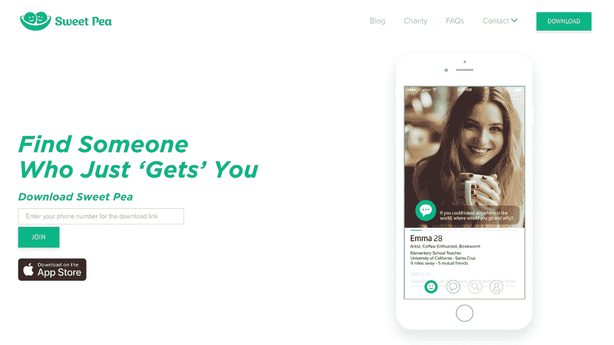
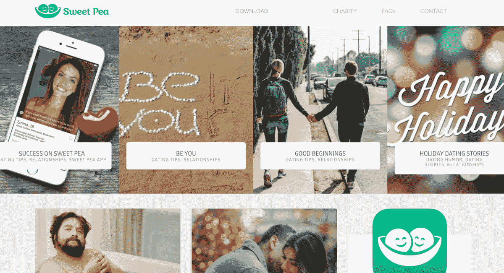

# 带着激情和 A/B 测试挑战根深蒂固的约会垄断

> 原文：<https://www.indiehackers.com/interview/taking-on-an-entrenched-dating-monopoly-with-passion-and-a-b-testing-6e97be6241>

## 你好！你的背景是什么，你在做什么？

我叫塞拉·斯特林。我今年 24 岁，住在洛杉矶，是甜豆的 CMO。

甜豆是一个约会应用程序，它让在网上结识新朋友成为一种体验，更多的是对话，而不是刷卡。我们面向有思想、有智慧的人，他们希望通过约会应用获得更好的社交体验。如果 Tinder 是一个聚会，我们就把自己看作约会应用的咖啡店。甜豆在这里将网上约会体验人性化，以便人们在现实生活中见面时，感觉像是他们的第三次约会，而不是第一次。我们希望让网上交友成为人们享受的一种体验，而不仅仅是一种他们觉得必须容忍和满足的体验。

我们的目标是让网上交友成为一种更富表现力、更具对话性的人性化体验。

我们目前在加州和纽约以及全国十所大学校园推出。我们在 2018 年从几千名用户增加到数万名用户。过去两年，我们一直在 R&D 打造尽可能最好的产品，我们计划在 2019 年集中精力扩大规模。

 

## 是什么促使你开始使用 Sweat Pea？

迈克尔最初提出了这个想法并开发了这个应用程序，但在很多用户注册之前，我很早就被他对公司的愿景所吸引。他的想法在个人层面上引起了我的共鸣——看到约会应用对现代约会文化的影响，我想成为一家公司的一员，试图更周到地对待这个领域。

我们一起花了将近一年半的时间来测试这个想法，完善产品，找到我们的受众，让我们的信息/品牌正确，现在，终于开始规模化。我们通过*大量*的 A/B 测试验证了这个想法。这意味着快速行动，尝试许多不同的事情，对变化持开放态度，倾听并同情用户，明智地优先考虑任务，并且非常非常努力地工作。我们是公司的传教士，不是雇佣兵。我们真的相信我们正在努力做的事情，并愿意用更少的资源比其他人更努力地工作来证明这一点。

在你的公司或产品准备好之前，你很容易仓促行事，试图扩大规模。创业是马拉松，不是短跑。

TweetShare

我在加入甜豆之前，其实并没有什么科技行业的专业知识，但通过在索尼的工作，我确实有过向大学生营销的经验。真的，我只是想学习，努力工作，从一开始就相信公司的使命。我一直专注于旅程和学习机会。在一家初创公司身兼数职可能会很费力，但作为一名科技界女性和一个人，这种经历对我的发展非常宝贵。它教会了我很多。

如果我不在甜豆，我不知道我会在做什么。也许在音乐行业工作。也许开自己的公司。我刚从大学毕业，兼职为一家在线出版物写作，突然心血来潮，在一家咖啡店遇到了迈克尔。和他谈了几个小时后，我问我是否能帮忙甜豆的大学营销。我们一起兼职工作了三个月，然后我作为他们的第一个营销雇员全职加入了这家公司。幸运的是，我现在不必为工作考虑太多不同的想法——目前我很乐意尝试解决这个问题。

## 构建最初的产品需要什么？

生产第一个产品花了*很多*时间。这是一个成熟的行业，因此颠覆价值数十亿美元的公司并不容易，也不便宜。对于约会应用来说，MVP 的门槛非常非常高。所以我们慢慢来，关注每一个小细节，进行大量的 A/B 测试，两年后——我在 1.5 年左右——终于对我们作为一个产品和公司的现状感到满意。我们坚持不懈地渴望比竞争对手更快地不断改进和迭代，但产品的基本舒适度最终还是达到了。我们觉得我们已经准备好认真比赛了。

对于一个新的创业公司来说，深度胜于广度。

TweetShare

我们是一家小公司，目前总共只有八个人。因此，我们必须明智地分配时间，比现有的品牌付出十倍的努力。资源限制让我们慢了下来，但它也迫使我们真正优先考虑并深入思考如何使用我们拥有的资源。在某些方面，这是一件好事。对于一个新的创业公司来说，深度胜于广度。这适用于产品开发和客户获取。

## 你的商业模式是什么，你是如何增加收入的？

我们通过订阅赚钱，就像其他所有约会应用一样，但区别在于价格。甜豆每天只给免费用户提供 15 场比赛，并向高级用户收取 3 美元/月的无限比赛和我们提供的所有其他高级功能。从商业角度来看，我们是 Match.com 等昂贵的会员专属网站和 Tinder 等免费增值应用之间的快乐中介，其中 5%的用户群通过每月 15 美元的订阅为其他人付费。我们希望成长为一家更像 Spotify 的公司，40-60%的用户为一项真正增加他们日常生活价值的服务支付少量、可承受的费用。

我们还认为我们的商业模式天生有利于一个更有思想、更有趣的社区。即使是最小的耐心(限制在每天 15 场比赛)和付费墙(3 美元/月)也会淘汰那些使用其他免费应用程序被动刷卡的人。我们的社区和用户体验实际上通过我们的商业模式得到了加强。我们的商业模式让我们能够直截了当、诚实地对待用户，而不是通过应用内购买、抑制参与的算法和赌场般的用户体验来气化体验。

 

## 你未来的目标是什么？

在这一点上，A/B 测试向前发展有许多变量，如价格、订阅持续时间、免费用户的每日匹配次数、高级用户的每日匹配次数、免费与高级功能，以及一系列其他小事情来尝试做好事情。如果 Tinder 以每月 15 美元(平均)的价格将他们的用户群货币化，并且有 5%的人买单，为了让我们提供每月 3 美元的订阅，我们需要 25%的订阅转化率。达到这个数字需要时间，但我们认为这是可行的，而且趋势是正确的。理想情况下，我们希望达到一个尽可能接近零边际成本的水平，并提供 1 美元/月的订阅，但这是一个需要规模和大量时间的目标。

建立市场最困难的事情是解决鸡和蛋的问题。对我们来说，这是一门科学。要激活一个新的地理位置，我们至少需要 X 个用户。在 X 之后，我们需要每天增加 Y 个用户来防止流失。我们在 Z 用户阈值之后看到了网络效应，如果我们幸运的话，将会让人们通过应用内邀请机制直接推荐他们的朋友。

我们的利润是一项正在进行的工作。像任何软件企业一样，他们的规模会越来越大。我们还在赔钱，但没关系。Tinder 目前的年收入为 8 亿英镑，净利润率为 40%。我们的目标是在三年内达到 20%的净利润率。

在产品方面，我们希望建立一个更好的约会应用程序，以便人们可以删除他们手机上的其他约会应用程序，而不仅仅是人们添加到手机上的另一个约会应用程序。这将要求我们比竞争对手更快地开发产品，继续降低风险并证明我们的业务模式，筹集资金以有效扩大规模，并证明我们的营销收购渠道和单位经济效益超过竞争对手。

从根本上说，我们相信如果我们坚持我们的创始原则，所有这些都是可行的——让人们快乐，并通过有趣、有趣、有意义的对话将他们联系起来。

## 你面临的最大挑战和克服的障碍是什么？如果你必须重新开始，你会做什么不同的事？

我们最大的障碍将是在筹集增长资本的同时保持勤奋和专注于产品。与根深蒂固的垄断集团(Match Group)竞争绝非易事。

就营销而言，如果我能改变什么，我会对我所做的一些实验和所花的钱更有耐心。小数字不会像大数字那样满足大脑——这只是基本的人类心理。我经常发现自己说“如果 Bumble 每天有 50，000 名用户，那么我们需要达到他们的水平，*现在*”在你的公司或产品准备好之前，你很容易仓促行事，试图扩大规模。耐心和满足于现状，而不是匆忙赶到我们想去的地方，漫不经心地花一大笔钱，已经成为一种后天的技能。我仍在培养更好的耐心，并不断提醒自己，创业是一场马拉松，而不是短跑。

明智、谨慎、缓慢地招聘对新公司来说非常非常重要。

TweetShare

糟糕的招聘决策——要么招聘得太早，要么对员工的审查不够彻底——是另一个需要努力的领域。从金钱的角度来看，雇佣不良员工的成本确实很高，但从时间和精力的角度来看，成本更高。明智、谨慎、缓慢地招聘对新公司来说非常非常重要。

## 有没有发现什么特别有帮助或者有优势的？

阅读:所有旧的 [Y Combinator 博客](https://blog.ycombinator.com/)、[陈楚翔的时事通讯](https://andrewchen.co/)、安德森·霍洛维茨的 [a16Z 播客](https://a16z.com/podcasts/)、[布拉德·菲尔德的博客](https://www.feld.com/)、[首轮资本的时事通讯](https://medium.com/@firstround)，以及互联网上的许多其他读物。

生活方式:定期锻炼有助于管理压力。

运气:遇到像迈克尔和莎莉这样的好人。有时候你只是运气好。

## 对于刚刚起步的独立黑客，你有什么建议？

*   保持耐心
*   关注竞争对手，但不要让他们的成功吞噬你
*   不断进行 A/B 测试
*   大量低投资的小实验>需要大量投资的大实验
*   伸出手去，尽可能多的认识一些人

## 我们可以去哪里了解更多？

*   [sweetpea.co](http://sweetpea.co/)
*   App Store 上的[香豌豆](https://itunes.apple.com/us/app/sweet-pea-meet-thoughtfully/id1116103846?mt=8)
*   关注我们的 IG[@ sweetpeapp](https://www.instagram.com/sweetpeaapp/)

有问题吗？想聊天吗？我们谈谈吧！ [【邮件受保护】](/cdn-cgi/l/email-protection#46352f23343427063531232332362327682529)

—[<picture id="ember8116509" class="user-avatar ember-view user-link__avatar"></picture>sweetpeapp](/SweetPeaApp?id=ml2AhsNCkbUFtEY0qpNv0P5FdiO2)，香豌豆 App 创始人

## 想像香豌豆 App 一样自己创业？

你应该加入独立黑客社区！🤗

我们是几千名创始人，互相帮助建立有利可图的业务和副业。来分享你正在做的事情，并从你的同事那里获得反馈。

还没准备好开始使用你的产品吗？没问题。这个社区是一个认识人、学习和实践的好地方。随意[随便浏览](/)！

——[<picture id="ember8116514" class="user-avatar ember-view user-link__avatar"></picture>柯特兰艾伦](/csallen?id=ibTLPyjwVebnZjMGKvz6ztarnuV2)，独立黑客创始人

15votes