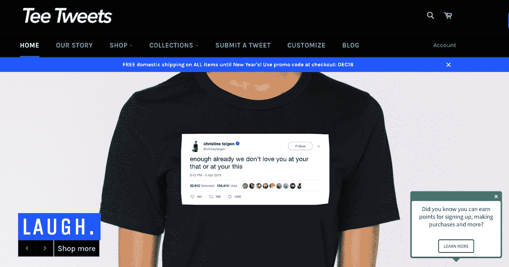
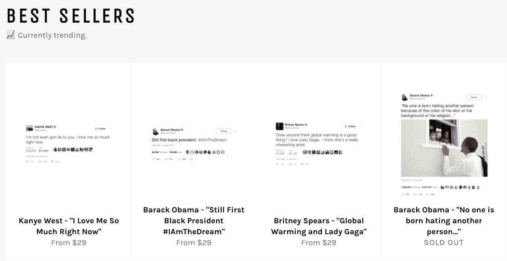
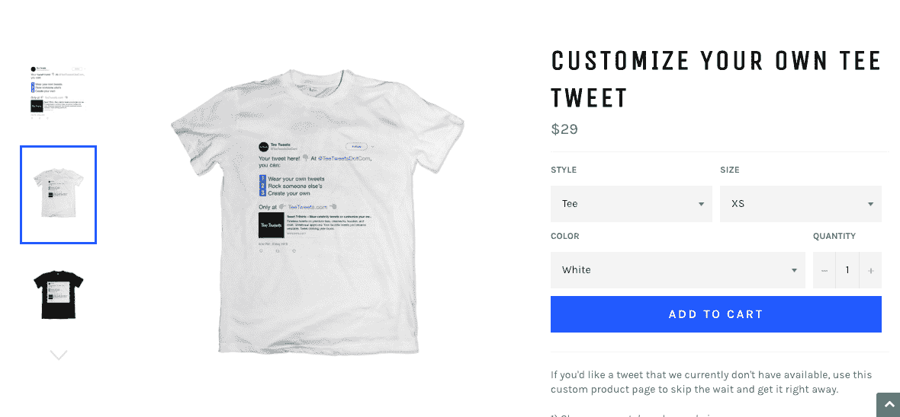

# 尽管债务迫在眉睫，还是要迈出这一步，并在前进的过程中解决问题

> 原文：<https://www.indiehackers.com/interview/taking-the-leap-despite-looming-debt-and-figuring-it-out-as-i-go-31c7348825>

## 你好！你的背景是什么，你在做什么？

嘿，我叫海勒姆，我是推特网的创始人。Tee Tweets 是一个服装品牌，可以让你穿上世界上任何一条 tweet。大多数是名人的推文，但我们也提供定制你自己的推文的能力——这意味着你可以穿上你自己的推文，朋友和家人的推文，或者从头开始设计一个“假”推文，创造你自己的旋转。

我最喜欢的(也是最棘手的)Tee Tweets 的一个部分是它所覆盖的广泛的受众网络。由于推特上的推文和亚文化的性质，在任何时候都有许多不同的受众生活在推特上。例如，我们有很多 Kanye West 粉丝购买 Kanye tweet 衬衫。与此同时，我们也有很多人不喜欢 Kanye，但喜欢讽刺性地穿他的古怪的推文或证明一个观点。类似的例子发生在 POTUS 集合上。从某种意义上来说，推文不是信息，穿者才是。

从每一个角度和每一条存在的推文来看，这都是有意义的，所以在某些方面，这是一个容易的销售。这种有着各种各样的需求和要求的广泛受众使得有针对性的营销变得非常困难，但是却为进行广义营销提供了一个很好的机会。

Tee Tweets 目前的月收入约为 1200 美元，在搜索中有很大的有机影响力。

 

## 是什么促使你开始使用 Tee Tweets？

我在 2017 年 2 月初想到了 Tee Tweets 的想法。美国总统就职典礼刚刚举行，似乎所有人都在谈论唐纳德·特朗普的推文。不仅是他，名人也在推特上发出了更多回应。每个人都在关注 Twitter，我只知道那里一定有某种游戏。

Tee Tweets 的想法来自我在 IU 的最后一个学期，所以这个时机也很诱人。尽管我一毕业就要写论文，还要做一些自由职业咨询，但我认为这是最好的时机。就这样，推特诞生了。

你必须愿意从悬崖上跳下来，并在下降的过程中尝试建造一架飞机。

TweetShare

迈出这一步很可怕。实际上，我曾考虑过在大一毕业后退学并开始创业，但我面临着完成大学学业、找到一份好工作等诸多压力。你知道，传统的家庭建议。随着发射的临近，我的焦虑与日俱增。作为一名破产的大学生，学生贷款很快就要到期，我知道这是一个巨大的风险，可能会导致毁灭性的失败。我认为这是每个企业家在考虑迈出第一大步时都在纠结的事情(顺便说一句:我不喜欢称自己为企业家——我认为这是一个沉重的词，最近有点太随便了)。经过深思熟虑，我决定制作我的第一份采购订单，以此来“锁定”自己，全身心地投入到这项业务中。最初的 800 美元采购订单对我来说是一大笔钱，尤其是在那个时候，没有任何保险措施，所以这是我少想多做的方式。

我之前没有零售背景，更不用说电子商务了。然而，我曾在旧金山一家名为 [Gametime](https://gametime.co/) 的初创公司工作过两年，负责营销和发展。我的地位非常低，但这仍然是一次很棒的经历。我了解了一些游击营销策略，管理了一些社交媒体账户，并与 Mixpanel analytics 打过交道。作为一名品牌大使，我也在运动场馆和酒吧工作，因此与潜在客户有很多互动。这些互动对于学习如何与潜在客户交谈，以及如何摆脱被忽视或拒绝是非常宝贵的。听起来很粗糙，但是学得越早越好。我还做过自由摄影和金融实习，在那里我应用了我的 Excel/会计技能，这最终被证明是有用的。

## 构建最初的产品需要什么？

时间是任何人拥有的最宝贵的资产，尤其是在创业的时候。2017 年夏天，当 Tee Tweets 推出时，我正在应对三个不同的风险:

*   为一家房地产公司从头开始编程和实现一个数据库(这将决定实际上是否毕业)
*   搜索引擎优化咨询(这个角色后来演变成营销、网络安全、视频编辑和内容创作的独角戏)
*   发球台高音从上到下

像许多创始人一样，我总是熬夜，尤其是在夏天。我经常在凌晨 4 点左右上床睡觉。许多任务本可以外包出去...如果我有钱的话！为了代替钱，我做了大多数人做的事情，并学会了如何自己做每件事。从在 Photoshop 中创建实体模型到寻找模型，进行产品摄影，标题标签，元描述，产品描述，标志设计，会计软件，客户服务，销售渠道——你说得出的，我都做了。除了必须自学之外，这个项目也是自筹资金的，所以一切都必须以最简单的方式完成。

 

## 你是如何吸引用户和发展微博的？

直到很久以后，我才知道媒体对你的发布会有多重要。由于营销中的这个漏洞，我们在发布会上最大的媒体是一个 Instagram 帖子，只有几个赞表示商店正式开业。你可以想象，没有什么大张旗鼓的。

很多重点放在了搜索引擎优化上。不幸的是，SEO 的结果通常要到六个月后才开始生效，至少是六个月后。所以，我尝试了一些其他的免费营销策略。

一个策略是做“商店广告交换”。这就是你给别人的店做广告，换取你在他们店里做广告。然而，这并没有持续很长时间，因为它不符合 Tee Tweets 的主题，并且在我们的网站上看起来很糟糕。你也很少看到一家商店为另一家商店做广告，所以它不起作用。这个想法很快就被废弃了。

我们生活在键盘战士和推特手指的时代。不要因此而气馁。倾听市场，但屏蔽噪音。

TweetShare

我的另一个免费策略是加入 reddit 社区。有一些衣服和衬衫的 subs，所以我们会在那里张贴一些衬衫，试图获得一些牵引力。它工作得相当好，虽然很难在这些潜艇中保持更新。在每个 sub 的规则内发帖也非常重要，所以交叉发帖或者意外违反规则会很棘手，因为你认为你在一个 subreddit 中，而实际上你在另一个 subred dit 中。

Instagram 是展示你物品的好地方。然而，它已经极度饱和了，所以有机增长是很困难的。随着算法的不断变化，需要进行大量的试错测试，才能找出 Instagram 认为值得向你的粉丝或潜在粉丝展示的内容。和 SEO 一样，这是一个永无止境的练习。

Twitter 是一个显而易见的东西，因为它的业务是基于 tweets 的。然而，推特上有很多噪音。如果做得好，这就是社区管理可以为你创造奇迹的地方，因为它有可能像病毒一样传播。在 Instagram 中，几乎不可能出现在“探索”标签上。Instagram 上的病毒式传播有很多因素，例如参与度、评论数量、你多快收到参与度、你过去的 Instagram 实践，以及只有 Instagram 员工知道的更多因素。然而，在 Twitter 上，一些转发会让你滚动起来，让人们参与进来。这是 Twitter 独有的，可以真正提高你的知名度。

社交媒体的巨大缺点是你在别人的平台上建立了一个观众群。人们通常建议你在关注社交媒体的同时或之外，建立自己的电子邮件列表。社交平台一直在变化，变化的方式你不一定能预测或控制。因此，用自己的方式与客户和社区交流是件好事。

一条重要的建议是:要真实。人是聪明的，他们可以自己做决定。你的产品不会适合所有人。即使有了推特广撒网的受众，仍有许多人持批评态度。没关系——这将取决于你想如何处理它的情况，但我们生活在键盘战士和推特手指的时代。不要因此而气馁。倾听市场，但屏蔽噪音。

## 你的商业模式是什么，你是如何增加收入的？

Tee Tweets 通过在线产品销售获得收入。目前大约是 1200 美元/月，尽管会有波动。零售是季节性和周期性的，所以有些波动是自然的。然而，并不是所有的波动都可以用自然市场趋势来解释。就假期销售而言，1 月和 2 月实际上是更好的月份，这对 Tee Tweets 来说是一个奇怪的(但却是好的)趋势。传统上，一月份是零售公司因退货损失惨重的时候。第一次回归实际上是在 2018 年年中，也就是成立一年后。

销售波动有几个原因。首先是 SEO。每当 alt 标签、meta 描述或丢失页面发生变化时，您都需要重新索引您的站点。当它被重新索引时，你会注意到一些流量的下降，而搜索引擎会根据它们的算法决定你所做的改变并放置你的站点。如果你的产品不断变化，或者你相当频繁地添加新的产品，这种情况会时有发生，取决于具体情况。

季节也很重要。有了 Tee Tweets，它的周期性就少了一些，因为衬衫是全年的商品，即使天气不够热，不能单独穿 t 恤，Tee Tweets 也提供圆领毛衣和帽衫，所以你可以全年自豪地穿着你的推文。

| 月 | 收入 |
| --- | --- |
| 17 年 10 月 | 200 |
| 17 年 11 月 | 0 |
| 2017 年 12 月 | 250 |
| 2018 年 1 月 | 500 |
| 2018 年 2 月 | 600 |
| 18 年 10 月 | 1300 |

## 你未来的目标是什么？

我想不断提高的主要事情之一是产品开发。我希望很快发布一系列背心，但为新产品模仿所有现有的推文非常耗时。此外，这意味着当新的推文发布时，总共将有八种图像变化(衬衫、运动衫、帽衫和坦克的黑白服装图像)。

我相信这将有助于接触到更广泛的人群，因为我们的一些 t 恤也已经变成了时尚的休闲上衣。就产品开发而言，可能性实际上是无限的。

最大的拦路虎就是什么都自己做。没有帮助，Tee Tweets 无法扩展。因此，我的下一步重点是在可能的情况下进行外包，以便扩大规模。

## 你面临的最大挑战和克服的障碍是什么？如果你必须重新开始，你会做什么不同的事？

让我措手不及的第一件事是，建立和运营一家企业需要花费大量的时间。你可能在想，“这只是一家 t 恤公司，能有多难？”嗯，我也是这么想的。结果:非常。这是由许多原因造成的。

**供应链**

Tee Tweets 不是直运。许多现有的 t 恤企业都是直接发货，对产品质量没有任何控制。直运的主要优势是时间可以花在其他事情上，如营销、内容创作等。但是，在直运的情况下，建立一个持久的品牌要困难得多。

**质量**

从一开始，我就非常坚定地要创造一个高质量的产品，让人回头率高，穿着舒适，人们会自豪地穿着。市面上 99%的 t 恤都是用成本最低的面料，用最便宜的印花方式。推特不会。这种对质量的追求降低了利润，但人们对他们的产品更加满意，这也降低了产品的退货率，我认为我们已经看到了证据。

**内容创作**

创作优质内容需要花费大量的时间和精力。与此同时，质量可能是主观的，所以我相信内容创作中的一些压力与你在自己的作品中确定“质量”的内容和方式有关。内容创作业务目前正在蓬勃发展，但来自如此多不同来源的如此高的投票率往往是以质量为代价的。

 

**制造**

所有的项目都是内部打印的，所以很难确保这些项目是“完美的”尤其是在有两只狗的房子里，它们拒绝停止脱毛，即使是在冬天。我把公寓的一部分封闭起来，以确保那里的灰尘和活动尽可能少。我的目标是控制生产环境。想想《绝命毒师》,除了我不会从一次制作中赚几百万。

**营销**

正如我之前提到的，市场营销对推文特别棘手，因为推文的受众千差万别。有些人喜欢坎耶，有些人讨厌坎耶，有些人喜欢政治，有些人讨厌政治，有些人狂热地讨厌凯文·杜兰特，有些人不关心体育。为这些不同的受众量身定制内容和营销尤其痛苦，因为人们会立刻对你的品牌形成印象。从更技术性的角度来看，战略营销很重要，因为搜索引擎不断试图找出你，并把你放在真正寻找你的人(或你的竞争对手)面前。

**定时**

由于 Tee Tweets 基于许多流行文化、体育、政治等，事情可能会很快变糟。主要例子:当 Kanye 与 Trump 结盟时，Kanye Tee Tweets 的销量直线下降。然而，史蒂芬·科拜尔和其他喜剧演员的推文销量保持稳定，甚至略有上升。流行文化有自己的经济日历。

## 有没有发现什么特别有帮助或者有优势的？

这听起来很傻，但我最初想让自己远离 Tee Tweets 品牌本身，因为我一直希望人们支持 Tee Tweets，因为他们真正喜欢这个品牌并相信它，而不是因为我的朋友想支持我，即使他们不喜欢，也会买一件衬衫。

不要误会我，我永远感激来自我的朋友和家人的支持，但我总是想觉得这是我应得的。我最近意识到，即使你有能力创造一些距离，也无法摆脱你公司的品牌，因为你的团队中有人帮助你管理日常事务。亚马逊是杰夫·贝索斯的代名词，特斯拉是埃隆马斯克的代名词，伯克希尔哈撒韦是沃伦巴菲特的代名词。公司的错误被视为他们的错误，即使他们与此无关。所以，试图逃避是没有用的。事情就是这样。作为一名领导者，你必须拥有它，从中学习，并不断向前推进。

## 对于刚刚起步的独立黑客，你有什么建议？

我能说的第一件事就是去做。也许这只是我的看法，但当涉及到商业时，我往往会想得太多，我正在努力改变这种情况。我会经常陷入分析麻痹，但现实是，你要试过才知道。我们可以整天在“如果”上来来回回，但是在采取行动之前，没有任何具体的东西可以作为进一步决策的基础。有很多不同的因素决定你的结果。你必须愿意从悬崖上跳下来，并在下降的过程中尝试建造一架飞机。如果失败了，至少你知道并能从中吸取教训。

如果你在等待“最佳时机”的到来，它永远不会到来。

TweetShare

世界上最大的毒药是后悔。当我想到这一点时，它驱使我采取行动。如果你在等待“最佳时机”的到来，它永远不会到来。你只需要去做。如果不是现在，什么时候？

## 我们可以去哪里了解更多？

*   **官方 Tee 推文网址:**【https://www.teetweets.com 
*   Instagram 手柄:[@ teeweetsdotcom](https://www.instagram.com/TeeTweetsDotCom)
*   Twitter 句柄:[@ teeweetsdotcom](https://www.twitter.com/TeeTweetsDotCom)
*   [博客](https://www.teetweets.com/blogs/news)
*   [Pinterest](https://www.pinterest.com/TeeTweets)
*   [定制自己的 Tee Tweet](https://www.teetweets.com/products/customize-your-own-tweet-shirt-sweater-crewneck-hoodie-tee-tweet) ！

如果你愿意，你也可以在 [LinkedIn](https://www.linkedin.com/in/hiramnunez) 和我的个人 [Instagram](https://www.instagram.com/hiramfromthechi/) 或 Twitter [@HiramFromTheChi](https://twitter.com/hiramfromthechi) 上找到我。

随时乐意联系讨论！请在下面的部分留下问题和评论，我会回复您的！

——[<picture id="ember8116633" class="user-avatar ember-view user-link__avatar"></picture>贡自驰](/hiramfromthechi?id=pJZdwIwLaWg1O2Yh3LMSEb0BM6Z2)，开山祖师

## 想像 Tee Tweets 一样建立自己的事业吗？

你应该加入[独立黑客社区](/)！🤗

我们是几千名创始人，互相帮助建立有利可图的业务和副业。来分享你正在做的事情，并从你的同事那里获得反馈。

还没准备好开始使用你的产品吗？没问题。这个社区是一个认识人、学习和实践的好地方。随意[随便浏览](/)！

——[<picture id="ember8116638" class="user-avatar ember-view user-link__avatar"></picture>考特兰艾伦](/csallen?id=ibTLPyjwVebnZjMGKvz6ztarnuV2)，独立黑客创始人

26votes