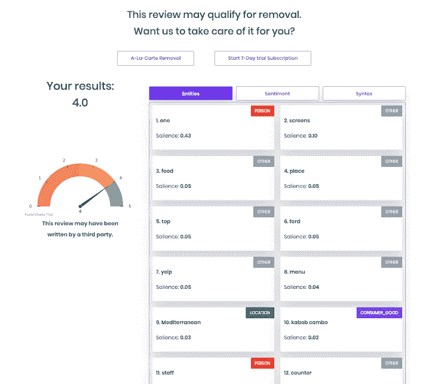
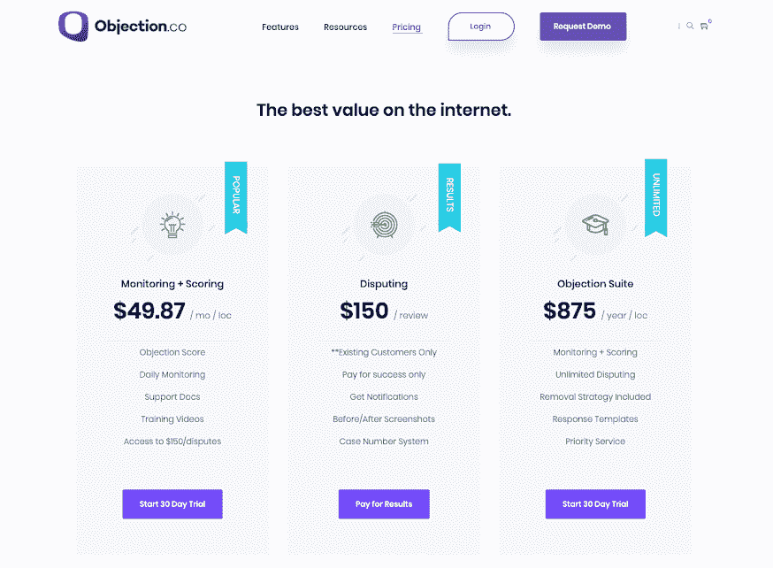

# 让我摆脱了护士学校 3 万美元债务的商业理念

> 原文：<https://www.indiehackers.com/interview/the-business-idea-that-got-me-out-of-30k-in-nursing-school-debt-e32f189370>

## 你好！你的背景是什么，你在做什么？

大家好，我的独立黑客伙伴们！我叫柯蒂斯·博伊德，我是反对公司的创始人。我有护理方面的背景。

Objection Co 是 SaaS 的一款产品，它使用人工智能来识别对业务不利的欺诈性评论。

【T2

## 是什么促使你开始使用 Objection Co？

我的创业之旅始于我读护士学校的时候。我在最后一个学期，负债 30，000 美元，在急诊室轮转，我在那里[实习](https://en.wikipedia.org/wiki/Preceptor#Health)。

一个整容外科医生来急诊室做咨询。他心情很糟糕，因为一个病人留给他一个糟糕的评论，这真的伤害了他的私人执业。我告诉他我可以帮他移除。他开玩笑地说，如果我这样做，他会还清我的学生贷款。我告诉他我有多少学生贷款，他说在评估开始的那一周，他可能损失了更多，因为他失去了七八个新的咨询。

第二天，我打电话到他的办公室，问他在急诊室的提议是不是认真的，他说是认真的。接下来的 72 个小时，我都处于研究模式，疯狂地标记和反驳差评。我拿不下来。评论管理员很坚决，我真的很沮丧。

最后，我在周末飞往旧金山，在该评论网站总部附近的当地咖啡店里闲逛，看看是否能找到能帮助我的人。最后，我遇到了一位曾在审查取消部门工作的高管，他向我透露了内幕。他提供了详细的指导，告诉我们该怎么做，怎么说，才能让评论被删除。带着这个建议，我飞回家开始工作。

不到 48 小时，我就删除了这篇评论。又过了 48 小时，我拿到了一张 3 万美元的支票。那一天，我意识到我可以为成千上万的企业主解决问题，并真正影响他们的生活。那位医生是整个医师网络的董事会成员，所以不到一周，我就有了 500 多个客户、一名注册会计师和自己不断增长的业务。那是六年前的事了。

停止关注你的产品，销售结果。

TweetShare

我们的 B2B[ORM](https://en.wikipedia.org/wiki/Object-relational_mapping)SaaS 专注于使用人工智能/[ML](https://en.wikipedia.org/wiki/Machine_learning)来识别和质疑 18 个以上使用最广泛的评论网站上的非法评论。今天，营销人员和企业主都在使用它。最常见的行业是医疗、家政服务、法律和酒店。我们已经开业八个月了，年营业额接近 25 万美元。

大约三年前，我意识到电脑可能可以做我的工作。为了不成为另一个统计数字，我决定回到学校，学习如何编码和编程一台计算机来完成我的工作。当我学习编码时，我意识到我可以同时向无限数量的客户提供服务，而不是像以前那样用手动和耗时的过程来完成同样的任务。

我向目前与我一起工作的多个客户和顾问推销了这个想法，他们喜欢这个概念。我知道即使事情从来没有“爆炸”,我至少能够在未来将它用于我自己的目的，并花更少的时间阅读差评和关注可能有争议的非法评论。

之前，我一直是在线公关的顾问，受雇于一家咨询公司，负责在线阅读、识别和反驳非法评论。我已经做了大约六年，主要关注 Yelp 和 Google 评论，这让我理解了大多数评论者内容管理的机制。

我真的没有考虑别的，考虑到这已经是我一段时间以来的工作主线了。我的经济状况一直不稳定；有些月份是惊人的，有些月份是完全干燥的。经营一家总部位于 SaaS 的企业无疑有助于稳定财务状况，因为我们有一个仪表板来存放我们的客户评论，这需要持续收费。

## 构建最初的产品需要什么？

Objection Co 的第一次迭代是由我在 Upwork 上发现的一个印度的离岸开发团队构建的。具有讽刺意味的是，尽管评论很好，但它们相当糟糕。该项目被推迟了六个多月，他们要求在最初报价的基础上增加数千美元。最初我认为它要花费 15，000 美元。我最终放弃了这一切，并找到了另一个团队。

我的第二个团队位于乌克兰，代码和通信的质量直线上升。印度团队花了一年多的时间，而我的乌克兰团队花了大约三个月。

这些功能基于在线声誉管理中的决策树以及如何处理负面评论的最佳实践。我不想与广泛覆盖网络声誉所有方面的大公司竞争——我只是想创建一个独特的管理负面评论的仪表板。

我用我的储蓄账户从头到尾启动了这个项目。我曾在当地一家标牌公司担任营销总监，直到这家公司赚了足够多的钱，让我辞掉了工作，把全部精力放在发展我们的订户和这个领域的权威上。

杰森·布朗和他对评论欺诈的研究非常有帮助，他关注的是谷歌评论，所有评论网站上的评论欺诈的特征都是相似的。Josh Prilloud 是我的商业顾问，他帮助我建立了一个商业模式，并了解我的产品适合更大的市场。

## 你的技术是什么？

在前端，我们有一个 SaaS 主题。在后端，我们使用 Laravel Vue 堆栈来托管客户仪表盘。我们有五种不同的 API，用于为客户仪表盘提供信息。

*   评审聚集器 API(用于引入现有评审)
*   审核更新 API(每天监控审核)
*   审核评分 API(对可能符合移除条件的审核进行评分)
*   审查欺诈 API(根据欺诈指标对审查者档案进行评分)
*   个人资料评分 API(编译星级和收入损失计算器)

我们的审查欺诈 API 使用 4+种不同的人工智能框架:

*   映象分析
*   使聚集
*   BERT/NLP 分析
*   NLTK/NLP 分析

随着我们从负面评价发展到不可知的星级欺诈检测系统，我们的堆栈一直在发生变化。一开始，我们的 API 更像是一个花哨的评论过滤器，包含一个*巨大的*单词包，以达到评论可以被删除的原因。现在它更多地向人工智能和机器学习的方向发展，为各种评论网站创造新的欺诈指标。

## 你是如何吸引用户和发展异议公司的？

我们从来没有真正的“发射”我们刚刚开业，预计会有成千上万的人涌向我们。当然，这从未发生过。我们能够吸引一些咨询客户，并产生足够的收入，从而有资格从 ClearBanc 获得一些资本。

有了这些资金，我们开始认真对待我们的销售渠道和对外销售工作。我开发了一个社交监听工具，可以监听每个企业的新差评。然后，我们使用自己的软件来查看该评论是否符合删除条件。如果是的话，我们会给企业打一个电话，寄一张明信片。我们能够从每天收到负面评论的大约 40，000 家不同企业的名单中预先确定我们自己的线索。现在，我们有一个由三名全职预约人员组成的团队，每周给大约 2500 家企业打电话。

我们从第一个月的$2K 涨到第二个月的$10k。我们更频繁地出售年度订阅，因此增长相当可观。在不到四个月的时间里，我们从 40 个用户增加到 300 多个用户。那时我们决定对前端进行重大改变。

我们意识到，我们的前端给出了一个“虚假承诺”的解决方案，而不是一个数据驱动的解决方案来识别和争论非法评论。我们没有试图说服人们，而是意识到我们的价值在于结果。我们开始使用硬数据向客户展示我们的服务能为他们做多少。

业务一直在放缓，但我们现在有一个更好的客户群，一个更好地了解我们的服务并与我们长期合作的客户群。

## 你的商业模式是什么，你是如何增加收入的？

我们以 3 种不同的方式向用户收费:

1.  年度订阅
2.  每月订阅
3.  单点结果

通过这种方式，我们能够与最小的企业和最大的企业合作。我们以[条纹](https://stripe.com/)开始，对它们非常满意。

目前，我们有望实现每月 2 万美元的收入。我们的客户流失率一直很高；一旦顾客得到他们想要的，他们就会离开。我们一直在开发我们的产品，这样我们就能更长时间地留住客户。

我们的新业务模式非常注重与更大的渠道合作伙伴建立战略合作伙伴关系。虽然我们在向小型企业销售方面没有问题，但我们知道将我们的技术添加到现有企业生态系统中也有巨大的机会。

## 你未来的目标是什么？

现在，我们正在将越来越多的欺诈指标添加到我们的 API 库中，这样我们就可以更好地了解评论中的意图，并在各种评论网站上创建个人资料。

我想说前面有一个巨大的路障。我们的公司本质上就是被设计来自相残杀的。希望一旦事情变得严重，科技巨头会收购我们，但如果他们用同样的技术复制我们，那么我们将完全被挤出市场。

## 如果你必须重新开始，你会做什么不同的事？

我做过的一些最糟糕的决定是营销支出，特别是过于信任营销供应商。你需要找到一个缓慢起步的策略，并以此为基础。不要让人向你承诺结果；让他们证明。

做 A/B/C 测试(或者多臂强盗战术，如果适用的话)来优化你的内容、登陆页面和文案。

在我看来，如果你能学会走在搜索你的人的前面，向内的线索是最好的方法。

## 有没有发现什么特别有帮助或者有优势的？

产品导向的增长非常有帮助。

马尔科姆·格拉德威尔的书，尤其是《T2》中的《引爆点》(T3)，让人们大开眼界，认识到一个产品或服务中的小细节有助于它真正脱颖而出。

不要让人向你承诺结果；让他们证明。

TweetShare

拖延会扼杀你的事业，会让你淹没在自己的效率低下中。此时此刻，把事情做完。变得以任务为导向，让事情发生。

## 对于刚刚起步的独立黑客，你有什么建议？

清晰是善良的。

当解释你所做的事情时，试着让事情过于简单。停止关注你的产品，销售结果，梦想。

## 我们可以去哪里了解更多？

*   [我们的网站](https://objection.co)
*   [我们的推特账户](twitter.com/objectionco)

如果有人正在与声誉管理 SaaS 做斗争，或者想问关于评论欺诈的问题，请不要犹豫！

——[<picture id="ember5276532" class="user-avatar ember-view user-link__avatar"></picture>寇博伊德](/ObjectionCo?id=MFdPSB4oKkcwELFXcwnbktWOFHp2)【异议公司创始人

## 想像 Objection Co 一样建立自己的事业吗？

你应该加入独立黑客社区！🤗

我们是几千名创始人，互相帮助建立有利可图的业务和副业。来分享你正在做的事情，并从你的同事那里获得反馈。

还没准备好开始使用你的产品吗？没问题。这个社区是一个认识人、学习和实践的好地方。随意[随便浏览](/)！

—[<picture id="ember5276537" class="user-avatar ember-view user-link__avatar"></picture>考特兰艾伦](/csallen?id=ibTLPyjwVebnZjMGKvz6ztarnuV2)，独立黑客创始人

27votes