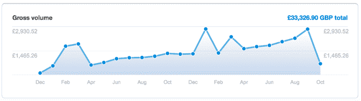

# 构建、推出和营销我的产品背后的挑战

> 原文：<https://www.indiehackers.com/interview/the-challenges-behind-building-launching-marketing-my-product-7a78b8b0e5>

## 告诉我们关于你自己和你正在做的事情。

我叫 Chris，是一名来自伦敦的全栈开发人员和想要成为独立黑客的人，也是 YC 大学的校友。

从 2013 年初开始，我就和一个朋友一起运营 Urlbox。 [Urlbox](https://urlbox.io) 提供了一个简单的 API，允许用户自动抓取网络上任何网站的截图，用于自己的网站、博客、电子邮件、应用程序，或者作为自己产品或内部测试的一部分。我们为那些截图不是其产品或用户界面核心部分的企业提供价值。这节省了开发者的时间和金钱，因为他们可以将截图渲染外包给 [Urlbox](https://urlbox.io) 。

有许多用例可以解释为什么企业可能想要使用 [Urlbox](https://urlbox.io) 来截图。雅虎！利用我们截取他们在社交媒体上发布的各种体育网站的截图。一些用户希望在灵感图库中显示网站的高分辨率截图，或者将网站的缩略图放在博客或时事通讯的链接旁边。一些用户的产品涉及电子邮件营销，他们希望在发送之前预览电子邮件的外观。最后，企业可能希望开发一种产品，能够捕捉竞争对手在一段时间内对其登录页面或定价页面的更改。Urlbox 让截屏变得更加容易，这样用户就可以将资源集中在产品的更高级功能上。

## 你是如何开始使用 Urlbox 的？

2012 年底，那年夏天我刚从 Y Combinator 回到伦敦——我在 YC 的经历非常棒，但最终我决定和我的团队分道扬镳。

我有一个朋友，是几年前在伦敦众多银行中的一家工作时认识的。当时，我们都想建立一个相当小的，利基，自给自足的东西，可以从第一天开始产生收入，然后作为半被动收入的副业项目来运营。我们已经一起发布了一款 iOS 文字游戏，所以我们对自己的能力、动机和工作方式都有很好的了解。与此同时，我们过去常常幻想创造一种产品，这种产品能让我们赚到足够的钱全职从事这项工作。

我建议我们构建类似幻像的服务。已经有像 ShrinkTheWeb 这样的服务验证了为屏幕截图制作快捷方式的想法，并表明这样的服务可以吸引大客户和小客户。我们可以在一个周末构建它，并在发布当天开始收费，至少我是这么认为的！令人惊讶的是，即使是最简单的想法也会变得如此复杂。

我们开始构建最初的产品，起初，我们只是用幻想曲来渲染截图。然后越来越多的网站开始使用网络字体，而 Phantom 总是很难渲染它们，所以我们知道我们必须重新考虑渲染引擎。事实上，字体渲染可能是试图渲染截图时的主要挑战之一——尤其是当您习惯在 MAC 上工作，但随后开始在 Linux 上渲染截图时！我花了大量的时间摆弄 Linux 中的字体配置，试图获得最准确的截图，这简直是疯了！

将万维网上所有可公开访问的网站作为程序的可能输入，这使得测试所有边缘情况变得很困难。我们不是试图测试所有的东西，而是依靠用户告诉我们，他们的截图上是否有什么问题，然后尝试解决这个问题。这些年我们看到了一些有趣的网站！另一个大挑战是扩展(以及随之而来的所有事情，如监控和部署)，同时还要关注成本。支持 [Urlbox](https://urlbox.io) 的大量时间都花在了 devops 活动上，因此尽可能多地实现自动化非常重要。

## 构建 Urlbox 需要什么？

我们在银行工作时攒下的钱足够维持我们的第一个产品版本。我们估计大约需要一个月，但我们最终花了大约三个月！我本可以做得更久，无休止地优化无意义的东西，添加没人会用到的功能，每天花几个小时对像素进行微观管理。我似乎更害怕产品在黑客新闻上受到侮辱，而不是希望在相关观众面前真正赚钱。是我的朋友最终受够了，给我们设定了一个艰难的期限，我同意努力实现。

推出后，我们通过接一些承包工作来养活自己。我的朋友回到一家银行工作，我开始了另一家创业公司，在那里，过了一段时间，我设法得到了一份微薄的工资来支付账单。

## 你是如何吸引用户和发展业务的？

我们于 2013 年初推出。我们做的是典型的开发者的事情，一旦我们把所有的精力都放在开发产品上，我们就筋疲力尽了，把营销更多地作为一种事后的想法，而不是试图在发布前建立任何受众。这是一个严重的错误！我们在所有“即将发布”和 [BetaList](https://www.betalist.com) 风格的地方放上链接，并试图联系一些记者，以便获得一篇关于我们的文章。我们拼命地给我们认为会成为目标受众的公司和网站设计机构发邮件。没人回复！

我们随后在《黑客新闻》上发帖，并登上了半天的头版。当时我们的基础设施非常薄弱，网站因为每个人都在我们的首页上试用产品而陷入停滞。我们之前发邮件的一名记者在黑客新闻上看到了我们，并决定写一篇文章。老实说，我们并没有从这些尝试中获得大量的注册，但它在反向链接方面帮助了我们的 SEO。直到今天，我们网站最好的新访客来源之一是我们放在 Quora 上的一个简单的“我也是”的回答。

我努力确保来自用户的任何询问都尽快得到回复和回答。我认为质量支持很重要，尤其是当客户付钱给你的时候。不止一次，正是我们高质量的支持让现有客户将我们推荐给其他人。更重要的是，我喜欢和用户交谈，知道他们正在试用我开发的产品。

目前，从试用到付费的转化率大约为 9%。该网站的流量很低，每天不到 100 次。我们应该更多地关注 SEO，我们还没有在广告或推广上花一美元，尽管这是我现在要研究的事情，因为我们有一些利润可以再投资。

## 你的营收背后有什么故事？

从第一天开始创收是我们选择打造像 [Urlbox](https://urlbox.io) 这样专注的利基产品的原因之一。我们的总部在英国，当时，Stripe 在我们国家还不可用，所以很难找到一家收费不那么高的好的支付提供商。我们最初有三个计划，每月 9 美元/29 美元/99 美元，用于增加独特截图的数量，如果用户的需求更大，还可以定制计划。我们从来没有免费的计划。这是我们考虑过的事情，但我们想从一开始就给人这样的印象，这是一个高质量的产品，值得花钱购买。不过我们有免费试用！

发布后，我们进行了几次试用注册，大约一周后，我们的第一个付费用户突然注册了。尽管每月只有 9.99 美元，但这给了我们一些希望！从那以后，注册人数一直相当稳定，考虑到我没有投入太多的营销努力，这很好。发布后不久，我给[帕特里克·麦肯齐(patio11)](/businesses/appointment-reminder) 发了电子邮件，他回复说建议我们提价。几个月前，我终于决定将这个建议付诸实践，并提高了价格。我们现在有 29 美元/99 美元/199 美元的计划。这产生了增加收入的效果，而且我们开始与一类不那么痛苦的客户打交道。上个月，我们的收入为 3，750 美元，如果目前的增长继续下去，我们应该在年底达到 5，000 美元。

以下是我们从 2014 年 12 月到 2016 年 10 月初的收入图表:(请注意，数值以英镑为单位。)

## 你未来的目标是什么？

我想在互联网营销和搜索引擎优化方面获得更多的经验——弄清楚什么可行，什么不可行——因为这不仅对 [Urlbox](https://urlbox.io) 很有价值，对我将来从事的任何其他产品也很有价值。

我很喜欢通过销售产品而不是销售时间来谋生的想法，但是你需要时间和金钱来制造一个像样的产品。我希望能够建立另一个类似于或者比 [Urlbox](https://urlbox.io) 范围更大的产品，并利用我从 [Urlbox](https://urlbox.io) 、YC 和我其他创业经历中学到的一些经验来发展这个产品。

我喜欢独立黑客可能提供的自由——不仅仅是设定自己时间表的自由，还有创造和学习任何你想做的事情的自由。我也一直打算开一个博客，写一些这类的东西，因为我觉得这很有趣，但我似乎从来没有抽时间去做。

## 如果你必须重新开始，你会做什么不同的事？

我会更早开始关注营销。很多像我这样的开发者做事的方式都是错误的，直到最后或发布前才开始营销。到那时，你很可能已经精疲力尽了，坦白地说，你不会想去钻研 SEO、广告和社交媒体的黑暗世界，在那里，很多事情都要反复试验。你不能只为这些事情编写一个单元测试，然后期望它们能够工作。我会说这有点像吃青菜——你知道你应该这样做，这对你有好处，但是你不能总是鼓起动力或者有时鼓起勇气去做。

我肯定会努力比我们更快地发布——我花了太多时间试图让网站看起来更好——虽然我认为这些事情很重要，但我意识到需要优先考虑并记住设计可以随着时间的推移而改进。我也会早一点听 patio11 的话，在他建议的时候提高价格，而不是三年后！

## 哪些事情对你最有帮助？

帕特里克·麦肯齐(Patrick McKenzie)和内森·巴里(Nathan Barry)等人给了我灵感，我非常感谢他们分享了他们所有的知识和经验。YC 的建议和保罗·格拉厄姆的文章真的很有帮助，同样适用于小项目和改变世界的大创意。现在这些都可以在网上找到，所以没有理由不去阅读或浏览。

就我们做出的正确决策而言，我感到自豪的是 [Urlbox](https://urlbox.io) 的架构自推出以来一直没有改变，并继续支持我们在接纳更多更大的客户时进行横向扩展。我还认为，我们善于对各种特定于某个人的用例的功能请求说不，但这些请求不会让许多其他客户受益。

## 你会和有抱负的独立黑客分享什么建议？

对你的目标要现实。像 [Urlbox](https://urlbox.io) 这样的小项目开始腾飞需要时间。(尽管如果你足够努力，你显然可以做些事情来缩短这个时间。)即使是现在，与独立黑客上的其他产品相比， [Urlbox](https://urlbox.io) 仍然很小，并且已经运行了超过 3 年半。所以不要指望上线后直接暴富！

我认为设定最后期限并努力实现它是很重要的。你需要有一定程度的自律，否则你可以像我一样继续编程很长时间。担心在互联网论坛上受到批评是很自然的——这总是意料之中的事情——但是如果你在发布产品时没有为自己的产品感到尴尬，那么你就做得不对；)

另外，锻炼也很重要。(这是在 YC 期间 PG 允许我们做的唯一一件事！)如果你独自工作，花大量时间编码和团结思考，时不时出去走走是很重要的，否则你最终会发疯的！我还建议试着找一个搭档或导师，一个你可以与之讨论你的想法，并会挑战你的决定的人。

## 我们在哪里可以更多地了解你？

在 Twitter 上我是[@ cjroeback](https://twitter.com/cjroebuck)，在 IH 论坛和 HN 上我是 [cjr](https://www.indiehackers.com/user/cjr) 。我还共同创立并开发了[bluebookacademy.com](https://bluebookacademy.com)，这是一个为 CFA(特许金融分析师)考试的人提供的网站，这些人希望有一个虚拟导师来指导他们通过考试。我目前正在寻找下一个大事情，所以如果任何人有任何想法，想一起工作，请做[联系](/cdn-cgi/l/email-protection#fa9992889389ba8f8896989582d49395)！

你也可以在下面留言，我会尽快回复你:

—[<picture id="ember5248291" class="user-avatar ember-view user-link__avatar"></picture>克里斯罗巴克](/cjr?id=0s8vqcENMJVUQ0d4JGRAgj0vRH03)，Urlbox 的创建者

## 想像 Urlbox 一样建立自己的事业？

你应该加入[独立黑客社区](/)！🤗

我们是几千名创始人，互相帮助建立有利可图的业务和副业。来分享你正在做的事情，并从你的同事那里获得反馈。

还没准备好开始使用你的产品吗？没问题。这个社区是一个认识人、学习和实践的好地方。随便去[随便浏览](/)！

——[<picture id="ember5248296" class="user-avatar ember-view user-link__avatar"></picture>考特兰艾伦](/csallen?id=ibTLPyjwVebnZjMGKvz6ztarnuV2)，独立黑客创始人

10votes