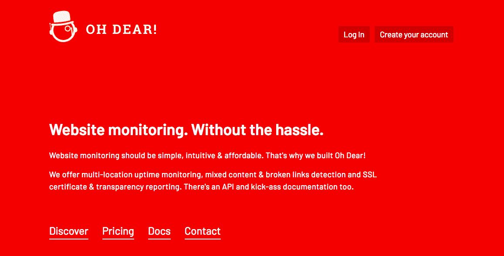
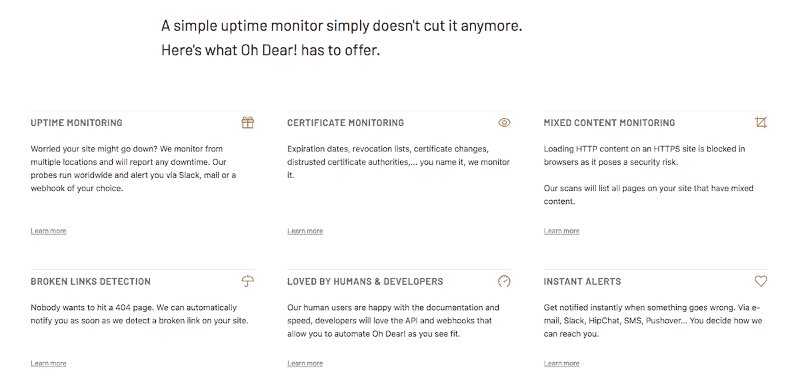
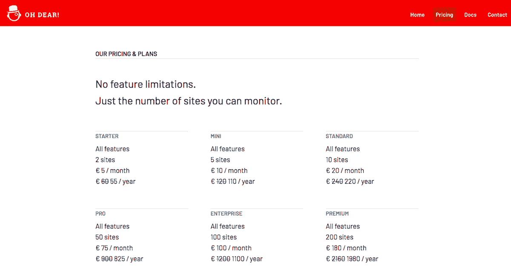

# 市场缺少我们想要的工具。所以我们自己建造了它。

> 原文：<https://www.indiehackers.com/interview/the-market-lacked-the-tool-we-wanted-so-we-built-it-ourselves-bf8cf22b27>

## 你好！你的背景是什么，你在做什么？

嗨！我的名字是[马蒂亚斯·吉尼尔](https://twitter.com/mattiasgeniar)和我的合作伙伴[弗里克·范·德·赫滕](https://twitter.com/freekmurze)一起，我们创立了*哦，天哪！*，专注于网站监控的新工具。

我们都厌倦了不符合我们需求的现有工具。大多数都很接近，但总有一些东西——无论是设置还是设计选择——是我们不喜欢的。作为工程师，显而易见的下一步就是自己建造它！

天哪！今年早些时候在私人测试中推出，现在已经在生产中运行了几个月。它已经每月创造超过 1500 美元的收入。

## 你是怎么想出这个名字的？

当我们头脑风暴我们的功能集和方法时，我们大多数晚上都在安特卫普一家名为 [Paters Vaetje](http://www.patersvaetje.be/) 的咖啡馆里度过。他们供应一种味道很好的啤酒，叫做 Moeder Overste，上面有一个修女的标志。

弗里克接着问了这样一个问题，“如果一个修女的网站下线了，她会说什么？”答案:“*哎呀！*

 

它给了我们网站副本、徽标等选项，我们决定使用它！

## 是什么促使你开始写《哦，亲爱的》?

Freek 和我都从不同的角度看待监控问题。我是[托管服务提供商](https://www.nucleus.be/en/)的系统管理员，我们的工作是保持一切顺利进行。弗里克是一家专注于定制应用的佛兰德网络机构的合伙人。

显然，我们都很关心我们的网站是否在线和可运营。从 Freek 的角度来看，他想知道每个页面的状态，是否包含混合内容(因为其中一些是用户上传的)，某些页面是否会产生 HTTP/500 错误，等等。我关注的是服务器和 HTTPS 堆栈的总体健康状况——证书是否即将过期，我们是否仍在使用安全的 TLS 密码，站点的响应时间是多少，等等。

当我们自己寻找结合了上述所有特性的监控工具时，我们发现不足。有些接近了，但最终做出了我们不喜欢的折衷。

我们在几个月内创建了一个 MVP，并开始自己使用它。它很快取代了我们自己的(商业)监控解决方案，并为我们的应用提供了许多前所未有的洞察力。如果一个网站包含用户生成的内容，那么很容易创建从根本上被破坏的页面，或者在 HTTPS 上下文中包含 HTTP 元素的页面，而浏览器会阻止这些内容。出于测试目的，我们给了一些朋友访问权限，他们的反应和热情足以让我们验证我们的想法。我们知道我们有一些特别的东西。

## 构建最初的产品需要什么？

给我们带来火花(双关语)的实际上是一个流行的 PHP 框架 Laravel 的创始人发布的产品，名为 [laravel Spark](https://spark.laravel.com/) 。这是一个定制的框架，包括启动你自己的 SaaS 的样板文件。开箱即用，它引入了用户管理(激活、密码丢失等)，通过 Stripe 处理发票和在线支付等。Spark 基本上做了所有我们不喜欢的关于建造我们自己的 SaaS 的事情，那些我们认为是无聊的事情。

我们希望创建一个监控解决方案，而不是将一半的时间花在用户管理、实施优惠券代码、处理支付以及弄清楚每个国家的增值税规则如何运作上。我们通过使用 Spark 作为我们的基础实现了这一切。仅此一项就为我们节省了几个月的工作，使得 MVP 在不到四个月的时间里就准备好了。

由于我们都有 PHP 背景，我们在晚上编码，而白天的工作给了我们所有想要的特性的灵感，更重要的是，我们讨厌现有工具的所有特性。

 

一旦我们有了工作产品，我们就开始关注可用性和设计。我们来自 Laravel 空间，那里的文化已经转变为比过去在开源世界更欣赏设计和风格，所以我们不能只使用 [bootstrap](https://getbootstrap.com/docs/3.3/css/) 发布应用程序，因为它看起来太像原型了。我们想要一个应用程序，而不仅仅是一个半成品工具。

早期，我们投资定制设计。这是我们最大的花费，但是我们最明智的预算决定。这个设计在三个月内就收回了成本。人们喜欢它的风格、外观和感觉*——这是我们自己无法做到的。*

 *新的设计也是使用新的 CSS 框架 [tailwind](https://tailwindcss.com/) 构建的。这给了我们额外的优势，让我们能够通过他们的渠道推广网站，因为他们正在寻找新的案例来展示这个框架的潜力。

## 你是如何吸引用户并发展壮大的？

他们说社会和有机增长是最健康的策略。目前为止，这是我们雇佣的唯一一个。弗里克和我都活跃在 Twitter 上，在会议上发言，并有一个受欢迎的博客。到目前为止，这就是我们所使用的全部促销手段。

在我们推出之前，我们通过社交媒体大肆宣传这项服务。我们展示了一些代码的截屏，我们正在构建的新东西，我们的测试套件，设计玩笑等等。所有这些都是为了驱动一个预发布邮件列表。我们最终在邮件列表上有超过 500 个用户，这给了我们一个健康的发布平台。

了解我们自己的缺点并在头脑中制定战略对于一个可行的产品和成功的发布是至关重要的。

TweetShare

大家都提倡使用邮件列表，我也怀疑了很久。但事实是，它成功了。我们有一个精心设计的登录页面，它展示了产品和功能(我认为这是关键)，我们把邮件列表的每一个注册都看作是对我们所做的东西有需求的确认。

总的来说，我认为名单上只有 10%的人转化为真正的付费用户。这远远低于我们的预期，但与其他创始人交谈后发现，这似乎与我们期望的比例相符。许多用户想在购买前试用一下，更多的人只是期待一个免费的版本，根本没有付费的打算。

从那时起，增长主要是通过口口相传。现在，我们正在进行*实际的*营销。然而，作为两个铁杆开发者，营销方面是我们需要更加适应的。

## 你的商业模式是什么，你是如何增加收入的？

为[哎呀！](https://ohdear.app)这很简单:没有免费版本，你选择一个月订阅来决定你想要监控多少个网站。你可以免费试用 14 天，不需要预付信用卡，看看你是否喜欢它。功能或数据保留没有区别，这些功能在所有计划中都是相同的。我们完全想要简单，并认为这也应该反映在我们的订阅计划中。

我们最近在服务中增加了一个推荐系统，但是到目前为止还没有产生任何有意义的线索。我认为许多人已经厌倦了看到这种推广(想想典型的数字海洋参考链接)，它可能不再流行。

当我们最终公开发布时，我们从邮件列表公告中获得了近 20 个注册。看到钱通过 Stripe 移动应用程序进来非常令人兴奋。从那时起，我们看到了稳定的增长，现在我们每月赚 1500 美元，并且每天都在增长。

 

由于我们选择使用 Laravel Spark 作为基础，Stripe 作为支付处理器最有意义。我们没有研究这一点，这是 Spark 的默认选项，我们只是采用了它。我不得不承认，Stripe 是一笔巨大的财富。在他们使用的内置优惠券方法(一次性或经常性折扣)和退款的简单选项之间，与其他任何产品相比，它是一个全面的伟大支付提供商。

就在上个月，我们推出了一项功能，可以按年付款，而不是按月付款。越来越多的用户要求这样做，特别是对于我们的小计划，因为每月提交和处理一张 5 美元的发票有点烦人。年度计划简化了这个过程。因此，我们的收入已经从稳定和可预测的变成了疯狂和多变的，因为不仅选择较小计划的客户会选择按年订阅，而且较大的用户也会这样做。这意味着我们看到了资金的激增，但我们的月收入却下降了，因为那些用户都预先支付了费用。

我们就这个决定争论了很长时间，权衡了按月计费和按年计费的利弊。就我们的目的而言，我们认为这并不重要。我们的发票和会计是自动化的，我们不支付每张发票，不管我们向任何给定的客户发出多少张发票，都是一样的。

最终，我们选择了对用户最有利的方式。我们希望吸引他们感兴趣的用户，并表明我们正在听取他们的反馈，所以我们选择了我们的用户所提倡的选项，即使这意味着我们的收入稍微不太可预测。那是我们的事，不是他们的。

## 你未来的目标是什么？

嗯，我们还是两个 PHP 开发人员。我们没有想要达到的商业目标。至少，现在还没有。

我们只是想添加更多我们自己想要的功能。从短期来看，这意味着额外的 SSL 监视器，扩展我们的 API，并研究进行服务器端监视的选项(比如磁盘空间和 CPU 负载)。

我们相信缓慢而稳定的增长。没有出售我们的应用程序和退休的宏伟计划，我们追求的是被动收入的梦想。除了它不是被动的——它需要每天工作。我认为被动收入经常被误解为“我想独立，只是每个月做自己的事来谋生。”虽然独立会很好，但我们真的追求后者。我们热爱构建、编码和发布，那么我们为什么要停止这样做呢？

## 你面临的最大挑战和克服的障碍是什么？如果你必须重新开始，你会做什么不同的事？

尽管每个人都警告我们不要这么做，但我们早期关注的是规模优化。

这并不是因为我们认为我们会在第一天就获得成千上万的用户，而是因为我们的 SaaS 是结构化的，规模实现得相当快。如果我们有 10 个客户端，每个客户端监控 100 个站点，这意味着我们每天运行超过 1，000，000 个“作业”。一项工作是监控正常运行时间、检查证书、验证链等。，很快就累加起来了。幸运的是，我们在第一天就考虑了这个设计，并直接使用了消息队列和异步处理。

这确实增加了代码库的复杂性，使测试变得有点困难，但是如果我们不这样做，我们就不能扩展到超过 100 个用户。

## 有没有发现什么特别有帮助或者有优势的？

我们做出的最明智的决定是不单干。我们组成了团队，这给了我们激励和挑战彼此的能力。

在每一次 SaaS 发布中，都有活跃程度较高的时期和精疲力竭的时期。有些时候，你只想放弃，因为这似乎是不可能的或令人生畏的。因为我们拥有彼此，所以我们有继续走下去的动力。我们可以通过问“嘿，功能 X 怎么样了？”我们中的任何一个人都不可能独自开发这个产品，一起开发比单干要有趣得多，当我推出我的第一个名为 [DNS Spy](https://dnsspy.io) 的 SaaS 时，我就是这么做的。

## 对于刚刚起步的独立黑客，你有什么建议？

找个人让你负责。

我们做出的最明智的决定是不单干。我们组成了团队，这给了我们激励和挑战彼此的能力。

TweetShare

无论是一起工作的伙伴，还是说“我在建造 X！”因此其他人可以检查进度，这有助于了解 a)其他人关心你正在构建的东西，b)有人可以偶尔推动一下以重新加快步伐。

此外，我们做出的最明智的决定是花钱购买合适的设计和布局。我们擅长编码，不擅长设计。了解我们自己的缺点并在头脑中制定战略对于一个可行的产品和成功的发布是至关重要的。

 

## 我们可以去哪里了解更多？

哦亲爱的！本身可以在 [ohdear.app](https://ohdear.app/) 上找到。Freek 在 Twitter 上以 [@FreekMurze](https://twitter.com/freekmurze) 的身份活跃，在那里他定期展示代码片段、测试套件、设计选择等等。他对自己的工作相当坦率。他还在 murze.be 上写关于 PHP 和 Laravel 的博客。

我是 Twitter 上的 [@MattiasGeniar](https://twitter.com/mattiasgeniar) ，在这里我更关注运营和安全方面的事情。更多长篇内容可以在我的博客 [ma.ttias.be](https://ma.ttias.be/blog/) 上找到。

如果你有任何问题，我们都很乐意回答，尽管开口！

我们有很多关于功能和工具的新想法，但是我们反馈和产品想法的第一来源来自随机的 Twitter 对话。如果有什么遗漏或者你对其他监控工具有什么不满，我们真的*非常*乐意听到！

——[<picture id="ember5250074" class="user-avatar ember-view user-link__avatar"></picture>马蒂亚斯·吉尼亚尔](/mattiasgeniar?id=xISIaeUj6yVjZPHZopHNTTbLkiT2)【哦亲爱的创始人

## 想建立自己的事业吗？

你应该加入独立黑客社区！🤗

我们是几千名创始人，互相帮助建立有利可图的业务和副业。来分享你正在做的事情，并从你的同事那里获得反馈。

还没准备好开始使用你的产品吗？没问题。这个社区是一个认识人、学习和实践的好地方。随意[随便浏览](/)！

——[<picture id="ember5250079" class="user-avatar ember-view user-link__avatar"></picture>柯特兰艾伦](/csallen?id=ibTLPyjwVebnZjMGKvz6ztarnuV2)，独立黑客创始人

55votes*