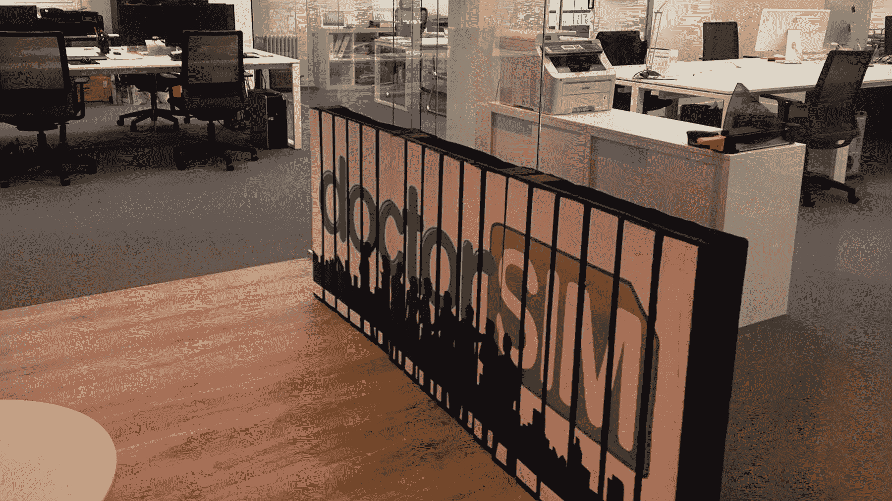
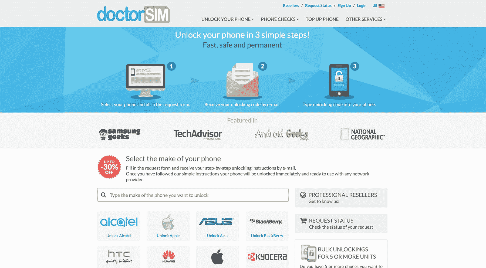
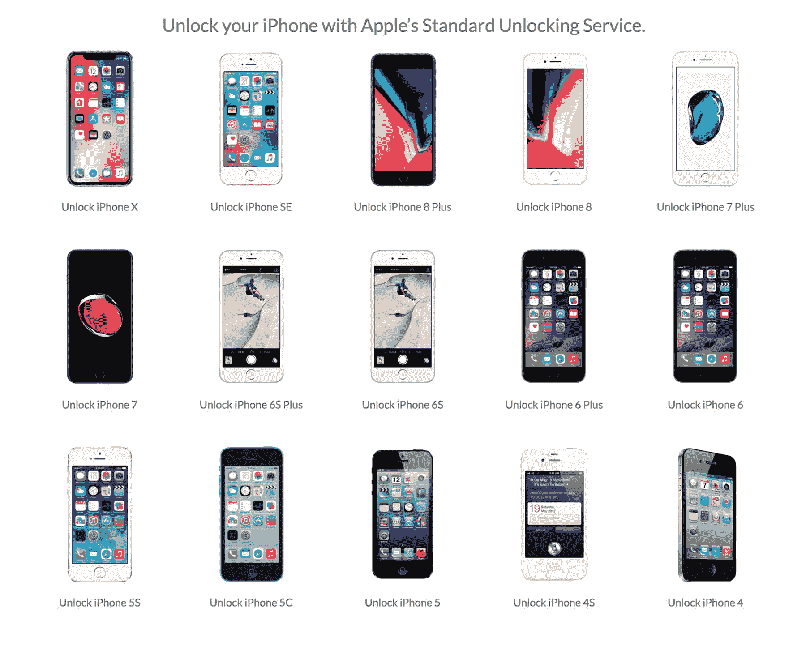

# 百万美元支点:手机解锁即服务

> 原文：<https://www.indiehackers.com/interview/the-million-dollar-pivot-cell-phone-unlocks-as-a-service-5a3857418a>

## 你好！你的背景是什么，你在做什么？

嗨，我是[doctor sim](https://www.doctorsim.com/us-en/)的首席执行官雨果·米娜。我喜欢让混乱的事情变得不那么混乱。

doctorSIM 成立于 2007 年，是一项订阅服务，旨在帮助手机用户节省高达 40%的月账单。

在三年节省了 1.5 亿欧元之后，我们看不到真正的模式或持续的增长，所以在离停止运营还有六周的时候，我们做出了改变:

> 让我们为消费者提供一种简单、快速、远程解锁手机的方式，同时提供透明度、顶级客户服务和保证。

doctorSIM 与我的姐姐[刘烨·米娜](https://www.linkedin.com/in/lidiameana/)和[阿尔贝托·佩纳](https://www.linkedin.com/in/bertopena/)共同创立，现在是一个 20 人的团队，总部设在西班牙马德里，在墨西哥、智利、波士顿和伦敦设有卫星办公室，月收入约为 40 万美元。

 

## 是什么促使你开始使用 doctorSIM？

doctorSIM 的第一次迭代从一个特殊的痛点开始:*“为什么为手机服务选择正确的数据包如此复杂？？！！!"*

基本套餐、数据套餐、短信套餐、有线套餐、漫游套餐！我们几乎不可能跟踪我们在电话账单上看到的数百种组合，然而我们接受这是理所应当的。

我的运营商向我收取语音套餐、最喜欢的人的附加服务、家人和朋友的附加服务、数据套餐附加服务、漫游附加服务和短信套餐附加服务的费用(是的，当时短信很受欢迎！).不可能知道我是否为我不需要的服务多付了钱。

不要想太多，否则你永远也不会投入进去…一点点鲁莽可能是好的。

TweetShare

所以我们想，“如果我可以根据我的实际使用情况运行市场上每个运营商的所有可能的捆绑包和附加组合，这不是很好吗？”我们认为我们可以从潜在的节省和用户转换运营商的回扣中赚钱。

我是一个平庸的程序员，但我成功地写下了几行 Visual Basic 代码(！！)并在朋友和家人的一堆电话账单上手动运行了几次迭代。通过捆绑包和附加组件的正确组合，平均节省了总费用的 30-50%左右。这意味着每个用户每年可以节省数百美元。谁能说不呢？？

想法通过验证。

*“好吧，就这么办吧！”*

**失败**

我们最初专注于我们的本土市场西班牙，很快就犯下了最初的四个错误:

1.  在 Visual Basic 中构建原型
2.  将开发外包给一个四人团队
3.  在一个封闭的循环中迭代开发，同时消耗宝贵的资源
4.  用没人想要的花里胡哨使我们的产品过于复杂

尽管如此，到 2008 年底，我们有了一个相当成功的伟大产品，受到了好评( [LeWeb 2008](https://techcrunch.com/2008/12/10/le-web-has-a-room-with-a-viewdle-startup-winners-picked/) )但是，令人惊讶的是……**没有人愿意为它付费！**

我们研究了其他创收方案，如广告和联盟计划，但这些方案也有重大缺陷，不可行。我们被困住了。

**机遇**

然而，我们确实注意到，我们的许多手机计划建议都涉及到更换运营商，而且大多数用户都有一部锁定运营商的手机。

*“听起来是个机会！”*

根据国家/运营商的不同，运营商发行的手机在购买时通常会被锁定。如果你打算出国旅行，转换运营商或出售二手手机，手机解锁很重要。

手机解锁的合法性一直是许多国家激烈争论的话题。今天，当你的合同到期时，许多运营商有义务解锁你的手机。然而，大多数人会让你经历十几道关卡，让你望而却步，有些人甚至会为此收取费用。他们显然对让你离开他们的公司不感兴趣。

这也是一个复杂的产品。大型电信公司的大多数客户服务代表没有专业知识来引导你浏览三星手机上的隐藏菜单，也没有耐心指导一个技术能力有限的人。

我们决定确保我们的核心增值主张是真正简化一个非常复杂和灰色的利基市场。指导客户完成在许多情况下是一个反复试验过程，如果不小心就会出错。

我们也坚信修车的权利，当国会通过“解锁并不违法”的法案时，我们激动不已。

我们认为外面的每部手机都应该默认解锁，但不承认我们从一个尚未受到监管的市场中受益是虚伪的，这个市场只会损害消费者并阻止价值传递。

“但是我们如何在骗子、越狱者、u 盘柜的海洋中脱颖而出？”

迄今为止，当无法通过运营商解锁手机时，大多数人仍然认为你需要“黑掉”它，或者去阴暗的市区街角商店越狱或重新安装你的 ROM 才能做到这一点。

网上也有一些著名的骗局，它们只提供无用的软件下载，或者只是花了你几美元，却没有任何回报。

我们的目标是提供一种安全、无忧、简单、远程、透明、合法的方式来永久解锁您的手机。

**开关**

我们希望尽快测试这个新的潜在市场，所以我们与一些提供商合作，建立了一个简单的登录页面，连接了一个 PayPal 支付页面，并从我们最初的储蓄引擎重定向用户。

测试 24 小时后，我们已经可以看到这是进行牵引。转化率大大超过了 15%，用户与我们的产品页面互动的次数比我们之前发布的任何产品页面都多，对额外功能的请求也越来越多。

“好吧，那就让我们来建造它吧！”

## 构建最初的产品需要什么？

经过两年多拐弯抹角的尝试，我们已经没有时间浪费了。我们决定手工测试每一个需要开发的功能，通过建立虚拟或手工页面，测量用户交互(即使这意味着在幕后做大量的手工工作)。只有当我们确信产品或服务会产生结果时，我们才会着手正确地实现代码和部署可伸缩的解决方案。

这种方法有其缺点——我们有时会迟到，有时需要大量的体力劳动——但这意味着我们总是在开发我们知道会对销售产生直接和即时影响的功能。

在最初的几年里，我们雇佣了大量员工，努力与分销商、经销商、大公司和移动运营商/电信公司一起发展我们的储蓄引擎。不幸的是，当我们进行转换时，我们不得不解雇业务开发和商业运营部门的五个人，并通过雇用更多的开发人员、客户服务英雄和营销人员进行重新调整。这是一段痛苦的时光。

更糟糕的是，我们在这个阶段已经快没油了。我们相信这种新模式，但我们急需资金。

我们决定“全押”,每位创始人都设法筹集了额外的资金。

我们设法在三个创始合伙人之间筹集了 16 万美元。对我们所有人来说，这些几乎是我们一生的积蓄。然而，这还不够。团队人数现在再次达到 11 人，全球月消耗率为 35，000 美元。创始人仍然拿不到薪水，所有的钱都被用于人事、营销和发展。

当我们听说有一个国家资助的科技创业软贷款项目(0%利息)时，运气来了。50 万美元——前提是我们提供总贷款的 30%作为股权投资。我们从其他企业家那里听说过一些故事，他们告诉我们不要这样做，这是浪费时间，因为我们可能会得到一点机会，我们应该走上风险投资的道路，试图以“正确的创业方式”筹集资金。

你不需要成为一名优秀的程序员…即使你正在创办一家科技公司。但是你确实需要通过与人相处来弥补。

TweetShare

我们抓住了机会，申请了，尽了最大努力，得到了。这些资金使我们能够采取更好的方法来构建我们的平台和进行国际扩展。六个月内，我们的现金流为正。12 个月后，我们的息税折旧及摊销前利润(EBITDA)为正，再也不需要注资了……四年后，我们全额偿还了贷款。

与我们最初针对特定国家/运营商和本地化的 savings engine 服务相反，手机解锁是一个全球市场问题。

虽然从外面看，这似乎是“另一个销售数字产品的电子商务商店”，但我们不能仅仅建立一个基于框架的网站(WP，Magento 等)。我们决定一切从头开始。这是个好主意吗？只能说它给了我们最好的和最坏的两个世界！

## 你们是如何吸引用户，让 doctorSIM 成长起来的？你是如何实现国际化的？你用了什么工具？

我们最初的市场是西班牙，现在考虑到拉丁美洲的相似性，我们正在寻找它。

“我们只需要在我们的网站上添加几面旗帜，”我们想。这是我们开始经历更多痛苦的地方。

在拉丁美洲网上销售很难！没人用过(或使用过)PayPal！信用卡普及率低！还有欺诈…哦，上帝。欺诈是一个非常非常大的问题！

我个人认为我们的客户服务部是我们最重要的资产。解锁是不稳定的，缺乏一个适合所有人的解决方案，并且在标准化方面充满了漏洞。从售前和售后的角度来看，客户可能会非常困惑。

我们的客户英雄团队是我们传播信息的最佳营销工具。对最初不满意的客户(困惑、不工作、延误等)进行成功的客户英雄互动。)将会比拥有完美体验但无需与客户英雄互动的客户产生 5 倍的未来销售/客户/口碑。

具有讽刺意味的是，产品越复杂，结果越有价值——当且仅当结果是好的！

除了内部营销，我们获得流量和客户的最佳工具之一是免费提供我们的手机费率计划比较工具。没有广告，没有费用，只是一个免费的服务，到时候会有额外的副产品！

我们还向 MVNOs 提供免费服务和定制集成(集成、链接等)。).

**“不要沉迷于 SEO”**

我们 40%的流量是有机的。根据我们的经验，做 SEO 的最好方法是不要过分专注于做 SEO。只要提供出色的用户体验，然后是更好的客户服务体验和内容。谷歌和其他公司会找到你。

另一个有助于有机/推荐流量的方面是投资与评论平台的付费整合。迄今为止，我们最好的两笔投资是 TrustPilot 和 T2 的 eKomi。我感觉很多企业不喜欢将意见/评论管理外部化，因为他们觉得这样会失去控制，而差评会让事情变得更糟。如果你积极努力让事情变得更好，并且快速仔细地倾听你的评论，这永远是赢家。

 

*小贴士:不要隐瞒[差评](https://www.trustpilot.com/review/doctorsim.com?languages=en&stars=1)或者要求顾客把它们写下来。当众回复，从错误中快速学习。由于交易量大，很难避免一星评论不时出现，因为不满意的客户会发生，他们总是比满意的客户更有发言权。我们接受现实，学习，然后继续前进。*

## 你的商业模式是什么，你是如何增加收入的？

解锁是低利润，高容量的业务。非常特殊的手机价格从几美元到 100 多美元不等。复杂之处在于解锁解决方案的最终提供商，无论是制造商、运营商还是 OEM 经销商。

由于我们主要充当中介，我们的利润很小，因此我们必须依靠大批量来保持竞争力。

这也是一项迁移业务，因为许多国家正在逐步淘汰带锁手机，而其他国家仍在大力补贴它们。我们必须非常快速有效地在我们决定进入的每个市场开展业务并扩大规模。一个国家今年可能是最畅销的，而下一年就要被淘汰了。

这些市场变化意味着我们的收入在过去的 2-3 年里稳定在每月 40 万美元左右。收入的具体构成因国家的变化而严重分散，这使得这项业务成为一个永恒的挑战。

我们的收入明细也逐年变化。最初，我们 100%的销售额来自 B2C 销售。随着我们的成长，发现了小型商店、分销商和 MVNOs 对业务解决方案的需求，我们建立了一个特定的经销商平台，目前占销售额的 15%。

关于处理支付，当我们在 2007 年开始时，PayPal 和当地的信用卡网关是我们唯一的选择。转化率很低。虚假下降率很高。我们甚至接受银行转账作为支付方式(可扩展性不强)。

快进到 2017 年，我们与 15 个不同的支付网关合作。 [Stripe](https://www.stripe.com) 占我们交易量的 40%，PayPal[占 35%，其余 25%由较小的本地平台分享，加上](https://www.paypal.com) [BTC](https://www.coinbase.com/merchants?locale=en) 和其他即将推出的 cryptos。

当我们开始时，Stripe 提供的服务/产品还不到现在的一小部分。尽管它已经走过了漫长的道路。在 Stripe 推出 [Radar](https://stripe.com/radar) (欺诈/退款预防)及其[多币种](https://stripe.com/docs/currencies)产品之前，我们必须在内部完成所有工作。latam 的欺诈防范和本地支付网关。一场噩梦。

幸运的是，Stripe 很快提高了它的产品，使我们能够以 150 种不同的货币收费，并更好地控制欺诈。在任何情况下，我们都必须继续前进，因此我们与大多数拉美国家的支付提供商建立了本地关系，并设计了我们专有的反欺诈机制。

过去 10 年，我们的技术体系也经历了转变。AWS 在 2007 年刚刚起步，所以我们在本地托管我们的堆栈。当我们看到国际化发展的需要时，我们开始了痛苦的迁移(以前就应该这样做)。

迄今为止，我们每月处理约 100 万份 uniques。我们已经拥有超过 180 万的客户用户群和超过 30，000 家 B2B 公司。

事实是，没有一个单一的行动点可以定义一个好的增长战略。不管你读了多少关于“增长黑客”的书，归根结底都是为了以最好的方式提供所需的服务。这可能需要时间，但口碑和推荐仍然是一个人可以渴望的最好的在线凭证。

**我们有所不同**

我们不跨市场。我们不会向您发送时事通讯，也不会开展宣传活动来促使您购买我们的产品。在某种程度上，这是由于服务的本质是一种需求，而不是冲动购买。但无论如何，你来到网站，得到你的服务，你就上路了。

**一次告白**

我们搞砸了很多！我们行动迅速，打破了很多东西。但现在它已经融入了公司的 DNA，所以我们努力鼓励它，并充分利用它。

**一次稀缺时间**

几年前，当我们还在做 AWS 之前的事情时，我们擦除了没有最近备份的生产数据库。凌晨 3 点所有人都在甲板上…但我们活着出来了。

**一个值得骄傲的时刻**

每次我们的客户支持人员因为外部供应商失误而通宵工作。

**总是需要改进的东西**

客服。

 

## 你未来的目标是什么？

当你听到互联网初创公司逐月呈指数增长的故事时，你既受到鼓舞又感到恐惧，认为如果你不模仿这些数字，你就会失败。但是成功还有另一个定义，它更长期，更稳定。它不那么性感，但肯定是有挑战性的。这需要不断的创新和坚持。

一个人越早意识到自己不是下一个独角兽，就越容易埋头做重要的事情。

至于实际的商业模式，我们所知道的解锁有一天会消失，因此这种模式也应该消失，但人们仍然会使用现收现付的手机，他们仍然会旅行/漫游并丢弃和损坏他们的手机，所以…我们正在进入与解锁密切相关的其他垂直行业。

倾听市场，不要执着于自己最初的想法。

TweetShare

## 你面临的最大挑战和克服的障碍是什么？如果你必须重新开始，你会做什么不同的事？

我们现在是一个 20 人的团队，但在过去的 10 年里，与我们一起工作的人数增加了一倍。许多人来来去去只是为了满足他们的好奇心，其他人则根本不适合这次旅行。

口头禅是:*炒得快，雇得慢*。此外，*的态度*每次都胜过*的能力*，尤其是从长远来看。拥有许多不能互相合作的“头号人物”会打击士气，并影响你团队的其他部分。

更详细地说，如果你要组建一个团队，*相应地委派*。我们的一个主要批评(对我自己、我妹妹和联合创始人刘烨)是我们授权不够。从长远来看，微观管理真的会伤害你，无论是从个人角度还是商业角度。以一个真正扁平的团队结构结束也给你一种感觉，那就是必须成为每一个过程的粘合剂，这可能是令人疲惫的。

*   开火总是很难，但是要快。
*   竞争是无情和肮脏的。
*   模仿者会一直出现。不要浪费时间回头看。简单的往前走。

## 有没有发现什么特别有帮助或者有优势的？

我们离不开的顶级产品:

1.  [Zendesk](https://www.zendesk.com)
2.  [条纹](https://www.stripe.com)
3.  [SiftScience](https://www.siftscience.com)
4.  [松弛](https://www.slack.com)
5.  扎皮尔
6.  [Customer.io](https://www.customer.io)
7.  [云闪](https://www.cloudflare.com)
8.  特雷罗
9.  [段](https://www.segment.com)

帮助我们销售和/或保持生产力的事物(排名不分先后):

1.  佐皮姆
2.  Elev.io
3.  接吻
4.  API.ai
5.  特维利奥
6.  缺席. io
7.  前进
8.  1 团队密码
9.  Dropbox
10.  比特桶
11.  g 组曲
12.  壁虎
13.  Iron.io
14.  对数地
15.  Pingdom
16.  邮递员
17.  StatusPage.io
18.  阿尔弗雷德应用程序

## 对于刚刚起步的独立黑客，你有什么建议？

*   你不需要成为一名优秀的程序员…即使你正在创办一家科技公司…但你需要通过与人相处、传达信息和激励他人来弥补。
*   不要想太多，否则你永远也不会投入进去…一点点鲁莽可能是好的。
*   倾听市场，不要执着于自己最初的想法。
*   不要多此一举！！！有许多现成的 SaaS 解决方案。不要浪费时间去开发已经有现成产品的东西。找到你的专有代码和想法，以及外包之间的平衡。支付应付的款项…

## 我们可以去哪里了解更多？

如果你需要[解锁](https://www.doctorsim.com/us-en/)、[检查](https://www.doctorsim.com/us-en/phone-imei-checks/)或[充值](https://www.doctorsim.com/us-en/topup-phone/)你的手机，请给我们一个尝试，但最重要的是，欢迎在评论中提出任何可能对你有帮助的问题。

谢谢科特兰和钱宁！

—[<picture id="ember5236506" class="user-avatar ember-view user-link__avatar"></picture>Hugo Meana](/doctorsim?id=fGF8rRCNZMagcifj8MFfmlNAmjt2)【doctor sim】联合创始人

## 想像 doctorSIM 一样建立自己的事业吗？

你应该加入[独立黑客社区](/)！🤗

我们是几千名创始人，互相帮助建立有利可图的业务和副业。来分享你正在做的事情，并从你的同事那里获得反馈。

还没准备好开始使用你的产品吗？没问题。这个社区是一个认识人、学习和实践的好地方。随意[随便浏览](/)！

——[<picture id="ember5236511" class="user-avatar ember-view user-link__avatar"></picture>考特兰艾伦](/csallen?id=ibTLPyjwVebnZjMGKvz6ztarnuV2)，独立黑客创始人

11votes