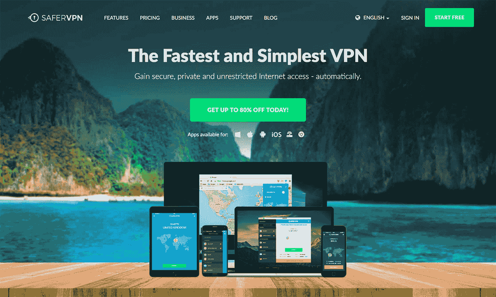
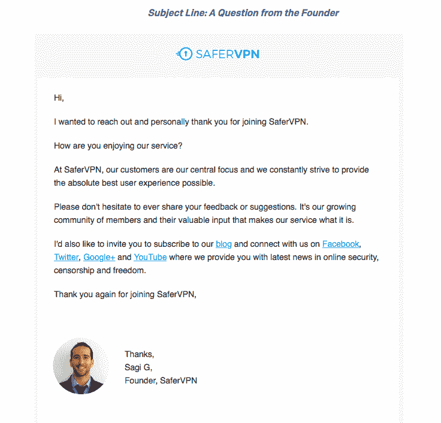
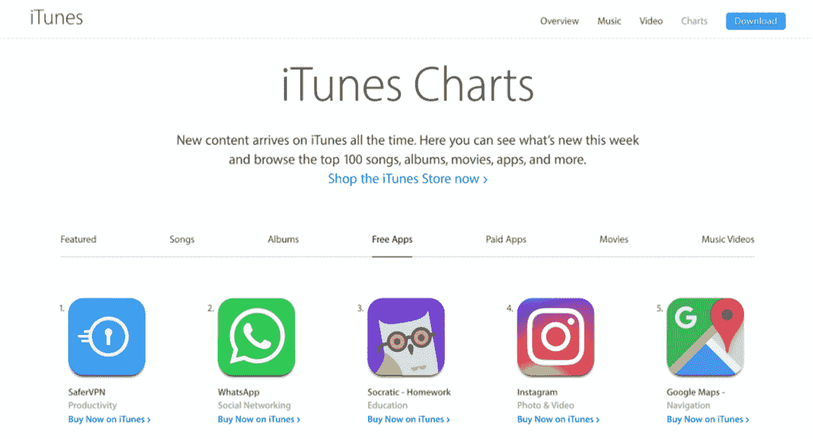
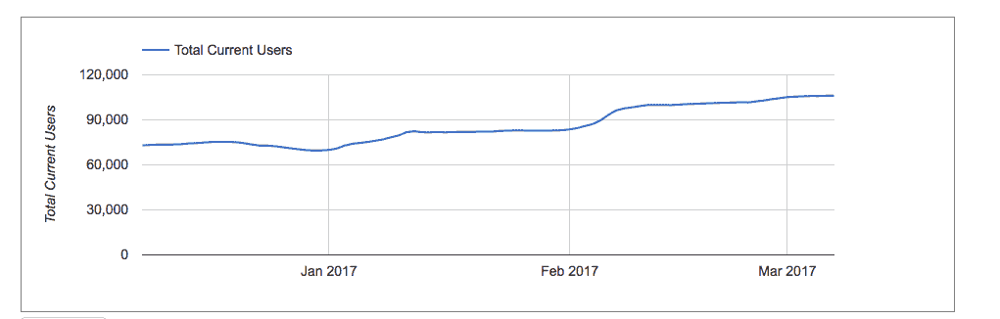

# 我们过去的产品和营销策略每月超过 20，000 美元

> 原文：<https://www.indiehackers.com/interview/the-product-and-marketing-strategies-we-used-to-surpass-20-000-month-f07a31c41e>

## 你好！你的背景是什么，你在做什么？

我叫萨基·吉达利。我是领先的虚拟专用网络和网络安全 SaaS 服务公司 [SaferVPN](https://www.safervpn.com) 的联合创始人兼首席技术官。SaferVPN 允许消费者安全、可靠、匿名地浏览网页；使企业能够保护其员工和组织免受 wi-fi 安全威胁和潜在的数据泄露。

我的个人背景是用户体验和产品设计。在我联合创建 SaferVPN 之前，我是以色列国防军视觉情报部门的一员。之后，我在西门子担任 UX 和用户界面顾问。在那里，我有机会为通用汽车和沃尔沃等主要汽车客户设计 web 应用程序。

现在，作为 SaferVPN 的联合创始人和 CPO，我管理与产品有关的一切。从我们的跨平台 VPN 应用到我们的公司网站，我一直关注如何为我们的用户简化我们的技术，并为他们提供出色而直观的用户体验。

 

## 是什么促使你开始使用 SaferVPN？

2013 年，我和我的大学朋友阿米特·巴雷特一起创立了[安全 VPN](https://www.safervpn.com) 。我们都梦想成为独立的企业主，以一种有意义的方式为社会做贡献。

在大学学习计算机科学时，Amit 和我一起开发了一个应用程序，提交给了微软的一个竞赛，并获得了一个最高奖项。后来，我们开始获得投资者和风投的认可和兴趣，我们真正开始看到我们的工作关系和专业协同的潜力。因此，毕业后，我们决定一起创业。

在最初的几个月里，我们花时间就我们想要开发的产品进行头脑风暴。我们有一个非常不同的产品的想法，但一位值得信赖的投资者建议我们不要追求它，认为这将很难创造一个有利可图的业务。

我们认为，拥有不受审查的互联网接入是每个人的基本权利。

TweetShare

我们最终选择了 VPN 领域，这是由我们在市场上看到的巨大需求和当今快速变化的在线世界所推动的，在这里我们现在遇到了互联网审查、隐私泄露、安全威胁和地理限制。

## 构建最初的产品需要什么？

最初，我们在[谷歌校园发射台](https://www.campus.co/tel-aviv/en)工作，在那里我们得到了很多支持。在那里，我们也有机会享受特殊的指导和咨询计划。

我们还从其他以色列企业家和 IDF 情报校友那里获得了大量宝贵的支持和建议，他们中的许多人都是成功的高科技公司的创始人。以色列的创业生态系统非常支持，很容易找到优秀的人来合作、协作和学习。

我们与其他成功企业家的联系帮助我们避免了错误，并获得了宝贵的建议。

TweetShare

当我们处于初始阶段并评估构建 VPN 解决方案的想法时，我们遇到了一家大型广告公司的首席执行官。他在寻找用于广告验证的软件，我们知道 VPN 是他需要的解决方案。他是我们的第一个客户，我们有义务在一个月内交付产品。我们设法坚持时间表，并在 30 天内将第一个版本交付给他。这位客户为我们产品的进一步发展买单。

与此同时，我们开始开发网站，进行市场研究，制定我们的上市战略，确定我们的目标受众和角色，并明确我们可以做些什么来使我们的产品在 VPN 领域与众不同。

我们在公司创业了两年，为了在经济上维持自己，我们都在大公司(西门子和 IBM)每周工作两天。我们剩下的时间都花在了产品的基础设施上。

当然，还有无名英雄:我们的实习生。多年来，我们非常幸运能够招募到优秀的实习生，他们对公司发展的各个方面都至关重要。我们赋予他们很大的责任，作为回报，他们帮助我们建立了有价值的国际合作伙伴关系，开发了我们的平台，发展了我们的业务。

## 你的技术是什么样的？

我们的 VPN 解决方案包括适用于 Windows、Mac、iOS、Android 和 Chrome 的快速简单的应用程序；以及面向企业、机构和企业的高度可扩展的白标、云 VPN 和自动 wi-fi 安全创新

我们使用各种各样的技术来管理跨平台 VPN 客户端、基础架构、网站等的完整环境。我们在 [SaferVPN](https://www.safervpn.com) 所做的一切都是在内部创建、实施和管理的。

我们用来搭建 SaferVPN 的技术有 Ansible、TeamCity、PHP/Laravel、NodeJs/Express/ParseServer、Webpack、React、Docker、Native Mobile 等等。

## 你用什么策略来吸引用户和发展你的业务？

我们使用了多种营销策略来发展[安全 VPN](https://www.safervpn.com) ，包括直接、有机和付费方式。

为了支持和维持公司的增长，我们最初收购了两个本地企业作为客户:一个搜索引擎优化(SEO)组织和前面提到的广告公司。

一旦我们推出我们的网站，我们就开始在谷歌以色列团队的帮助下使用谷歌 AdWords。凭借每月 5000 美元的小额预算，我们成功获得了正投资回报。从那里，我们开始创造收入，每月增长 15-20%。

我们还建立了附属关系，为公司带来客户，后来，我们通过建立博客、社交媒体渠道和产品的独特电子邮件渠道，提高了公司的知名度和有机用户获取量。

我们从竞争中脱颖而出的一点是，我们提供不需要信用卡号码的免费试用，这也是一个非常有效的增长渠道。这使我们能够获得销售线索，并与用户进行互动，从而理想地将他们转化为销售。

从我们推出到现在，我们的有机收购已经增加到我们每月网站流量的 40-50%左右，我们的品牌得到了广泛的认可，我们的客户群已经达到 150 多万免费和付费用户。

一个非常有效的客户拓展策略是我们的“来自创始人的电子邮件”，它帮助我们与客户建立关系并与他们互动:

这封邮件的独特打开率高达 60%。每周我都会收到许多忠实客户和超级用户的电子邮件，他们乐于分享他们的反馈——我会阅读每一封！事实证明，这是一种非常有效的方式，既能吸引顾客，又能了解他们的需求。

我们还大力投资于客户支持计划，其中包括全天候实时聊天、全面的知识库和易于使用的自助工具。事实上，Software Advice 将我们评为 SaaS 公司中客户支持方面的领导者，因为我们有客户友好的帮助台和支持技术。

我们以客户为中心的理念已经得到了回报。在领先的客户评论网站 Trustpilot 上，我们的满意度高达 9.7 分(满分 10 分)。通过与他们的合作，我们在网站和电子邮件漏斗上整合了我们的强大评级和积极的客户评论，这反过来帮助我们向潜在客户宣传我们产品的优势，并在很短的时间内实现了我们转化率的有意义提升。

与我们的客户一样，我们高度重视我们的合作伙伴关系。例如，我们坚持支持所有人不受限制地访问互联网和言论自由的议程。因此，我们与人权众包组织[运动](https://movements.org)合作，创建了我们名为[的强大倡议](https://www.safervpn.com/unblock-the-web)。作为互联网自由斗士，我们相信拥有不受审查的互联网接入是每个人的基本权利，我们的倡议为封闭社会中的活动家和持不同政见者提供免费的 VPN 服务，以便他们能够行使这一基本权利。

对于我们的企业对企业业务，我们与大型原始设备制造商合作，提供我们完整的白牌 VPN 解决方案。我们提供特定于公司的品牌和完全无缝的集成。

关于 SEO 和 ASO(应用程序商店优化)，我们已经成功地利用新的平台和工具来提高我们的排名并产生有机流量。例如，通过使用移动营销平台 [TUNE](https://www.tune.com) ，我们能够有效地瞄准低竞争、高流量的关键词，并在阿联酋应用商店排名第一——甚至击败了 WhatsApp！

iTunes 上的顶级免费应用。

就像我们的苹果和谷歌应用商店流量一样，我们在 Chrome 应用商店的大部分增长都是有机的，再次受到我们在应用描述中仔细选择和放置目标关键词的驱动:

Chrome 扩展客户的增长。

我们还以其他方式推动有机交通。每周，我们都会通过我们的博客和社交媒体发布大量内容，努力让我们的用户了解使用 VPN 的好处，并让他们了解与网络安全相关的时事。我们的博客是 SEO 优化的，提供关于各种主题的有用提示和信息，如在线安全、审查和匿名浏览。

除了这些努力，我们还在不断进行 A/B 测试，改进我们广泛的电子邮件漏斗，进行设计研究以了解它如何影响用户，并改变我们的基础设施以增强我们的 UX/用户界面。

## 你有没有尝试过结果很差的增长策略？

到目前为止，对我们有用的就是坚持不懈，努力工作，绝不让任何失败拖我们的后腿。

我想说，到目前为止，我们最大的挑战是，在我们创业的第一年，我们无法实现我们的客户获取目标。我们试图与 10，000 名顾客签约，但只争取到了 1，000 名左右。

这一挫折导致我们完全重新评估和修改我们的营销策略。克服这种主要的失望也教会了我们更有耐心，并仔细规划我们的战略，以获取和保留客户。

具有讽刺意味的是，这种经历也让我们不那么恐惧，更愿意冒险。现在，当我和我的联合创始人对我们的业务有了新的想法时，我们有更多的信心和信念去实现我们的设想，并将我们的想法贯彻到底——因为我们知道我们可以从任何事情中恢复过来。

## 你的收入和商业模式背后有什么故事？

我们有两个成功的垂直市场:消费者和企业。

我们的消费者业务模式非常简单。我们提供基于免费试用订阅的 SaaS 高级服务，以及有每月数据限制的免费增值 Chrome 扩展。

我们还与 EMM/MDM(企业移动管理和移动设备管理)分销商和销售商合作，为企业提供我们的 VPN 解决方案。我们的 SDK 封装了我们的技术，使我们能够与大型电信和互联网安全公司合作并向其提供可定制的白标解决方案。这种创新使我们在行业中脱颖而出，也是持续业务发展和扩张的强大驱动力。

无论路途有多遥远，我们都非常专注和清楚我们要去哪里。

TweetShare

像许多 SaaS 公司一样，我们也面临着欺诈问题，而且我们将来很可能还会继续遇到这种问题。虽然我们一直在努力改进我们的系统和检测方法，以阻止和防止欺诈行为，但我们知道这是我们必须继续保持警惕和解决的问题。

我们也一直在修改我们的策略来应对客户流失。例如，许多外国人和旅行者主要通过 VPN 从国外访问受地理限制的内容。一旦他们回国，他们往往看不到这项技术有多大用处。我们正努力让这些客户了解我们服务的所有好处，特别是在线隐私和安全方面的好处，这些好处非常宝贵，在日常生活中很容易发挥作用。

积极的一面是，我们的最新功能[自动 Wi-Fi 安全](https://www.safervpn.com/blog/automatic-wifi-security-feature)于 2016 年底发布，是我们创新、主动的网络安全技术方法的一个展示。这不仅有助于增加我们的收入，还让我们在行业内获得了广泛的曝光率。

我们在开发和提供我们的促销和促销产品方面也非常强大。在刚刚过去的假日季节，我们测试了各种促销和定价模式，以确定什么样的优惠对我们的客户群最有吸引力。利用这些知识，我们实现了创纪录的高销售额(是我们平均日销售额的 4 倍！)并大幅提升我们的月度和年度销售额。

在技术方面，我们的收入是通过订阅模式产生的。支付系统包括:各大信用卡、PayPal、比特币、支付宝、iDeal、Sofort 银行转账、Yamoney、Redcompra、Webmoney、Unipin Express、Qiwi Wallet、Mobiamo、MINT、OneCard、EcoCard、CherryCredits、Unipin Wallet、Oxxo、MOL、Neosurf、myCard、Member、Wallet、Yannex。

## 你未来的目标是什么？

我们有一个非常有趣的 2017 年路线图，其中包括通过我们开创性的下一代 B2B 和白牌解决方案将公司扩展到新的垂直市场。

2017 年已经在筹备中的是新的桌面客户端、新的内容过滤解决方案、VPN 服务器位置扩展以及与非政府组织的合作伙伴关系，以推进我们的#UnblockTheWeb 计划。

至于我们的产品，今年 Amit 和我的目标是在 [SaferVPN 的](https://www.safervpn.com)消费者市场取得成功，并在此基础上开发和营销我们的新企业和 B2B 产品。我们收到了来自不同垂直行业的企业对我们试点项目的热烈反馈，这看起来很有希望。

我们也在不断改善客户体验，无论是通过增加我们网站上可用的语言数量，还是通过扩大支付选项来增强我们的客户支持服务。

我们以客户为中心的理念已经得到了回报。

TweetShare

至于任何可预见的障碍，我们知道 VPN 空间是一个拥挤的空间，而且只会继续增长。为了保持我们在竞争中的优势，我们不断创新，以确保我们继续提供市场上最好、最简单、最相关的网络安全产品。

就个人而言，作为一个非常重视健康生活和保持积极生活方式的人，我的目标是继续保持工作和个人生活的平衡。我每周在 CrossFit 健身房训练几次，它帮助我从工作中退一步，以不同的方式使用我的大脑。

我是一个非常有创造力的人，对我来说，花时间去反思、思考，让我的创造力流动起来是很重要的。我发现，当我参加体育运动、徒步旅行以及通常脱离电子设备和工作时，我能做到最好。在户外给我的电池充电真的帮助我获得了额外的视角。

## 在发展 SaferVPN 的过程中，什么对您有利和有帮助？

SaferVPN 取得成功的一个巨大优势是，我和我的联合创始人都有技术背景，都曾在军队的精英情报部门工作过，后来都在企业技术部门工作过。一路走来，我们已经能够从我们的军队同事以及以色列生态系统中的成功首席执行官那里获得有用的见解，他们是由于我们的军事服务和经验而被介绍给我们的。

我们在产品和技术方面的广博知识，我们互补的能力，以及我们个人的个性优势，真正为我们的合作和知识经验的融合创造了良好的协同效应。所有这些特征都允许我们建立基于快速、简单产品的敏捷公司。

我们公司的投资者也对我们的成长和发展产生了很大的影响。我们与他们中的大多数人关系密切，他们一直非常支持我们，参与公司的发展，并对我们的团队和他们的能力保持坚定的信心。此外，我们与其他成功企业家的关系和联系帮助我们避免了错误并获得了宝贵的建议。

另一件对我们有利的事情是时机。当前对 VPN 解决方案的需求正在增加，这种需求的主要驱动力之一是不安全 Wi-Fi 网络的快速增长。根据思科的视觉网络指数，到 2020 年，公共 Wi-Fi 热点预计将从 6400 万个增长到 2015 年的 7 倍。与此同时，卡巴斯基最近的一项研究显示，由于公共网络缺乏安全性，五分之一的人和十分之三的高级业务经理在旅途中受到过网络犯罪的攻击。

鉴于这个日益严重的问题，我们最近获得了苹果公司的特别批准，以实施我们的自动 Wi-Fi 安全解决方案。这项创新技术适用于所有平台，解决了不安全的公共 Wi-Fi 网络带来的巨大网络安全威胁。与其他需要用户主动连接以获得 Wi-Fi 数据保护的 VPN 服务不同，使用 SaferVPN，每次用户连接到不安全的网络时，我们的解决方案都会自动启动。

我们的愿景是我们成功的驱动力。无论路途有多遥远，我们都非常专注和清楚我们要去哪里。对我们来说，成功是唯一的选择，我们用激情、毅力、奉献甚至一点幽默来追求成功。

我们有一个围绕言论和表达自由的社会议程；对我们来说，这不仅仅是一项业务。我们专注于我们的解决方案提供的真正好处:帮助人们行使他们的基本人权，获得未经审查的互联网体验。对于一些人来说，缺乏互联网接入和在线隐私的自由可能是一个危急的情况，甚至是一个生死攸关的问题。

## 我们可以去哪里了解更多？

*   网址:[safervpn.com](https://www.safervpn.com)
*   博客:【safervpn.com/blog 
*   推特: [@SaferVPN](https://twitter.com/SaferVPN)
*   Google+: [+SafervpnCom](https://plus.google.com/+SafervpnCom)
*   YouTube: [安全 VPN](https://www.youtube.com/user/SaferVPN)

—[<picture id="ember5250170" class="user-avatar ember-view user-link__avatar"></picture>萨吉吉达利](/SagiGidali?id=safervpn-owner)，SaferVPN 的创建者

## 想像 SaferVPN 一样建立自己的事业？

你应该加入[独立黑客社区](/)！🤗

我们是几千名创始人，互相帮助建立有利可图的业务和副业。来分享你正在做的事情，并从你的同事那里获得反馈。

还没准备好开始使用你的产品吗？没问题。这个社区是一个认识人、学习和实践的好地方。随意[随便浏览](/)！

—[<picture id="ember5250175" class="user-avatar ember-view user-link__avatar"></picture>考特兰艾伦](/csallen?id=ibTLPyjwVebnZjMGKvz6ztarnuV2)，独立黑客创始人

4votes