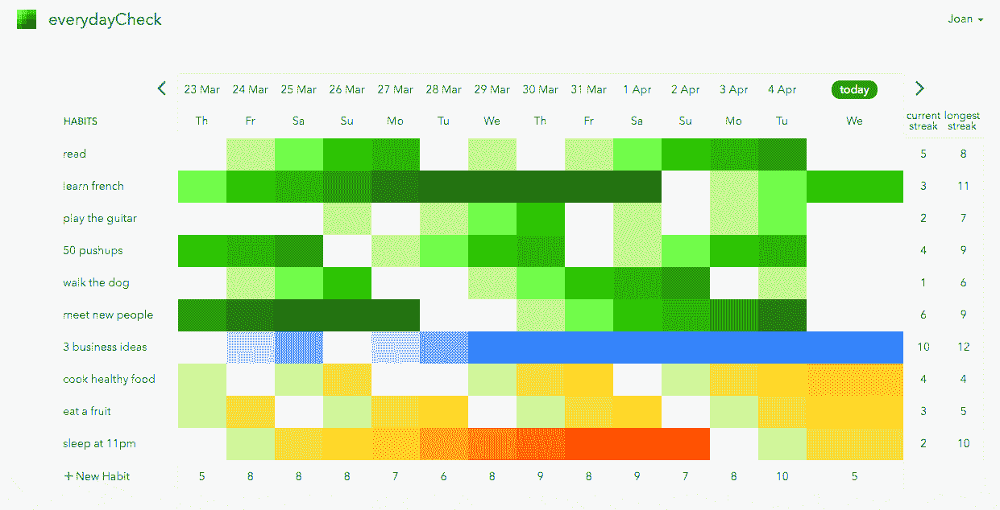
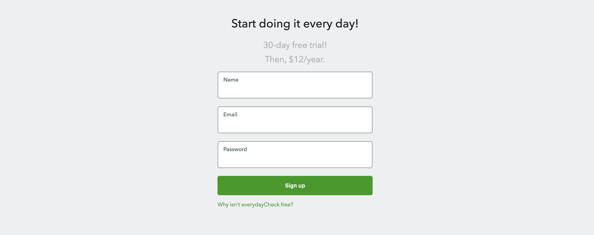

# 帮助构建和发展自身的生产力应用程序

> 原文：<https://www.indiehackers.com/interview/the-productivity-app-that-helped-to-build-and-grow-itself-b4d7afdf11>

## 你好！你的背景是什么，你在做什么？

你好！我是 Joan Boixadós，我正在做一个简单而漂亮的习惯追踪软件，帮助你养成新习惯，这个软件叫[。这个想法是，达到我们目标的最好方法是每天都为之努力，不管我们做得有多少。](https://everydaycheck.com/)

我是一名自由职业的 web 应用程序开发人员和产品经理。我在加泰罗尼亚理工大学(UPC)学习计算机科学，在慕尼黑(TUM)做硕士论文。然后，我为初创公司工作，直到我成为一名全职的自由职业者。

然而，对我来说，自由职业的自由仍然受到太多的限制，这就是为什么我总是在业余时间制作产品。因为我一直想拥有自己的事业，所以发现独立黑客的故事对我来说很有启发。

everydayCheck 是我尝试货币化的第一个产品，而且很成功。自从我 5 月份开始收费以来，它的平均价格是 450 美元/月。现在，每 240 次访问就有 30 个注册用户和一个付费用户。

 

顺便说一下，我还创建了 [awesome-indie](https://github.com/mezod/awesome-indie) :一个帮助独立开发者赚钱的开源资源库。请随意投稿！

## 是什么促使你开始做日常检查？

在经历了相对平淡的 2016 年之后，在重读了 [12 个月内的 12 家创业公司](https://levels.io/12-startups-12-months/)—[Pieter Levels](https://twitter.com/levelsio)的一篇很棒的(不言自明的)帖子之后，我感到有动力在 2017 年对自己提出挑战。

所以我想出了 12 个劳动力的主意，就像赫拉克剌斯那样。我把它们叫做[十二项全能](https://dodecathlon.com)。这 12 项工作不是创业，只是我想在一年中做或学的 12 件事。你猜怎么着？一月的劳动是:“做一个至少赚 1 美元的项目。”我以前从未为我的任何副业项目收费。

另一方面，当谈到生产力时，我总是挠自己的痒痒。我认为这是非常私人的事情。我为自己开发了几个小应用程序，而 [everydayCheck](https://everydaycheck.com/) 是其中之一。

我通常会在笔记本上列出每天或每周要做的事情。很长一段时间，有一件事困扰着我。有些任务，不管我做不做，第二天它们又会出现。去健身房，健康饮食等。这非常令人沮丧，因为刮掉它们并不意味着我摆脱了它们。大脑中没有多巴胺。看不到进展。

从那时起，我开始区分待办事项和日常待办事项。在我意识到我甚至想开发它之前，我已经做好了模型。然后我读了一些关于习惯的书，它们的好处，还发现了一些习惯追踪器。“每天做一点点，不管多少”的想法已经在我脑海中出现了几年，但我从未专门为此开发过应用程序。

有趣的是，现在想起每天的任务之一是“想出 5 个商业点子”

从商业的角度来看，在研究了习惯追踪器之后，我发现它们大部分都是用于移动设备的，于是我决定将它产品化。网络上也没有好的现代解决方案。

我想，“嗯，作为一个移动应用程序，它当然更有意义。”但后来我想起了 [Patrick McKenzie](https://twitter.com/patio11) 关于[针对少数族裔的营销](http://businessofsoftware.org/2011/03/hello-ladies-patrick-mckenzie-at-business-of-software-2010-marketing-to-minorities/)的一次演讲，他鼓励向人口统计数据和竞争较少的平台销售，我决定尝试一下。毕竟，我们大多数人都是在电脑前度过一天的！

作为一名自由职业者，你需要非常自律。所以我喜欢认为我做了每日检查，感谢每日检查，因为它帮助我每天都做，不管我做得多少。

为了验证这一点，我把我的应用发布在了几个我认为相关的子栏目中，在大多数栏目中，它都引起了极大的关注。具体来说，[r/get disciplified](https://www.reddit.com/r/getdisciplined/comments/60akoi/method_thought_i_owed_this_subreddit_a_lot_so_im/)上的这个帖子爆炸了。很早就确认这个想法给了我继续下去的信心。

## 构建最初的产品需要什么？

我花了三个星期才完成了第一个工作版本，登陆页面已经设置好了，可以展示给大家看了。我每天花一到四个小时在这上面。；)这三周是丢弃和优先化特性的伟大练习。

作为一名开发人员，大多数时候你只是想开发一些东西来尝试和实验，因为这很有趣。你开发一些小项目来尝试新的技术或库。

有了[每日检查](https://everydaycheck.com/)，我试着对我要实现的和我要省略的非常挑剔。我希望它简单到让我不好意思分享。我现在意识到我可以做得更好。做一件事，并把它做好。

我希望它简单到让我不好意思分享。

TweetShare

我一开始没有实现的事情:

*   恢复密码电子邮件
*   确认电子邮件
*   帐户设置:更改密码，昵称…
*   导出数据
*   提醒
*   用户化
*   条纹集成

我现在想想，我意识到我后来也没加那么多东西。我的极简主义方法是有意义的。我现在有一个人们要求的功能的大列表，但是我不想仅仅为了证明收费更高而添加更多的功能。除非某个特性是真正需要的，并且会增加很多价值，否则我不会添加它。

我已经熟悉了技术堆栈，所以这是一个很好的优势。我认为对于大多数项目来说，堆栈根本不重要。重要的是你对它足够适应，你可以快速移动。我只关心支付系统和如何实现订阅。

谢天谢地，我找到了关于[条纹的](https://stripe.com)。是的，我知道独立黑客被 Stripe 收购了，但分享这个链接的是我！作为一个从早期就进入社区的人，我担心收购会扼杀独立黑客的本质。然而，时间证明我的担心是没有根据的。

Stripe 真的是一个很棒的工具。文档和 API 都很棒，真的是最先进的。我分享这个是因为它对像我们这样刚刚起步的小企业特别有用。它解决了很多你在起步时连想都没想过的问题。如何处理年度定期订阅？我真的认为我必须建立某种脚本，每 X 天向我的客户收费，就像 cron 作业一样。Stripe 有一个超级强大的订阅 API。

我记得我担心退款:“我该怎么处理？”嗯，只要按一下仪表板上的按钮。再比如:最近有人找我要他记账的收据。我当时想，“呃，我还没注册呢。”我开始想出一个好办法来为将来的收据建立一个模板。但首先我决定检查条纹的地狱。它给了我一个链接；我把它给了顾客。每个人都很开心。

## 你是如何吸引用户和发展每日一查的？

在我完成最初的产品后，我与几个朋友分享了它，但基本上我是大约一个月的唯一用户。这个应用对我很有效，所以我把这个习惯添加到了“一天发送 5 个链接”我一直很不愿意展示我的作品…

这个习惯让我基本上有了以下四个[里程碑](https://everydaycheck.com/featured):

**1。[岗位纪律](https://www.reddit.com/r/getdisciplined/comments/60akoi/method_thought_i_owed_this_subreddit_a_lot_so_im/)**

这是我最先分享应用的地方之一。这有助于证实这个想法。一天之内我就有大约 600 人注册，接下来的两三天就有 200 人。在这 800 名注册用户中，大约有 100 人最终成为了每日用户。不过，记住这一点很重要，那时候，这个应用程序是完全免费的。

这段经历也让我明白，人们真的很喜欢并欣赏你的跟进。我的小型专用服务器很难服务所有的页面，所以我很可能失去了一些潜在的注册用户。此外，这完全验证了登录页面。人们立刻明白了这款应用的用途，并想尝试一下。

**2。每日支票登上了[测试列表](https://betalist.com/startups/everydaycheck)**

请注意，这种情况已经持续了几个月。有趣的是，在我决定关闭这个应用程序并让它付费 24 小时后，它才成为特色。 [everydayCheck](https://everydaycheck.com/) 是当天也是本周最时尚的应用。所以这给了它几天的能见度。

我不能说它带来的流量是疯狂的，但这种体验让我再次证实了人们喜欢我的产品，也证明了有人愿意在没有尝试的情况下就为它付费。

**3。我在[节目上推出了 HN](https://news.ycombinator.com/item?id=14653078) 和[黑客狩猎](https://hackerhunt.co/)和**

现在已经是六月下旬了，我很确定我已经放弃了让《每日观察》进入 HN 的主页，并展示 HN 的努力。因为我已经验证了产品，所以我更关注长期战略，比如为 SEO 优化网站等等。

然而，浏览 HN 我发现黑客亨特杀了它。我读了它是什么——一个让 HN 展览项目在 HN 更加引人注目的工具(一个寻找黑客新闻产品的工具)。我抓住机会，决定再试一次。我在 HN 秀上分享了每天的支票。奇迹发生了。正如贾斯廷·杰克逊所说的那样，我赶上了黑客狩猎浪潮。

每天检查迅速开始收到大量来自 HN 的流量，并使其成为黑客新闻和黑客狩猎的头版。在这个[独立黑客每月更新线程](https://www.indiehackers.com/forum/post/-KqT6DeKitcAItzp-XnY?commentId=-KqUUE_1wKoyruz8SJvW)(Ctrl-F:“Hacker hunt”)中可以读到更长的版本。

**4。[产品搜寻](https://www.producthunt.com/posts/everydaycheck-2)发布**

早在三月份，我就在产品搜索上发布了我的应用程序，它几乎没有被注意到。然而，还记得 Hacker Hunt 是如何在产品搜索中获得第一名的吗？嗯，这给我带来了产品搜索的大量流量，而且，人们开始在那里投票。

结果呢？第二天，它再次出现在产品搜索上，令我惊讶的是，它在当天排名第六。这是我最大的流量峰值，是之前注册人数的三倍。它也在习惯一天看几个产品的人群中验证了我的产品。产品搜索的可见性也使该应用出现在其他几个较小的博客和时事通讯中，从而保持了流量。

你必须自己创造机会。

TweetShare

所有这些都是在我对营销一无所知的情况下完成的。几乎没有任何计划。所以产品执行力有多重要就不用我说了。

当然，这些都是进行得很顺利的分享尝试——在我分享的所有链接中，这只是很小的一部分。所以我的建议是:坚持。坚持就好。每天都是。

我做的另一件重要的事情是建立了一个 Twitter 账户，并在应用程序的任何地方分享我的电子邮件，以便用户可以访问并立即帮助他们。获得用户反馈是非常宝贵的，尤其是在早期阶段。

在扩大用户群的过程中，一切都很重要。我为 SEO 做了优化，我开了一个博客，我回答了 Quora 的问题，我回答了 reddit 关于生产力的问题，我一有机会就在独立黑客上谈论它；这些是我接下来的步骤。你必须自己创造机会。

只是为了搞笑，看看这个[关于独立黑客](https://www.indiehackers.com/forum/post/-Kfaz5PwSA60NS5KJLw7)的帖子，我在那里没有得到回应和支持。坚持。

## 你的商业模式是什么，你是如何增加收入的？

我知道我想让它成为一个[微型 SaaS](https://www.youtube.com/watch?v=i3d1asTrWUQ) ，拥有基于订阅的商业模式。我有一个超棒的想法，你每月支付 5 美元，你养成的每一个习惯就能得到 1 美元。我甚至检查了我可以用 Stripe 实现它。但是这里有个聪明人告诉我，“不要让你的生活变得困难。人们希望了解他们支付的是什么——让他们觉得简单。不要有可变价格。”

这让我想到从简单开始，我决定每月收费 1 美元，每年收费 12 美元。

所以在上面提到的 reddit 帖子之后，我有了一个相对较大的用户群，可能有 800 个注册和 100 个日常用户。这个想法得到了验证。

产品呢:会有人为此买单吗？我在试图扩大用户群还是开始收费之间犹豫不决。IH 说服我开始充电。所以在这篇文章中，我问了关于[的最好方法](https://www.indiehackers.com/forum/post/-KiFpDOck0fhXuFBokoj)。

我在接下来的两个星期里实现了它，并推出了它。基本上做了条纹整合，加了个“为什么不免费？”消息，并给人们 10 多天的时间，直到它完全关闭订阅。大约 30%的日常用户转化！太棒了！

(直到今天，我仍然想知道停止使用这款应用的早期用户对从免费到付费的转变的真实感受。他们生气了吗？或者他们只是觉得这个应用程序没有价值和帮助，不足以支付每年 12 美元的费用？)

这里有一个有趣的轶事:部署付费版本 24 小时后，还没有人订阅。然后我发现我已经在测试模式下创建了 Stripe 订阅计划(所以测试当然有效！)但不在生产中。所以每个试图订阅的人都遇到了错误。

当我发现这个的时候，我正在拔我的头发。谢天谢地，我把它修好了，并通过电子邮件给每个尝试付费的人发了一个借口。成功了。人们喜欢听到你的声音。我记得我在推特上发了一条关于这件事的反馈。他们的工具不完全是白痴证明我猜想，呵呵。

在那个时候，我决定把产品放在付费墙后面，不提供免费试用。毕竟登陆页的 GIF 显示的是什么。我只是想验证一下。所以我知道一些尝试过它的用户发现它很有价值并支付了费用，但是用户会立即支付年费吗？

我又走运了。我根本没有计划过这个，但是在我付费购买产品的第二天，测试列表(我大概几个月前就申请了)显示了[每日检查](https://everydaycheck.com/)。这是当天最受欢迎的产品，也是本周最时尚的产品。这基本上意味着它是你进入网站时看到的第一样东西。这带来了足够的流量，证明人们也愿意在试用之前付费。那是个好消息！它验证了我的登陆页面。

然而，我觉得我失去了很多有可能转化的注册用户。更重要的是，我没有任何东西可以藏在付费墙后面——这个应用程序很好用！(就我自己而言，在过去的四个月里，我只跳过了两天的日常检查工作！)所以我决定实行 30 天试用期。为什么是 30？好吧，我们正在谈论习惯，你不可能在比那更短的时间内形成一个习惯。我观察到，在试用期间持续使用该应用的人转化率为 85%。

 

我当时的策略是更长远的。我知道我基本上想慢慢来，从头开始学习营销。通过产品搜索和其他类似的努力，我获得了平均 35 个月的订阅——每月 450 美元。

## 你未来的目标是什么？

一天三次付费注册。这大约是 1100 美元的 MRR。事实上，我向自己承诺，如果我在今年年底到达 MRR，我会在 2018 年进行数字漫游，并尝试体验其他城市和地方，同时让[的日常检查](https://everydaycheck.com/)增长。

以目前的转换率(每个订阅 240 次独立访问)来达到这个目标，我需要每天驱动 720 个访问者到我的网站。这是我目前的目标，无论从短期还是长期来看，尽可能地增加网站的流量。随着时间的推移，被动获取渠道有望取而代之。

因此，真正的目标是学习和享受营销。我最鼓舞人心的想法之一是，如果我在对市场营销一无所知的情况下走到了这里，并且在这个方向上花费了相对较少的努力，那么我一定还有很多事情要做。有很大的改进空间。

我正在研究的一些想法在这个[独立黑客主题](https://www.indiehackers.com/forum/post/-KrW6w9LH1rEnvuBBy2z)中有更详细的描述。欢迎提出建议！

当然，理想主义的目标，我相信我和许多独立黑客伙伴都有同感，是拥有一个被动的 MRR，让我实现财务独立。相信我，我不会考虑比我为 12 月 31 日设定的目标高出太多的金额。在巴塞罗那，你不需要挣那么多钱就能过上好日子:p .有足够的空闲时间去做其他事情，去学习新东西，也许去尝试建立技术更复杂的创业公司，或者在我喜欢的事情上花更多时间。

## 你面临的最大挑战和克服的障碍是什么？

创始人之间的纠纷是创业公司失败的最常见原因之一。出于同样的原因，你是你最大的威胁。所以我最大的挑战是我自己——找到每天在[上工作的动力，尤其是在我的舒适区之外做任务的时候。](https://everydaycheck.com/)

举个例子，我纠结营销两个月了。更多的是因为学习过程中的不作为和摩擦，而不是因为实际失败的营销尝试。

我试着少想一些。最大的错误是优柔寡断:分析麻痹。但是失败就是进步。有几件事，你可以做真正的努力和良好的意图，可以破坏你的进步。

最大的错误是优柔寡断:分析麻痹。但是失败就是进步。

TweetShare

当你从未从自己创造的产品中赚钱时，让至少一个人(不是你妈妈)为它买单看起来很难。非常辛苦。但是一旦你到了那里，你就会意识到这并不困难，你只需要尝试不同的事情，直到你到达那里。然而，达到一个点，该产品可以产生同样多的钱，你用你的全职工作吗？嗯，那是另一个故事了。

我想我认为这是最大的挑战，因为这是我现在找到自己的地方。但是营销很难。作为一名工程师，你知道你工作的结果，你有任务 X，任务 X 可能很难，或者不可能，但你知道你最终会征服它。当你这么做的时候，就成功了。你成功了！

有了营销，你可以分享 700，000 个链接，获得 0 次访问。同样，你可以在一天中正确的时间和正确的人分享一个带有正确单词的链接，并获得 70 万次访问。

当然，营销人员会说你可以让它更科学，我正在揭开营销的神秘面纱，但你需要转变思维才能实现。营销是一项挑战，只是现在我才开始享受它。

我很幸运这款应用引起了人们的反应和兴趣。然而，我现在确信，计划同时通过几个渠道发布确实可以提高你的初始曝光率和势头。

关于商业模式，我仍然在寻找 B2C 低年费是否是一个好的决定。显然，B2B 每月订阅允许您与更少的客户保持平衡，但是功能集(以及产品和营销方面的工作量)需要更多的努力。12 美元/年迫使我寻找大量用户来使它可行。但考虑到潜在受众的广泛程度，并没有多到听起来不可能触及的程度。

最后，任何类型的成功都来自长期的坚持。作为一名工程师，我喜欢不断尝试新事物，开始新的副业项目。因此，对我来说最大的挑战是带着这样的信念成长，即我想永远从事这项工作，或者至少长期从事这项工作。

企业不是一夜之间建立起来的。这就是为什么我说创意对创始人比对受众更重要。观众会根据你做的事情而改变，但你不会改变，你每天都要争取。所以，确保它能充实你的灵魂，让你保持动力。

## 有没有发现什么特别有帮助或者有优势的？

独立黑客。如果你是一个独立创业者，你会怀疑，你会犹豫，你的动力可能会减弱。这就是为什么我认为像这样的社区非常重要。你可能感觉很低落，然后你来到这里，发现其他人在和你一起奋斗，你意识到你已经完成了什么。见鬼，能量回来了，你出去把事情做完！我认为我从这次采访中链接到论坛的次数非常明显地表明我发现 IH 是多么有帮助。

在这种社区中，每个人都希望每个人都成功，并带来一些东西。我收集了大部分帮助我开始[牛逼独立](https://github.com/mezod/awesome-indie)的东西。这些资源帮助我做出了很多明智的决定，让我走上了正确的道路。

现在，最明显的答案是:拥有一个好的产品。没有什么比拥有一个好的产品更好的了，不管它有多简单。它会自己传播。

[每日一查](https://everydaycheck.com/)的一大优势是每个人都能认同应用的信息。习惯的概念和创造习惯的好处是如此的明显和常识，以至于人们愿意听你说些什么。

虽然我认为如此低的价格可能会使我难以使用某些获取渠道，但我也相信它使世界上几乎每个人都可以获得它。价值主张放之四海而皆准，价格呢？差不多了。

价值主张是普遍的，价格也差不多。

TweetShare

我认为对我早期成功有巨大影响的小事:

*   一个非常简单的登录页面，带有一个 GIF 图片，显示了这个应用程序的内容以及如何立即使用它。可笑的是，这与内容多的 SEO 原则相冲突。我当前的登录页面转换得很好，但是文本太少，我几乎不能对任何内容进行排名！一些营销人员告诉我，像我登陆时的主要报价这样的报价是不可取的，因为它们通常不会很好地转化。在这种情况下，我相信它会立即将价值主张灌输到人们的头脑中。

*   我在 reddit 上第一篇文章的标题是:“我认为我欠这个 subreddit 很多，所以我分享这个小应用程序，它帮助我遵守纪律，做我需要做的事情，每天都做。”是它引发了这一切。重要的时候注意小细节。

*   “为什么不是免费的”信息。它可能会让你失去注册，但它会过滤掉那些永远不会付费的人。这会建立信任。

*   接近你的用户。如果你能证明一个人的乐队是可靠的，人们会喜欢帮助他们。如果你几乎立即提供了答案，如果你是有帮助的，你可以挖掘从小处开始，并保持小的力量。

我也认为写下这个过程非常有帮助。这不是巧合，有这么多的独立企业这样做。它帮助你理清思路，建立动力，产生兴趣。

最后，成为该应用的用户#1 肯定有所帮助。

## 对于刚刚起步的独立黑客，你有什么建议？

前面的要点:

*   *[每天做一点。](https://everydaycheck.com/)* 这就是[彼得雷乌斯所说的](https://twitter.com/levelsio/status/913189764110700544)。

*   尽快弄清楚是否有人愿意为你的产品买单。我说的“愿意付钱”是指他们真的付钱给你。

*   一旦验证，忘记产品。让它成熟。然后应该努力分享应用程序，并获得最小的 MRR，使你能够改进产品。

*   利用这个势头。为了成长，也是为了完成任务。*持续决策*。动作要快。

*   顾客只关心价值。*所以需要找到最短路径来取值*。按照“更省时”和“更有效”来排列任务的优先级。不要用不相关的任务来忽悠自己。

*   亲近和回应:让人们很容易看到你是一个人，很容易与你取得联系。要透明，表现出你的恐惧，问他们想让你去哪里。

*   *坚持。坚持。*

*   *要你想要的。*你知道为什么我的应用还没有出现在 Lifehacker 上吗？因为我没问过。那是我的错。

*   把过程写下来，哪怕只是为了自己。这是一个很好的练习，可以让你理清思路，建立动力。

*   跟大家说说你在做什么。你永远不知道这会导致什么。副业是真正的激情。它们比我们真正的工作更私人。他们建立联系。

*   跟随你的直觉。想学多少就读多少，想获得动力，但最终没有人做过你正在做的事情。找到自己的路。

我读了很多，我真的认为[泰勒·特林加斯的微 Saas 博客书](https://tylertringas.com/micro-saas-ebook/)在不太多的字符中包含了很多价值。我认为他不得不放弃写电子书的想法是件好事，这样他就不会感到被迫打出比实际需要更多的页面来传达他的想法。别的不说，[牛逼-独立](https://github.com/mezod/awesome-indie)！

## 我们可以去哪里了解更多？

*   日常检查:[https://everydaycheck.com/](https://everydaycheck.com/)
*   推特:[https://twitter.com/everydayCheck](https://twitter.com/everydayCheck)
*   我的微博:[https://mezod.com](https://mezod.com)
*   我的 Github:[https://github.com/mezod](https://github.com/mezod)

跟踪 everydayCheck 进展的最佳机会是查看独立黑客的每月帖子。我对反馈和帮助总是非常开放，所以请不要犹豫，通过 [【电子邮件受保护】](/cdn-cgi/l/email-protection#6a00050b042a0f1c0f18130e0b1309020f090144090507) 与我联系！

我还要感谢并祝贺科特兰和钱宁为 IH 所做的出色工作。你鼓舞了我们其余的人！

嘿，我可能是 IH 所有受访者中最不精明的，但我也可能是最接近的，所以随时向我提问。我也很想听到这次采访的反馈。

我喜欢彼得·里维斯常说的一句话:“如果我能做到，你也能！”

—[<picture id="ember8078683" class="user-avatar ember-view user-link__avatar"></picture>Joan boixadós](/mezod?id=pYbtWMiD0UaaginYnUelLefxuQn1)【天天网创始人. app

## 想像 daily . app 一样建立自己的事业？

你应该加入独立黑客社区！🤗

我们是几千名创始人，互相帮助建立有利可图的业务和副业。来分享你正在做的事情，并从你的同事那里获得反馈。

还没准备好开始使用你的产品吗？没问题。这个社区是一个认识人、学习和实践的好地方。随意[随便浏览](/)！

——[<picture id="ember8078688" class="user-avatar ember-view user-link__avatar"></picture>柯特兰艾伦](/csallen?id=ibTLPyjwVebnZjMGKvz6ztarnuV2)，独立黑客创始人

31votes