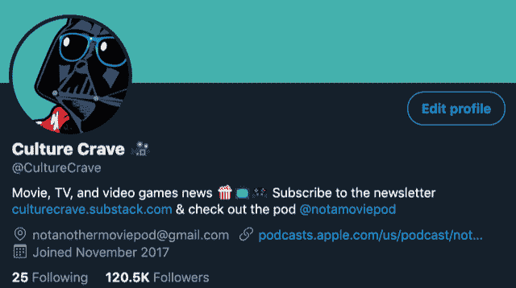
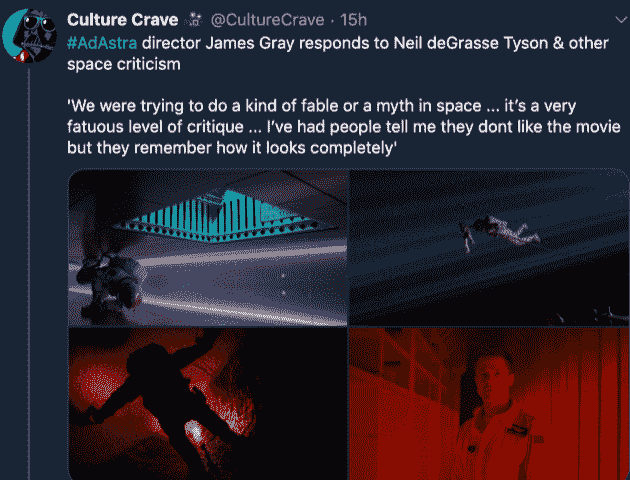
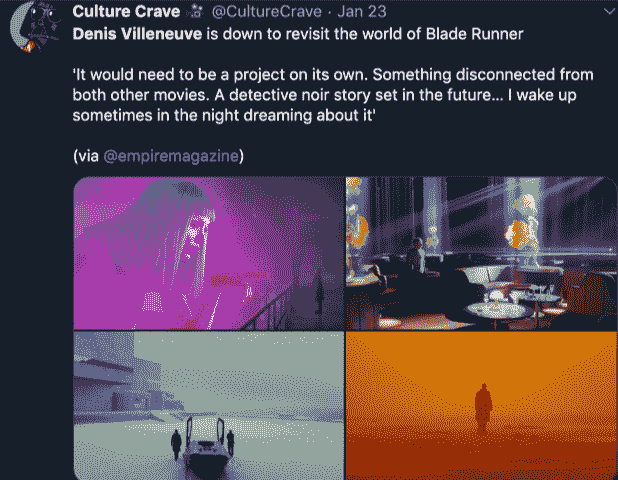

# 成长为社交媒体帝国的独立创始人

> 原文：<https://www.indiehackers.com/interview/the-solo-founder-growing-a-social-media-empire-1cc48d1094>

## 你好！你的背景是什么，你在做什么？

嘿，我叫扎克·威廉森。我正在建立[文化渴求](https://culturecrave.substack.com):一个涵盖电影、电视和视频游戏最新动态的新闻来源。它在 Instagram、Twitter 和 Snapchat 上拥有广泛的账户网络，覆盖了许多细分市场，拥有近 400 万粉丝。大多数新闻是关于流行文化、体育和幽默的。在过去的几个月里，我一直致力于将它转变为一家数字媒体公司。

在全职从事文化渴望之前，我在 [Fandom](https://www.fandom.com/) 的社交和编程团队工作。Fandom 是世界上最大的流行文化维基托管服务，每月接收超过两亿的独立观众。我有机会进来帮助他们从零开始建立社交关系。

在我在那里的两年里，我们的粉丝在 Twitter 上增加了 285，000 名活跃用户，在 Instagram 上增加了 200，000 名。月浏览量从每月 200 万增加到 7000 万。

在成为 Fandom 之前，我就读并毕业于俄勒冈州立大学，获得了市场营销学位。上学期间，我花了大约一年时间和 CollegeHumor 一起工作，在 Twitter、Instagram 和 Tumblr 上建立他们的社交网络。

## 是什么促使你开始接触文化渴望？

首先，我爱电影。我发现有一个机会，可以以一种快速和信息丰富的方式将关于电影的最大新闻发布到 Twitter 上。我早期的一个灵感来自于《看台报告》和体育界如何在社交网站上分享信息。一些快速的小点，加上适当的积分，如果有错误，体育推特永远不会让你的出口听到它的结束。

发邮件时千万不要气馁。

TweetShare

流行文化方面的问题是，有许多经过验证的交易网站运行 clickbait，或者对未经证实的来源给予权重。可能是一个拿着卡通 avi 的随便什么人，他们还是会在上面写一篇 1000 字的文章。

因此，我的提要的目的是直奔主题，只有经过证实的来源。我称之为“文化渴望”,因为我觉得这个名字可以包含很多更深层的东西:电影、电视、视频游戏、社交媒体、体育、嘻哈等等。

## 构建最初的产品需要什么？

我有更大的计划，但现在我们很小。目前没有网站。我还没有应用程序。

我们完全依靠时事通讯、社交媒体和口碑营销开展工作。

下面我得到了更多关于我们从一个帖子开始到今天的信息。

## 你的技术是什么？

对于时事通讯，我使用[子栈](https://substack.com/)。我现在喜欢它，因为它是免费的，布局看起来很干净。一旦时事通讯变得更大，我愿意转移到其他地方，但现在它足够了。

对于调度内容，我使用[后期](https://later.com/)、[缓冲](https://buffer.com/)，以及 [Tweetdeck](https://tweetdeck.twitter.com/) 。

## 你的商业模式是什么，你是如何增加收入的？

Culture Crave 的收入逐月变化。有些价格超过 12，000 美元，有些低至 2，000 美元。过去几个月，在疫情期间，它一直在 5000 美元左右。我创造和成长的一贯方式之一是通过 CPM 或基于 rev-share 的交易为网站带来流量。

Culture Crave network 每月可以从纯社交网站向网站推送 60 万至 70 万个会话。一些过去的客户是今日美国，复杂网络和分钟媒体。

该网络已被用于推动应用程序登录页面、推文、youtube 视频、嘻哈歌曲、memes 和 Shopify 商店的印象和浏览量。几年前，当 Cycle Media 在 Twitter 上活跃时，他们与 ESPN 合作制作社交节目，其中之一是主持人罗伯·佩雷兹和卡西迪·哈巴斯的《水桶》。Cycle 会找我来推动这个观点。另一个例子是，当抖音刚起步的时候，我会通过 Snapchat 用他们的动物视频为抖音做 PPI 活动。

我还提供社交策略咨询，并利用网络推动增长。我在 2020 年剩余时间及以后的主要关注点之一是找到更多的客户来协助他们的社交方式。大多数地方即使没有意识到也需要帮助。每个平台都在不断变化，它们都有不同的构建方法。有时你必须为特定的平台引入专家，我对此并不陌生。

过去，我们曾与电影公司合作推出预告片和海报。这也是我今后努力做得更多的事情。令人惊讶的是，说服经销商进行社交推广是多么的重要。我认为这是因为他们中的大多数人想出了传统营销，像电视，广告牌，网站横幅，等等，并不真正了解社交媒体平台。大多数地方甚至不回我的邮件。

几周前，凯文·詹姆斯推出了一部名为《贝基》( Becky )( T1)的电影，他在其中扮演一名新纳粹分子，这部电影获得了好评。单单这个前提听起来就很疯狂。*保罗·布拉特扮演纳粹？*我们偶然发现了预告片，贴了出来，在没有背后大力推动的情况下，在推文上获得了 25 万的浏览量。之后，我搜索了他们的官方账户，除了通过 Twitter 广告进行的付费活动之外，在 Twitter 上几乎没有任何推广。假设他们通过 Twitter 直接购买了 25 万个印象来推广预告片。安全地说，那将花费超过 1500 美元。如果他们通过文化渴望或不同的影响者网络，这只是相同目标市场成本的一小部分，你不用为那些立即浏览推文的人的印象付费，因为上面写着*推广了*。

我认为当前的气候将迫使这些电影公司和他们的营销团队在前进的道路上冒更多的险。最近的一个例子是克里斯托弗·诺兰在游戏《堡垒之夜》中放弃了他的*信条*预告片。诺兰是如此的老派，以至于第一部《宗旨》的预告在去年霍布斯&肖和华纳兄弟发布[数字千年版权法案](https://en.wikipedia.org/wiki/Digital_Millennium_Copyright_Act)之前就发布了，因为诺兰不想在网上看到任何东西。现在他在一个儿童视频游戏中发布预告片！我希望一旦世界恢复正常，这些不同的方法会继续下去，因为这对每个人都有好处。

流媒体服务是另一个容易合作的地方。我知道，当亚马逊等网站在 Prime 上添加了*灯塔*功能时，我正在向他们提供免费营销，但在推销之前，我需要有社会证据证明这是可行的。

我们正在尝试的最后一条盈利途径是播客。我们推出了《权力的游戏》第八季的《不是另一个电影播客》，并从那以后将它转向了电影和电视播客。自 2019 年 5 月以来，该剧 60 集的下载量已达 40 万次。不幸的是，我们在整个广告周期中只投放了一个广告，因为大多数问询都不值得推广，而且我们的规模太小，无法与像 Authentic 这样每集需要 10，000 次下载的网站签约。Patreon 进展顺利，在我们找到合适的广告合作伙伴之前，它将继续运营。

## 你是如何吸引追随者并满足文化需求的？

大学毕业后，就在《权力的游戏》第七季播出之前，我开设了一个名为《权力的真相》的页面，因为我太喜欢这部剧了，想找一种方式分享我从《冰与火之歌》的世界中学到的所有这些随机的东西。

我有一个公式，使用印象和个人资料点击来衡量潜在的追随者增长，这是可以在所有提供分析的社交媒体网站上复制的东西。另一种在没有预算的情况下最大化增长的方法是玩标签游戏，并保持在新闻周期的顶端。

这是一个巅峰时代，所以每个人都在谈论它。我想这个页面在节目播出的两个月里已经有了 4 万名粉丝。到了最后，对电影新闻的文化渴求开始了。

## 你面临的最大挑战和克服的障碍是什么？

除了寻找合作伙伴，我面临的最大挑战是筋疲力尽。有一段时间，我在旧金山市中心的 Fandom 工作了 8 个小时，往返两个小时，然后每周花 40-60 个小时在这些项目上，以保持增长。

那时，我有一个不符合我职业道德的合作伙伴，这导致我不得不投入更多的时间。我们最终分道扬镳，从那以后，我开始用自由职业者来扮演这些角色。

## 如果你必须重新开始，你会做什么不同的事？

如果我必须重新开始，我会直接雇佣自由职业者。

现在，我有一个做内容的人，一个编辑，一些视频人员和一个平面设计师。他们都采取主动，并相信我们正在建设的。知道我得到了帮助，他们也在帮助我，这有助于我保持动力。

## 你未来的目标是什么？

主要目标是继续建设。我想在明年将这个网络扩大到所有平台上的 1000 万粉丝，并找到新的方法来区分收入。

回复每一个值得尊敬的 DM 或询问。

TweetShare

我还为 Substack 上的 Culture Crave 创办了一份时事通讯，其中综合了电影、电视、营销和社交媒体的见解，以及对其他创作者和影响者的采访，内容是他们如何建立追随者。最终，我想做广告，推出付费栏目，并开始在主流文化下建立细分市场时事通讯，关注特定的粉丝:星球大战、MCU、LOTR 等等。

最后，我想为文化渴望建立一个社区新闻应用程序。我对它的想法满足了市场的一些需求。我加入独立黑客的原因是为了学习更多关于筹集资金的知识，因为我对这些都很陌生。

## 对于刚刚起步的独立黑客，你有什么建议？

我可以把我最好的建议列出来:

*   永远学习
*   永远保持人际关系
*   回复每一个值得尊敬的 DM 或询问
*   发邮件时千万不要气馁
*   影响者营销工作
*   设定预算

## 我们可以去哪里了解更多？

在 [【邮件保护】](/cdn-cgi/l/email-protection#8bf1eae8e3eef9f2fce2e7e7e2eae6f8e4e5cbe2e8e7e4feefa5e8e4e6) 可以通过邮件联系到我。

我在这里的独立黑客产品页面是 [@culturecrave](https://www.indiehackers.com/product/culture-crave) 。

我的简讯是[culturecrave.substack.com](https://culturecrave.substack.com/)。

——[<picture id="ember5200450" class="user-avatar ember-view user-link__avatar"></picture>扎克·威廉森](/zachwilliamson?id=Bt59gTqiaCWLnpKnUu5r5Bl4wcx2)，文化渴求的创始人🍿

## 想像文化渴望一样建立自己的事业吗🍿？

你应该加入独立黑客社区！🤗

我们是几千名创始人，互相帮助建立有利可图的业务和副业。来分享你正在做的事情，并从你的同事那里获得反馈。

还没准备好开始使用你的产品吗？没问题。这个社区是一个认识人、学习和实践的好地方。随意[随便浏览](/)！

—[<picture id="ember5200455" class="user-avatar ember-view user-link__avatar"></picture>考特兰艾伦](/csallen?id=ibTLPyjwVebnZjMGKvz6ztarnuV2)，独立黑客创始人

29votes