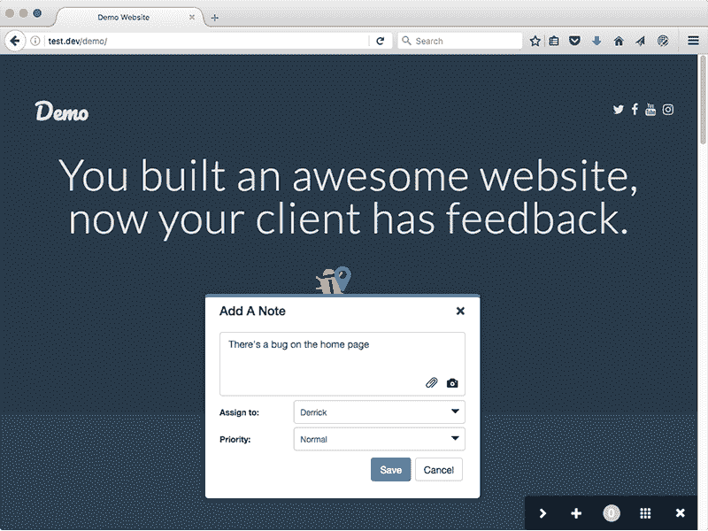
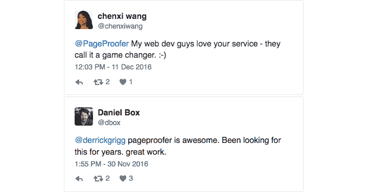
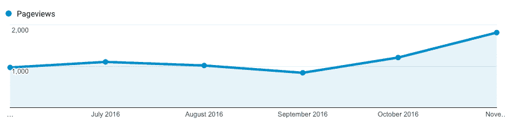
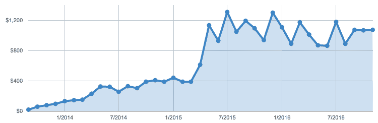

# 我学到的关于快速启动的宝贵经验

> 原文：<https://www.indiehackers.com/interview/the-valuable-lessons-ive-learned-about-launching-quickly-ff6228ecc6>

## 你好！告诉我们关于你自己和你正在做的事情。

我叫德里克·格里格。我从事网页开发已经超过 15 年了，其中 10 年是作为一名独立的网页开发者。PageProofer 是我第一次尝试在 SaaS 做生意。PageProofer 是一个可视化的错误跟踪和反馈系统。它让人们跟踪错误和问题，并在他们的网站上请求修改。

假设你是一家数字代理公司，你建立网站。这些网站中的每一个都会有问题，需要修复的东西，需要更新的内容。通常所有的交流都是通过电子邮件、电子表格、文档，有时还有一个 bug 追踪器来处理的。

有了 [PageProofer](https://pageproofer.com) 你可以在网站上留下一个虚拟的便利贴，当有事情需要解决的时候——只需点击三次就可以搞定。没有摆弄电子邮件和创建文档来告诉人们什么需要得到解决。有了 PageProofer，就像在电脑屏幕上贴一张便条一样简单。

PageProofer 主要由数字机构(大的和小的)、营销公司和企业网络团队使用。它在 1200 多个网站上使用，每月产生 1100 多美元的收入。

 

## 你是如何开始使用 PageProofer 的？

[页面校样器](https://pageproofer.com)在 2010 年作为一个小项目开始。当时没有一个好的方法让开发者、设计师和客户在网站开发过程中分享反馈，所以我决定做点什么。想法很简单:给人们一个虚拟版本的便利贴，让他们在网站上留下反馈。从概念上讲，没有比这更简单的了。我花了几个月的时间在晚上和周末工作，完成了一个工作原型。我把最初的原型展示给了几个客户，他们都很喜欢。我知道我有所发现。

不幸的是，第一个版本在用户界面上严重依赖 Flash，2010 年春天，史蒂夫·乔布斯发布了他的著名信件，这基本上是对 Flash 的致命一击。我意识到，如果我的想法要存活下来，它需要 100%用 HTML 和 JavaScript 构建，这样它才能在尽可能多的网站和设备上工作。重写的时间比我预期的要长。许多在 Flash 和 ActionScript 中很容易的事情在 JavaScript 中需要更多的努力和工作。我也有一个不断增长的家庭，一个妻子和四个孩子，所以 PageProofer 退居二线去工作支付账单。

最终在 2013 年，我准备推出 PageProofer。该系统在所有流行的浏览器和设备上都能正常工作，我也完成了营销网站。我发现创建内容来推广你的产品有时就像制作实际的产品一样困难。2013 年秋天，我打开了开关，向公众发布了 PageProofer。我很快意识到，斗争才刚刚开始:营销一个产品将是一个比制造它更大的挑战。

## 你提到了晚上和周末工作。你是如何找到时间和资金来自己制作 PageProofer 的？

[page proof er](https://pageproofer.com)100%自己自举。从“啊哈”时刻到原型，花了几个月时间，差不多三年时间才推出。谢天谢地，我有一个成功的网络开发业务，涵盖(现在仍然涵盖)页面校样器的开发费用。在向一些值得信赖的朋友和客户展示了第一个原型之后，我得到了投资，以帮助加快最初的构建。当时我不知道如何对 PageProofer 进行估值，也不知道它能做什么，所以我不愿意投资。这些人一直是我信任的盟友，我可以向他们提出想法和问题，这非常有益。

作为一名独立开发者最好的一点是，我在项目间隙(除了晚上和周末)有时间在[页面校样器](https://pageproofer.com)上工作。即使有了这种自由，它仍然花了近三年时间做好发射准备。现在回想起来，时间本来可以短得多，但我让它停留了一段时间，而我真的不应该这样做。如果我是一家公司的全职员工，我不确定我是否能完成它。我的妻子给了我巨大的支持。做一名创业者意味着有几天(甚至几周)你会怀疑自己在做什么，为什么要这么做。在那些日子里，有人鼓励你，继续尽你最大的努力，这是非常重要的。她可能永远不会完全理解她的支持对我有多重要。

在运行 [PageProofer](https://pageproofer.com) 的同时运行我的 web 开发业务的一个附带好处是，我经常与终端用户一起使用 PageProofer。我参与的几乎每个基于网络的项目都使用 PageProofer 进行错误跟踪和反馈。这是非常有益的，因为我可以看到什么在工作，什么可以使用一些调整，以及添加什么功能会有帮助。通过我自己的使用和参与用户的反馈，它正在不断地被改进。由于不断的改进，它已经从一个非常简单的产品发展成为网页设计者和开发者非常有用的工具。

## 你是如何吸引用户和发展 PageProofer 的？鉴于市场如此拥挤，我想推广一个 bug 追踪器是很困难的。

在推出 PageProofer 之前，我联系了一个关系密切的圈子，收集了一份符合目标市场的公司、设计师和开发商的名单。我还花了几周时间在互联网上搜索那些属于 PageProofer 目标市场的人，主要是网络开发者和营销/广告代理。我希望当时有产品搜索，因为它可能会使发布会更有意义一点。鉴于这是一个人的行动，发射那天相当安静。我仍然记得那天晚上和我的妻子出去吃了一顿美味的牛排晚餐，以庆祝发布，并为可能取得的任何成功干杯。

最初的几个月比我预期的要慢。试图吸引网站流量过去是，现在仍然是最大的挑战。从试用到客户的转化率一直徘徊在 9%的关口，已经很棒了。客户获取和收入一直是非常线性的，这里没有曲棍球棒增长。我已经尝试了 Google Adwords、Twitter 广告以及一些目标网站上的横幅广告，但都没有太大的成功。支出对采购和客户价值对我不利。

增长的主要障碍之一是缺乏有针对性的搜索词，以及谷歌上广告词的成本(“bug 跟踪”是一个昂贵的术语)。人们知道他们需要一个解决方案，但是他们不知道去寻找什么。我刚刚与一位新客户交谈过，他说他在 Google 上搜索了一年多来寻找合适的解决方案。用他的话来说，“我确切地知道我想要什么，但是有很多服务不是我想要的。”

电话推销很成功(包括电话和邮件),但是需要花费大量的时间和精力来挖掘潜在的销售线索。最近我在 Twitter 上做了更多的工作，寻找那些在 Twitter 上发布反馈和错误跟踪问题的人，甚至只是网站反馈。搭讪做了两件事。首先，它引起了那个特定人的兴趣，其次，它在他们的社交网络中产生了连锁反应。它的可扩展性不是很好，但在这一点上，它有助于推动流量，这将有望带来一些长期的好处。当你收到这样的推文时，你的努力肯定是值得的:

最近，我更加注重为营销网站生成内容，专注于我认为会产生兴趣和流量的非常具体的关键词和主题。几个月前，一位潜在客户发来电子邮件，询问 PageProofer 是否仍在积极开发和支持中，因为博客帖子已经过时了。这是一个警钟，我需要做得更好，在网站上获得新鲜的内容。人们会注意到。在过去的三个月里，网站流量翻了一倍多，达到每月 2000 多页...不算惊人，但谢天谢地，这是朝着正确的方向发展。

最终归结为简单的数字:试用的访问者和订阅的试用者。访客到试用的转化率是 5%，试用到订阅是 9%。流失率低于 4%。我所能做的任何增加浏览量和网站访问量的事情最终都有助于底线。

## 你的商业模式是如何运作的？你做了什么来增加收入？你的花费是什么样的？

[PageProofer](https://pageproofer.com) 是基于月度和年度计划的 100%订阅。从第一天起，我就收取订阅费。上线不到一个月，我就有了三个付费客户。总共才 45 美元/月，但感觉很棒。知道有人为我的创作买单是对所有辛勤工作的肯定。这也让我意识到，人们现在指望我的服务来帮助他们经营业务，这是一个非常清醒的想法。如今，PageProofer 每月收入近 1100 美元，总收入超过 25000 美元。

每月费用很低。我支付网站托管，服务器监控，和其他一些最低限度的每月开支。我目前没有从 PageProofer 获得任何收入，我依靠我的 web 开发咨询业务来支付我家人的生活费用，希望这在未来会有所改变。

最初我提供了 30 天的免费试用。随着时间的推移，我已经把它缩减到目前的 15 天免费试用。我发现参加试验的人很快就能看出[页面校样器](https://pageproofer.com)的用处，或者根本看不出来。30 天推迟了大多数人准备在两周左右做出的决定。不过，我对试用期非常灵活——如果有人需要更多时间来评估 PageProofer，我很乐意延长试用期。

定价从每月 15 美元开始，根据订阅计划，客户可以在 PageProofer 中添加的用户和网站数量有限。最初没有年度计划。我从第一天开始就使用 Stripe 进行订阅和支付处理。在研究了可用的支付方式后，他们为我提供了最佳的整体解决方案。知道我不需要太担心信用卡的安全，生活就轻松多了。

发布一年多后，我应用户的要求增加了年度计划。大约在同一时间，在阅读了一些不同的文章后，我将价格全面提高了约 30%，并改变了一些计划限制，特别是帕特里克·麦肯齐的[这篇](https://training.kalzumeus.com/newsletters/archive/saas_pricing)。最终结果是对转换率的影响为零，收入显著增加，从最低计划转移到中间层的客户大幅增加(因为修改了用户限制)。尽管定价和限额调整实际上意味着新客户的价格上涨了 100%，但变化前后的转换率保持不变。

在对订阅进行价格调整时，我遇到的一个难题是如何处理现有客户。我反复考虑是延续旧计划，还是让每个人都接受新计划。我决定保留旧的计划，但警告说，客户必须保持他们的计划有效，如果他们取消或停止订阅，然后重新启动，新的价格将生效。令人惊讶的是，我没有抱怨。

2015 年，在度假期间，一位客户联系我，紧急请求升级他们的订阅，以允许更多用户。当最高计划允许 50 个用户时，他们预计需要 150 个用户。在一些确定他们需要什么的谈话之后，我匆忙制定了一些额外的计划来满足他们当前和未来的需求(那是一次我不介意因公中断休假)。现在有每月 20-400 美元的套餐。

随着时间的推移，我发现限制网站和用户对我们的客户和潜在客户来说没有意义。随着用户数量的增加，他们可以看到支付更多费用的理由，但没有看到与多少网站使用 [PageProofer](https://pageproofer.com) 的相关性。深入研究系统活动和数据量，我可以看到它更多地是由帐户上的用户数量而不是安装 PageProofer 的网站数量驱动的，所以我决定取消网站限制，让所有计划在无限制的网站上使用。

在过去的一年里，收入增长相当平稳。如上所述，我开始更加注重吸引人们访问 PageProofer 网站。在过去的几年里，我花了很多时间添加新功能，希望能吸引新客户，但我从惨痛的教训中认识到，内容和广告比任何新功能都更有底线效应。

## 你未来的目标是什么？有什么大的挑战即将到来吗？

我的目标很简单。成长。提高网页设计和开发社区对 [PageProofer](https://pageproofer.com) 的认知度，增加网站流量，增加收入。

具体来说，我想在明年将客户数量增加一倍，并持续增加网站的月访问量。我想把 PageProofer 发展到可以养活我的家人，最好是几个员工的地步。我很现实，我不认为它会成长为一家大公司，但我认为它可以成为一家成功的小公司，提供优秀的产品和优质的服务。

我认为最大的挑战是被听到和看到。互联网是一个巨大的空间，很难吸引任何人的注意力。最后，任何 SaaS 业务都可以归结为三个简单的数字:网站访客、转换(访客和客户)和流失。保持前两个向上，最后一个向下，你就赢了。我得到的访问者越多，我就越能开发 PageProofer。对我(和大多数开发者)来说，这是一个巨大的挑战，因为生成内容来增加流量和知名度与编写代码是非常不同的。不是二进制的。

## 如果你必须重新开始，你会做什么不同的事？到目前为止，你在旅途中学到了什么？

两件事。第一，上市速度。我花了将近三年的时间从构思到推出。2010 年，市场上没有任何东西能与[的页面打样机](https://pageproofer.com)相提并论。如果你在谷歌上搜索“可视化 bug 追踪器”或“可视化反馈工具”,搜索结果页面没有精确匹配。2013 年，有一些竞争对手得到了风险投资的支持。这是比赛场上的一个重大变化。那次耽搁是我会后悔很久的事情。如果我没有推迟并慢慢修补我的小副业，会有什么不同呢？这就是生活。

第二，营销。我从大学毕业，获得了商业营销学位，但我从一开始就没有意识到营销自己产品的重要性。我将大量时间和精力投入到产品开发和功能上，而不是专注于营销和增长。我低估了吸引网站流量和试用订阅的难度。在发布后花了很多时间阅读和研究 SaaS 和开发者论坛，我知道我不是唯一一个犯这个错误的人。这是典型的“如果我建造了它，他们就会来”的心态。

不幸的是，我不能让时钟回到 2010 年，更快地发布，但我可以确保我能更好地将精力集中在营销[页面校样](https://pageproofer.com)上，而不仅仅是打造一个伟大的产品。没有受众的伟大产品只是一个吸尘器。我未来的计划是利用内容营销和有机搜索。我知道我现在无法在每月广告词支出上与市场上更大的玩家竞争，但在内容创作和有机搜索结果方面，我可以在相当平等的基础上竞争。

## 你认为帮助你成功的最大优势是什么？

决心和客户服务。我天生是一个非常坚定的人。一旦我下定决心做某件事，要让我打消这个念头需要很大的努力(问问我妻子)。我决心让 [PageProofer](https://pageproofer.com) 成为最好的视觉反馈和视觉错误跟踪解决方案。我认为我在发展和商业技能方面有很好的平衡，如果适当地集中精力，可以帮助我实现我下定决心要做的事情。

比决心更重要的是，我愿意提供优质的客户服务(我收到了一封客户的电子邮件，提议在圣诞节给我买一件超级英雄服装)。经验告诉我，客户服务是同类服务和产品的最大区别。做了很长一段时间的网络咨询后，我知道一个满意的客户的好的推荐的力量。在同等条件下，人们更喜欢正面的客户体验，而不是负面的。倾听 PageProofer 的客户，主动询问我如何才能做得更好，并及时回复人们——这些听起来很简单，但很多公司似乎不明白这些做法有多有价值。

我认为我最大的优势是我经常使用[页面校样器](https://pageproofer.com)进行我的网络开发业务。我可以很快看到哪些工作正常，哪些需要改进，以及哪些新功能将是有益的。因为我在现实世界的项目中与团队一起使用 PageProofer，所以不仅仅是我的想法推动了开发，而是我直接与之互动的人的建议和反馈塑造了 PageProofer。

## 你会和有抱负的独立黑客分享什么建议？

我知道这有点老生常谈，但没有一夜成功的故事。浏览独立黑客的采访列表。这需要努力、失败和毅力。你需要享受小小的胜利，并在此基础上再接再厉。得到一个客户，得到十个客户，得到一百个客户。

学会如何学习。今天，你不太可能知道让你的产品或服务成功所需的一切。你需要能够快速地从你的错误和其他走过这条路的人身上学习。 [Bootstrapped.fm](http://discuss.bootstrapped.fm/) 对我来说是学习、分享和提问的绝佳资源。[艾米·霍伊](https://unicornfree.com/)、[加勒特·戴蒙](https://garrettdimon.com/)、[帕特里克·麦肯齐](http://www.kalzumeus.com/)和[罗布·沃林](http://www.softwarebyrob.com/)都是我学习到的优秀资源。

## 我们可以从哪里了解更多信息？链接到你写过的其他相关内容，链接到你的个人/商业博客、网站、Twitter 账户、电子邮件等

你可以在 Twitter 上关注 page proof er([@ page proof er](https://twitter.com/PageProofer))，访问[网站](https://pageproofer.com)，或者给我发邮件 [【邮件保护】](/cdn-cgi/l/email-protection#44202136362d272f043425232134362b2b2221366a272b29) 。也可以在 Twitter [@derrickgrigg](https://twitter.com/derrickgrigg) 关注我或者在下面留言评论/提问。

—[<picture id="ember5280826" class="user-avatar ember-view user-link__avatar"></picture>DG rigg](/dgrigg?id=uFgOe3LB66Yopn9lKDrq6LRi3272)，PageProofer 的创建者

## 想像 PageProofer 一样建立自己的事业？

你应该加入[独立黑客社区](/)！🤗

我们是几千名创始人，互相帮助建立有利可图的业务和副业。来分享你正在做的事情，并从你的同事那里获得反馈。

还没准备好开始使用你的产品吗？没问题。这个社区是一个认识人、学习和实践的好地方。随意[随便浏览](/)！

—[<picture id="ember5280831" class="user-avatar ember-view user-link__avatar"></picture>考特兰艾伦](/csallen?id=ibTLPyjwVebnZjMGKvz6ztarnuV2)，独立黑客创始人

6votes