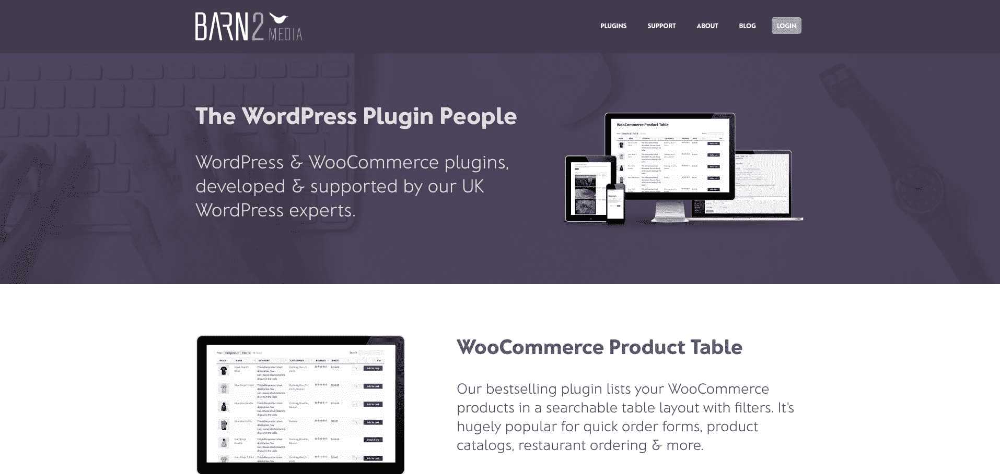
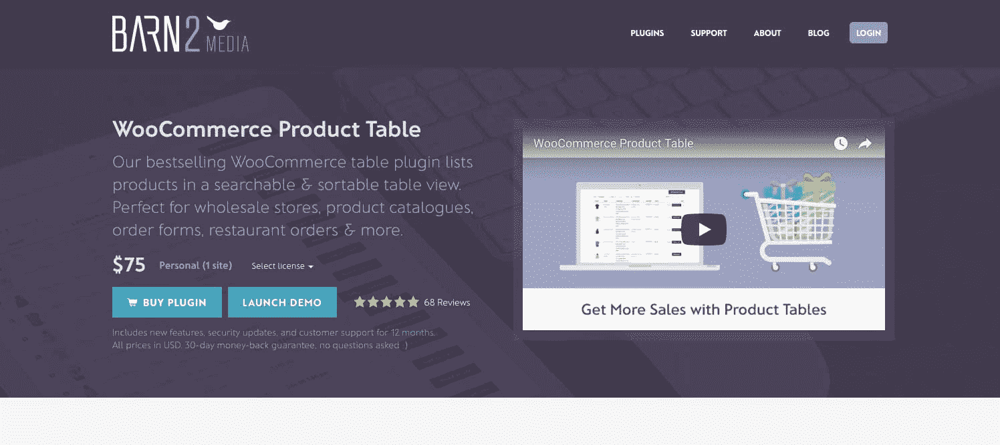
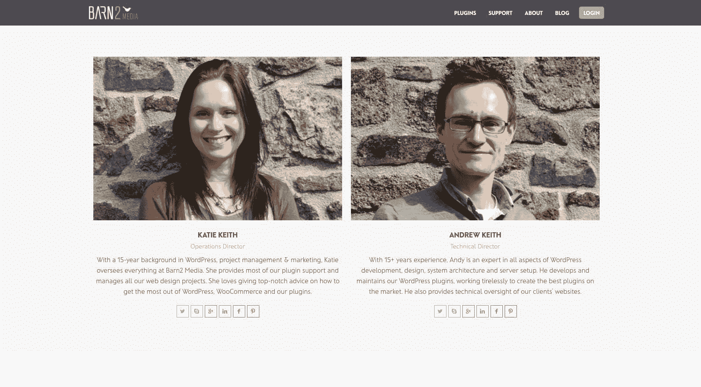

# 从设计商店过渡到基于订阅的插件业务

> 原文：<https://www.indiehackers.com/interview/transitioning-from-design-shop-to-subscription-based-plugin-business-6b9b970fb3>

## 你好！你的背景是什么，你在做什么？

嗨，我是凯蒂·基思。早在 2009 年，我和我的丈夫安迪共同创立了 Barn2 Media。

安迪的职业是网络开发员，但我的网络知识都是自学的。我的背景实际上是市场营销和项目管理——我的学位是英语和哲学！

在创办 Barn2 Media 之前，我为当地政府做了 7 年的市场营销工作，鼓励人们领养一个孩子。这确实涉及到一些在线营销和网页设计，但这不是主要的重点。

安迪和我一直想在家工作，一起创业。我们在 20 多岁的时候谈论过这个话题，但觉得我们没有一个成功的杀手锏。结果，我们在工作岗位上呆的时间比我们应该呆的时间长得多。

20 多岁的时候，我大部分时间都在谈论创业，却什么都没做。当你有固定工资时，很容易做到这一点！

TweetShare

最终，安迪辞去了高级软件开发员的工作，创办了 Barn2 Media，而我则在全职工作之外支持这项业务。2011 年生了孩子后，我全职在 Barn2 Media 工作。

我们从为中小型企业设计 WordPress 网站开始，并没有遇到任何工作上的困难。我们没有招聘员工(我们都不愿意这么做)，而是通过招聘一批自由职业者来发展业务。在鼎盛时期，我们有一个由大约 10 名自由职业者组成的分布式团队，定期在一起工作。

然而，我们总是觉得销售 WordPress 相关产品是一种更好的方式来获得我们正在寻找的工作与生活的平衡。2016 年，我们冒险将大部分时间投入到开发和销售 WordPress 产品插件上，这些插件为人们的网站增加了额外的功能。

一晃两年过去了，除了网页设计业务的收入，我们现在每月销售超过 24k 美元的插件。

 

## 是什么促使你开始销售 WordPress 插件？

从 [Barn2 Media](https://barn2.co.uk/) 早期开始，我就想销售网络相关产品，因为我觉得这是一种更具可扩展性的商业模式。我喜欢创造一种可以多次销售的产品的想法，而不必为每一次销售而努力。

我们从一个想法论坛上获得了第一个插件的想法，人们在那里请求 WooCommerce 的新功能。WooCommerce 是世界上最大的 WordPress 电子商务插件，支持全球超过 42%的在线商店。相当多的人要求在他们的 WooCommerce 商店中用密码保护特定的类别，但是还没有人开发出这种方法。因此，我们开发了我们的第一个插件——[woo commerce 密码保护类别](https://barn2.co.uk/wordpress-plugins/woocommerce-password-protected-categories/)。

我们没有对这个想法进行任何正式的验证，也不知道它是否会成功。这感觉像是一个非常小的利基目标！然而，它不需要大量的开发时间，所以我们决定冒一次险。

停止等待完美的“大创意”。阅读论坛，在 Quora 上寻找想法和市场空白，开发几个不需要太长时间的产品。

TweetShare

推出 WooCommerce 插件很好地结合了我们的技能。我们在开发 WooCommerce 网站和为基于 WooCommerce 的客户编写定制插件方面非常有经验。这感觉像是在更广阔的 WordPress 领域中的一个很好的定位目标。

与此同时，我们还推出了两个免费插件，以帮助 Barn2 Media 作为一家插件公司提高知名度——[Better Recent Comments](https://en-gb.wordpress.org/plugins/better-recent-comments/)和[Posts Table with Search+Sort](https://en-gb.wordpress.org/plugins/posts-data-table/)。这些是我们已经为我们的网页设计客户建立的插件的增强版本。

## 构建最初的产品需要什么？

销售 WordPress 产品的完美之处在于，你可以开发它们，并把它们推向市场，而不需要大量的财政支出。你只需要能够承受花费时间制造可能永远赚不到钱的产品所带来的收入下降。

我们已经通过为客户设计网站过上了不错的生活。有了一个既定的流程和一个自由职业者团队，我可以继续运营客户业务，而安迪则致力于构建 WordPress 插件。

在早期，我可能花了四分之一的时间营销插件和提供客户支持。一旦产品获得成功，我就可以停止承担新的网页设计项目，这就增加了我 90%的时间。这意味着我们非常幸运，能够以一种允许我们开始销售插件而没有任何大的财务风险的方式来构建现有的业务。

一旦 Andy 把所有时间都花在产品开发上，我们就能在几周内推出两个免费插件，一个月后推出我们的第一个高级插件。

我们通过仔细考虑每个插件的范围和复杂性实现了这一点。我非常厌恶风险，不想在一个可能不成功的产品上花太多时间。策略是推出几个小型到中型的插件，每个插件满足一个特定的需求，而这个需求在其他地方是没有的。然后，我们可以评估每个产品的成功，从我们的错误中学习，并计划如何继续发展业务。

 

## 你是如何吸引用户并提高 Barn2 Media 的产品销量的？

当我们推出第一个插件——woo commerce 密码保护类别——的时候，我们在几天内就开始销售了。第一个月只有八次销售，但是第一次销售感觉很好！

我没有做任何付费广告，发布前营销，建立邮件列表，在社交媒体上制造轰动，或者任何你应该做的事情来推广新产品！我所做的只是在我们的博客上发表一些文章。因为这是一个利基领域，这足以让人们在谷歌上找到我们。人们愿意从我们这里购买，因为我们的网站看起来很专业，而且没有其他产品提供相同的解决方案。

我们通过倾听用户的意见来提高产品销量。一旦我们发布了 WooCommerce 密码保护类别和两个免费插件，功能请求就开始潮水般涌来。这给了我们一些销售新产品的好主意。例如:

*   出乎意料的是，很多人使用 WooCommerce 密码保护类别来创建一个完全隐藏的商店。这个插件并不是真正为这个设计的，所以我们开发了一个新产品: [WooCommerce 私人商店](https://barn2.co.uk/wordpress-plugins/woocommerce-private-store/)。这个现在比原来的产品卖得更多。
*   使用 Search + Sort 插件的 Posts 表的用户很快开始要求在一个表中列出其他帖子类型和自定义数据。免费插件只在表格中列出博客文章，所以我们开发了[文章表格 Pro](https://barn2.co.uk/wordpress-plugins/posts-table-pro/) WordPress 表格插件来满足这一需求。
*   许多 Posts Table Pro 用户使用它在一个表格中列出 WooCommerce 产品，这是我们没有预料到的。他们想要额外的功能，比如添加到购物车按钮，所以我们为 WooCommerce 创建了一个专用的表格插件——[woo commerce 产品表格](https://barn2.co.uk/wordpress-plugins/woocommerce-product-table/)。这个插件有着巨大的需求，并使我们的销售直线上升——它的销量超过了我们所有其他插件的总和。

我给有抱负的企业家的建议是，不要再等待完美的“好主意”了。阅读论坛，在 Quora 上寻找想法和市场空白，开发几个不需要太长时间的产品。找到其他地方还没有的产品是很重要的，因为这样更容易征服你的利基市场，为你的网站带来流量。

评估结果，听取反馈，并利用结果提出更独特的想法，这样会卖得更好。

## 你的商业模式是什么，你是如何增加收入的？

插件业务的商业模式是继续推广我们现有的产品；在我们有证据表明会增加销量的地方增加新功能；并开发新的插件来进一步填补 WordPress 和 WooCommerce 市场的空白。

我们通过以下组合增加了收入:

*   尝试定价，为每种产品找到最有利可图的成本。
*   推出新产品并为现有产品添加新功能。
*   持续营销以提高知名度，并展示我们的产品如何为许多不同的使用案例提供解决方案。
*   订阅模式下的年度定价。

在了解了其他 WordPress 产品公司的成功之后，比如 Pippin Williamson 的公司 Sandills Development，我们决定对我们的产品采用订阅模式。当有人购买我们的插件时，他们会自动注册一个年度订阅。他们每年为持续访问新版本的插件和支持支付一次费用。

这使得业务更加可持续，并将随着时间的推移增加我们的收入。目前，我们每月从插件更新中获得几千美元，这对新的销售收入是一个很好的促进。

通过直销创造你有合理机会成功的利基产品。小馅饼的一大块总比大馅饼的 0%块好。

TweetShare

我们提供两种支付方式:PayPal 和 Stripe。我认为这很重要，因为我们是一家英国公司，89%的客户都在海外。他们需要了解并信任的支付方式。贝宝很棒，因为它非常简单，人们不必输入他们的信用卡信息。我认为增加信用卡/借记卡选项也很好，因为这对我们来说费用略低，而且一些人(特别是大公司)不喜欢使用 PayPal。由于费用较低，Stripe 是我们的默认支付方式，我们 60%的客户通过 Stripe 支付。

我们上个月卖出了 24000 美元的插件，这个数字每个月都在增长。除此之外，还有来自其他来源的收入，比如我们之前设计的支持网站。

我给有抱负的企业家的建议是，通过直销创造有合理成功机会的利基产品。在小馅饼中分得一大块总比在大馅饼中分得 0%好——尤其是如果你可以选择自己的定价并出售订阅，这在大多数市场上都不是一个选项。在自己的网站上直接销售比在第三方市场上销售更有可能带来更高的收入，在第三方市场上销售你会损失 30-50%的收入。

| 月 | 销售 |
| --- | --- |
| 3 月 16 日 | 8 |
| 6 月 16 日 | 13 |
| 9 月 16 日 | 48 |
| 十二月十六日 | 59 |
| 3 月 17 日 | 153 |
| 6 月 17 日 | 177 |
| 9 月 17 日 | 203 |
| 十二月十七日 | 211 |

## 你未来的目标是什么？

我不热衷于制定正式的收入目标和预测。相反，我计划继续做我们正在做的事情——这是我所知道的建立在我们现有成功基础上的最佳方式。

这意味着:

*   使用我们的功能请求列表来改进我们的产品，以增加销售。
-继续尝试新的方法来推广和提高产品的知名度。
*   推出更多免费和付费的 WordPress 插件。基于我们发现的市场空白，每一个都旨在满足 WordPress 或 WooCommerce 的特定需求。

就我个人而言，我的目标是不那么忙，腾出更多时间用于休闲和家庭生活。我天生是一个积极向上的人，喜欢努力工作！这意味着我一直在寻求继续发展业务，即使我可以大幅减少工作时间，但仍能赚足够的钱维持生活。我需要找到正确的平衡，既要积累足够的收入，保证家庭未来的财务安全，又要记住短期内享受生活和休息一段时间。

## 你面临的最大挑战和克服的障碍是什么？如果你必须重新开始，你会做什么不同的事？

我喜欢销售产品，因为虽然我们的客户需要大量的支持，但这远没有为客户设计网站要求高或时间密集。我也喜欢为自己工作，因为我有更多的自由，可以选择我的工作时间。

我最大的遗憾是没有早点做这件事。2002 年大学毕业，2016 年才开始卖 WordPress 插件。20 多岁的时候，我大部分时间都在谈论创业，却什么都没做。当你有固定工资时，很容易做到这一点！

一旦我开始 [Barn2 Media](https://barn2.co.uk/) 并建立了一个成功的网页设计业务(我真的很自豪)，我花了几年时间谈论销售 WordPress 产品，却没有真正做任何事情。当你有很多项目在忙的时候，这样做很容易！

如果你讨厌自己的工作，那么为自己工作就毫无意义。选择你会积极享受的工作，这能很好地利用你的技能和经验。

TweetShare

销售 WordPress 产品的最大障碍是时间。以前忙着全职就业，后来忙着生孩子，忙着管理网页设计项目。那些年里，我做了几个兼职项目，但都没有进展，因为我没有投入足够的时间。

我明白了有时候你必须创造时间去做你真正想做的事情。一路上有很多干扰，你需要变得坚强和专注。

例如，到 2016 年 9 月(在推出我们的第一批插件后 6 个月)，很明显插件业务有潜力获得成功。这让我有信心停止接新的网页设计项目，把大部分时间集中在销售插件上。我继续支持现有客户，这提供了一个财务安全网。然而，将我的大部分时间投入到产品中产生了巨大的差异，我应该早点这样做。

## 有没有发现什么特别有帮助或者有优势的？

我发现在一个我已经熟悉的行业中开发产品真的很有帮助。虽然我销售产品还不到两年，但我已经在 WordPress 行业工作了八年多。

在此期间，我使用了其他公司的数百个插件。我知道什么是好的插件，以及其他公司做错了什么。我得到了出色的支持和差劲的支持。我知道谁是大玩家，以及向谁学习。我和数百名 WordPress 网站所有者交谈过，知道他们的优先事项和痛点。

我将所有这些知识直接用于销售我们自己的插件，我认为这帮助我们更快地取得成功。这也帮助我避免了许多其他公司犯的错误。

例如，我见过很多免费支持定制和第三方集成的 WordPress 产品。我一直想知道他们如何负担得起这样做，因为这意味着他们将提供无限的支持。因此，我从一开始就知道，我们的插件业务将有一个明确定义的支持政策，并设定限制。这是更可持续的，我们的客户仍然很高兴，因为即使我们不能帮助他们，我们总是会为他们指出正确的方向。

自从开始插件业务以来，我也发现与其他插件公司交流是非常宝贵的。WordPress 会议如 WordPress camps 在这方面非常棒，我是脸书一个销售 WordPress 产品的组织的成员。

 

## 对于刚刚起步的独立黑客，你有什么建议？

让它发生。你可以谈论一些事情很多年，但只有当你采取行动并推出产品时，它才会发生。第一次尝试不成功也没关系。通过首先走出去，一个想法可以演变成另一个想法，你成功的几率会无限提高。

提交。如果你的产品是你的主要关注点，你会获得更大的成功。你可以通过副业获得成功，但是这很难，因为有太多的干扰。

使其可重复。商业大师经常说，留住现有客户比招募新客户更容易。建立基于订阅的收入模式，避免涉及一次性付款的产品。

听和学。成功创业是一个旅程，而不是目的地。愿意根据你的经验、顾客反馈和其他新信息来改变你的计划。

享受吧。如果你讨厌自己的工作，那么为自己工作就毫无意义。选择你会积极享受的工作，这能很好地利用你的技能和经验。这是你的事，你可以随心所欲。

## 我们可以去哪里了解更多？

我们公司的网站是[barn2.co.uk](https://barn2.co.uk/)。你也可以在推特上关注我们 [@barn2media](https://twitter.com/Barn2Media) 。

如果你想在下面留下评论或问题，我很乐意收到你的来信。

—[<picture id="ember5267673" class="user-avatar ember-view user-link__avatar"></picture>凯蒂·凯斯](/barn2media?id=YgA8bR8AqLTq8qmQmauCOm5DsJ33)，Barn2 Media 创始人

## 想像 Barn2 Media 一样建立自己的事业？

你应该加入独立黑客社区！🤗

我们是几千名创始人，互相帮助建立有利可图的业务和副业。来分享你正在做的事情，并从你的同事那里获得反馈。

还没准备好开始使用你的产品吗？没问题。这个社区是一个认识人、学习和实践的好地方。随意[随便浏览](/)！

——[<picture id="ember5267678" class="user-avatar ember-view user-link__avatar"></picture>柯特兰艾伦](/csallen?id=ibTLPyjwVebnZjMGKvz6ztarnuV2)，独立黑客创始人

62votes