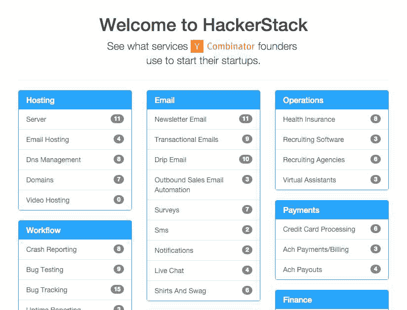
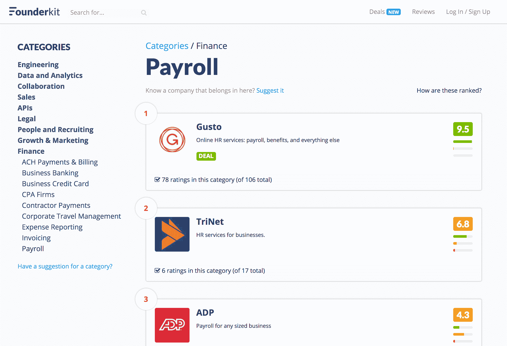
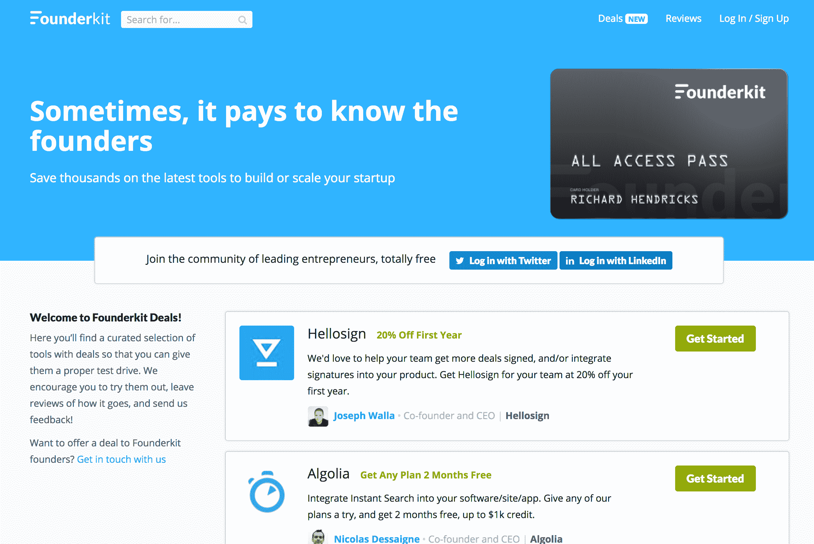

# 将我们的原型转化为产品，并增长到每月 5000 美元

> 原文：<https://www.indiehackers.com/interview/turned-our-prototype-into-a-product-and-growing-to-5k-mo-b8955dc2a0>

## 你好！你的背景是什么，你在做什么？

嗨，我们是瑞安·米克尔和伊恩·亨特，我们是 Founderkit 的创始人。此前，瑞安创办了 Yardsale，该公司还推出了 FOBO(本地 P2P 市场)，后者于 2011 年夏天成为 Y Combinator 的一部分。Ian 是另一个本地 P2P 市场 Zaarly 的首席技术官/联合创始人，我们直接相互竞争。

一个难得的机会发生在我们身上，我们都在寻找我们的下一个项目，所以我们在大约一年半前开始一起工作。我们的重点是(1)引导由咨询资助的多个产品，(2)快速验证或放弃想法，以及(3)加倍投资于获得社区兴趣的项目。

Founderkit 是一个由数千名 Y Combinator (YC)和风投支持的初创公司创始人组成的社区。它提供对创业工具的评论，并提供十几项值得关注的创业服务的交易和积分。自推出以来的两个月里，Founderkit 已经接触了超过 50，000 名创始人，由数千名 YC 和风险投资支持的企业家撰写了评论。该网站目前每月产生 5000 美元的经常性收入。

## 是什么促使你们开始使用 Founderkit？

[Founderkit](https://founderkit.com) 的灵感来源于初创公司创始人不断询问相同的问题——从哪家银行，到交易电子邮件 API，再到使用何种服务台服务。每个月都会涌现出如此多的新服务，很难及时了解什么最适合您的业务。太多的创始人陷入困境，或犯错误，花费数千美元或需要数月的工作来纠正。

即使在 YC，创始人也会互相问同样的问题，也会问校友同样的问题。这些回答往往非常周到，但需要时间来分析，有时还带有偏见。在讨论了这个问题之后，我们都意识到我们是多么喜欢为初创公司创始人社区建立一些东西的想法。

当时，我们仍然需要平衡咨询，因为我们都只有几个月的时间，但 Founderkit 符合我们的个人兴趣，感觉像是一个值得投资的项目。

## 构建最初的产品需要什么？

第一个版本的 [Founderkit](https://founderkit.com) 实际上只是一个电子表格，我们与 YC 的其他创始人分享。我们单独联系了我们的网络，得到了每个类别的服务列表，我们刚刚将它添加到主列表中。我记得我们瞥了一眼只有大约 10 个创始人贡献的电子表格，并立即找到了我们想要尝试的新工具，这将节省我们构建产品的时间。很明显，这些数据对其他创始人来说是无价的，我们有责任找到一种可扩展的方式来分享这些数据。

立即启动 fast 并验证您的用户获取策略。

TweetShare

在电子表格的结果看起来令人信服之后，我们决定花大约两周的时间构建该产品的第一个版本，我们称之为 Hackerstack。然后我们会与 YC 的朋友分享，看看他们是否觉得有用。如果 YC 的创始人认为这很有帮助，那么更广泛的初创企业创始人群体也很有可能会这样认为。

[

当 Founderkit 还是黑客 stack 的时候。](https://founderkit.com) 

Founderkit 两周的原型相当难看 Photoshop 中的一个临时标识，一个占位符。co 域，以及一个普通的 Rails/Bootstrap web 应用程序。该网站只接受邀请(我们会手动批准)，使创建评论变得容易，并显示每个类别中每个工具的协作评级。

我们还从原始电子表格中导入了所有数据，因此网站总是会有“啊哈，太棒了！”看到其他人对工具的评价和评论的时刻，即使是作为第一个用户。这很简单，但很有效。

除了服务器成本，我认为我们唯一的成本是 Urlbox 的成本。我们使用 Urlbox 抓取每个工具的网站截图，使评论和排名页面在视觉上更有趣。我们每月的开支总计约为 90 美元。

## 你是如何吸引用户并发展 Founderkit 的？

我们通过电子邮件列表与 YC 的创始人分享了 [Founderkit](https://founderkit.com) ，从而产生了第一批 100 名左右的成员。这个原型运行得非常好，以至于我真的收到了杰西卡·利文斯顿的一封电子邮件，询问我们是否在从 YC 电子邮件列表档案中搜集评论(我们没有)。

[

Founderkit 上的“工资单”类别页面。](https://founderkit.com) 

当时我们刚刚开始咨询，所以我们有时间构思功能，但几乎没有时间实现它们。但是这个网站一直在增长。创始人会告诉我们，这是他们在选择新工具之前首先考虑的地方，他们不断要求新的类别。当我们不再关注它时，你可能会认为它会消亡，但大约在六个月后我们完成咨询时，它已经被 YC 几乎所有活跃的创始人所使用。是时候向更多的创始人网络开放了。

刚刚起步，少担心五年甚至两年的愿景。运东西，继续运。

TweetShare

接下来，我们联系了其他领先的创始人团队，如 Slow Ventures(通过脸书)、First Round、Social Capital(通过 Slack)、True Ventures、TechStars、Resolute.vc。一些投资者没有创始人电子邮件/脸书团队或 Slack，但我们一直在努力。我们设置了 Founderkit，这样当你是像 First Round 这样的组的一部分时，你可以看到该组范围内的推荐和评级。在像 YC 这样的具有批处理的组中，成员还可以看到彼此的批处理(如“2011 年夏季”批处理)。我们确保成为这些团体的一部分提供了一个特殊的、有价值的经历。那时，我们有大约 1000 名非常有经验的创始人，你可以把你的创业押在评论上。

最后，我们在产品搜索上推出了 Founderkit。结合黑客新闻，它导致了超过 50，000 名创始人访问该网站，从那以后，它的增长显著。

## 你的商业模式是什么，你是如何增加收入的？

在产品搜索和黑客新闻上发布后(在此期间，我们以某种方式保持了网站的正常运行)，Gusto、Hellosign 和其他公司的创始人都伸出手来表示祝贺，并说他们都在他们的办公室里传递 Founderkit。当我们问他们是否有任何流量时(通过每个公司页面上几乎不可见的链接)，他们让我们去找他们的营销人员，要求挖掘他们的分析。不到一个小时后，一位营销主管打电话给我说“我们推荐了他们见过的最好的流量”，并问他们是否可以付钱让我们推荐更多的流量。

我们都同意，我们永远不会在网站上篡改评分或排名。永远不会。因此，为了鼓励创始人尝试他们的服务，我们建议他们给创始人一些东西，就像公司给 YC 的创始人巨大的信贷和折扣一样。于是[基金公司](https://founderkit.com/deals)诞生了。

Founderkit Deals 是一个针对初创公司创始人的领先工具的信用、折扣和扩展试用列表。这是公司的付费功能，因为它的目的是鼓励创始人尝试他们的服务，与评级和排名分开，我们支付固定费用，不管创始人是否签约和/或支付服务费用。我们目前在 Founderkit 上有十几个交易，还会有更多的交易。

## 你未来的目标是什么，你打算如何实现它们？

我们对 [Founderkit](https://founderkit.com) 的目标是建立一个地方，让创始人可以互相帮助，成功地启动和扩大他们的创业公司。我们已经计划了很多，并将很快推出该网站的 v2 版本，这将揭示该网站的更多最终愿景。

## 到目前为止有哪些挑战？有什么帮助吗？

事实上，有很多次我们差点杀了 Founderkit。但是创始人不断回来。当它只是 YC 境内的一个小网站时，我们会看到每月有 20%的用户回访，这比我们预期的要高。作为一个评论网站，我们希望创始人每 6 个月使用我们一次。然而，创始人依赖它来做决定，并回来留下关于导致他们改变工具的事情的评论。我们网站的最初目标是创建一个没有废话的地方，在那里创始人可以找到他们需要的推荐，然后回去工作，我们成功了，所以我们继续前进。

虽然我们经常纠结于开始的方向，但正是开始本身让我们能够学习。这当然有助于我们之前都建立了市场，并且知道解决先有鸡还是先有蛋的问题的来龙去脉。多年来，我们在创业社区与数百位创始人朋友建立了友谊，因此我们能够开发一款产品，为我们所在的社区服务。

## 对刚刚起步的有志独立黑客有什么建议吗？

两件事——第一件是马上开始，少担心五年甚至两年的愿景。运东西，继续运。让引擎运转起来，增加收入，因为您总是可以优化和增长。令人惊讶的是，第一次条纹充电可以激励！

创始人经常会被一些只会影响未来的“如果”的事情所阻碍或分心。大多数时候，即使只有 10 个用户，你在第一个版本或迭代中所学到的东西也远不止是坐在那里猜测。

其次，启动 fast 并立即验证您的用户获取策略。我们经常走大量的捷径，比如将产品简化为手动电子邮件和谷歌电子表格或表格，就像我们对第一版 [Founderkit](https://founderkit.com) 所做的那样，或者直接跳到运行脸书广告来开始，即使我们正在并行构建产品。这常常迫使你爱上数据和结果，而不是那些耗费时间的特性和其他方面。

## 我们可以去哪里了解更多？

来加入我们在 Founderkit.com[的活动吧。我们很喜欢你的反馈(你不能伤害我们的感情)，如果我们能为你的创业提供任何帮助，请在你加入时给我们回复欢迎电子邮件。](https://founderkit.com)

——[<picture id="ember5249723" class="user-avatar ember-view user-link__avatar"></picture>ryanm](/ryanm?id=TijqavfIKyMtvXfgaCIOp0ORPHw1)《founder kit》的创作者

## 想像 Founderkit 一样建立自己的事业？

你应该加入[独立黑客社区](/)！🤗

我们是几千名创始人，互相帮助建立有利可图的业务和副业。来分享你正在做的事情，并从你的同事那里获得反馈。

还没准备好开始使用你的产品吗？没问题。这个社区是一个认识人、学习和实践的好地方。随便去[随便浏览](/)！

——[<picture id="ember5249728" class="user-avatar ember-view user-link__avatar"></picture>考特兰艾伦](/csallen?id=ibTLPyjwVebnZjMGKvz6ztarnuV2)，独立黑客创始人

7votes