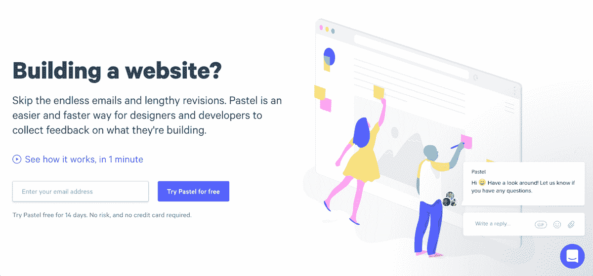
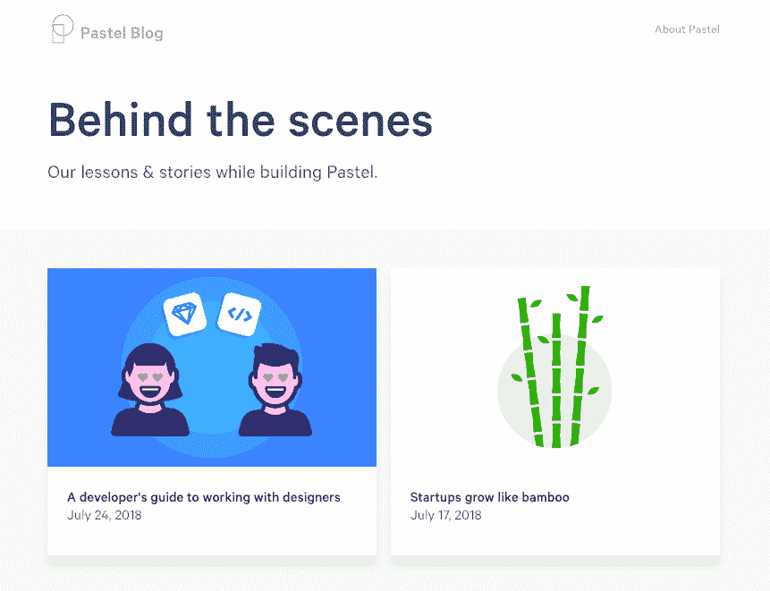
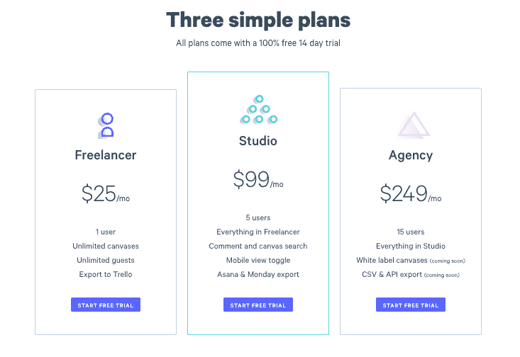

# 将令人沮丧的上市变成有利可图的增长故事

> 原文：<https://www.indiehackers.com/interview/turning-a-discouraging-launch-into-a-profitable-growth-story-dfc3de1a48>

## 你好！你的背景是什么，你在做什么？

你好！我的名字是瓦伦丁·斯泰科夫，和哈尼夫·加尼姆、T2、阿洛克·皮莱一起，我已经做了一年多的 T4 粉彩。

在进入创业公司之前，我去了多伦多大学攻读商业，并在企业界工作了一段时间。我很快意识到这不适合我，并决定尝试创办自己的公司。我现在已经在软件创业领域工作了四年，在创办 Pastel 之前，我曾与 Haneef 合作过一家房地产营销软件创业公司。在意识到我们建立的产品太小众而无法规模化之前，我们每月的经常性收入(MRR)达到了 1200 美元。我们没有转向一个我们刚刚开始了解的行业的不同方向(我们最初是如何进入房地产的，这是一个很长的故事)，而是决定做一些完全不同的东西，最终变成了彩色的。

Pastel 是人们建立网站的反馈和交流工具。它允许设计师、开发人员和产品经理通过直接在他们正在构建的网站上留下评论来收集客户和团队的反馈，而不必安装任何东西或注册。

 

Pastel 现在在 MRR 拥有 50 名付费用户和 1400 美元。

## 是什么促使你开始使用粉彩？

Pastel 最初并不是作为人们建立网站的反馈工具。最早的版本是浏览器扩展，允许开发者在他们的本地环境中共享网站。我的联合创始人哈尼夫(Haneef)早在为 [Wattpad](https://www.wattpad.com/) 的平台团队工作的时候就想做一个类似的东西。在我们决定离开之前的创业公司后，Haneef 在两周内完成了扩展，我们尽了最大努力让它发布。

我们很快了解到，分享你的本地主机并不是很多人愿意花钱去做的事情。要么他们已经有了某种解决方案，要么正在使用开源替代方案。我们知道那里有一些东西，所以我们试图找出问题的“为什么”——为什么我们首先想要能够共享一个本地主机。当然，这是为了获得关于我们正在构建的东西的反馈。但是我们意识到，重要的是具体的反馈，而不是它是在本地环境、试运行还是生产服务器上。

如果你有一个想法，就开始为之努力。但是要聪明。对于绝大多数想法，有一种方法可以用最少的资源和时间来测试它们。

TweetShare

一旦我们理解了这一点，我们决定在编写更多代码之前，对产品和我们的方法更加明智，并在两个多月的时间里与不同公司的大约 40-50 名开发人员、设计师和产品经理进行了交谈。我们发现他们在获得反馈方面都有问题，大多数人都在使用截屏、电子邮件、Slack 和 Google Drive 的组合来迭代动态网站。

所以我们开始制作最终会变成彩色的东西。最早的版本是面向开发者的；从语言到设计的一切都是针对写代码的人。此后不久，在经历了大量的实验和几乎同样多的失败后，我们遇到了一个怪人。他也在研究同样的问题，但是是从设计师的角度。作为一个有着丰富经验的产品设计师，他对问题有着深刻的理解和我们从未想过的洞察力。

我们很快决定汇集我们所有的知识，形成了粉彩。几个月后，经过彻底的重新设计和重建，我们有了当前产品的最早版本。很快，注册用户和(更重要的是)付费用户开始进来，从那以后我们一直在努力。

## 构建最初的产品需要什么？

我们希望粉彩的第一个版本有两个主要的东西:

*   能够点击页面上的任何地方，并像便利贴一样留下评论
*   无需安装任何东西，就可以对任何可通过互联网访问的网站做到这一点

每一个都花了大约两个月的时间来获得 MVP，所以在大约四个月的时间里，我们有了 Pastel 的第一个版本。第二部分比较棘手，因为我们必须构建一个相当复杂的定制代理解决方案，允许我们在任何网站上添加评论工具，只需在仪表板上粘贴一个链接。在早期，人们尝试的很多网站都不能正常运行。经过大约一年的错误修复，我们现在很少遇到不适合 Pastel 的网站。

因为我们有意保持设计的干净和简单，事实上我们一开始没有很多功能并不是问题。在发布第一个版本时，我们跳过了很多东西。在某一点上，我们向一些注册的人提供了折扣代码，但是我们没有我们的计费系统。一旦我们到了人们想付钱给我们的地步，就疯狂地去把事情做好。一个月前，我们刚刚增加了通过用户界面更改您的电子邮件或个人资料图像的功能，这距离该产品上线已经快一年了。在此之前，我们在数据库中手动处理所有请求。

就资金而言，Pastel 完全靠自己，我们一直在做咨询和兼职工作来支付账单。

## 你是如何吸引用户并发展粉彩的？

Pastel 于 2017 年 7 月中旬上线，一两周之后有人在 Designer News 上发布了关于我们的消息。接受情况不太好。许多人表示担心我们的价格(每月 25 美元)太高，并说他们不认为我们的产品有价值。我们也有一些关于团队计划定价的信息问题，这造成了一些混乱。虽然有一些支持的声音，但总的来说，评论中的语气非常消极。

你需要尽可能早地要钱——这是验证你所建造的东西是否有价值的最好方法。

TweetShare

虽然我们最初对负面评论感到沮丧，但我们开始看到设计师新闻上的帖子有很多注册。很快，我们有了第一个付费客户。那个月我们有四个人付钱给我们，到了第二个月，我们找到了第一批 10 个付费客户(其中 9 个至今仍在付钱给我们)。

从那以后，我们还推出了产品搜索，出现在一些登录页面的灵感画廊中，并出现在 Reddit 上的 r/entrepreneur 和 r/startups 的首页，这些都带来了一些流量，但没有什么突出的。

| 月 | 客户 |
| --- | --- |
| 2017 年 8 月 | 38121 |
| 2017 年 9 月 | 31136 |
| 2017 年 10 月 | 35389 |
| 2017 年 11 月 | 27832 |
| 2017 年 12 月 | 35470 |
| 2018 年 1 月 | 38097 |
| 2018 年 2 月 | 39668 |
| 2018 年 3 月 | 50933 |
| 2018 年 4 月 | 41568 |
| 2018 年 5 月 | 59556 |
| 2018 年 6 月 | 68227 |

我们发现的唯一推动持续流量的方法是发布常规内容，这是最近才出现的。除此之外，我们的每月访问量保持相对稳定，自今年 5 月我们开始更定期地发布内容以来，访问量有所上升。我们知道我们想做内容已经有一段时间了，我们花了一段时间才真正进入其中。如果你想做内容，但还没有扣动扳机，现在就开始吧。如果你很难思考该写些什么，我们使用的策略是把我们自己的知识收获和失败变成博客文章。每当我们学到一些东西或以某种方式搞砸了，我们就把它写在一篇博客文章的草稿中，然后回头再来讨论它，如果我们认为它足够好或提出来供以后考虑，就展开这个主题。

 

一路上我们尝试了很多不同的东西，其中很多都没有像我们希望的那样成功。我的联合创始人写了一篇关于所有不同经历和挫折以及我们所学到的东西的博客。使用聊天工具与我们的客户交谈，这在早期产生了很大的影响，现在仍在继续帮助我们。对于我们的大多数付费用户来说，我们在聊天工具([对讲机](https://www.intercom.com/))上有一些初始互动。无论他们问了一个问题还是报告了一个错误，当我们回复他们并快速解决他们的问题时，他们更有可能转变。这似乎是显而易见的，但如果我们没有安装聊天工具，这些客户中的一些可能永远不会接触并最终转化。

## 你的商业模式是什么，你是如何增加收入的？

我们是一家 SaaS 企业，按月收费。Pastel 的第一个版本一上线我们就开始收费了。我们从以前的经历中了解到，我们需要尽早要钱——这确实是验证你所建造的东西是否有价值的最佳方式。我们的计划附带 14 天免费试用，我们没有免费等级。我们已经考虑了这个想法，我们很可能最终会添加一个，但我们现在坚持试用。

 

直到两个月前，我们只有一个计划——每月 25 美元的个人账户。我们有很多团队使用 Pastel，我们知道我们需要一个团队账户。我们需要一些基础设施和额外的功能，所以我们最终优先改进核心产品，而不是增加团队功能。当我们最终在 5 月份增加团队时，我们看到了比前几个月更快的增长。在我们的个人计划中，我们需要四个客户才能获得与一个团队客户相同的收入，所以这很有意义。

| 月 | 收入 |
| --- | --- |
| 2017 年 8 月 | 92 |
| 2017 年 9 月 | 229 |
| 2017 年 10 月 | 309 |
| 2017 年 11 月 | 345 |
| 2017 年 12 月 | 487 |
| 2018 年 1 月 | 674 |
| 2018 年 2 月 | 681 |
| 2018 年 3 月 | 714 |
| 2018 年 4 月 | 806 |
| 2018 年 5 月 | 935 |
| 2018 年 6 月 | 1296 |
| 2018 年 7 月 | 1493 |

作为纯软件企业，我们的费用相当低。我们每月花费 100 美元在主机上，另外每月花费 200-300 美元在帮助我们节省时间的工具上，比如 Intercom、Mailchimp 和 Polymail。

## 你未来的目标是什么？

从长远来看，我们希望任何建立网站的人都能使用 Pastel 与他们的团队和利益相关者进行交流。

在不久的将来，我们希望为 Pastel 添加更多的团队和协作功能。比如在评论中给人加标签，更好的通知，以及与项目管理工具更深入的集成。我们还计划增加提供更多视觉反馈的能力，而不仅仅是基于文本的评论。在业务方面，我们的目标是 12 个月后在 MRR 达到 20，000 美元。

与其他在这条道路上走得更远的创业者交谈真的很有帮助。

TweetShare

现在对我们来说最大的障碍是不能全职从事粉彩工作。由于我们还没有足够的收入来支付自己，我们不得不接受自由职业者的工作，以资助 Pastel 和支付账单。这分散了我们对产品和业务发展的注意力，但是我们在计划和管理时间方面做得越来越好，能够做到这两点。

## 你面临的最大挑战和克服的障碍是什么？如果你必须重新开始，你会做什么不同的事？

我们有一些非常复杂的代理技术为 Pastel 提供动力，让我们尽可能流畅地体验。代理技术花了很长时间才达到今天的水平。在早期，我们会定期收到一些不正常的报告。我们在它们弹出时就修复了它们，但是有些修复比其他的花费了更多的时间。好的一面是，一旦我们为一个网站修复了它，它就为所有其他使用相同设置的网站修复了。现在，我们每个月都很少会收到超过 2-3 个关于某些事情不正常的报告。无论何时我们得到它们，我们通常在同一天修理它们。

如果你想做内容，但还没有扣动扳机，现在就开始吧。

TweetShare

在构建代理方面，我们没有太多不同的做法，这是必须要做的。但有一件事我们可以做得更好，那就是尽早在一个细分市场中磨砺。Pastel 可以被任何人用来建立一个网站，但这是一个相当大的池。在开发产品的过程中，我们花了大量时间试图与任何人会面并向其销售产品，从试图获得第一个客户的个体自由职业者到加拿大一些最大的银行和电信公司。一旦我们缩小了范围，意识到 Pastel 对于为客户建立网站的团队来说是最有用的，我们就轻松多了。

## 有没有发现什么特别有帮助或者有优势的？

与其他在这条道路上走得更远的创业者交谈真的很有帮助。了解他们是如何做事的，他们犯了什么错误，什么对他们有效，帮助我们更明智地处理我们的问题。

对我们有所帮助的两本书是盖布瑞尔·温伯格和贾斯汀·马雷斯写的《Intercom 关于营销的书》和《T2 牵引》。团队中的每个人都是产品人，我们的目标是在营销上像在产品上一样有条不紊。这两本书都极大地帮助了我们构建自己的思维。

## 对于刚刚起步的独立黑客，你有什么建议？

如果你有一个想法，就开始为之努力。但是要聪明。

你不必辞掉工作，全职工作，你可以兼职做很多事情来验证你的想法。与你的目标客户交谈，建立一个包含等候名单的登录页面，或者结合一系列现有工具，尝试手动交付价值。这并不适用于所有情况，但是对于绝大多数想法来说，有一种方法可以用最少的资源和时间来测试它们。

与此同时，知道什么时候应该全力以赴，全心投入一个想法是很困难的。我第一次开公司肯定没做对。我们决定为一个我们知之甚少并且犯了很多错误的市场开发一款产品。我学到了很多，但如果我能再来一次，我肯定会用不同的方式做事。

## 我们可以去哪里了解更多？

了解我们正在做的事情的最好地方是在 usepastel.com。你也可以在推特上关注 [@usepastel](https://twitter.com/usepastel) 或者在 [【邮件保护】](/cdn-cgi/l/email-protection#84f2e5e8e1eaf0edeac4f1f7e1f4e5f7f0e1e8aae7ebe9bbd7f1e6eee1e7f0b9cdeae0ede1a1b6b4cce5e7efe1f6f7a1b6b4edeaf0e1f6f2ede1f3) 给我发邮件。

你也可以在 blog.usepastel.com[的博客上了解更多关于我们的旅程和我们学到的东西。](https://blog.usepastel.com/)

欢迎在下面的评论中提问，我很乐意继续对话:)

——[<picture id="ember8080348" class="user-avatar ember-view user-link__avatar"></picture>瓦伦丁·斯塔科夫](/valentin?id=opT3bntaKAhhNccWRrYZgm8S4Sr2)，粉彩的共同创始人

## 想像粉彩一样建立自己的事业？

你应该加入[独立黑客社区](/)！🤗

我们是几千名创始人，互相帮助建立有利可图的业务和副业。来分享你正在做的事情，并从你的同事那里获得反馈。

还没准备好开始使用你的产品吗？没问题。这个社区是一个认识人、学习和实践的好地方。随意[随便浏览](/)！

—[<picture id="ember8080353" class="user-avatar ember-view user-link__avatar"></picture>考特兰艾伦](/csallen?id=ibTLPyjwVebnZjMGKvz6ztarnuV2)，独立黑客创始人

27votes