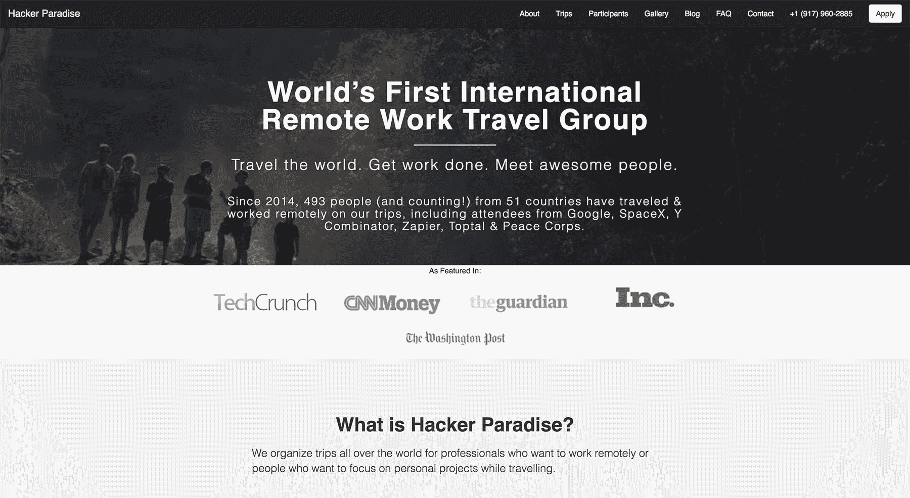
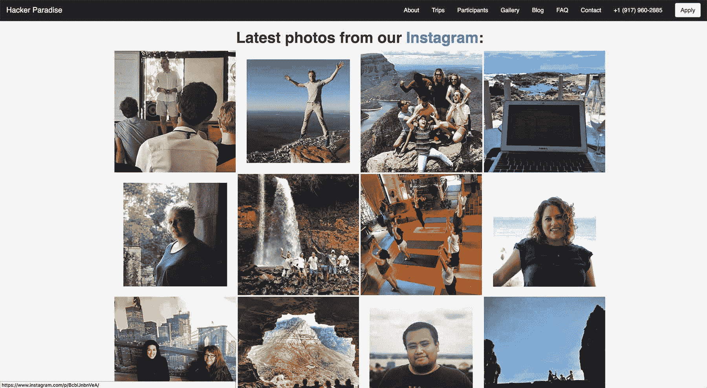
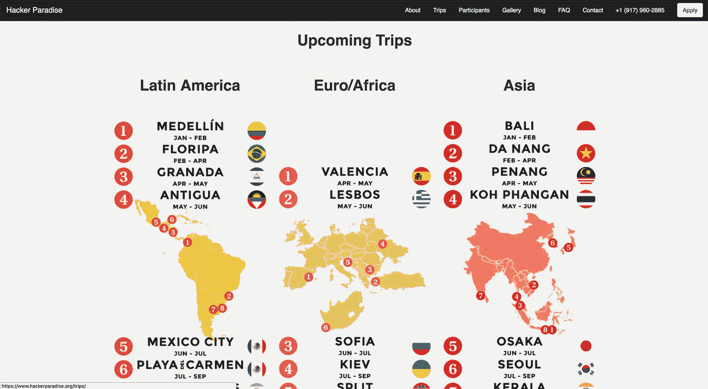

# 将编程务虚会变成每月 35，000 美元的业务

> 原文：<https://www.indiehackers.com/interview/turning-a-programming-retreat-into-a-35-000-mo-business-0d621fde9b>

## 你的背景是什么，你在做什么？

我叫凯西·罗森格伦，过去三年我一直在经营[黑客天堂](https://www.hackerparadise.org/)。我们为那些想在旅途中远程工作的有创造力的人组织世界各地的旅行。

我们在 2014 年秋季开始了一个兼职项目，从那时起，400 多人加入了我们的社区，包括 Y Combinator、谷歌和和平队校友。你可以在这里查看其中的一些。

人们加入我们的旅行，这样他们就可以去美丽的地方，并且仍然可以进入一个繁荣的技术社区。我们处理后勤(住房和工作场所)和管理社区(面试申请人、组织社交活动、聚会、黑客马拉松等)。).

我们是完全自助的，目前每年有 150-200 人加入我们的旅行。

在黑客天堂之前，我是一名学生和自由网页开发者。我在大学期间也创办了一些公司。

 

## 是什么激励你开始做黑客天堂？

大学期间，我休学一年，和一个朋友一起创业做电子商务。我们犯了很多第一次创业的经典错误，一年后我们决定关闭公司。我回到学校，完成了学位，开始在不同的创业公司面试工作。

整个经历让我对技术感到非常厌倦。当我在创业公司工作时，我已经失去了创造事物的内在乐趣，我一直专注于工作，以至于忽略了个人健康。

我觉得回到创业世界只会延续这一趋势，在花了一些时间反思后，我意识到我真正想做的是长期旅行，并从事一些只是为了娱乐的兼职项目。

所以我就这么做了。我接了一些自由职业者的网站开发工作，并给中美洲的一些酒店发了电子邮件，看看他们是否会给我提供食宿，以换取网站和营销方面的帮助。我收到了哥斯达黎加一家酒店的回复，我开始与他们合作，在这个国家的淡季推广瑜伽静修。

我不可能仅仅坐在家里头脑风暴创业想法就创建了黑客天堂。

TweetShare

然而，就在我们开始这个项目后，有人偷了他们瑜伽教练的笔记本电脑，她决定离开哥斯达黎加回到她的祖国英格兰。突然之间，我没有更多的工作要做，看起来我不得不缩短在那里的逗留时间。

我仍然想在哥斯达黎加呆着，所以我说服酒店老板带一群开发人员到他的酒店进行“编程静修”。在淡季，酒店的入住率很低，我们的想法是，我们可以让他的酒店住上几个月，否则酒店就会空无一人。我们匆匆做了一个登陆页面，开始注册。大约在这个时候，我的联合创始人阿列克谢加入了进来。

事实证明，人们对我们正在做的事情很感兴趣——我们第一次旅行就来了 30 个人，于是[黑客天堂](https://www.hackerparadise.org/)诞生了！人们玩得非常开心，所以我们决定继续做下去，并把它变成一项可持续的业务。我们还决定向设计师、企业家和其他非技术创新类型开放社区。

一开始，这真的是一种让我们自己挠痒痒的方式。我们很高兴能去这些美丽的地方旅行，黑客天堂提供了刺激和机会，因为周围都是非常聪明和有创造力的人。这就像我们走到哪里都有一个弹出式技术社区。

让我震惊的是，整个公司都是由意外收获发展而来的。如果那位瑜伽教练的笔记本电脑没有被偷，你今天可能会采访我一些利基瑜伽静修业务，而不是黑客天堂。

## 构建最初的产品需要什么？

因为我们已经有了一家酒店，所以构建最初的“产品”非常简单

我用来自 [BlackTie](http://blacktie.co/) 的免费引导模板制作了一个简单的登陆页面(强烈推荐)。我们通过谷歌表单接受申请，并使用 [YouCanBookMe](https://youcanbook.me/) 来安排面试。我认为从有想法到建立网站并开始在网上分享花了我们一周的时间。

我们最初的许多申请者来自 Meetup 和其他在线技术社区。当时，外面真的没有像我们这样的人，所以当我们伸出手时，人们都很容易接受。

我认为这也有助于在开始时，我们只是一个附带项目。我们以成本价提供旅行服务(人们直接支付酒店费用)，所以当我们接触一个聚会时，推销真的是非正式的。就像是，“我们在哥斯达黎加做一件很酷的事情，却没有赚到任何钱，我们在寻找其他优秀的技术人员一起出去玩。想加入吗？”

后来，它变成了一项业务，但第一次旅行更多的是一个基层社区的倡议。

 

## 你们是如何吸引用户，壮大黑客天堂的？

聚会对于传播我们第一次旅行的消息非常有用。我们在世界各大城市的技术相关团体的邮件列表和讨论板上发帖。我们的个人网络，以及在黑客新闻上的一些小小的成功填满了我们的第一次旅行。

在我们的第二次旅行中，我们联系了记者，就在那时我们被《卫报》报道了。最终，TechCrunch、CNN 和《华盛顿邮报》也对我们进行了报道。后来的新闻报道实际上来自于与我们的竞争对手的友好关系，他们更积极地进行营销，当记者想与该领域的其他人交谈时，他们会推荐我们。

然而，我们增长的主要焦点是提供令人敬畏的体验。因此，人们经常会延长在我们酒店的停留时间，在未来的旅行中回来，并推荐他们的朋友。我们通过反馈严格跟踪我们的表现，特别是查看净推介值(NPS)。

虽然这有点老生常谈，但在我们业务的最初几年，我们确实遵循着这条格言:“营销是你为拥有一个不起眼的产品或服务所付出的代价。”现在，几年过去了，这个领域开始成熟，我们开始在增长和营销方面投入更多有意识的努力。

## 你的商业模式是什么，你是如何增加收入的？

我们的商业模式非常简单:人们付给我们一个价格来组织住房、公共工作空间和现场活动。

例如，我们有每周一次的聚餐，以及定期安排的讲座、演示日、黑客马拉松和与当地技术界的聚会。过去，这些演讲者包括 Taavi Kotka(爱沙尼亚首席信息官)、Patrick McKenzie (Kalzumeus 和 Stripe)和 Matz(Ruby 编程语言的创始人)。这些是你独自旅行时无法获得的体验，也是人们选择加入我们团队的原因之一。

就收入而言，提高价格是我们在最初 1-2 年增长的主要方式，也是我们为了让黑客天堂可持续发展而不得不做的最困难的事情之一。

我们早期的旅行几乎没有足够的利润来支付我们的旅行费用，Alexey 和我都有其他的项目，这些项目是我们的主要收入来源。我们最终意识到，为了黑客天堂的生存，我们需要将价格提高到一个我们可以支付给自己和团队一份公平的薪水来全职工作的水平。

随着我们将价格提高到一个更可持续的水平，我们保持了一个特殊的校友率，并试图找到吸引我们最初客户的方法，但我们仍然最终失去了我们社区的一些早期成员。对我来说，这就像在肚子上打了一拳，因为在一起旅行了几个月后，我认为这些人是亲密的朋友。

即便如此，这在当时也是维持黑客天堂生存所必需的。如今，我们的价格已经稳定在每月 2000 美元左右，我们开始通过扩大团队和平行旅行来进一步发展。

## 你未来的目标是什么？

我们未来有三个目标:

1.  扩大我们的社区。
2.  继续为希望边工作边旅行的技术人员提供最高品质的体验。
3.  开发我们可以提供给校友的新体验。

我们现在在不同的地方运行多个并发的旅行——南非和泰国/柬埔寨，我们正在尝试一些短期的、体验性很强的旅行(比如在法国南部租一个城堡住一周)。

 

从长远来看，我们希望继续发展这个社区，这样无论你去世界的哪个地方，你都可以参加一次有组织的旅行，或者认识来自校友网络的人。我们已经有来自 30 多个国家的校友，我们一直在努力寻找更多的方式让人们在旅行后保持联系。

就我个人而言，我也试图花更多的时间再次探索副业。在过去的三年里，我一直担任着一个非常繁重的角色，现在我正试图每周抽出一些时间来编写和编程。

## 你面临的最大挑战和克服的障碍是什么？

我们面临的最大挑战之一是管理我们自己的带宽。

在最初的 18 个月里，我和我的联合创始人将[黑客天堂](https://www.hackerparadise.org/)打造成了一家企业，同时还经营旅行和管理社区。我们曾经开玩笑说，这就像优步的创始人亲自驾驶所有的汽车，同时还试图筹集资金和发展公司。

一开始，我认为这是有帮助的，因为它允许我们在启动时节省现金。然而，有一个临界点，雇佣别人来帮忙比自己尝试做所有事情更好，我们可能会更快做出这种转变。

这就好像优步的创始人一直在亲自驾驶所有的汽车，同时还试图筹集资金和发展公司。

TweetShare

我们还在早期处理了一些关于支付和财务的后勤问题。

由于我们在一个相对较新的账户上收到了大量来自国外的付款，PayPal 在几个月后冻结了我们大约 2 万美元的资金，我在这里写了关于[的文章](https://medium.com/@casey_rosengren/paypal-froze-our-funds-then-offered-us-a-business-loan-49a078310fb)。硅谷银行也关闭了我们的账户，告诉我们他们不希望我们成为客户，因为我们有太多的国际交易。最终，我们得到了[条纹](https://stripe.com/)和花旗银行，事情进展得相对顺利。

## 有没有发现什么特别有帮助或者有优势的？

有一个问题，在我的旅程中我思考了很多，我发现它非常有用，它被称为彩票练习。内容如下:

想象你中了彩票，金钱不再是主要的动力。你的家人现在得到了照顾，你也因为拥有中奖彩票而赢得了一定的名声。你下一步会做什么？”

思考这个问题是什么导致我离开传统的创业世界，开始旅行。我当时的回答是，“我想花 1-2 年的时间环游世界，然后在某个地方安顿下来，创办一家我觉得有意义的公司。”幸运的是，这也是我最终做的事情。

我试图每年至少回来一次，以确保我仍然与我的项目保持一致。此外，这个练习来自沃顿商学院教授理查德·谢尔(Richard Shell)所著的《跳板》(T0)一书，我强烈推荐这本书的全部内容给任何正在经历转型或考虑创业的人。

我也是《T2:快速失败，经常失败》这本书的忠实读者，这本书是两位斯坦福附属心理学家写的关于采取行动和对失败的恐惧的论文。这本书棒极了，它帮助我重新定义了当我刚刚起步时，我是如何看待失败、成功、“错误”和传统职业道路的。

它也特别有助于处理“我这一生在做什么？”早期的焦虑，当时前方的道路还很不明朗，在[黑客天堂](https://www.hackerparadise.org/)成为既定事实之前。这是另一本书，每当我考虑一个重大的改变，发现自己由于害怕失败或害怕犯错而犹豫不决时，我每年都会回来看 1-2 次。

最后，冥想和写日记让我在两年的大部分时间里不停地旅行。我是乔恩·卡巴特·津恩和塔拉·布拉克的忠实粉丝，如果你对冥想感兴趣，强烈推荐你去看看他们的书和资源。

## 对于刚刚起步的独立黑客，你有什么建议？

我相信机会无处不在，而最好的机会通常是我们没有意识到的。

当我开始从事自由职业和旅行时，我不知道我会进入什么样的领域，我也不可能仅仅坐在家里头脑风暴创业想法就创造出[黑客天堂](https://www.hackerparadise.org/)。事情走到一起，是因为我积极地与世界互动，尝试新事物，也因为我时刻关注着机会。

我真正想做的是旅行一段时间，并做一些有趣的兼职项目。

TweetShare

我建议你开始采取行动，批判性地思考你的经历，对这个世界充满好奇，敞开心扉迎接意外之喜，而不是试图通过思考进入一家企业。

找到这些道路需要信念的飞跃，通常没有明确的目的地，但我认为它们是最有回报的，无论是个人还是经济上。

## 我们可以去哪里了解更多？

你可以在 www.hackerparadise.org 找到更多关于黑客天堂的信息。

你也可以在 Twitter [这里](https://twitter.com/caseyrosengren)和 Medium [这里](https://medium.com/@casey_rosengren)关注我。

欢迎在下面提出关于建设黑客天堂、数字游牧生活方式、辅助项目或任何你感兴趣的问题！我也喜欢谈论创始人的健康、福利和自我保健:)

—[<picture id="ember8160098" class="user-avatar ember-view user-link__avatar"></picture>凯西·罗森格伦](/casey?id=evvcz008RHehanOOYlzB6xL2MtE3)【黑客天堂】联合创始人

## 想像黑客天堂一样建立自己的事业？

你应该加入[独立黑客社区](/)！🤗

我们是几千名创始人，互相帮助建立有利可图的业务和副业。来分享你正在做的事情，并从你的同事那里获得反馈。

还没准备好开始使用你的产品吗？没问题。这个社区是一个认识人、学习和实践的好地方。随意[随便浏览](/)！

—[<picture id="ember8160103" class="user-avatar ember-view user-link__avatar"></picture>考特兰艾伦](/csallen?id=ibTLPyjwVebnZjMGKvz6ztarnuV2)，独立黑客创始人

14votes