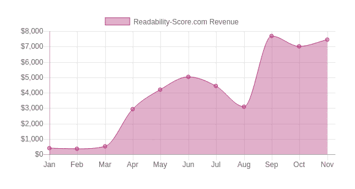

# 将对财务独立的追求转变为 5000 美元/月的网站

> 原文：<https://www.indiehackers.com/interview/turning-a-quest-for-financial-independence-into-a-5k-mo-site-ef487b3af7>

## 告诉我们关于你自己和你正在做的事情。

我是戴夫·蔡尔德，我做网站已经超过 20 年了。第一次浏览互联网时，我就被吸引住了——我认为它会改变世界，我知道我想以某种方式参与进来。不久，我建立了一些小的爱好网站，加入了 webrings，并且乐在其中。

没过多久，我就开始为朋友和家人建立网站，我一直在寻找新的技术和机会。在接下来的几年里，我有幸担任过开发人员、顾问、营销人员和经理等不同的角色。

2012 年年中，我决定做出改变。我被困在一个机构的老一套里，需要一个新的挑战。我一直都有副业，但我想让它们成为我工作的重点。因此，怀着即将到来的孩子，我辞掉了工作，和我极其耐心的妻子搬到了乡下，开始了我自己的小型网络代理公司。

这让我开始更多地关注自己的产品网站。有一个想法尤其不容忽视:Readability-Score.com 的。今天，我正在发展这个网站，增加新的工具和新的互动方式，并试图找到更多的方法来帮助人们使他们的副本更具可读性。

## 是什么让你选择可读性分数而不是其他想法？

当我开始创业时，我的投资组合中有几个产品网站，其中最大的是 [Cheatography](https://www.cheatography.com) ，一个备忘单生成器和存储库。我在银行里也有一点现金，并且为一群客户提供相当稳定的自由开发工作。

我知道我最终想转型做产品生意，但是没有任何一个特别的产品能吸引我。我一直有一点我称之为“闪亮的东西综合症”——我喜欢创造新的东西，但通常不会对在人们面前展示它的前景感到兴奋！

2004 年，我写了一小段代码来测量文本的可读性。当时这只是一个编码练习，但是我把它加到了我的网站上，继续愉快地发布小抄和写博客。几年后，我发现这个工具的流量越来越大，所以我把它移到了自己的领域。流量增加了，所以我增加了一个小的溢价产品，并把它作为一些定价实验的测试平台——比如[“支付你想要的价格](https://getpostcookie.com/blog/pay-what-you-want-pricing-experiments)，等等。

2015 年底，该网站给我带来了一点收入，但基于可观的流量。转换率大约是 0.04%，所以我决定是时候给这个项目应有的关注了。

我给一些现有客户发了电子邮件，了解他们喜欢什么以及如何使用这个网站，并与有 SaaS 经验的设计师和开发人员进行了交谈。我得到的反馈是，人们认为这是一个有用的网站，但其设计几乎是人们见过的最糟糕的东西，尤其是[笨重的高级注册](https://storage.googleapis.com/indie-hackers.appspot.com/content/readability-score__old-signup.png)。

所以，我得去工作了。我重建了整个网站，改进了底层软件，采购了一个新的 logo，整合了[一个新的设计](https://storage.googleapis.com/indie-hackers.appspot.com/content/readability-score__new-website.png)，添加了一些新工具，在 4 月份，我将它投入使用。

我没抱太大期望。我最初的目标是，到 2016 年底，该网站的收入达到每月 1000 美元，并成为为我赚取可观综合工资的几个网站之一。最终，我们的目标是——现在仍然是——财务和位置独立。我正在建立一个多元化的生活方式企业，这让我能够致力于让我兴奋的产品和挑战。

显然，该网站认为每月 1000 美元不是一个现实的目标。第一个月，新的[Readability-Score.com](https://readability-score.com)赚了 3000 美元，这就是我需要的所有的认可和鼓励，让我投入进去，给它一些真正的关注。

转换率现在接近 0.7%，所以还有很大的提升空间。

## 你是怎么找到时间和资金来做这些的？

这并不容易。我有客户工作，大约每周 30-40 个小时。在家里，我有一个三岁的孩子，他应该得到比他所得到的更多的时间。我有几个其他的网站需要一些关注。

哦，我们刚刚生了一对双胞胎女儿。

很多人告诉我，他们没有足够的时间来建立自己的网站或从事自己的项目。但我还没有遇到比 2016 年初更有理由推迟的人。但是我的新家庭对我来说也是巨大的激励因素。我每周工作 80 多个小时，有很多晚上 9 点到凌晨 2 点和周末会议。新生儿的一个优势是，无论如何你都是醒着的，所以你最好充分利用它。

客户工作足以支付账单，所以钱不是一个大问题。当然，我必须优先考虑客户的工作，这意味着我不能总是像我希望的那样快速工作，但我保持了势头，并在合理的时间框架内使网站上线。

对我来说一个很大的帮助是，我开始写我在 [Get Post Cookie](https://getpostcookie.com) 上经历的过程。整理[定期收入报告](https://getpostcookie.com/income-reports)让我变得更善于分析，也更专注。我会把它推荐给任何有闪光综合征的人。

## 你是如何吸引用户和发展业务的？

交通已经很好了，这更多的是因为运气而不是判断。该网站已经被研究人员和教师广泛使用，给了它许多可爱的。edu 链接，它的搜索排名非常好。它也经常在学术论文中被引用，这给了它一个我自己很难获得的可信度。

该网站的新版本引入了一些免费使用的限制，这导致了流量的下降，所以我现在的主要重点是通过内容营销来建立备份。在接下来的几个月里，我希望能有所增加，到今年年底，效果应该会非常明显。

我尝试了一些其他方法来吸引流量，最著名的是推荐方案和 Slack 应用程序。两者都处于起步阶段，所以现在很难说哪一个是成功的，但两者都很有趣，这对我来说是足够的理由。

我知道你们喜欢细节，所以这里有一张 2016 年用户数量、营销预算和收入的可爱图表:

| 月 | 客户 | 收入 | 营销 | 变化 |
| --- | --- | --- | --- | --- |
| 2016 年 1 月 | 1004 | $405 | $0 | - |
| 2016 年 2 月 | 1056 | $361 | $0 | -11% |
| 2016 年 2 月 | 1056 | $361 | $0 | -11% |
| 2016 年 3 月 | 1120 | $530 | $0 | +47% |
| 推出新网站 |
| 2016 年 4 月 | 1340 | $2923 | $0 | +452% |
| 2016 年 5 月 | 1560 | $4184 | $0 | +43% |
| 2016 年 6 月 | 1787 | $5019 | $0 | +20% |
| 2016 年 7 月 | 1925 | $4431 | $250 | -12% |
| 2016 年 8 月 | 2058 | $3100 | $250 | -30% |
| 2016 年 9 月 | 2411 | $7669 | $250 | +147% |
| 2016 年 10 月 | 2753 | $7023 | $500 | -8% |
| 2016 年 11 月 | 3076 | $7447 | $500 | +6% |

## 你的营收背后有什么故事？

该网站一开始完全免费用来测量粘贴文本和网址的可读性。2012 年，我添加了一些高级功能——可读性提醒和 PDF/Word 文档处理，以及“按需付费”模式(最低价格为每年 1 美元)——但核心功能仍然免费且无限制。不过，这真的很容易添加。Gumroad 有一个优秀的订阅系统，甚至可以设置“支付你想要的”价格作为订阅选项。

第三次付款是 100 美元。一个月后，我从该网站的长期固定用户那里收到了 600 多美元，他们只是想表达他们的感激之情。几乎没有人像当时那样使用高级功能。我措手不及。我以为可能会有几笔 5 美元的付款。我想，如果我幸运的话，这个新的高级模型可能会让我每个月买几瓶啤酒。

网站的流量持续增长，今年年初，我决定看看是否有更大的机会。我仍然没有(事实证明)把握住事情的潜在规模。重建网站时，我的目标是每月 1000 美元。现在，我的目标是到明年年底赚 10，000 美元 MRR。目前是 5000 美元多一点。支付通过 Stripe 进行管理，这是一个很好的合作方式。喜欢他们的 API 文档！

我一直在慢慢地添加功能，比如突出长句和难词。有大量的新功能需要添加。语法和拼写检查会很有用，漂亮的 PDF 可读性报告，Google Drive 和 Google Docs 集成等等。诀窍是不要偏离核心任务太远——让你的文本更容易阅读！

## 你未来的目标是什么？

或多或少与他们开始时一样——财务和位置独立。对我来说，这意味着我的网站每个月有大约 7000 美元的利润。

对于 Readability-Score.com 来说，我的目标是在 2017 年底达到 10，000 美元的 MRR。在那个阶段，我将要做出一些有趣的选择！

## 如果你必须重新开始，你会做什么不同的事？

最重要的是——我希望我在 2004 年就发现了这个机会，而不是等到十几年后才进一步开发它。我怀疑我在此期间所做的工作(以及我在其他项目中犯的错误)是这个网站现在成功的重要原因，但这并不意味着我不会回头看，想知道如果我早点开始这段旅程，我现在可能会在哪里。

作为一个单身创始人工作也很累人，而且在工作/生活平衡上没有太大的灵活性。我不知道这个项目会不会成为我的联合创始人，但如果有机会重新开始，我肯定会花更多时间与其他开发人员、营销人员、设计师等交谈，谁知道呢，我可能会在这个过程中遇到一两个项目的伟大联合创始人。

幸运的是，最后一点是我仍然可以改进的，所以我正在更加努力地去参加当地的开发者聚会，我已经加入了 bootstrapper 团体，并且我正在努力帮助其他人避免一些我在这个过程中发现的陷阱。

我还在六月份犯了一个大错误，我以一种相当微妙的方式破坏了这个网站——我不小心取消了免费使用的限制。仍然有一个弹出窗口说“请注册继续使用该网站”，但它仍然允许你使用它。这是一个无伤大雅的改变，但它破坏了网站的转化率。你可以在页面上看到对收入的影响。我现在对测试更加偏执了，这并不是什么坏事。我现在也更加尊重一个网站上哪怕是很小的改变所能产生的效果。

## 对你真正有帮助的是什么？

我做过的最好的两个决定是，开始为自己工作，并开始公开收入和进展。

第一个，为自己工作，帮助我重新发现了我对开发和网络的热情。它给了我在自己的项目上工作的灵活性和健康的动力——如果我不工作，账单就不会被支付！

到目前为止，透明度对我也有好处。它让我保持专注，并迫使我花时间更批判地评估我的努力。以前，我会高兴地去做我喜欢的事情。现在，我仍在做我喜欢的事情，但我更清楚地意识到我希望工作的结果是什么。我不太容易从我的核心产品上分心。(这并不是说我从不分心，但这种分心现在必须变得更加引人注目和有趣！)

我还发现其他人关于他们努力的文章真的很有帮助。阅读其他人已经尝试了什么，什么有效，什么无效，以及他们是如何解决他们的问题的——所有这些都是非常宝贵的。这也是我喜欢 IndieHackers.com 的原因之一。🙂

## 你会和有抱负的独立黑客分享什么建议？

没有比用自己项目赚来的钱买第一瓶啤酒更好的感觉了。赚到的第一笔 1000 美元。第一次从自己的产品里领工资。那些是美好的日子。但这需要时间，有些想法永远不会实现。有时候那是因为想法不够好。有时候是因为你不适合这个想法。

尽量不要太执着于一个想法。有时候，如果你正纠结于一个想法，做点别的事情可以让你精神焕发，为你提供看待事物的新方法。墨守成规肯定会让你一事无成。

还有，学会做你能做的最好的咖啡。你会挺过去的。

哦，不要在创业的时候生双胞胎。

## 我们在哪里可以更多地了解你？

我偶尔会在我的个人博客上写点东西，比如[、博客帖子](https://getpostcookie.com)(尽管目前大多只是收入报告)，我还会从 [@Dave_Child](https://twitter.com/Dave_Child) 发推文。如果你在下面留下评论，我会尽力回复你的！

我还有其他几个项目:

*   [备忘稿](http://www.cheatography.com) —备忘稿
*   在线小说写作软件的测试版
*   [填字游戏作弊](http://www.crosswordcheats.com)——更好地玩神秘的填字游戏
*   [Mathaversaries](http://www.mathaversaries.com) —值得庆祝的有趣里程碑
*   [@CrosswordBot](https://twitter.com/CrosswordBot) 和[@ TriviBot](https://twitter.com/TriviBot)——有趣的 twitter 机器人，提供纵横字谜线索和琐事问答

(而且以防你好奇，这个采访的可读性是 7.8。这是一个年级水平，意味着有人可能需要大约 8 年的教育来阅读它。对于面向公众的文本，你应该把分数定在 6-8 分左右。)

—[<picture id="ember8081189" class="user-avatar ember-view user-link__avatar"></picture>大卫子](/DaveChild?id=6TX9oIXSwAd4nEEDJ44XFiHxery1)，创作者可读

## 想像 Readable 一样建立自己的事业？

你应该加入独立黑客社区！🤗

我们是几千名创始人，互相帮助建立有利可图的业务和副业。来分享你正在做的事情，并从你的同事那里获得反馈。

还没准备好开始使用你的产品吗？没问题。这个社区是一个认识人、学习和实践的好地方。随意[随便浏览](/)！

——[<picture id="ember8081194" class="user-avatar ember-view user-link__avatar"></picture>柯特兰艾伦](/csallen?id=ibTLPyjwVebnZjMGKvz6ztarnuV2)，独立黑客创始人

8votes