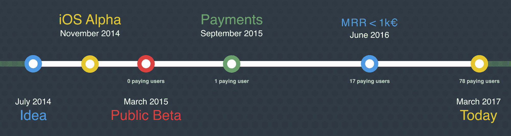

# 将公司内部工具转变为每月 6500 美元的副业

> 原文：<https://www.indiehackers.com/interview/turning-an-internal-company-tool-to-a-6-500-mo-side-business-edc9893da1>

## 你好！你的背景是什么，你在做什么？

你好，我是斯特凡·克朗普。我来自德国，虽然我曾在加利福尼亚、毛伊岛、苏格兰、巴塞罗那和迪拜生活过，但过去三年我一直住在一辆野营车里。

我做过汽车修理工、电气工程师、斯坦福自动驾驶汽车项目成员(2007 年)、iOS 和 Android 开发者(自学成才)等专业工作。但是现在我主要参与产品营销和移动爵士乐的商业策略。我们是一个 20 人的远程团队，主要为世界各地的各种跨行业客户提供软件开发服务，从小初创公司到大品牌，如空中客车、AVG、谷歌、惠普、Skyscanner 等等。

我和另外两位联合创始人一起工作:Jordi Giménez 和 Aleix Ventayol。乔迪和我一起开始了移动爵士乐。他曾为不同规模的公司做过 web 开发人员和安全审计员。阿列克斯后来加入了我们。他是一名经验丰富的 CTO、全栈工程师和企业家，拥有超过 15 年的经验。

对内，我们做了很多[开源产品](https://mobilejazz.com/products/opensource)，搭建内部工具，其中一部分变成了[实际产品](https://mobilejazz.com/products)。其中一款产品就是 [Bugfender](http://bugfender.com/) ，这也是我今天要说的。

[Bugfender](http://bugfender.com/) 是一个应用程序日志的远程记录器和云存储服务。目前我们的重点是移动应用，但我们很快就会发布 MacOS 和 web 开发的 SDK。

假设您的一个用户遇到了一个您无法在自己的设备上重现的问题(bug)。唯一的方法是亲自邀请用户到您的办公室，将他们的设备连接到您的开发机器上。这并不容易——尤其是当你在欧洲而用户在澳大利亚的时候。

Bugfender 让开发人员可以远程访问用户设备的日志功能。以下是该产品的一些关键数据:

*   我们目前的收入是 6，500 美元(MRR)，预计到今年年底(2017 年)将达到 11，000 到 14，000 美元。
*   用户 2616 人，其中 103 人为付费客户(转化率 3.9%)。
*   有 1250 万台设备安装了 Bugfender SDK。
*   该应用程序每天收集超过 6000 万条日志。
*   该应用程序每天检测和报告 2 万个问题。

[![[FIXME]](img/f37613833194e2fa4cd5baa19195bc92.png)](Bugfender) 

## 是什么促使你开始使用 Bugfender？

作为移动应用工程师，我们面临的问题是无法在我们自己的设备上重现特定的用户问题，无论是由于奇怪的屏幕尺寸、奇怪的操作系统版本还是特定的设置。因此，我们开发了一个真正的内部工具的准系统版本，用于远程访问日志，将其修补成一个特殊的版本，并开始将其发送给有问题的用户。

专注于一个你完全理解的问题。即使它是一个微小的利基。

TweetShare

我们发现这是一个反复出现的问题(这验证了这个想法本身)，并认为在我们所有的应用程序中默认内置这个工具会很棒。然而，发送如此多的日志，尤其是对于拥有数千甚至数百万用户的应用程序，会产生两个问题:

1.  我们每天必须传输和存储数百万个日志，从可伸缩性的角度来看，这既不便宜也不简单。
2.  如果这项服务总是在用户的设备上运行，一直发送每条日志，它将使用大量的数据，并可能使他们的电话账单相当昂贵。

为了解决这个问题，我们付出了很大的努力来扩大规模，同时减少我们的流量和数据存储费用。(今天我们仍在重建和优化。)对于我们的应用程序端 SDK，我们投入了大量的工程思想来实现一个电池友好的过程，以便在本地存储日志，并仅在需要时传输它们。

## 构建最初的产品需要什么？

以下是我们从 2014 年开始对开发 [Bugfender](http://bugfender.com/) 所需时间的最初估计:

*   iOS+Android SDK:6 天
*   API +数据库:3 天
*   网站管理员:3 天
*   不可预见的挑战:6 天
*   总计:18 天(大约 4 周的工作时间)

所以，是的，我们有点低估了这个。一旦其他优先事项开始发挥作用，我们花了 4 个月的时间才在 2014 年 11 月准备好我们的第一个 SDK 内部 alpha 版本。

然后，我们又进行了 4 个月的测试，直到我们认为它足够稳定，可以在 2015 年 3 月供公众使用。

我们想看看我们的产品是否有需求，所以一开始我们完全免费提供。最后，在 2015 年 9 月，我们推出了付费订阅层，我们的第一批付费客户也很快跟进。

  

快进一年到 2016 年 6 月:17 个付费客户。每月经常性收入(MRR)约为每月 1000 美元。开发、数据存储、客户支持和营销费用的月消耗率约为 3-6k 美元。

不需要会计师就能发现我们在谈论扼杀产品。

但是我们没有扣动扳机。夏天到了，我们决定推迟到假期后再做决定。这也是一个很好的决定——由于我们的营销努力，我们开始看到每月 10-30%的增长。

截至今天(2017 年 6 月)，我们有大约 100 名快乐付费客户，其中包括一些重要的消费品公司和品牌。

回想一下，创始团队一开始都致力于移动 Jazz。嗯，当我们开始看到 Bugfender 有吸引力的迹象时，我们开始慢慢增加我们投入该产品的时间，减少花在 Mobile Jazz 上的时间。

如果我们知道 Bugfender 会如此成功，我们会更早投入更多资源。

TweetShare

我们投入了自己的时间和金钱(3 位创始人)，并获得了欧盟 9 万€(略高于 10 万美元)的资助:

*   创始人资金:约 27500 美元
*   欧盟赠款:约 10.3 万美元
*   AWS 积分:约 11500 美元
*   时间投入:三位创始人 3500 小时。假设合理的小时费率约为 28.75 美元/小时，这相当于另外 100，625 美元。
*   总投资:约 23.1125 万美元

我们将自己的资金和欧盟的拨款大部分投入到产品的开发和不断改进中。很大一部分资金也投入了——现在依然如此——市场营销。最后，我们投入了大量资金，通过让我们自己的工程师响应支持请求而不是外包来提供尽可能好的客户支持。那会便宜很多，但是人们喜欢 Bugfender，因为它的快速和出色的客户支持。

最初，我们专注于构建一个功能齐全的产品，以在市场上测试这个想法。然而，我们很快意识到我们需要更加关注用户体验:在登录页面更好地解释产品，降低用户入门的门槛(然后慢慢揭示应用程序的功能)，与用户进行聊天互动，建立知识库等。

作为一个用户，在使用一个产品的时候，有很多事情被认为是理所当然的，但是当你在构建一个产品的时候，这些事情就不那么明显了。这是一个转折点。

## 您能告诉我们更多关于您的技术堆栈的信息吗？

没错。我们在 [Go](https://golang.org/) (golang)中开始开发，作为内部实验，我们也想评估 Go 作为一种新语言。虽然 Go 是一种很棒的新语言，但它的新颖性和缺乏生态系统(相对于其他更成熟的语言)给我们带来了几个问题:

*   意外的错误
*   缺乏解决常见问题的工具和开源库(所以我们必须自己构建每个人)
*   市场上还没有多少 Go 开发者(这使得他们非常昂贵)

我们的数据主要存储在[亚马逊 Aurora](https://aws.amazon.com/rds/aurora/) 和 [Elasticsearch](https://www.elastic.co/products/elasticsearch) 中。我们还使用 [Redis](https://redis.io/) 进行缓存。我们使用 [Baremetrics](https://baremetrics.com/) 进行业务度量，使用 [Stripe](https://stripe.com/) 进行支付处理，使用 [Intercom](https://www.intercom.com/) 进行支持。这些产品为我们节省了几十个小时的开发时间。

我们的软件目前托管在亚马逊网络服务上，尽管我们正在研究谷歌云平台。

## 你是如何吸引用户并发展 Bugfender 的？

这是[挡泥板](http://bugfender.com/)最模糊的部分。我们尝试了很多从传统营销书籍、博客文章和专家那里“学到”的东西。

坦白说:我们本质上是工程师。因此，当谈到营销时，我们认为我们应该在谷歌和脸书上贴一些付费广告，新用户就会来点击。聊胜于无，对吧？事实是，我们每个月都在烧钱，却没有任何切实的成果。

以下是不起作用的地方:

*   谷歌、脸书、Twitter 和 LinkedIn 上的付费流量(广告)
*   赞助开发者大会
*   赞助开发者时事通讯和播客

以下是奏效的方法:

*   有深度、有见解的博客文章
*   回答 Stackoverflow 和 Quora 上的问题
*   对黑客新闻和 Reddit 的评论

因此，我们决定将我们的“营销”努力集中于提供真正的帮助，并创造原创和有价值的新内容。

这在实践中意味着什么？

*   我们继续亲自参与开发人员社区网站。
*   我们忘记了廉价的外包博客帖子，而更关注有深度、有见地的博客帖子。它们需要更多的时间，但研究起来也更有趣，并为我们的读者提供真正的价值。
*   我们正在编写一本名为“降为零”的电子书，它将揭示我们作为 Mobile Jazz 的移动、web 和后端开发人员多年来开发的顶级日志记录和调试策略。
*   我们不是简单地赞助会议和播客，而是做会议和播客。我们有很多有价值的知识要分享，有很多有趣的故事要讲。

## 你的商业模式是什么，你是如何增加收入的？

Bugfender 是一家 SaaS 公司。因此，我们通过每月或每年订购我们的服务来赚钱。大多数人从免费计划开始，但是一旦他们看到了免费计划的价值和局限性，他们就开始订阅付费计划。此外，许多人很快升级到更大的计划，因为最终，他们花在 Bugfender 上的所有钱在其他地方节省了很多钱。从我们用户的角度来看，这是一项伟大的投资。

我们使用 Stripe 作为我们的主要支付处理器。我们还以手动方式向客户提供 PayPal、银行转账，甚至比特币(尽管到目前为止，只有一名用户要求以这种方式支付)。

我们目前赚了 6500 美元(MRR)，我们将 100%投入到产品和营销中。还有，我们三个联合创始人还没有给自己发工资。因此利润率为零，甚至为负，但这是故意的，因为我们在这个阶段专注于增长，而不是利润最大化。

收入不断增长(每月在 5-30%之间波动)。因此，尽管我们没有看到具体的营销努力和注册之间的直接关联(尽管我们做了所有的测试)，但我们确实看到它们有长期的影响。因此，我们更加注重打造品牌，提高我们所有产品的知名度。

不过，我们了解到的一件事是，开发人员(我们的目标受众)是聪明人。他们不会被简单的广告和吸引人的信息所欺骗而购买。

他们也非常节俭。他们使用“免费”的时间越长越好。他们倾向于低估构建某个东西所需的努力，有时试图自己构建。然而，如果你以诚实、真诚、可信的方式与他们交流，一旦他们看到了某样东西的价值，他们就是伟大的客户。

有趣的是，开发者是我们的用户和推广者，但实际客户(为 Bugfender 付费的那个)是他们的老板或公司。因此，他们可能会为自己使用免费版本的 Bugfender(业余爱好项目)，但会为他们工作的公司推荐付费版本。

## 你未来的目标是什么？

我们目前的目标肯定是增长。我们将所有收入再投资于产品改进、令人兴奋的新功能、尽可能提供最好的客户支持，以及为营销创造优秀的内容。

我们今年年底的财务目标是在 MRR 达到 11000 万到 14000 万美元，我们正在顺利前进。虽然有更多的钱总是好的，但这并不能决定我们的发展方向。

在功能方面，我们即将发布一个全新版本的 [Bugfender](http://bugfender.com/) (v2.0)，一个 MacOS SDK (beta)，以及 iOS 和 Android 的崩溃报告。

  

与此同时，我们已经在开发一个更好的问题跟踪器、JavaScript 和 tvOS SDKs。

从长远来看，我们有很多事情要做，但是我们会让它们依赖于用户的反馈。也就是说，当出现错误时，可以自动跟踪应用程序性能，并获得 UI 堆栈的可视化表示。

## 你面临的最大挑战和克服的障碍是什么？

因为我们已经是一家成熟的服务公司(Mobile Jazz ),非常注重公司文化、远程工作和招聘人才，所以从“人力资源”的角度来看，增加另一种产品并不是一个很大的挑战。

然而，作为一家工作总是超过其处理能力的公司，很难决定如何*分配*我们现有的盈利业务的资源？还是进入像 [Bugfender](http://bugfender.com/) 这样的新实验？如果我们知道 Bugfender 会如此成功，我们会更早投入更多资源。另一方面，我们并不匆忙，我们更喜欢以正确的方式做事，即使这会慢很多。

我们偶尔也会就技术选择进行激烈的辩论甚至争吵。我们的运营规模非常大(1250 万台设备，并且还在快速增长)，我们做出的任何决定都会对资金产生巨大影响。因此，当涉及到这样的决策时，每个人都参与其中。

我们面临的最大障碍之一是，作为一家开发公司，我们知道如何开发产品，但不知道如何营销。我们在学习和雇佣合适的人上下了很大的功夫，我们每天都在学习很多东西。

忘掉廉价的外包博文，多关注有深度、有见地的博文。

TweetShare

## 有没有发现什么特别有帮助或者有优势的？

不仅仅基于直觉，而是基于我们自己的实际需求来构建产品，这无疑是有帮助的。我们用 [Bugfender](http://bugfender.com/) 服务的是一个小利基，但是我们 100%理解这个问题，并以合理的价格提供一个完美的解决方案。

我个人阅读了大量的书籍，参与了黑客新闻、Quora、Twitter 和独立黑客等新社区的大讨论，还有各种播客。很难将它归结为一个特定的资源，但我多年来吸收的大量知识和经验(主要是通过阅读其他创始人的自传)在我的决策过程中每天都有所帮助。

这也有助于快速理解瞄准开发商与瞄准在超市购买洗衣液的消费者是不同的。除了提供一流的客户支持，你还必须真正专注于打造尽可能高质量的产品。这使得人们把我们的产品告诉他们的朋友和同事。

我们最近还开始向我们的付费客户发送手写明信片(告诉他们我们有多在乎他们是我们的客户)，只是为了向他们展示我们是 Bugfender 背后的真实人物。

## 对于刚刚起步的独立黑客，你有什么建议？

毅力。我们几乎杀死了 Bugfender，因为我们只有很少的付费客户，而我们的支出却在激增。幸运的是，由于夏季休假和成功申请欧盟拨款，我们推迟了这一决定，突然之间，增长率在夏末开始快速上升。

专注于一个你完全理解的问题。即使它是一个微小的利基。如今，每个人都想打造下一个脸书，获得财富和名声。但是他们忽略了他们在自己的领域所拥有的显而易见的知识和专业技能，在这些领域他们了解实际的需求和问题。

在为你的创业投资时，考虑你的选择。从天使投资人和风险资本那里筹集资金只是选择之一。但是你也可以通过在其他地方工作(就像我们一样)或者与你的第一批未来客户达成一项特殊协议来筹集所需的资金。

如果你决定筹集资金，要留意你筹集了多少，什么时候筹集，并且明白你要付出什么作为交换。我们看到人们把商业成功和从风投那里融资混为一谈。

资源:Gabriel Weinberg 和 Justin Mares 写的《T2 牵引》是一本很好的概述营销渠道的书。除此之外，我只是阅读和参与黑客新闻和独立黑客的评论，并在 Twitter 上关注正确的人(例如尼尔·帕特尔、帕特·弗林)。

## 我们可以去哪里了解更多？

*   【http://bugfender.com 
*   [http://bugfender.com/blog](http://bugfender.com/blog)
*   [http://twitter.com/bugfenderapp](http://twitter.com/bugfenderapp)

—[<picture id="ember5304465" class="user-avatar ember-view user-link__avatar"></picture>斯蒂芬·克伦普](/znq?id=9CCnkKMAydc2fzP0lwbhMQ5C2Ql2)，Bugfender 联合创始人

## 想像 Bugfender 一样建立自己的事业？

你应该加入独立黑客社区！🤗

我们是几千名创始人，互相帮助建立有利可图的业务和副业。来分享你正在做的事情，并从你的同事那里获得反馈。

还没准备好开始使用你的产品吗？没问题。这个社区是一个认识人、学习和实践的好地方。随意[随便浏览](/)！

——[<picture id="ember5304470" class="user-avatar ember-view user-link__avatar"></picture>柯特兰艾伦](/csallen?id=ibTLPyjwVebnZjMGKvz6ztarnuV2)，独立黑客创始人

9votes