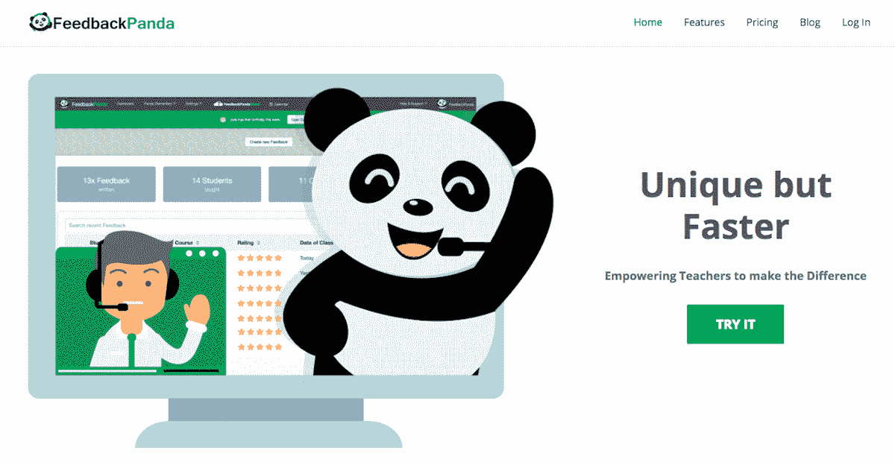
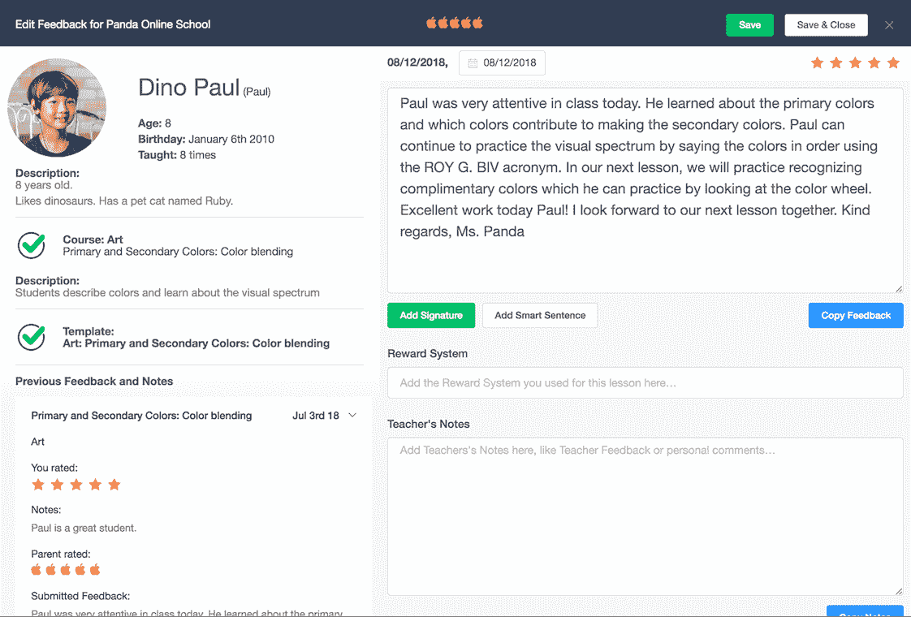
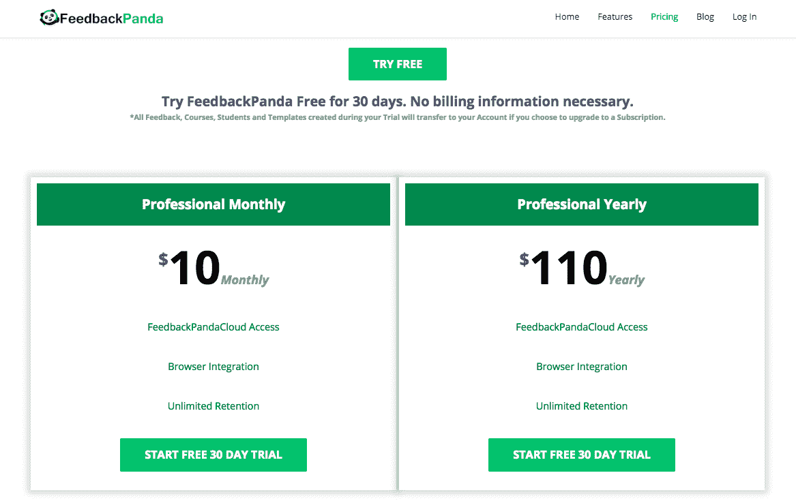

# 将挫折转化为每月 35000 美元的产品，帮助教师超越自我

> 原文：<https://www.indiehackers.com/interview/turning-frustration-into-a-35k-mo-product-that-helps-teachers-excel-d2205a1100>

## 你好！你的背景是什么，你在做什么？

你好！我是 Danielle Simpson，我和我的联合创始人 Arvid Kahl 一起开发了一年多的反馈熊猫软件。

我的职业生涯不是从科技开始的。事实上，远非如此，因为我实际上是一名训练有素的歌剧演员。像大多数艺术家一样，我掌握了在演出和试镜之间平衡多方利益的艺术，以保持生存。这是我的一份兼职，在线教授英语作为外语，这让我意识到需要像 FeedbackPanda 这样的服务。FeedbackPanda 是一个面向自由职业在线教师的客户端管理系统。该工具通过帮助教师组织学生和课程记录以及为学生撰写个性化反馈，每天为他们节省大约两个小时的无薪时间。老师们也可以使用 FeedbackPanda 进行协作，分享自己的反馈模板，互相启发。

在一年之后，FeedbackPanda 每月产生 35000 美元，并继续以每月 10%的速度增长。

 

## 是什么促使你开始使用 FeedbackPanda？

我们建立了 FeedbackPanda，因为我需要一个工具来帮助我教授尽可能多的课程。搬到德国后，我试唱了大约两年，完全忽略了我在加拿大的学生贷款。我破产了，需要尽可能快速有效地赚钱。

2017 年 1 月，我开始为 VIPKID 公司工作，该公司通过视频通话将中国儿童与美国英语教师联系起来。他们有一个很好的平台来培养个性化教育，我连续两个月每天从早上 4 点到下午 4 点教一对一的英语课。这真的很好，除了我不得不投入额外的无薪时间来保持我的学生有组织性和写一份表现评估。

很明显，我将无法保持这样的速度，保持我的健康和理智。我尝试了不同的方法来加速这个过程，但是即使在绞尽脑汁的头脑风暴和大量的 Excel 表格之后，我还是忍不住动摇了一定有更好的方法的想法。

作为我的男朋友，Arvid 亲眼目睹了这个问题，因为他是一名软件工程师，我向他提出了我的解决方案。我需要做的就是听到这是可能的，所以当我得到 Arvid 的赞许后，我们就开始制造我和其他老师需要的产品。

## 构建最初的产品需要什么？

我们把 FeedbackPanda 的最初版本作为 SaaS 的产品，只有一个客户:我。Arvid 在晚上和周末开发原型，同时他在工业物联网领域担任全职软件工程师。他工作的公司非常先进，在后端使用 Elixir 编程语言，在前端使用 Vue.js 构建物联网平台，所以我们决定在自己的产品中使用相同的技术。

以这样的速度工作，我们花了一个月的时间建立了一个工作系统，在这个系统中，我可以使用我之前保存在电子表格中的模板来管理我的学生并生成反馈。一旦我们将该系统集成到 VIPKID 的教学门户中，我们就看到了我们可以节省多少时间——单击一个按钮就会自动调出我以前使用的模板，并根据我刚刚教过的学生进行调整。五分钟的工作浓缩成一次点击。我们知道我们有一个有价值的产品。

在向公众发布之前，我们确保将尽可能多的复杂技术转移到其他 SaaS 工具上。我们集成了 Stripe 用于支付，Intercom 用于客户通信，Auth0 用于处理我们的用户管理。所有这些服务都有一个试用或启动计划，所以我们可以很容易地引导公司，从来没有采取任何资金。

我们还决定，我们希望利用教师分享材料的网络效应，所以我们很快建立了一个“云”的原型，教师可以在这个平台上与其他人分享他们的数据。就推动增长而言，这已被证明是我们做出的最佳决定。

 

## 你是如何吸引用户和发展 FeedbackPanda 的？

幸运的是，我确切地知道谁是我们的顾客，饮水机在哪里。所以我们的营销始于一份小小的战略性的《脸书邮报》。我每天多次浏览社区脸书小组，在用狗喂我们的产品大约两个月后，我终于在回答某人询问如何解决他们的问题时透露了反馈熊猫。

成为社区的一部分，感受他们的需求，以及如何在不打扰他们的情况下接近他们。

TweetShare

我们有一些非常热情的早期采用者，他们回到饮水机旁，向我们宣传这个工具。我们通过对讲机与每个人保持密切联系，真正建立了一个用户社区，从而帮助这一势头滚雪球般地进入更多用户。我们给我们的第一批 100 名订户寄去了手写的明信片感谢信，然后他们用它拍照、录像，并再次回到饮水机旁与其他老师分享。

 

## 你的商业模式是什么，你是如何增加收入的？

我们提供基于订阅的软件平台访问。我们有一个月计划和一个稍微便宜的年计划，两者都有 30 天的试用期。我们没有免费计划，但我们对试用延期很慷慨，我们也向 30 天后回来试用但没有创建任何有意义的数据的用户提供试用延期。这些用户可以自动延长他们的试用期，这是一个伟大的重新激活技术。

我们从一开始就向我们的客户收费，当然是在他们 30 天的试用期之后。一些老师非常喜欢这个产品，他们花了几天时间来试用。实际上，第一个试图付款的客户无法付款，因为我们忘记了将条纹测试密钥与活动密钥进行交换！我们必须做一个快速的紧急部署，让我们的客户付款。但在那次坎坷的开始后，订阅量稳定增长，转化率超过 25%。

迅速远离那些不起作用的事物，追随那些起作用的事物。

TweetShare

因为我们是一家德国公司，大部分客户在美国，所以我们在网上支付方面有两个主要问题。我们收取美元，但收取欧元，因此欧元和美元之间的汇率对我们的 MRR 影响很大。此外，由于收款银行是德国，美国的许多小银行和信用合作社都在阻止信用卡收费。一些银行甚至在客户打电话要求取消这些收费后也不会取消。我们必须自己建立一个催款系统，向受影响的客户建议如何处理此事。Stripe 非常可靠，但我们客户的银行还是受到了影响。

我们的增长相当稳定，在公司运营的几个月里，增长率在 10%左右。更多的顾客带来更多的口碑，这反过来又转化为更多的注册。为了保持较高的转化率，我们非常迅速地回答问题，我们已经建立了一个广泛的知识库，视频和内部通信截图。教师社区也很有帮助，因为老师热爱教学，所以他们会一直互相帮助。

我们的流失率很低，不到 1%，因为大多数教师通过放入他们的个人模板对产品进行了大量投资。大多数流失发生在我们的客户换工作或休育儿假的时候。

 

## 你未来的目标是什么？

我们的主要目标是让老师关注我们的产品。许多 EdTech 产品如此关注学生，以至于完全忽略了学习过程的促进者。我对老师和他们的待遇变得非常热情，因为我觉得他们经常被利用或被视为理所当然。

如果你关心老师，你会在学生的表现中看到可衡量的结果。展望未来，我想帮助其他环境如线下教室和实体学校的老师。

## 你面临的最大挑战和克服的障碍是什么？如果你必须重新开始，你会做什么不同的事？

拥有像 Intercom 这样的聊天工具是接收客户反馈的一个很好的渠道。我们不断收到新功能的请求，这非常令人兴奋，因为让客户为产品做出贡献是一件非常美妙的事情。然而，对新功能和新想法的需求可能是压倒性的。我认为 Arvid 和我在辨别哪些功能可能有用，哪些功能会变得无聊和复杂化产品的简单本质方面做得非常好。我们所犯的错误是在不改变产品价格的情况下增加新功能。

FeedbackPanda 得到了极大的丰富，我们为此付出了额外的成本，但没有给客户带来任何额外的成本。现在，我们正试图找出如何提高产品价格，以匹配我们提供的价值。

## 有没有发现什么特别有帮助或者有优势的？

有一些非常好的书是关于在 SaaS 开公司和一般的企业家生活的。我推荐阅读迈克尔·E·葛伯的《电子神话》和约翰·瓦里洛的《T2 为销售而建》，以了解一家基本自动化、结构良好的公司。对于产品，我强烈推荐 Nir Eyal 的 [Hooked](https://www.amazon.com/Hooked-How-Build-Habit-Forming-Products/dp/0670069329) ，因为它非常清楚地说明了如何打造人们喜欢使用的产品。

找出你的顾客在哪里聊天。有成千上万的脸书团体、论坛和其他社区，人们可以在那里找到帮助和支持。成为社区的一部分，感受他们的需求，以及如何在不打扰他们的情况下接近他们。向您的客户提供有价值的内容，并鼓励他们分享到这些社区中。

寻找一个市场，在这个市场中，强大的力量正在改变世界，创造新的机遇。

TweetShare

我们了解到，用狗食喂养我们的产品帮助我们难以置信地走向市场。我使用 Arvid 构建的原型，立即告诉他 bug 和难以使用的组件，第二天，它就会被修复。不出所料，即时反馈为我们节省了大量时间。顾客通常会责怪自己或者只是“忍着吧”，所以最好先把你的产品用在自己身上。鼓励你的顾客给出直接的批评性反馈。我们发现，向人们要那些不起作用的东西通常会产生好的结果。如果你问他们觉得怎么样，他们通常会非常肯定。阅读 Rob Fitzpatrick 的《妈妈测试》( Mom Test )( T7 ),获得关于措辞的好提示。

中国教育市场正在加速发展，我们很幸运地发现了这个市场中的一个利基市场，我们不仅可以填补这个市场，还可以与市场一起成长。一年前，VIPKID 的教师不到 15000 人，现在他们有超过 50000 人。所有这些教师都是潜在客户，每天都有数百人加入教师社区。寻找一个市场，在这个市场中，强大的力量正在改变世界，创造新的机遇。

## 对于刚刚起步的独立黑客，你有什么建议？

当你开始做某件事时，要非常具体地确定你想解决的问题以及它会帮助谁。不要担心它太具体。你在确定目标受众或你想要解决的问题时越具体，你就越有可能解决问题或接触到你的客户。保持 10 年的愿景，但不要害怕在最初的行动中非常具体。如果你知道你的目标群体，你更有可能获得一些牵引力，然后建立你的帝国。

另一件我发现很有帮助的事情是相信你的直觉并采取行动。迅速远离那些不起作用的事物，追随那些起作用的事物。不要纠结，也不要逃避，重新定向，往前走。

不要参加不必要的会议。作为创始人，你的时间不多了。珍惜你的时间，礼貌地拒绝。

 

## 我们可以去哪里了解更多？

你可以在[https://www.feedbackpanda.com](https://www.feedbackpanda.com)以及[脸书](https://www.facebook.com/feedbackpanda/)、[推特](https://twitter.com/feedbackpanda)、 [Instagram](http://instagram.com/feedbackpanda/) 和 [CrunchBase](https://www.crunchbase.com/organization/feedbackpanda) 上找到 FeedbackPanda。我们在我们的[博客](https://www.feedbackpanda.com/blog)上发布在线教学的相关内容。你可以在推特上找到我。

我一直在浏览 IndieHackers。如果你有任何问题，请在下面的评论区发表！

—[<picture id="ember5286979" class="user-avatar ember-view user-link__avatar"></picture>丹妮尔·辛普森](/daniellesimpson?id=icVoDWBY51MDSOdIRdiNUAYW4Je2)【feedback panda 创始人

## 想像 FeedbackPanda 一样建立自己的事业？

你应该加入独立黑客社区！🤗

我们是几千名创始人，互相帮助建立有利可图的业务和副业。来分享你正在做的事情，并从你的同事那里获得反馈。

还没准备好开始使用你的产品吗？没问题。这个社区是一个认识人、学习和实践的好地方。随意[随便浏览](/)！

——[<picture id="ember5286984" class="user-avatar ember-view user-link__avatar"></picture>柯特兰艾伦](/csallen?id=ibTLPyjwVebnZjMGKvz6ztarnuV2)，独立黑客创始人

77votes